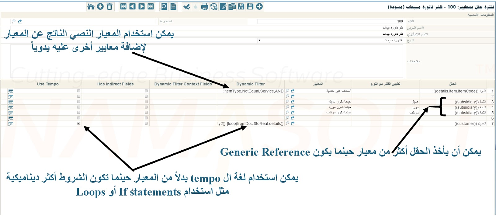

# Field Filter with Criteria

You can use the **Field Filter with Criteria** screen to apply custom filters when searching within specific fields on any Nama ERP screen.

For example:
- In a **purchase invoice**, you may want to display only items whose default supplier matches the invoice's supplier.
- In a **sales invoice**, you may want to show only **non-service items** when selecting an item.

## How to Define a Field Filter with Criteria

1. **Create a Criteria Record**
    - In the *Criteria Definition* file, define the condition you want to apply (e.g., non-service items).

2. **Create a Field Filter Record**
    - Open the **Field Filter with Criteria** screen and create a new record.
    - Specify the **Document Type** (e.g., Sales Invoice).
    - Define the **Field** to apply the filter on (e.g., `details.item.item`).
    - Assign the previously defined **Criteria** to this field.

3. **Assign the Field Filter**
    - Go to one of the following configuration locations and assign the filter in the **Field Filter** field:
        - Document Type
        - Document Book
        - Master Group
        - Menu Definition Update
    - Alternatively, select the **Automatic** option to apply it automatically.

4. **Save** your changes.

> If your filter requires dynamic logic such as loops or conditions, use **Tempo Language** instead of a criteria definition.



---

## Example: Filter Non-Service Items in Sales Invoice

To show only non-service items when selecting an item in the **Sales Invoice** screen:

1. In the *Criteria Definition* file, define a condition for non-service items.
2. Create a new record in **Field Filter with Criteria**:
    - Document Type: Sales Invoice
    - Field: `details.item.itemCode`
    - Criteria: Your non-service items criteria
3. Save the filter with a name like `NonService`.
4. In your **Sales Invoice document term**, set **Field Filter = NonService**.
5. Create a new Sales Invoice using that term.
6. When selecting items, only non-service items will be shown.

::: tip
- You must assign the filter in **Field Filter** field of a document type, book, master group, or menu update.
- To test your criteria:
    - Enable **Use In List View** in the criteria record.
    - Open the item list and enter your filter in the **Extra Filter** field.
    - The list should show only matching items.
- You can retrieve the **Textual Criteria** from the criteria record to see or manually adjust the filter conditions.
- For advanced logic, use **Tempo Language**.
  :::

---

## Example: Dynamic Filter Using Tempo

Suppose a **Sales Invoice** is based on a **Sales Order** containing multiple customers in the lines. You want to list only the customers with remaining quantities (`unsatisfiedQty2`) when selecting a customer in the sales invoice.

Use this **Tempo** code in the `Dynamic Filter` field of the field filter:

```tempo
{loop(fromDoc.$toReal.details)}
  {if(fromDoc.$toReal.details.unsatisfiedQty2)}
    code,Equal,{fromDoc.$toReal.details.customer.code},OR;
  {endif}
{endloop}
```