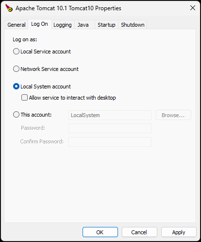

# Nama ERP Installation Guide

**Nama ERP** is a Java-based web application that runs on Apache Tomcat and uses Microsoft SQL Server as its default database engine.

## System Requirements

* **Operating System:** 64-bit (Windows Server recommended)
* **Java JDK:** Version 21 or higher
  [Download JDK 21](https://www.oracle.com/eg/java/technologies/downloads/#jdk21-windows)
* **Apache Tomcat:** Version 10
  [Download Tomcat 10](https://tomcat.apache.org/download-10.cgi)
* **Database Engine:** Microsoft SQL Server 2016 or higher (SQL Server 2022 recommended)
  For test environments, use **SQL Server Developer Edition**
  [Download SQL Server](https://www.microsoft.com/en-us/sql-server/sql-server-downloads)


## Database Setup

* Enable **Mixed Mode Authentication** in SQL Server.
* Create a database (avoid using the default name `namaerp` in production).
* Create a SQL user (or use `sa`) and grant full access to the database.
* Enable **TCP/IP Protocol** using **SQL Server Configuration Manager**.
* For **named instances**, assign a static port using the **IPAll** settings.

## Installer Features

The **Nama ERP Installer** includes:

* Creating database and database users.
* Generating a SQL Server Agent **full backup job**.
* Creating a **differential backup job** (runs every 2–3 hours to save space and provide disaster recovery).
* Generating a **backup cleanup script** (removes old backups, e.g., older than 5 days).
* Option to **upload backups to cloud storage** (Google Drive, Dropbox, OneDrive, etc.).
* Automatic **SSL certificate** creation using [Let's Encrypt](https://letsencrypt.org/).

## SSL Certificate Requirements

To install SSL with Let's Encrypt, you need:

1. A **static IP address**
2. A **domain name** that points to the static IP
3. **Port forwarding** for ports `80` and `443` from your router to your server

::: tip
If a static IP is not available, you can use a **Dynamic DNS service** (e.g., selfip, DDNS).
:::

## Supported Databases

While SQL Server is the default, other databases may be supported. Please contact Nama ERP technical support for confirmation before using alternatives.

---

## 📺 Full Installation Walkthrough

Watch the full installation tutorial here:
👉 [https://youtu.be/6UWe9GyZC20](https://youtu.be/6UWe9GyZC20)

## Confirming Nama ERP Installation

By default, Apache Tomcat runs on port `8080`. If you did not change the port during setup, you can confirm that Nama ERP is installed correctly by visiting:

```
http://localhost:8080/erp/
```

If the login page appears, the installation was successful.

To allow access for other users on your local network (LAN), make sure port `8080` is open in **Windows Firewall**:

* Go to **Windows Defender Firewall** > **Advanced Settings**
* Under **Inbound Rules**, create a new rule to allow traffic on port `8080`

---

## Useful Tools During or After Installation

* **7-Zip** (for handling compressed files)
  [Download 7-Zip](https://www.7-zip.org/download.html)

* **Notepad++** (for viewing logs or editing configuration files)
  [Download Notepad++](https://notepad-plus-plus.org/downloads/)

---

Here's the refined version with clearer formatting and corrections:

---

## Upgrading Nama ERP

You can upgrade Nama ERP from the **utils page** within the system interface. Multiple upgrade methods are available depending on your setup.

### Manual Upgrade

To upgrade Nama ERP manually:

1. Download the upgrade tool:
   [https://namasoft.com/bin/upg-wget.jar](https://namasoft.com/bin/upg-wget.jar)

2. Copy the file into your **Tomcat installation folder**

3. You can run the JAR file by:

    * **Double-clicking** it
      **OR**
    * Using **Windows Command Prompt**:

      #### Steps:

        * Open Command Prompt (`cmd`)

        * Navigate to your Tomcat installation folder using the `cd` command, for example:

          ```cmd
          cd "C:\Program Files\Apache Software Foundation\Tomcat 10"
          ```

        * Run the upgrade tool:

          ```cmd
          java -jar upg-wget.jar
          ```

This tool will automatically download and apply the latest Nama ERP updates.

### How to Allow Downloading Releases from Utils Page?

To enable the system to download and install updates from the **utils** page (i.e., support self-upgrade functionality), the Tomcat service must run under the **Local System Account**.

::: tip
 This configuration is typically set automatically during the Nama ERP installation. If auto-upgrade stops functioning, follow these steps to restore it
:::

1. Open the **Tomcat Service Configuration Utility**:

    * Navigate to:
      `C:\Program Files\Apache Software Foundation\Tomcat 10\bin\tomcatw.exe`
    * Or search in the Windows Start Menu for: **Configure Tomcat**

2. In the configuration window, go to the **Log On** tab.

3. Select the radio option **Local System account**.

4. Save the configuration and restart the Tomcat service.


