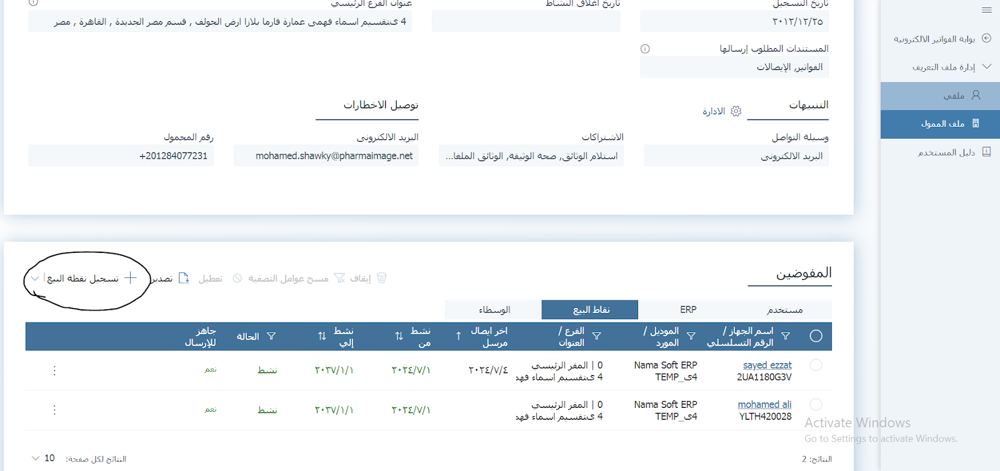
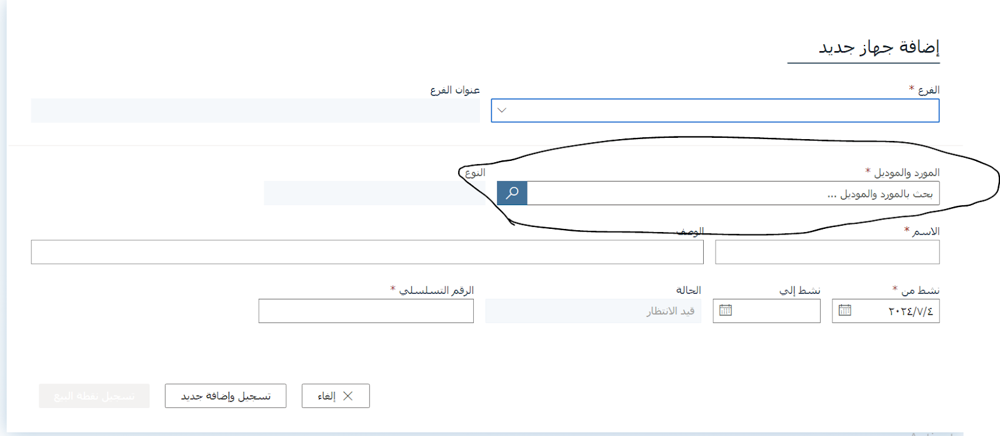
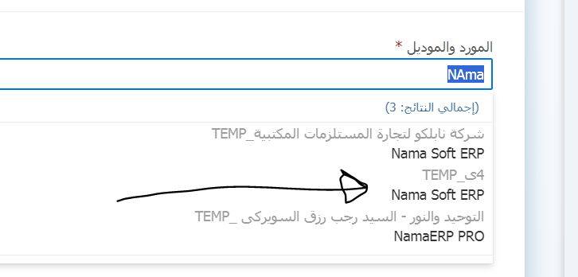
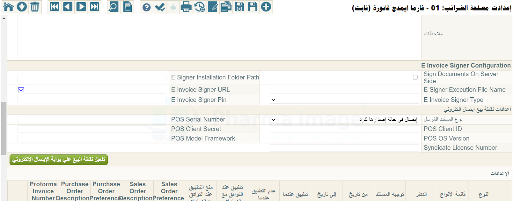
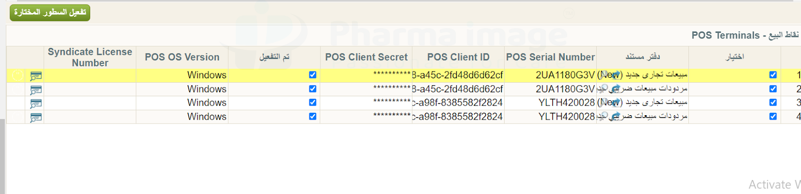
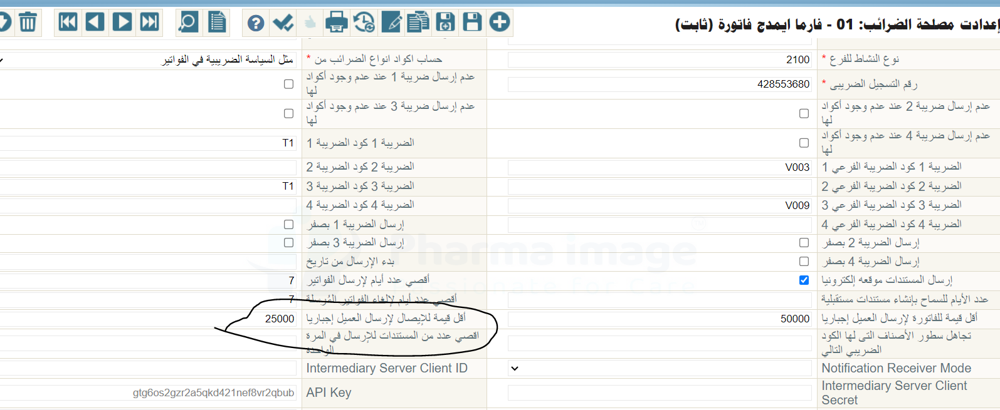

<rtl>

::: warning In Progress
This document is still in progress, not yet finished
:::

# Electronic Receipt (Egypt Tax eInvoice) تفعيل الإيصال الإلكتروني - الفاتورة الإلكترونية - مصر

## طريقة تفعيل الإيصال الإلكتروني عبر جهاز الكومبيوتر

1. يجب على العميل التواصل مع مصلحة الضرائب لتسجيل **الرقم التسلسلي (Serial Number)** الخاص بجهاز الكمبيوتر أو الأجهزة التي سيتم استخدامها لإرسال الإيصالات.

2. يجب أيضًا إبلاغ المصلحة باسم **المورد والموديل** (Vendor & Model)، وهما يُعرَّفان في النظام من خلال شاشة **تسجيل نقطة بيع** بالشكل التالي:



عند الضغط على "تسجيل نقطة بيع" تظهر النافذة التالية:



يُقصد بـ:

* **المورد**: اسم الشركة (مثال: Nama Soft)
* **الموديل**: اسم النظام (مثال: Nama ERP)

3. بعد تسجيل الأجهزة لدى مصلحة الضرائب وتعريف المورد والموديل، يتم استكمال إعداد نقطة البيع داخل النظام كالتالي:

* اختيار الفرع (غالبًا يكون الفرع الرئيسي)

* اختيار المورد والموديل المعتمدين من المصلحة
  

* إدخال اسم نقطة البيع (اختياري)

* إدخال تاريخ التفعيل حسب رغبة العميل

* إدخال الرقم التسلسلي للجهاز الذي سجلته المصلحة. يمكن الحصول عليه من جهاز العميل عبر تشغيل الأمر التالي على الـ CMD:

  ```bash
  wmic bios get serialnumber
  ```

* بعد إدخال البيانات، اضغط "تسجيل وإضافة جديد"

* بعد الحفظ، تظهر نافذة بها بيانات:

    * **Client ID**
    * **Client Secret**

يجب حفظ هذه القيم في مكان آمن.
ستكون نقطة البيع حينها مسجلة ولكن حالتها **غير نشطة** حتى يتم تفعيلها عبر النظام.

---

## التفعيل على النظام

1. اذهب إلى إعدادات مصلحة الضرائب في النظام:
   

2. في إعدادات نقطة البيع الإلكترونية:

* حدد نوع المستند "إيصال" في حال كان المستلم **فردًا**

    * إذا كان الكيان القانوني في ملف ذمة الفاتورة من النوع **فرد**، يتم الإرسال كـ إيصال
    * إذا كان الكيان القانوني **قطاع خاص**، يتم الإرسال كـ فاتورة تلقائيًا

* إذا كان هناك **جهاز واحد فقط** للإرسال:

    * املأ الحقول: `Client ID`, `Client Secret`, `Serial Number`, و`POS OS Version` (مثلاً Windows)

* اضغط "حفظ" ثم "تفعيل"

> تتحول حالة نقطة البيع إلى نشطة على بوابة مصلحة الضرائب

---

### في حال وجود أكثر من جهاز للإرسال:

* قم بتسجيل نقطة بيع مستقلة لكل جهاز كما في الخطوات أعلاه
* داخل النظام، في نفس إعدادات مصلحة الضرائب، استخدم الجريد السفلي لتعريف كل جهاز:



* اختر الدفتر المستخدم للفواتير والمردودات

* أدخل لكل جهاز:

    * الرقم التسلسلي
    * Client ID
    * Secret ID
    * POS OS Version

* احفظ واضغط "تفعيل السطور"

---

## ملاحظات هامة:

* إذا كان العميل **فردًا**، يجب أن يحتوي ملفه على **رقم البطاقة الشخصية**، وإلا سيرفض النظام إرسال الإيصال.
* أما إذا كان العميل **قطاع خاص**، فيلزم وجود بيانات مثل **السجل الضريبي**.

### استثناء العملاء الأفراد من شرط رقم البطاقة:

في حالة الفواتير ذات القيم الصغيرة (مثلاً 100 ج)، قد لا يكون من المنطقي طلب رقم بطاقة من كل عميل.
يمكنك ضبط الحد الأدنى لقيمة الإيصال الذي يُلزم وجود رقم بطاقة له عبر الإعداد التالي:



::: tip
 إذا كانت الفاتورة أقل من هذا المبلغ (مثلاً 25000 ج)، يمكن الإرسال بدون رقم بطاقة.
 أما إذا زادت القيمة، فيتطلب النظام وجود الرقم.
:::

</rtl>