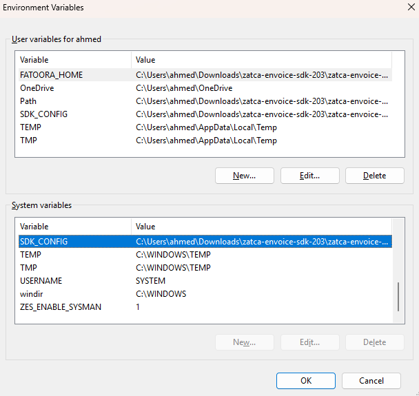
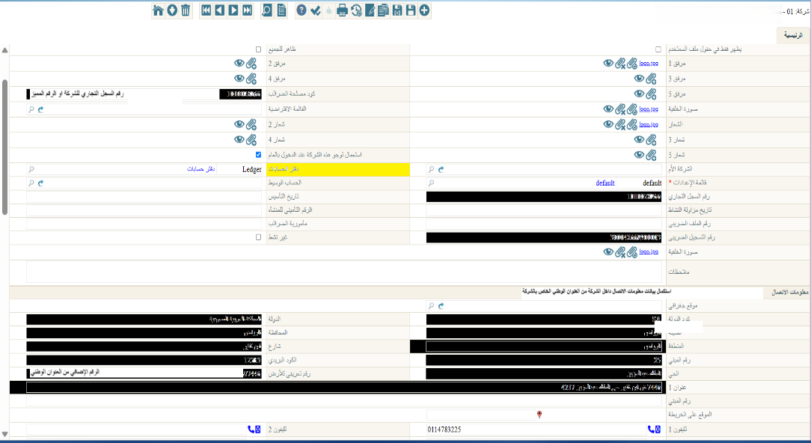

<rtl>

::: warning In Progress
This document is still in progress, not yet finished
:::

# الربط مع هيئة الزكاة والدخل بالسعودية

## تجهيز سيرفر العميل للربط مع هيئة الزكاة والدخل 

- قم بتحميل ملف الزكاة والدخل [Zatca SDK](https://zatca.gov.sa/en/E-Invoicing/SystemsDevelopers/ComplianceEnablementToolbox/Pages/DownloadSDK.aspx)
- قم بفك الملف المضغوط الذي تم تحميله في الخطوة السابقة
- بداخل المجلد الذي تم فكه ستجد ملف `install.ba_` - قم بتغيير اسمه إلى `install.bat`  ثم قم بتشغيله
  - يمكنك تغيير الاسم بسهولة من خلال اختبار الملف ثم الضغط على F2
- 
- قم بالذهاب إلى Environment Variables من خلال خصائص الكمبيوتر - متقدم او قم بتشغيل الأمر التالي في Run Dialog (Win + R)
```sh
rundll32 sysdm.cpl,EditEnvironmentVariables
```
- قم بنسخ السطر الذي يخص `SDK_CONFIG` من القسم `User Variables` إلى القسم `System Variables`
::: tip
يمكنك تشغيل الكود التالي في برنامج Windows PowerShell (يجب تشغيله ك Administrator) لنسخ ال Variable أعلاه بدلا من نسخه يدوا
```powershell
$varName = "SDK_CONFIG"
$userValue = [Environment]::GetEnvironmentVariable($varName, "User")
if ($userValue) {
    Write-Host "Copying $varName with value '$userValue' to system environment..."
    [Environment]::SetEnvironmentVariable($varName, $userValue, "Machine")
    Write-Host "Copied successfully."
} else {
    Write-Host "User environment variable '$varName' not found."
}

```
- **تذكر أن تقوم بتشغيل PowerShell ك Administrator**
- قم بالتأكد أنه تم النسخ بشكل صحيح بمراجعة الصورة التالية
:::
بعد النسخ سواء بشكل يدوي أو باستعمال كود باور شيل يجب أن يكون الشكل مقارب للتالي:


- قم بفتح الملف `Configuration/config.json` وتأكد أن المسارات به الصحيحة
- قم بتحميل ملف zatca.war من: https://namasoft.com/bin/zatca.war
  - ضع الملف في مجلد Tomcat Path/webapps
## تجهيز النظام للربط مع هيئة الزكاة والدخل 
- من "الإعدادات العامة" → الصفحة الثانية - اختر `هيئة الزكاة والدخل (السعودية)` في الحقل `عرض صفحة الفاتورة الإلكترونية الخاصة بـ`
<GlobalConfigOption option-code="value.info.einvoicePageShowType" />
- بعد تغيير قيمة الحقل قم بعمل Regen UI
- استكمال بيانات الشركة: قم بتعبئة الحقول الأتية بملف الشركة
  - رقم السجل التجاري
  - رقم التسجيل الضريبى
- واكمل البيانات التالية من العنوان الوطني الخاص بالمؤسسة
  - كود الدولة
  - الدولة
  - المدينة
  - المحافظة
  - المنطقة
  - شارع
  - رقم المبني
  - الكود البريدي
  - الحي
  - عنوان 1
  - رقم تعريفي للأرض

## إنشاء ملف إعدادات مصلحة الضرائب
يجب الآن انشاء ملف `إعدادات مصلحة الضرائب`
عند التكويد، اختر القيمة المناسبة في حقل نوع المصلحة:
- `السعودية - موقع الفاتورة الإلكتروني للمطورين`: لأغراض التجربة
- `السعودية - موقع الفاتورة الإلكترونية التجريبي`: ربط خلال فترة التجربة
- `السعودية - موقع الفاتورة الإلكترونية`: الربط الفعلي

</rtl>