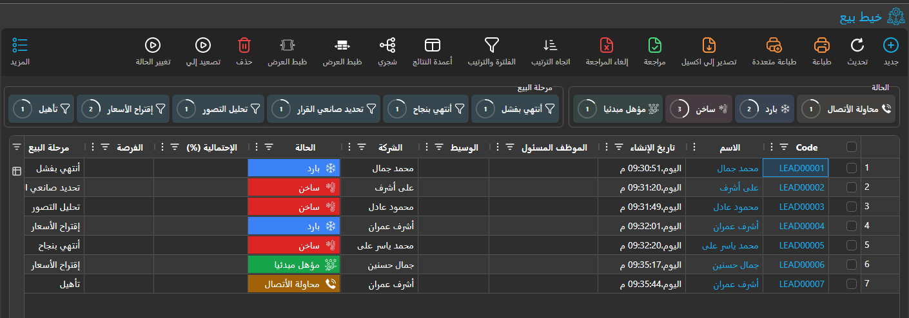
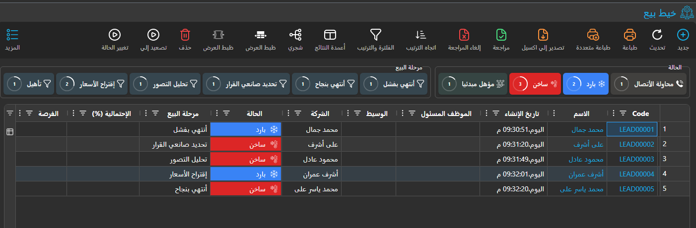
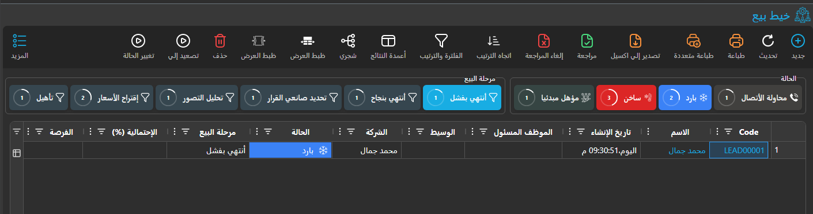

# Quick Filters in List Views

::: tip New Feature
Quick Filters have been developed to enhance user experience in filtering data quickly and intuitively across all list views in Nama ERP system.
:::

## Overview

Quick Filters are interactive tools that appear at the top of list views, allowing users to filter data quickly based on the most common or important values in fields. This feature is designed to provide a fast and visual way to access the required data.

## Key Features

### 1. Value-Based Quick Filtering
- **Dynamic Buttons**: Display buttons containing the most frequently occurring values in specified fields
- **Smart Icons**: Show appropriate icons for each data type (enums, references, dates, etc.)
- **Real-time Statistics**: Display record counts for each value and their percentages

### 2. Pre-defined Custom Filters
- **Custom Criteria**: Ability to create complex filters using SQL or specific criteria
- **Translatable Titles**: Support for Arabic and English filter titles
- **Flexible Configuration**: Link filters to specific entities or screens

### 3. Enhanced User Interface
- **Smart Grouping**: Group related filters into logical groups
- **Visual Indicators**: Display percentages as colored progress circles
- **Interactive Response**: Instant result updates when applying filters

## How to Use

### For End Users

#### 1. Accessing Quick Filters
1. Navigate to any list view screen in the system
2. Quick filters will appear at the top of the table (if configured for the entity)
3. Filters are grouped in boxes with descriptive titles

#### 2. Using Value Filters





The quick filters appear as interactive buttons at the top of list views, showing the most common values for specific fields:

- **Click Button**: Applies the filter instantly to the table
- **Colors**: Vary by data type (green for paid, red for unpaid)
- **Counter**: Shows record count and percentage

#### 3. Using Custom Filters

Custom filters provide specialized filtering criteria that are pre-configured by administrators to address common business needs.

#### 4. Combining Filters



- Multiple filters can be applied together
- Filters from different groups work together (AND logic)
- Filters from the same group work as alternatives (OR logic)

### For Administrators and Support Staff

#### Configuring Quick Filters Using Screen Modifier

Quick Filters are configured through the Screen Modifier system, which allows customization per entity and user.

##### Accessing Screen Modifier Configuration
1. Navigate to **Basic Module** → **Screen Modifier**
2. Search for or create a record for your target entity (e.g., "Invoice")
3. Go to the **Quick Filter** grid

##### Setting Up Value-Based Filters
* **Configure Group Settings**:
   - **Arabic Title**: عنوان المجموعة بالعربية
   - **English Title**: Group Title in English
   - **Column Names**: Enter comma-separated field IDs (e.g., "status,customerType")
   - **Show Count**: Enable to display record counts
   - **Max Button Count**: Set maximum number of buttons (typically 5-10)
   - **Remove**: Check this to hide/remove a quick filter group (useful for overriding inherited configurations)
   - **Quick Filter Values Criteria**: Select a Criteria Definition to filter which values appear in the quick filter buttons
   - **Quick Filter Values Dynamic Criteria**: Enter dynamic criteria text to filter which values are shown (uses the same syntax as [Text Criteria](../text-criteria-guide.md))

##### Filtering Quick Filter Values
You can control which values appear in the quick filter buttons using criteria. These criteria filter the database query that fetches distinct values, and can be applied on **any column in the table** - not just the column being displayed in the quick filter.

For example, if you have a quick filter on the "status" field, you could add a date criteria to show only statuses that appeared in recent records:

- **Example**: Show only invoice statuses from the current month by adding criteria: `invoiceDate,GreaterThanOrEqual,$monthStart()`

**Configuration Options:**
- **Using Criteria Definition**: Create a reusable criteria and link it in the "Quick Filter Values Criteria" field
- **Using Dynamic Criteria**: Enter criteria text directly in the "Quick Filter Values Dynamic Criteria" field

This is useful when you want the quick filter buttons to reflect only values that are relevant to the current context or time period, rather than showing all values that ever existed in the database.

##### Example Configuration for Invoice Status Filter
```
Arabic Title: حالة الفاتورة
English Title: Invoice Status
Column Names: status
Show Count: ✓ (checked)
Max Button Count: 8
Quick Filter Values Dynamic Criteria: (optional - leave empty to show all values)
```

##### Setting Up Custom Criteria Filters
1. **Create Quick Filter Criteria**:
   - Navigate to **Basic Module** → **Quick Filter Criteria**
   - Create new record for your entity type

2. **Add Criteria Lines**:
   - **Dynamic Criteria**: Enter Criteria Text  (e.g., `dueDate,LessThanOrEqual,$today()'`)
     - For more details refer to: [Text Criteria Guide](../text-criteria-guide.md)
   - **Arabic Title**: العنوان بالعربية
   - **English Title**: Title in English

3. **Link to Screen Modifier**:
   - In Screen Modifier Quick Filter grid
   - Select the created criteria in the **Criteria** field