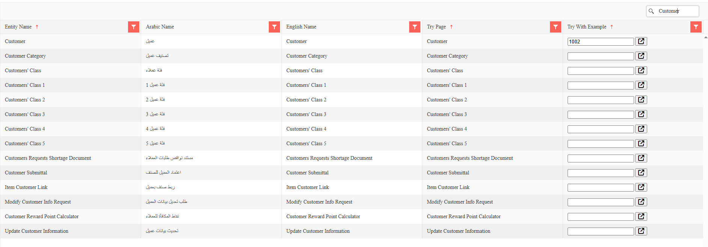

# Nama ERP REST API

Nama ERP provides a comprehensive REST API for performing CRUD operations on all system entities, with full OpenAPI 3.0 specification support for seamless integration with third-party systems.

For a fast introduction, watch this video: [Nama ERP Rest API Introduction](https://youtu.be/lUxZMIoxxUY)

## API Browser Overview

The Nama ERP API Browser provides an interactive interface for exploring and testing all available REST APIs in your system.

### Accessing the API Browser

The API Browser is available through multiple endpoints:

#### Main API Browser (Router Page)
```
http[s]://<server-ip-or-domain>/erp/browseapi/
```
This displays the main router page with links to different API sections.

#### Entity APIs Browser
```
http[s]://<server-ip-or-domain>/erp/browseapi/browseentitiesapi.html
```
Lists all available entity APIs with their Arabic and English names.

#### Special Purpose APIs Browser
```
http[s]://<server-ip-or-domain>/erp/browseapi/browsespecialpurposesapi.html
```
Lists specialized APIs for specific integrations (e.g., attendance machine synchronization).



### Features of the API Browser

The API Browser dynamically generates documentation based on your system configuration:

* **Entity List**: Displays all entities available to the current user based on:
  - Module permissions
  - User access rights
  - Enabled features
  - Customer-specific configurations
  
* **Multilingual Support**: Shows entity names in both Arabic and English
* **For each entity, two primary resources are provided:**

  1. **OpenAPI JSON Specification**: Machine-readable API definition
  2. **Swagger UI**: Interactive documentation and testing interface

### OpenAPI JSON Specifications

#### Basic OpenAPI Endpoint
```
http[s]://<server-ip-or-domain>/erp/browseapi/openapi/{EntityName}.json
```

#### OpenAPI with Example Data
```
http[s]://<server-ip-or-domain>/erp/browseapi/openapi/{EntityName}.json?exampleCode={code}
```

**Parameters:**
- `{EntityName}`: The entity type (e.g., SalesInvoice, Customer, Item)
- `{code}`: Optional - specific record code or UUID to use as example

**Special Example Codes:**
- `Find@First`: Uses the first available record as example
- Any valid business code or UUID from your system

::: tip Example URLs
```
# Get SalesInvoice OpenAPI spec with first available record
http://localhost:8080/erp/browseapi/openapi/SalesInvoice.json?exampleCode=Find@First

# Get Customer OpenAPI spec with specific customer
http://localhost:8080/erp/browseapi/openapi/Customer.json?exampleCode=CUST001

# Get Item OpenAPI spec without examples
http://localhost:8080/erp/browseapi/openapi/Item.json
```
:::

### API Response Structure

The OpenAPI specification includes detailed schema definitions for each entity:

#### Field Types Mapping
- **String Fields**: Text, BigText, Date, DateTime, Time, Email, Color, LatLng, Enum
- **Number Fields**: Decimal, Integer
- **Boolean Fields**: Boolean type fields
- **Reference Fields**: Returns the referenced entity's code
- **Generic References**: Object with `entityType` and `code` properties
- **Collections/Details**: Arrays of objects (e.g., invoice lines, payment details)

#### Excluded Fields
The API automatically excludes:
- System-generated fields (unless specifically requested)
- Calculated fields
- Binary fields (images, documents)
- Internal user tracking fields

### Working with Entity Collections

Many entities include detail collections (one-to-many relationships):

```json
{
  "invoiceLines": {
    "type": "array",
    "items": {
      "properties": {
        "itemCode": { "type": "string" },
        "quantity": { "type": "number" },
        "unitPrice": { "type": "number" }
      }
    }
  }
}
```

Collections represent detail records like:
- Invoice lines
- Payment lines
- Order items
- Journal entry lines

---

## API Authentication & Access

### Authentication Methods

Nama ERP REST API supports two authentication methods:

#### 1. API Key Authentication (Recommended)

API Keys are the primary authentication method for production integrations.

**Header-based Authentication:**
```http
apiKey: {your-api-key}
```

**Query Parameter Authentication (Testing Only):**
```
http://localhost:8080/erp/browseapi/openapi/SalesInvoice.json?apiKey={your-api-key}
```

::: warning
Query parameter authentication should only be used for testing in the API Browser. Production integrations must use header-based authentication for security.
:::

#### 2. Session-based Authentication

For browser-based testing, you can use session cookies from a logged-in user session.

### How to Generate an API Key

The **system administrator** can generate API keys using the **API Credentials** master screen:

1. Open the API Credentials screen
2. Create a new record with:
   - **Code**: Unique identifier for this API credential
   - **Name**: Descriptive name for the integration
3. Select the **User** whose permissions will apply to this key
4. Save the record
5. **Important**: The API Key displays once after saving—copy it immediately
6. Provide the key securely to the development/integration team

::: tip Permission Inheritance
The API Key inherits all access permissions from the selected user:
- Entity access rights
- Module permissions
- Data visibility rules
- Company/branch restrictions
:::

### Viewing API Keys After Creation

To view an API Key again after initial creation:

1. Open the API Credentials record
2. Check **"View API Key"** option
3. Click **Save**
4. The API Key will display on screen

::: info Audit Trail
Re-exposing an API key is logged in the audit trail for security tracking.
:::

### API Key Best Practices

1. **Create separate keys** for different integrations
2. **Use descriptive names** to identify each integration
3. **Assign minimal permissions** needed for each integration
4. **Rotate keys periodically** for security
5. **Monitor API usage** through audit logs
6. **Revoke unused keys** to minimize security risks

---

## CORS Configuration

The API Browser automatically handles Cross-Origin Resource Sharing (CORS) for API requests:

- Allows cross-origin requests from any domain (development mode)
- Supports preflight OPTIONS requests
- Includes necessary CORS headers in responses

::: warning Production CORS
In production environments, configure CORS policies to restrict access to specific domains for security.
:::

---

## Testing APIs

### Using the API Browser for Testing

The API Browser provides multiple ways to test APIs:

#### 1. Direct OpenAPI JSON Access
```bash
# Get the OpenAPI spec with examples
curl -H "apiKey: {api-key}" \
  "http://localhost:8080/erp/browseapi/openapi/Customer.json?exampleCode=Find@First"
```

#### 2. Import to Postman
1. Copy the OpenAPI JSON URL
2. In Postman: Import → Link → Paste URL
3. Add API Key to collection authentication
4. Test all CRUD operations

#### 3. Interactive Swagger UI
Access the Swagger interface for interactive testing (if configured).

### Example Request Formats

#### Finding Records by Code
```http
GET /api/v1/Customer/{code}
apiKey: {api-key}
```

#### Finding Records by UUID
```http
GET /api/v1/Customer/{uuid}
apiKey: {api-key}
```

#### Creating New Records
```http
POST /api/v1/Customer
apiKey: {api-key}
Content-Type: application/json

{
  "code": "CUST001",
  "name1": "Customer Name",
  "contactInfo.email": "customer@example.com",
  "contactInfo.phone": "+966501234567"
}
```

#### Updating Records
```http
PUT /api/v1/Customer/{code}
apiKey: {api-key}
Content-Type: application/json

{
  "name1": "Updated Customer Name",
  "contactInfo.email": "newemail@example.com"
}
```

---

## Error Handling

The API returns standard HTTP status codes and detailed error messages:

### Common Response Codes
- **200 OK**: Successful request
- **201 Created**: Resource created successfully
- **400 Bad Request**: Invalid request parameters
- **401 Unauthorized**: Missing or invalid API key
- **403 Forbidden**: Insufficient permissions
- **404 Not Found**: Resource not found
- **500 Internal Server Error**: Server-side error

### Error Response Format
```json
{
  "error": {
    "code": "ENTITY_NOT_FOUND",
    "message": "Customer with code CUST999 not found",
    "details": "Additional error information"
  }
}
```

---

## Special Purpose APIs

Beyond standard entity CRUD operations, Nama ERP provides specialized APIs:

### Attendance Machine Integration
- Endpoint: `attcron-open-api-template`
- Purpose: Synchronize attendance data from biometric devices
- Supports batch processing of attendance records

### Data Export API
- Export records as JSON with full relationship data
- Supports filtering and pagination
- Preserves data integrity for backup/migration

### Batch Operations
- Process multiple records in single request
- Transactional processing with rollback on errors
- Optimized for high-volume integrations

---

## Performance Considerations

### Pagination
All list endpoints support pagination:
```
GET /api/v1/Customer?page=0&pageSize=50
```

### Field Selection
Request only needed fields to reduce payload:
```
GET /api/v1/Customer?fields=code,name,email
```
---

## Troubleshooting

### Common Issues and Solutions

#### API Key Not Working
- Verify key is active in API Credentials screen
- Check user permissions for the entity
- Ensure correct Authorization header format

#### Empty Example Data
- Verify records exist for the entity
- Check user data visibility permissions
- Use `Find@First` to get any available record

#### Missing Fields in Response
- System fields excluded by default
- Binary fields not included in API responses
- Calculated fields not available via API
