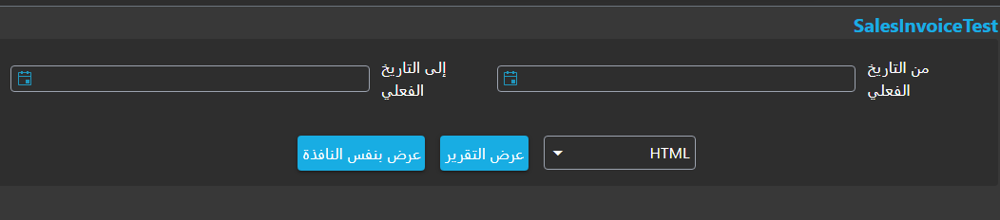
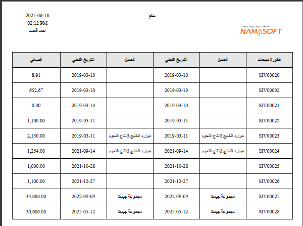

<rtl>

# دليل استخدام أداة إنشاء التقارير ونماذج الطباعة

يوفّر نظام Nama ERP وسيلة سهلة وفعالة لإنشاء تقارير احترافية بسرعة عبر أداة "إنشاء التقارير" (Report Wizard).

تمكنك هذه الأداة من إنشاء التقارير عن طريق اختيار الجدول الرئيسي، ثم تحديد الحقول المطلوبة وإضافة الفلاتر بطريقة بسيطة وسريعة، كما سيتم شرحه بالتفصيل من خلال الأمثلة.

## إنشاء تقرير بسيط لعرض فواتير المبيعات

لإنشاء تقرير يعرض بيانات فواتير المبيعات مثل كود الفاتورة، اسم العميل، تاريخ الفاتورة، وصافي قيمة الفاتورة، اتبع الخطوات التالية:

1. قم بإنشاء تقرير جديد باستخدام أداة إنشاء التقارير، وحدد له كود واسم مناسب.
2. في حقل **الجدول الرئيسي**، اختر `فاتورة مبيعات` من شاشة البحث.
3. في جدول **الحقول**، أضف السطور التالية:

  * `this` لعرض كود السند مع رابط لفتح تفاصيل الفاتورة.
  * `customer` لعرض اسم العميل مع رابط لفتح تفاصيل العميل.
  * `money.netValue` لعرض صافي قيمة الفاتورة.
4. في جدول **المدخلات**، أضف سطرًا واحدًا يحتوي على الحقل `valueDate` لتحديد الفترة الزمنية.

::: tip

* يمكنك استخدام زر **Select Fields** لعرض واجهة اختيار الحقول بطريقة مرئية دون الحاجة لكتابة أسمائها يدويًا.
* عند كتابة جزء من اسم الحقل (بالعربية أو بالإنجليزية)، يمكنك الضغط على السهم للأسفل لعرض الحقول المقترحة.
:::

::: details JSON for direct import

```json
{
  "mainTable": "SalesInvoice",
  "fields": [
    { "fieldId": "this" },
    { "fieldId": "customer" },
    { "fieldId": "valueDate" },
    { "fieldId": "customer" },
    { "fieldId": "valueDate" },
    { "fieldId": "money.netValue" }
  ],
  "parameters": [
    {
      "fieldId": "valueDate",
      "filterType": "Between"
    }
  ]
}
```
:::

بعد الحفظ، اضغط على زر **عرض التقرير**، ستظهر لك شاشة شبيهة بالتالي:



اختر فترة زمنية مناسبة (من تاريخ - إلى تاريخ) واضغط على زر **تشغيل الآن**، سيظهر التقرير بالشكل التالي:



كما تلاحظ، تم إنشاء تقرير بفلاتر زمنية وأعمدة منظمة بشكل احترافي، مع ظهور شعار الشركة، تاريخ ووقت التشغيل، واسم المستخدم تلقائيًا.

<rtl>

## شرح تفصيلي لحقول وجداول أداة إنشاء التقارير

في هذا القسم نستعرض شرحًا دقيقًا لكل الحقول المستخدمة في أداة إنشاء التقارير، مع توضيح وظيفة كل حقل وكيفية تأثيره على التقرير الناتج.

### `Report Group`

عند حفظ ملف أداة إنشاء التقرير، يتم تلقائيًا إنشاء ملف تقرير جديد في النظام.
يمكنك استخدام هذا الحقل لتحديد المجموعة التي سيتم تصنيف التقرير ضمنها، مما يساعد في تنظيم التقارير بحسب الأقسام أو الوظائف.

---

### `Table Type`

يساعدك هذا الحقل على تسهيل اختيار الجدول الرئيسي (`Main Table`) للتقرير من خلال تصنيف الجداول المتاحة. يحتوي على القيم التالية:

* **`Entity`**
  يتيح لك اختيار أي نوع كيان موجود في النظام، مثل:

  * فاتورة مبيعات `SalesInvoice`
  * سند صرف `PaymentVoucher`
  * العميل `Customer`
  * المورد `Supplier`
  * الموظف `Employee`
  * الحسابات `Account`
    وغيرها من الكيانات الرئيسية في النظام.

* **`Detail Line`**
  يتيح لك اختيار أحد جداول السطور المرتبطة بالكيانات، مثل:

  * `SalesInvoiceLine`: تفاصيل سطور فاتورة المبيعات
  * `CustomerContactInfo`: جهات الاتصال بملف العميل

* **`System Table`**
  يتيح لك اختيار جداول نظامية داخلية مثل:

  * `ItemDimensionsQty`: يعرض كميات الأصناف في المخازن المختلفة
  * `FAPropertiesEntry`: يعرض خصائص الأصول الثابتة

---

### `عنوان التقرير بالعربية` و `عنوان التقرير بالإنجليزية`

تُستخدم هذه الحقول لتحديد عنوان التقرير الظاهر في أعلى التقرير النهائي، وتظهر القيمة وفقًا للغة المستخدم.
إذا كانت واجهة المستخدم بالعربية، سيظهر العنوان العربي، وإذا كانت بالإنجليزية، فسيظهر العنوان الإنجليزي.

---

### `Layout Method`

يحدد هذا الحقل الطريقة التي سيتم بها وضع الحقول والمدخلات داخل التقرير الناتج. يحتوي على الخيارات التالية:

* **`يدوي (Manual)`**
  تتيح لك تحديد الخصائص يدوياً لكل حقل ومدخل مثل الموضع والعرض والارتفاع من خلال الجداول داخل ملف إنشاء التقرير.

* **`From Uploaded File`**
  تسمح برفع ملف Jasper مسبق الصنع (امتداد `.jrxml`) واستخدام خصائص الحقول والمواضع الموجودة به داخل التقرير.

* **`From Editor`**
  تتيح لك استخدام محرر بصري لتنسيق الحقول وتحديد مواقعها داخل التقرير. يمكن فتح المحرر من خلال زر `Open Editor`.

</rtl>

</rtl>
