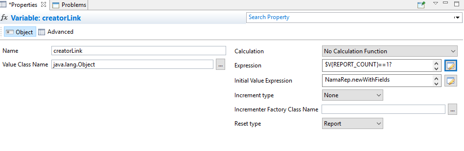

# Reports Guide (Jasper Reports)
### Add the company logo to a report

- Create a parameter named `loginLegalEntityLogo` with type `java.lang.Object` or `java.io.InputStream`
- Create an image, image expression should be `$P{loginLegalEntityLogo}`

### Subreports

You can include subreports within a main report. A subreport can either be:

* Another existing report, or
* An external report file.

To link a subreport, create a parameter with the **same ID** as the subreport. The parameter type should be either `java.io.InputStream` or `java.lang.Object`, depending on how the subreport is being passed.


### Extra Resources (e.g., Images)

You can also attach additional resources—such as images—to a report.
To use a resource within the report, define a parameter with the **same ID** as the resource. The parameter type should be `java.lang.Object`.


### How to Get Day Name of a Date
```groovy
NamaRep.dayName($F{dateField})
NamaRep.enDayName($F{dateField})
NamaRep.arDayName($F{dateField})
```
### To translate an enum
```groovy
NamaRep.translate(enumValue)
```
### To select name1, name2 or code, altCode based on language
```groovy
NamaRep.name(arabic,english)  
```
where arabic = name1 or code, english = name2 or altCode

### Calculate The Price of an Item

```groovy
NamaRep.priceCalculator().item($F{item}).uom($F{UOM}).qty($F{Quantity}).unitPriceOnly().price()
```
- This will calculate unit price only for the item with the qty and uom
::: tip
- This expression returns a full price Object. 
- You should put the result in a variable
  - The variable Class should be `java.lang.Object`
  - Calculation `No Calculation Function`
  - Increment type `None`
  - Reset type `None`
:::
- The following is a list of all functions you can use to create a price calculation request
- The `price()` or `unitPrice()` function must be the last one in the expression 
```groovy
item($F{itemIdOrCode})
customer($F{customerIdOrCode})
supplier($F{supplierIdOrCode})
uom($F{uomIdOrCode})
invoiceClassification($F{classificationIdOrCode})
ic($F{classificationIdOrCode})
legalEntity($F{legalEntityIdOrCode})
le($F{legalEntityIdOrCode})
sector($F{sectorIdOrCode})
sc($F{sectorIdOrCode})
branch($F{branchIdOrCode})
br($F{branchIdOrCode})
department($F{departmentIdOrCode})
dep($F{departmentIdOrCode})
analysisSet($F{analysisSetIdOrCode})
anset($F{analysisSetIdOrCode})
priceClassifier1($F{priceClassifier1IdOrCode})
pc1($F{priceClassifier1IdOrCode})
priceClassifier2($F{priceClassifier2IdOrCode})
pc2($F{priceClassifier2IdOrCode})
priceClassifier3($F{priceClassifier3IdOrCode})
pc3($F{priceClassifier3IdOrCode})
priceClassifier4($F{priceClassifier4IdOrCode})
pc4($F{priceClassifier4IdOrCode})
priceClassifier5($F{priceClassifier5IdOrCode})
pc5($F{priceClassifier5IdOrCode})
revision($F{revision})
color($F{colorCode})
size($F{size})
qty($F{qty})
date($F{date})
unitPriceOnly()
```
- Assuming the variable you created is named price, here is a list of all expressions you can use to extract price components
```groovy
$V{price}.custom.primitiveValue
$V{price}.discount1.afterValue.primitiveValue
$V{price}.discount1.maxNormalPercent.primitiveValue
$V{price}.discount1.percentage.primitiveValue
$V{price}.discount1.value.primitiveValue
$V{price}.discount2.afterValue.primitiveValue
$V{price}.discount2.maxNormalPercent.primitiveValue
$V{price}.discount2.percentage.primitiveValue
$V{price}.discount2.value.primitiveValue
$V{price}.discount3.afterValue.primitiveValue
$V{price}.discount3.maxNormalPercent.primitiveValue
$V{price}.discount3.percentage.primitiveValue
$V{price}.discount3.value.primitiveValue
$V{price}.discount4.afterValue.primitiveValue
$V{price}.discount4.maxNormalPercent.primitiveValue
$V{price}.discount4.percentage.primitiveValue
$V{price}.discount4.value.primitiveValue
$V{price}.discount5.afterValue.primitiveValue
$V{price}.discount5.maxNormalPercent.primitiveValue
$V{price}.discount5.percentage.primitiveValue
$V{price}.discount5.value.primitiveValue
$V{price}.discount6.afterValue.primitiveValue
$V{price}.discount6.maxNormalPercent.primitiveValue
$V{price}.discount6.percentage.primitiveValue
$V{price}.discount6.value.primitiveValue
$V{price}.discount7.afterValue.primitiveValue
$V{price}.discount7.maxNormalPercent.primitiveValue
$V{price}.discount7.percentage.primitiveValue
$V{price}.discount7.value.primitiveValue
$V{price}.discount8.afterValue.primitiveValue
$V{price}.discount8.maxNormalPercent.primitiveValue
$V{price}.discount8.percentage.primitiveValue
$V{price}.discount8.value.primitiveValue
$V{price}.headerDicount.afterValue.primitiveValue
$V{price}.headerDicount.maxNormalPercent.primitiveValue
$V{price}.headerDicount.percentage.primitiveValue
$V{price}.headerDicount.value.primitiveValue
$V{price}.netValue.primitiveValue
$V{price}.${price}.primitiveValue
$V{price}.tax1.afterValue.primitiveValue
$V{price}.tax1.maxNormalPercent.primitiveValue
$V{price}.tax1.percentage.primitiveValue
$V{price}.tax1.value.primitiveValue
$V{price}.tax2.afterValue.primitiveValue
$V{price}.tax2.maxNormalPercent.primitiveValue
$V{price}.tax2.percentage.primitiveValue
$V{price}.tax2.value.primitiveValue
$V{price}.tax3.afterValue.primitiveValue
$V{price}.tax3.maxNormalPercent.primitiveValue
$V{price}.tax3.percentage.primitiveValue
$V{price}.tax3.value.primitiveValue
$V{price}.tax4.afterValue.primitiveValue
$V{price}.tax4.maxNormalPercent.primitiveValue
$V{price}.tax4.percentage.primitiveValue
$V{price}.tax4.value.primitiveValue
$V{price}.totalCashShare.primitiveValue
$V{price}.totalPaymentMethodShare.primitiveValue
$V{price}.unitPrice.primitiveValue
``` 

### Links to entities, attachments, and reports
- Create a link to an entity
```groovy
NamaRep.link(entityType,id)
```
- Create a link to an entity with menu code and view name
```groovy
NamaRep.link().entityType($F{entityType}).id($F{id}).viewName("theViewName").menuCode("abcMenu").toString();
```
- Create a link to a file (attachment)
```groovy
NamaRep.attachmentLink(id)
```
- Create a link to another report
```groovy
NamaRep.repLinkByCode($P{REPORT_PARAMETERS_MAP},"ReportCode").p("p1 id").v(value expression).p("p2 id").v(value expression).toString()
```
- To copy all common parameters from the current report to the required report:
```groovy
NamaRep.repLinkByCode($P{REPORT_PARAMETERS_MAP},"code").copyParams()
```
- To add reference value, use any line from the following sample:
```groovy
v($F{id},$F{entity},$F{code},$F{name1},$F{name2})
v($F{id},$F{entity},$F{code})
ref($F{entityType},$F{id})
refCode($F{entityType},$F{code})
```
- Examples for report links
```groovy
NamaRep.repLinkByCode($P{REPORT_PARAMETERS_MAP},"Statement").copyParams().p("fromAccount").v($F{accountId},$F{accountEntityType},$F{accountCode})
        .p("toAccount").v($F{accountId},"Account",$F{accountCode}).toString()
```
```groovy
NamaRep.repLinkByCode($P{REPORT_PARAMETERS_MAP},"SalesProfitSummary").copyParams($P{REPORT_PARAMETERS_MAP})
        .p("SalesInvoice").ref("SalesInvoice",$F{SSIid}).p("cust").refCode("Customer","Customer501")
        .p("fromDate").v("23-04-2014").p("showDetails").v("true").toString()
```
```groovy
NamaRep.repLinkByCode($P{REPORT_PARAMETERS_MAP},"SubsidiaryAccountStatement").p("subsidiaryType").v($F{CustomerEntityType})
        .p("fromSubsidiary").v($F{customerId},$F{CustomerEntityType},$F{customerCode})
        .p("toSubsidiary").v($F{customerId},$F{CustomerEntityType},$F{customerCode}).p("accuontType").v("mainAccount").toString()
```
#### Share links to reports for outside parties
If you want to share report links to third parties who do not have username and password to access Nama ERP, 
```groovy
NamaRep.repLinkByCode($P{REPORT_PARAMETERS_MAP},"ARG000046-report").p("Code_Equals").ref($F{entityType},$F{id}).toNoAuthResultLink()
```
::: tip You can shorten URLs in reports
Use the following sample
```groovy
NamaRep.shortenURL(serverurl,signature,url)
```
To find more, visit `{shortenurl()}` section in tempo help
:::

- Create Link to create entities using Creators inside a report
  - Example: To create a link that generates a new Receipt Voucher based on an invoice:
```groovy
NamaRep.newWithFields("ReceiptVoucher")
.f("term").value("POTermCode")
.f("book").value("POBook1")
.f("remarks").v("Auto Created")
.f("fromDoc#type").v("SalesInvoice")
.f("fromDoc#code").v($F{code}).toString()
```
- You can also use `NamaRep.creator("ReceiptVoucher")`
- To generate a link that also includes line-level details (e.g., items), follow these steps:
  - Create a variable creator link as below:
    
  - Initial Value Expression
```groovy
NamaRep.newWithFields("PurchaseOrder").field("term").value("P.Order.Term").root()
```
  - Expression
```groovy
Expression: $V{creatorLink}.field("details.item.itemCode").value($F{code}).row($V{REPORT_COUNT})
```
  - Then create a link and make the expression:
```groovy
$V{creatorLink}.toString()
```
### Find employee vacation balances
```groovy
NamaRep.getVacation1RemainderBalance(empIdOrCode)
NamaRep.getVacation2RemainderBalance(empIdOrCode)
NamaRep.getVacation3RemainderBalance(empIdOrCode)
NamaRep.getVacationRemainderBalance(empCodeOrId,vacationTypeIdOrCode)
NamaRep.getVacationRemainderBalance(empCodeOrId,vacationTypeIdOrCode,atDate)
```

### Approvals in Reports
- Create Links to approve, reject, return, and so on
```groovy
NamaRep.approveAllLink($P{REPORT_PARAMETERS_MAP})
NamaRep.rejectAllLink($P{REPORT_PARAMETERS_MAP})
NamaRep.returnAllLink($P{REPORT_PARAMETERS_MAP})
NamaRep.returnAllToPreviousStepLink($P{REPORT_PARAMETERS_MAP})
```
- If you have approval per line (concerned lines, used mainly in supply chain documents)
```groovy
NamaRep.approveLink($P{REPORT_PARAMETERS_MAP},$F{lineNumber})
NamaRep.approveLink($P{REPORT_PARAMETERS_MAP},$F{lineNumber},reasoncodeOrId) // same for all remaining links
NamaRep.rejectLink($P{REPORT_PARAMETERS_MAP},$F{lineNumber})
NamaRep.returnLink($P{REPORT_PARAMETERS_MAP},$F{lineNumber})
NamaRep.returnToPreviousStepLink($P{REPORT_PARAMETERS_MAP},$F{lineNumber})
```
- Another alternative would be to use the `approveAllLink` method
```groovy
NamaRep.approveAllLink($P{REPORT_PARAMETERS_MAP},decision)
```
::: tip Allowed Values for decision

Decision can be one of: `Approve` , `Reject` , or `Return`
:::
- To show approval dialog by clicking on a link, use the following code sample
```groovy
NamaRep.approveFromJS(entityType, entityId, nextStepName, concernedLines, nextStepSeq, summary)
```
- Find if a line is concerned in approval
```groovy
NamaRep.isConcernedLine($P{REPORT_PARAMETERS_MAP},$F{lineNumber})
```


### Run SQL Statement inside a report
```groovy
NamaRep.runSQLQuery(sql,paramName,paramValue,paramName,paramValue)
```
### Transform HTML to text (HTML Parsing)
```groovy
NamaRep.htmlToText(text)
```
## Miscellaneous

### Time To String Functions in Reports
- `NamaRep.timeToString`: converts milliseconds to hours:minutes, example 9120000 becomes 02:32
- `NamaRep.timeToStringNullable`:  same as previous, but 0 is converted to null instead of 00:00
- `NamaRep.decimalToString`: converts hours to hours:minutes, example 9.5 becomes 09:30 and 9.25 becomes 9:15
- `NamaRep.decimalToStringNullable`: same as previous, but 0 is converted to null instead of 00:00

### To convert date to Hijri

```groovy
NamaRep.toHijri($F{date})
NamaRep.hijriDay($F{date})+"/"+NamaRep.hijriMonth($F{date})+"/"+NamaRep.hijriYear($F{date})
NamaRep.hijri_yyyyMMdd($F{date})
```

### To execute query:
```groovy
NamaRep.executeQuery("select cast(w.name1 collate Arabic_CI_AI_KS_WS as varchar(250)) from warehouse w where w.id = :wid"
        ,"wid",$F{wid})
```

### To Get Configuration Field:
```groovy
NamaRep.getValueFromModuleConfig(moduleId,fieldId)
```
- Example:
```groovy
NamaRep.getValueFromModuleConfig("basic","value.info.useCurrentUserAsSalesMan")
```

This will get the value of the field: value.info.useCurrentUserAsSalesMan from global config

- Here are the available module names:
```
accounting
basic
supplychain
fixedassets
humanresource
dms
project
ecpa
manufacturing
srvcenter
crm
contracting
travel
realestate
housing
auditing
education
namapos
mc
```