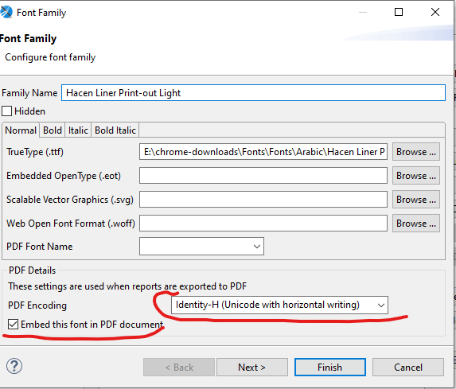

# Jasper Reports Complete Guide for Nama ERP

## Overview
This comprehensive guide covers all aspects of developing Jasper Reports in Nama ERP, including the powerful NamaRep utility class that extends ServerNamaRep. NamaRep provides essential functions for localization, data retrieval, entity linking, pricing calculations, and more.

## Quick Start: Adding Company Logo to Reports

To display the company logo in your reports:

1. Create a parameter named `loginLegalEntityLogo` with type `java.lang.Object` or `java.io.InputStream`
2. Add an image component to your report
3. Set the image expression to `$P{loginLegalEntityLogo}`

The logo is automatically provided by the system when the report runs.

### Adding Any Attachment/Image to Reports
```groovy
// To retrieve any attachment by ID
NamaRep.getFile($F{attachmentId})
// OR
NamaRep.getAttachment($F{attachmentId})
```

## Subreports

You can include subreports within a main report. A subreport can be either another existing report or an external report file.

### Linking Subreports
To link a subreport:
1. Create a parameter with the **same ID** as the subreport
2. Set the parameter type to `java.io.InputStream` or `java.lang.Object`
3. The system will automatically pass the subreport to this parameter

### Extra Resources (Images, Files)
You can attach additional resources such as images to a report:
1. Define a parameter with the **same ID** as the resource
2. Set the parameter type to `java.lang.Object`
3. The resource will be available through this parameter

## NamaRep API Reference

### Core Localization & Translation

#### Name Selection Based on Language
```groovy
// Automatically selects Arabic or English name based on current language
NamaRep.name(name1, name2)  // Returns name1 for Arabic, name2 for English

// With fallback to code if names are empty
NamaRep.nameOrCode(code, name1, name2)

// Direct language selection
NamaRep.name(arabic, english)  // where arabic = name1 or code, english = name2 or altCode
```

#### Translation Methods
```groovy
// Translate any value (strings, booleans, enums)
NamaRep.translate(value)

// Translate enum values
NamaRep.translate(enumValue)

// Translate boolean values to localized text
NamaRep.translate(true)  // Returns localized "Yes" or "نعم"

// Translate field IDs with entity context
NamaRep.title(entityType, fieldId)
NamaRep.translate(entityType, fieldId)

// Translate with prefix
NamaRep.translate("prefix", "value")  // Translates "prefix.value"

// Split translated text with pipe separator
NamaRep.head("header|subtitle")  // Returns "header"
NamaRep.sub("header|subtitle")   // Returns "subtitle"
```

### Date & Time Functions

#### Day Names
```groovy
NamaRep.dayName($F{dateField})     // Returns day name in current language
NamaRep.arDayName($F{dateField})   // Arabic day name
NamaRep.enDayName($F{dateField})   // English day name
NamaRep.dayName(dayNumber)         // 1=Sunday, 2=Monday, etc.
```

#### Hijri Calendar Support
```groovy
// Convert Gregorian to Hijri
NamaRep.toHijri($F{date})                    // Full Hijri date string
NamaRep.toHijriDate($F{date})                // HijriDate object
NamaRep.hijriDay($F{date})                   // Day in Hijri (padded)
NamaRep.hijriMonth($F{date})                 // Month in Hijri (padded)
NamaRep.hijriYear($F{date})                  // Year in Hijri
NamaRep.hijri_yyyyMMdd($F{date})            // Format: yyyyMMdd

// Custom formatting
NamaRep.hijriDay($F{date})+"/"+NamaRep.hijriMonth($F{date})+"/"+NamaRep.hijriYear($F{date})
```

#### Time Conversion
```groovy
// Convert decimal hours to time format
NamaRep.decimalToTime(9.5)           // Returns "09:30"
NamaRep.decimalToTimeNullable(0)     // Returns null instead of "00:00"

// Convert milliseconds to time format  
NamaRep.timeToString(9120000)        // Returns "02:32"
NamaRep.timeToStringNullable(0)      // Returns null instead of "00:00"
```

#### Date Period Calculations
```groovy
// Calculate period between dates (years, months, days)
// 1. Create variable with reset type none, increment type none
java.time.Period.between(
  new java.util.Date($F{FromDate}.getTime()).toInstant()
    .atZone(java.time.ZoneId.systemDefault()).toLocalDate(), 
  java.time.LocalDate.now()
)

// 2. Use in text field expression
$V{period}.getYears()+" سنة "+$V{period}.getMonths()+" شهر "+$V{period}.getDays()+" يوم"

// Calculate months between dates
NamaRep.dateDiffInMonth(date1, date2)
```

### Number Formatting & Conversion

#### Arabic Numerals
```groovy
// Convert Western to Arabic-Hindi numerals (٠,١,٢,٣,٤,٥,٦,٧,٨,٩)
NamaRep.arNumbers("123")  // Returns "١٢٣"
NamaRep.arNumbers(value)
```

#### Numeric Field Helpers
```groovy
// Null-safe operations
NamaRep.zeroIfNull(fieldOrVariable)        // Returns 0 if null
NamaRep.oneIfZero(fieldOrVariable)          // Returns 1 if zero
NamaRep.nullIfZero(fieldOrVariable)         // Returns null if zero

// Convert to BigDecimal
NamaRep.objectToDecimal(value)   // Safe conversion to BigDecimal
```

#### Saudi Riyal Symbol
```groovy
// Returns SAR symbol as InputStream for image component
NamaRep.sar()
```

### Tafqeet (Number to Words)
```groovy
// Convert numbers to words in different languages
NamaRep.tafqeet(currencyCode, amount)        // Current language
NamaRep.tafqeetArabic(currencyCode, amount)  // Arabic
NamaRep.tafqeetEnglish(currencyCode, amount) // English
NamaRep.tafqeetFrench(currencyCode, amount)  // French
```
The configuration for currencies tafqeet can be found in Global Configuration under `value.info.tafqeetInfo.currencyCode`

## Price Calculations

### Price Calculator Usage
```groovy
// Basic unit price calculation
NamaRep.priceCalculator()
  .item($F{item})
  .uom($F{UOM})
  .qty($F{Quantity})
  .unitPriceOnly()
  .price()
```

::: tip Creating Price Variables
This expression returns a full price Object. You should store it in a variable:
- Variable Class: `java.lang.Object`
- Calculation: `No Calculation Function`
- Increment type: `None`
- Reset type: `None`
:::

#### Complete Price Calculator Functions
```groovy
// All available builder functions
NamaRep.priceCalculator()
  .item($F{itemIdOrCode})
  .customer($F{customerIdOrCode})
  .supplier($F{supplierIdOrCode})
  .uom($F{uomIdOrCode})
  .invoiceClassification($F{classificationIdOrCode})
  .ic($F{classificationIdOrCode})              // Short for invoiceClassification
  .legalEntity($F{legalEntityIdOrCode})
  .le($F{legalEntityIdOrCode})                  // Short for legalEntity
  .sector($F{sectorIdOrCode})
  .sc($F{sectorIdOrCode})                       // Short for sector
  .branch($F{branchIdOrCode})
  .br($F{branchIdOrCode})                       // Short for branch
  .department($F{departmentIdOrCode})
  .dep($F{departmentIdOrCode})                  // Short for department
  .analysisSet($F{analysisSetIdOrCode})
  .anset($F{analysisSetIdOrCode})               // Short for analysisSet
  .priceClassifier1($F{priceClassifier1IdOrCode})
  .pc1($F{priceClassifier1IdOrCode})            // Short for priceClassifier1
  .priceClassifier2($F{priceClassifier2IdOrCode})
  .pc2($F{priceClassifier2IdOrCode})
  .priceClassifier3($F{priceClassifier3IdOrCode})
  .pc3($F{priceClassifier3IdOrCode})
  .priceClassifier4($F{priceClassifier4IdOrCode})
  .pc4($F{priceClassifier4IdOrCode})
  .priceClassifier5($F{priceClassifier5IdOrCode})
  .pc5($F{priceClassifier5IdOrCode})
  .revision($F{revision})
  .color($F{colorCode})
  .size($F{size})
  .qty($F{qty})
  .date($F{date})
  .unitPriceOnly()
  .price()  // Must be last in chain
```

#### Accessing Price Components
After storing price in variable `$V{price}`, access components:

```groovy
// Main values
$V{price}.unitPrice.primitiveValue
$V{price}.netValue.primitiveValue
$V{price}.custom.primitiveValue
$V{price}.totalCashShare.primitiveValue
$V{price}.totalPaymentMethodShare.primitiveValue

// Discount components (1-8 available)
$V{price}.discount1.percentage.primitiveValue
$V{price}.discount1.value.primitiveValue
$V{price}.discount1.afterValue.primitiveValue
$V{price}.discount1.maxNormalPercent.primitiveValue

// Header discount
$V{price}.headerDicount.percentage.primitiveValue
$V{price}.headerDicount.value.primitiveValue
$V{price}.headerDicount.afterValue.primitiveValue

// Tax components (1-4 available)
$V{price}.tax1.percentage.primitiveValue
$V{price}.tax1.value.primitiveValue
$V{price}.tax1.afterValue.primitiveValue
$V{price}.tax1.maxNormalPercent.primitiveValue
```

## Entity Links & Navigation

### Basic Entity Links
```groovy
// Simple link to entity
NamaRep.link(entityType, id)
NamaRep.link(serverUrl, entityType, id)

// Advanced link builder with menu and view
NamaRep.link()
  .entityType($F{entityType})
  .id($F{id})
  .viewName("theViewName")
  .menuCode("abcMenu")
  .url(serverUrl)
  .toString()
```

### Attachment Links
```groovy
// Create link to attachment/document
NamaRep.attachmentLink(id)
NamaRep.attachmentLink(serverUrl, attachmentId)
```

### Report Links
```groovy
// Link to another report by code
NamaRep.repLinkByCode($P{REPORT_PARAMETERS_MAP}, "ReportCode")
  .p("p1 id").v(value expression)
  .p("p2 id").v(value expression)
  .copyParams()  // Copy all shared parameters from current report
  .toString()

// Reference parameters - multiple formats available
.p("param").v($F{id}, $F{entity}, $F{code}, $F{name1}, $F{name2})
.p("param").v($F{id}, $F{entity}, $F{code})
.p("param").ref($F{entityType}, $F{id})
.p("param").refCode($F{entityType}, $F{code})
```

#### Report Link Examples
```groovy
// Example 1: Account Statement
NamaRep.repLinkByCode($P{REPORT_PARAMETERS_MAP}, "Statement")
  .copyParams()
  .p("fromAccount").v($F{accountId}, $F{accountEntityType}, $F{accountCode})
  .p("toAccount").v($F{accountId}, "Account", $F{accountCode})
  .toString()

// Example 2: Sales Profit Summary
NamaRep.repLinkByCode($P{REPORT_PARAMETERS_MAP}, "SalesProfitSummary")
  .copyParams($P{REPORT_PARAMETERS_MAP})
  .p("SalesInvoice").ref("SalesInvoice", $F{SSIid})
  .p("cust").refCode("Customer", "Customer501")
  .p("fromDate").v("23-04-2014")
  .p("showDetails").v("true")
  .toString()

// Example 3: Subsidiary Account Statement
NamaRep.repLinkByCode($P{REPORT_PARAMETERS_MAP}, "SubsidiaryAccountStatement")
  .p("subsidiaryType").v($F{CustomerEntityType})
  .p("fromSubsidiary").v($F{customerId}, $F{CustomerEntityType}, $F{customerCode})
  .p("toSubsidiary").v($F{customerId}, $F{CustomerEntityType}, $F{customerCode})
  .p("accuontType").v("mainAccount")
  .toString()
```

### Public Report Links (No Authentication)
To share a report link externally (e.g., to customers) without requiring login:

```groovy
NamaRep.repLinkByCode($P{REPORT_PARAMETERS_MAP}, "ARG000046-report")
  .p("Code_Equals").ref($F{entityType}, $F{id})
  .toNoAuthResultLink()
```

::: tip URL Shortening
You can shorten report URLs using:
```groovy
NamaRep.shortenURL(serverurl, signature, url)
```
See `{shortenurl()}` section in Tempo documentation for more info.
:::

## Entity Creation (Creators)

### Basic Creator
```groovy
// Create new entity with fields
NamaRep.newWithFields("ReceiptVoucher")
  .f("term").value("POTermCode")
  .f("book").value("POBook1")
  .f("remarks").v("Auto Created")
  .f("fromDoc#type").v("SalesInvoice")
  .f("fromDoc#code").v($F{code})
  .menuCode("NormalReceiptMenu")
  .viewName("NormalReceipts")
  .toString()

// Alternative syntax
NamaRep.creator("ReceiptVoucher")
  .field("supplier").value(supplierId)
  .toString()
```

### Creator with Line Details
For reports with detail bands that need to create entities with line items:

1. **Create variable** `creatorLink` with initial value expression:
```groovy
NamaRep.newWithFields("PurchaseOrder")
  .field("term").value("P.Order.Term")
  .root()
```

2. **In detail band**, add line items:
```groovy
$V{creatorLink}
  .field("details.item.itemCode").value($F{code})
  .field("details.quantity").value($F{qty})
  .row($V{REPORT_COUNT})
```

3. **Generate final link**:
```groovy
$V{creatorLink}.toString()
```

## Approval System

### Document Approval Links
```groovy
// Approve/Reject/Return all lines
NamaRep.approveAllLink($P{REPORT_PARAMETERS_MAP})
NamaRep.rejectAllLink($P{REPORT_PARAMETERS_MAP})
NamaRep.returnAllLink($P{REPORT_PARAMETERS_MAP})
NamaRep.returnAllToPreviousStepLink($P{REPORT_PARAMETERS_MAP})

// With decision parameter
NamaRep.approveAllLink($P{REPORT_PARAMETERS_MAP}, decision)  // decision: "Approve", "Reject", or "Return"
```

### Per-Line Approval (Concerned Lines)
For documents with line-level approvals:

```groovy
// Approve/Reject specific line
NamaRep.approveLink($P{REPORT_PARAMETERS_MAP}, $F{lineNumber})
NamaRep.rejectLink($P{REPORT_PARAMETERS_MAP}, $F{lineNumber})
NamaRep.returnLink($P{REPORT_PARAMETERS_MAP}, $F{lineNumber})
NamaRep.returnToPreviousStepLink($P{REPORT_PARAMETERS_MAP}, $F{lineNumber})

// With reason code
NamaRep.approveLink($P{REPORT_PARAMETERS_MAP}, $F{lineNumber}, reasonCodeOrId)
NamaRep.rejectLink($P{REPORT_PARAMETERS_MAP}, $F{lineNumber}, reasonCodeOrId)

// Check if line needs approval
NamaRep.isConcernedLine($P{REPORT_PARAMETERS_MAP}, $F{lineNumber})
```

### JavaScript Approval Dialog
```groovy
// Show approval dialog in browser
NamaRep.approveFromJS(entityType, entityId, nextStepName, 
                      concernedLines, nextStepSeq, summary)
```

## Employee & HR Functions

### Vacation Balances
```groovy
// Default vacation types (1, 2, 3)
NamaRep.getVacation1RemainderBalance(empIdOrCode)
NamaRep.getVacation2RemainderBalance(empIdOrCode)
NamaRep.getVacation3RemainderBalance(empIdOrCode)

// Specific vacation type
NamaRep.getVacationRemainderBalance(empCodeOrId, vacationTypeIdOrCode)
NamaRep.getVacationRemainderBalance(empCodeOrId, vacationTypeIdOrCode, atDate)

// Detailed vacation information
NamaRep.getVacationAssignedConsumedRemainder(employeeId, vacationType)
NamaRep.getVacationAssignedConsumedRemainder(employeeId, vacationType, atDate)

// Balance per years
NamaRep.getRemainderBalancePerYears(employeeId, atDate, yearsCount)
```

## Database Operations

### SQL Query Execution
```groovy
// Execute SQL query with parameters
NamaRep.runSQLQuery(sql, paramName, paramValue, paramName, paramValue)

// Example with named parameters
NamaRep.executeQuery(
  "SELECT cast(w.name1 collate Arabic_CI_AI_KS_WS as varchar(250)) 
   FROM warehouse w WHERE w.id = :wid",
  "wid", $F{wid}
)

// Format query results
NamaRep.formatQueryResult(results, "\n", ",")  // Row separator, column separator
```

### Module Configuration Access
```groovy
// Get configuration value
NamaRep.getValueFromModuleConfig(moduleId, fieldId)

// Example
NamaRep.getValueFromModuleConfig("basic", "value.info.useCurrentUserAsSalesMan")
```

Available module names:
- accounting, basic, supplychain, fixedassets
- humanresource, dms, project, ecpa
- manufacturing, srvcenter, crm, contracting
- travel, realestate, housing, auditing
- education, namapos, mc

## Security & Permissions

### Security Constraints for Reports

::: rtl
### كيفية التصفية حسب الشركة، أو القطاع، أو أي مُحدد آخر

نفترض أنك ترغب في تصفية البيانات بناءً على منشئ السجل، وصلاحيات التعديل أو العرض، وكذلك حسب الشركة أو القطاع أو الفرع أو غير ذلك من المُحددات ضمن سجل الحساب. للقيام بذلك، اتبع الخطوات التالية:
:::

#### 1. Create Hidden Parameter `SECURITY_CONSTRAINTS`

Create a `String` parameter with "Not For Prompting" and default expression:

```groovy
NamaRep.security()
  .fieldEntityType("Account")
  .tableAlias("acc")
  .capabilities("firstAuthor", "viewCapability", "usageCapability", 
                "updateCapability", "legalEntity", "branch", 
                "sector", "department", "analysisSet")
```

**Expression Components:**
- `.fieldEntityType("Account")` - Specifies the entity type for security filtering
- `.tableAlias("acc")` - Table alias in your SQL query
- `.capabilities(...)` - List of security dimensions to filter by

Available capabilities:
- `firstAuthor` - Filter by record creator
- `viewCapability`, `updateCapability`, `usageCapability` - Permission-based filtering
- `legalEntity`, `branch`, `sector`, `department`, `analysisSet` - Organizational filtering

#### 2. Use in SQL Query

Include the parameter in your WHERE clause:

```sql
SELECT a, b, c 
FROM Account acc 
LEFT JOIN Table2 t2 ON t2.id = acc.someId 
WHERE acc.code <> 'abc' 
  AND $P!{SECURITY_CONSTRAINTS}
```

#### 3. Multiple Table Security

For filtering on multiple tables:

```groovy
NamaRep.security()
  .fieldEntityType("Account")
  .tableAlias("Account")
  .capabilities("firstAuthor", "viewCapability")
+ " AND " +
NamaRep.security()
  .fieldEntityType("FiscalYear")
  .tableAlias("FiscalYear")
  .capabilities("legalEntity", "branch", "sector")
```

::: tip Summary
This security filtering approach dynamically applies data visibility and editing rights based on user roles and organizational structure. The system automatically generates appropriate WHERE clauses based on user permissions.
:::

### Display Permissions
```groovy
// Check if user can display parameter/field
NamaRep.canDisplay($P{param})
```

## Utility Functions

### HTML to Text Conversion
```groovy
NamaRep.htmlToText(htmlContent)
```

### Serial Numbers
```groovy
// Expand compressed serials
NamaRep.expandSerials(serials)                      // Default newline separator
NamaRep.expandSerials(serials, separator)           // Custom separator
NamaRep.unzipSerials(serials)                      // Returns List<String>
NamaRep.unzipSerialsWithNewLines(serials)
NamaRep.unzipSerialsWithComma(serials)
NamaRep.unzipSerialsWithSeparator(serials, ";")

// Compress serial ranges
NamaRep.zipSerialsRange(serials)
```

### ZATCA QR Codes (Saudi Tax Authority)
```groovy
// Generate ZATCA QR code
NamaRep.genZATCAQR(sellerName, vatNumber, timestamp, 
                   invoiceAmount, vatAmount)

// With separate value and creation dates
NamaRep.genZATCAQRWithCreationDate(sellerName, vatNumber, 
                                   valueDate, creationDate, 
                                   invoiceAmount, vatAmount)

// From entity
NamaRep.genZatcaQrCodeFromEntity(entityType, idOrCode)
NamaRep.zatcaHashedInvoice(entityType, id)
```

### Mobile QR Integrator
```groovy
// Create QR code for mobile scanning and entity creation/update
// The QR code will be processed by Mobile QR Integrator when scanned

// Basic QR with integrator code
NamaRep.mobileQr()
    .code("IntegratorCode")
    .toString()

// QR with parameters
NamaRep.mobileQr()
    .code("CustomerAttendance")
    .addParam("customer", $F{customerCode})
    .addParam("date", $F{valueDate})
    .addParam("amount", $F{totalAmount})
    .toString()

// Encrypted QR (Base64 encoded)
NamaRep.mobileQr()
    .code("SecureIntegrator")
    .addParam("sensitive", $F{confidentialData})
    .encrypted()
    .toString()
```

**Usage Notes:**
- The QR code contains JSON with the integrator code/ID and parameters
- Parameters are accessible in entity flows via `$map.paramName`
- Encrypted QRs are automatically decrypted by the mobile app
- The integrator must be configured in MobileQRIntegrator entity

## System Parameters in Reports

All reports have access to these system parameters:

::: details Click to see all system parameters
### User & Login Information
- `loginLanguage` - Current language (Arabic/English)
- `originalLoginLanguage` - Original login language
- `loginUserId`, `loginUserCode`, `loginUserName1`, `loginUserName2`
- `loginUserTreatAsAuthorIds` - Delegate user IDs
- `loginEmployeeId`
- `currentUser` - Current user object

### Organization Structure
- `loginLegalEntityId`, `loginLegalEntityCode`, `loginLegalEntityName1`, `loginLegalEntityName2`
- `loginSectorId`, `loginSectorCode`, `loginSectorName1`, `loginSectorName2`
- `loginBranchId`, `loginBranchCode`, `loginBranchName1`, `loginBranchName2`
- `loginDepartmentId`, `loginDepartmentCode`, `loginDepartmentName1`, `loginDepartmentName2`
- `loginAnalysisSetId`, `loginAnalysisSetCode`, `loginAnalysisSetName1`, `loginAnalysisSetName2`

### Public Organization IDs
- `publicLegalEntityId`, `publicSectorId`, `publicBranchId`
- `publicDepartmentId`, `publicAnalysisSetId`

### Logos & Branding
- `loginLegalEntityLogo` - Primary logo (InputStream)
- `loginLegalEntityLogo2` through `loginLegalEntityLogo5` - Additional logos
- `reportsFooterNote1`, `reportsFooterNote2` - Footer text

### Report Context
- `formEntityType` - Entity type for the form (can be used for translation)
- `reportCode`, `reportId`, `reportName1`, `reportName2`
- `namaReportInstance` - Report instance object
- `runId` - Unique run identifier

### URLs
- `guiServerURL` - GUI server URL
- `externalServerURL` - External server URL
- `currentGUIURL` - Current GUI URL

### Approval System
- `concernedLines` - Lines requiring approval
- `candidateEmployeeId`, `candidateEmployeeCode`, `candidateEmployeeName1`, `candidateEmployeeName2`
- `approvedRecordId`, `approvedRecordType`, `approvedRecordCode`
- `approvalSecret`, `approvalStepSeq`

### Security & Permissions
- `allowedCapabilities`, `allowedEntities`, `allowedDocuments`, `allowedFiles`
- `notAllowedEntities`, `notAllowedDocuments`, `notAllowedFiles`
- `accessibleLegalEntityIds`, `accessibleSectorIds`, `accessibleBranchIds`
- `accessibleDepartmentIds`, `accessibleAnalysisSetIds`

### Security Flags
- `legalEntityNotUsedInSecurity`, `sectorNotUsedInSecurity`
- `branchNotUsedInSecurity`, `departmentNotUsedInSecurity`
- `analysisSetNotUsedInSecurity`

### Other
- `posShiftCode` - POS shift code
- `currentReplicationSiteId`, `currentReplicationSiteCode`
- `currentReplicationSiteName1`, `currentReplicationSiteName2`
:::

## Report Parameters

### List Parameters (Multi-Selection)

To define a parameter that supports multiple selections:

1. Set the property `list = true`
2. For non-reference types, specify `listType` property
3. Capture selected values for display:
   - `<parameterName>_csv`: Translated values as CSV string
   - `<parameterName>_codecsv`: Codes as CSV string
   - `<parameterName>_name1csv`: Name1 fields as CSV string
   - `<parameterName>_name2csv`: Name2 fields as CSV string
4. To prevent automatic grid display: `doNotAutoShowList = true`

::: details Example: Multi-Selection Parameters
```xml
<!-- Reference type list parameter -->
<parameter name="MultiEmployee" class="java.util.List">
    <property name="entityType" value="Employee"/>
    <property name="arabic" value="الموظفين"/>
    <property name="english" value="Employees"/>
    <property name="property" value="code"/>
    <property name="list" value="true"/>
    <property name="doNotAutoShowList" value="false"/>
</parameter>
<parameter name="MultiEmployee_csv" class="java.lang.String" isForPrompting="false"/>

<!-- Non-reference type list parameter -->
<parameter name="MultiDate" class="java.util.Date">
    <property name="english" value="Dates"/>
    <property name="arabic" value="التواريخ"/>
    <property name="defaultValue" value="$monthStart()"/>
    <property name="list" value="true"/>
    <property name="listType" value="java.util.Date"/>
</parameter>
<parameter name="MultiDate_csv" class="java.lang.String" isForPrompting="false"/>
```
:::

### Parameter Properties Reference

#### Basic Properties
- **`list`**: `true`/`false` - Enable multi-selection
- **`listType`**: Required for non-reference types (e.g., `java.util.Date`)
- **`layout`**: Display layout (`alone`, `spanned`, `normal`, `spanned2`)
- **`required`**: `true`/`false` - Mark as mandatory
- **`requiredGroup`**: Group parameters where at least one must be filled
- **`hijri`**: `true`/`false` - Use Hijri calendar for dates
- **`nama-id`**: Internal identifier for Nama-specific functionality (Report Wizard)

#### Suggestions for Text Fields
- **`suggestionquery`**: SQL query for autocomplete
  - Two columns: Code and Arabic display
  - Three columns: Code, Arabic, and English

```sql
-- Example suggestion query
SELECT DISTINCT TOP 25 revisionId, revisionName 
FROM ItemRevision 
WHERE invItem_id = {fItem} 
  AND (revisionId LIKE '%' + {revision} + '%' 
       OR revisionName LIKE '%' + {revision} + '%')
```

#### Reference Selection
- **`entityType`**: Entity to select from
- **`property`**: Field to extract (`code`, `name1`, `name2`, `startDate`)

#### Combo Box (Drop Down)
- **`enumType`**: Enum type for allowed values
- **`allowedValues`**: Comma-separated allowed values (renders as combo box)
- **`allowedValuesAr`**: Arabic translations for dropdown values (comma-separated, same order as `allowedValues`)
- **`allowedValuesEn`**: English translations for dropdown values (comma-separated, same order as `allowedValues`)

```xml
<parameter name="entityType" class="java.lang.String">
    <property name="enumType" value="EntityTypeDF"/>
    <property name="allowedValues" value="Employee,Supplier"/>
    <property name="allowedValuesAr" value="موظف,مورد"/>
    <property name="allowedValuesEn" value="Employee,Supplier"/>
</parameter>
```

#### Filtering Values
- **`filter`**: Field filtering syntax: `field,operator,value[,relation]`
  - Multiple filters separated by semicolons
  - Default relation is `AND`
  - Use `${parameterId}` to reference other parameters

Available operators:
```
Equal, EqualOrEmpty, NotEqual, NotEqualOrEmpty,
GreaterThan, GreaterThanOrEmpty, GreaterThanOrEqual, GreaterThanOrEqualOrEmpty,
LessThan, LessThanOrEmpty, LessThanOrEqual, LessThanOrEqualOrEmpty,
StartsWith, StartsWithOrEmpty, NotStartsWith, NotStartsWithOrEmpty,
EndsWith, EndsWithOrEmpty, NotEndWith, NotEndWithOrEmpty,
Contains, ContainsOrEmpty, NotContain, NotContainOrEmpty,
OpenBracket, CloseBracket, In
```

Examples:
```
forType,Equal,Department,AND;isLeaf,Equal,true
documentType,Equal,ReceiptVoucher
forType,Equal,${subsidiaryType}
```

#### Default Values
- **`defaultValue`**: String value based on parameter type
  - Date: `dd-MM-yyyy`
  - Time: `yyyy-MM-dd'T'HH:mm:ss.SSS`
  - Reference: `id:entityType:code`

::: details Dynamic Default Functions
```
$now()                  $today()
$monthStart()           $monthEnd()
$yearStart()            $yearEnd()
$quarterStart()         $quarterEnd()
$thirdStart()           $thirdEnd()
$halveStart()           $halveEnd()
$previousMonthStart()   $previousMonthEnd()
$nextMonthStart()       $nextMonthEnd()
$previousYearStart()    $previousYearEnd()
$nextYearStart()        $nextYearEnd()
$currentFiscalPeriod()  $currentUser()
$currentEmployee()
$todayPlusDays(n)       $todayPlusWeeks(n)
$todayPlusMonths(n)     $todayPlusYears(n)
```
:::

For multi-value parameters, use `@A=@X` separator:
```
id:entityType:code@A=@Xid:entityType:code@A=@X...
```

#### Display Control & Validation
- **`NamaRep.canDisplay($P{param})`**: Use in `printWhenExpression`
- **`no-mirror = true`**: Prevent element mirroring

#### Range Validation
- **`fromParam`**: Link "to" parameter to "from" parameter
- **`fromParamMaxGapInDays`**: Maximum gap in days between dates

```xml
<parameter name="toDate" class="java.util.Date">
    <property name="arabic" value="إلى تاريخ"/>
    <property name="english" value="To Date"/>
    <property name="fromParam" value="fromDate"/>
    <property name="fromParamMaxGapInDays" value="30"/>
</parameter>
```

#### Other Properties
- **`arabic`/`english`**: Display labels
- **`resource`**: Resource key for translation
- **`src`**: Reuse property from another parameter
- **`ignore`**: Exclude from prompting
- **`type`**: Special null handling or comparison type (e.g., for date comparisons with `>`, `<` operators)

### Report Properties
Special report-level properties (consult development team for usage):
- `preRunUtil` - Pre-execution utility
- `questionsChangeUtil` - Question change handler
- `comparisonType` - Comparison type configuration

## Creating Reports with Different Page Sizes

::: rtl
### كيفية إنشاء تقرير يحتوي على تقارير فرعية بأحجام صفحات مختلفة باستخدام JasperReports

يمكنك تنفيذ هذا النوع من التقارير بسهولة باستخدام JasperReports من خلال الخطوات التالية:
:::

### Using Book Reports for Multiple Page Sizes

1. **Create a Book Report**: Start with a main report of type *Book Report*
2. **Add SQL Query**: Write a simple SQL query with fields for conditional display
3. **Add Report Parts**: Use **Add Part to Content** to add each subreport
4. **Set Print Conditions**: Use **Print When Expression** for each part
5. **Pass Parameters**: Define all required parameters and pass them to each part

### Example: Mixed A4 and A3 Pages
Create a print template with two parts having different page sizes (A4 and A3), displayed based on a condition from the document's notes field. Each part can contain its own subreports.

- 📥 [Download Excel template for import](https://docs.google.com/spreadsheets/d/1TPjsTwB2fcCIth0JB30AqbmIxPymgEbG/edit)
- 📎 [Download attachment for import](https://drive.google.com/file/d/1r1FraUmyLue9xyOHURnzzKTKoap_hxQQ/view)

Reference: Development request [SRDRQ05261](https://namasoft.com/reqs/SRDRQ05261)

## Kill Reports Running for More Than N Seconds

::: rtl
### ⏱️ إيقاف التقارير التي تجاوزت وقت تنفيذ معين

عند تشغيل تقارير كبيرة، قد يؤدي الضغط على النظام أحيانًا إلى عدم قدرة المستخدمين الجدد على تسجيل الدخول. وفي بعض الحالات، نضطر إلى إيقاف خدمة **Tomcat** وإعادة تشغيلها لحل المشكلة.

لذا تم إنشاء أداة تقوم بإيقاف أي تقرير تجاوز وقت تنفيذ معين (مثلاً 10 أو 120 ثانية)، دون الحاجة لإعادة تشغيل الخادم.
:::

### Configuration Steps

1. **Edit `nama.properties`**:
```ini
kill-reports-running-more-than-seconds=120
```
The number `120` represents the maximum seconds allowed for report execution.

2. **Apply Configuration**:
Navigate to: `/basic-services/monitorlogin?reload-config-and-kill-running-reports=true`

This reloads the configuration and kills all reports exceeding the time limit.

Reference: Development request [ECPADR00932](https://namasoft.com/reqs/ECPADR00932)

## Adding Extra Fonts for PDF Printing

Nama ERP supports **Times New Roman** by default for Arabic text. To use different Arabic-supporting fonts (Cairo, Amiri, Droid Arabic Naskh, etc.):

### 1. Add Font in Jaspersoft Studio
- Open **Jaspersoft Studio**
- Go to `Window > Preferences`
- Navigate to `Jaspersoft Studio > Fonts`
- Click **Add**

### 2. Configure Font Properties
In the **Font Family** dialog:
- Choose the `.ttf` or `.otf` font file(s)
- Check ✅ **Embed this font in PDF documents**
- Set **PDF Encoding** to: `Identity-H`



- Click **Finish**

### 3. Export Font as JAR
- After adding the font, click **Export**
- Save the generated `.jar` file

### 4. Deploy Font JAR in Tomcat
- Copy the exported `.jar` file to `tomcat/lib` folder
- Restart the **Tomcat** service

### 5. Use the Font in Reports
- Assign the new font family to text fields in your `.jrxml` files
- The font will be embedded and rendered properly in PDFs, including Arabic characters

## Best Practices

### 1. Variable Creation for Complex Objects
When working with price calculations or report links, create variables:
```xml
<variable name="price" class="java.lang.Object" calculation="No Calculation Function">
  <initialValueExpression>
    NamaRep.priceCalculator().item($F{item}).qty($F{qty}).price()
  </initialValueExpression>
</variable>
```

### 2. Null Safety
Always use null-safe methods when dealing with potentially null values:
```groovy
NamaRep.zeroIfNull(value)              // Instead of direct value access
NamaRep.nameOrCode(code, name1, name2) // Fallback to code
```

### 3. Localization
Always use translation methods for user-facing text:
```groovy
NamaRep.translate(enumValue)   // For enums
NamaRep.name(arabic, english)  // For dual-language fields
```

### 4. Performance Optimization
- Cache complex calculations in variables
- Use `copyParams()` when linking reports to avoid parameter duplication
- Batch SQL queries when possible

### 5. Security Constraints
Always apply security constraints when querying sensitive data:
```sql
SELECT * FROM Account acc 
WHERE acc.active = true 
  AND $P!{SECURITY_CONSTRAINTS}
```

## Migration from Legacy Methods

Common replacements when updating old reports:

| Old Method | New Method |
|------------|------------|
| Direct field access | `NamaRep.name(name1, name2)` |
| Manual date formatting | `NamaRep.datePattern()` |
| Custom price queries | `NamaRep.priceCalculator()` |
| Manual translation | `NamaRep.translate()` |

## Troubleshooting

### Common Issues and Solutions

1. **Arabic text not displaying**: Ensure font supports Arabic and PDF encoding is set to `Identity-H`
2. **Null pointer exceptions**: Use null-safe methods like `zeroIfNull()`
3. **Price calculations returning null**: Verify all required parameters are provided
4. **Links not working**: Check that entity type and ID are valid
5. **Security constraints not applying**: Ensure parameter name matches exactly in query
6. **Multi-selection not working**: Verify `list` and `listType` properties are set correctly
7. **Subreports not loading**: Check parameter ID matches subreport name exactly

## Advanced Features Reference

For additional advanced features, consult the development team:

- Group Expressions: `NamaRep.groupExpression(field1, field2, field3)`
- Order By Builder for complex sorting
- Audit Trail: `NamaRep.audit(entityType, id, versionNumber, actionType)`
- Encryption/Decryption utilities
- Values Holder for complex operations
- Report References with custom ordering
- Map creation utilities
- File operations and retrieval

## Conclusion

This guide provides comprehensive coverage of Jasper Reports development in Nama ERP. The NamaRep utility class offers powerful tools for creating localized, secure, and feature-rich reports that integrate seamlessly with the ERP system. Always refer to this guide when developing new reports or maintaining existing ones.

For additional support or undocumented features, consult the Nama ERP development team.