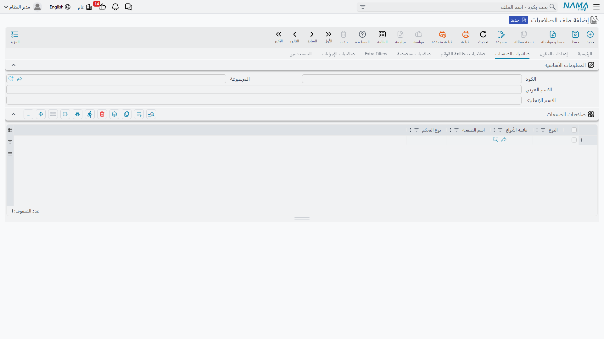
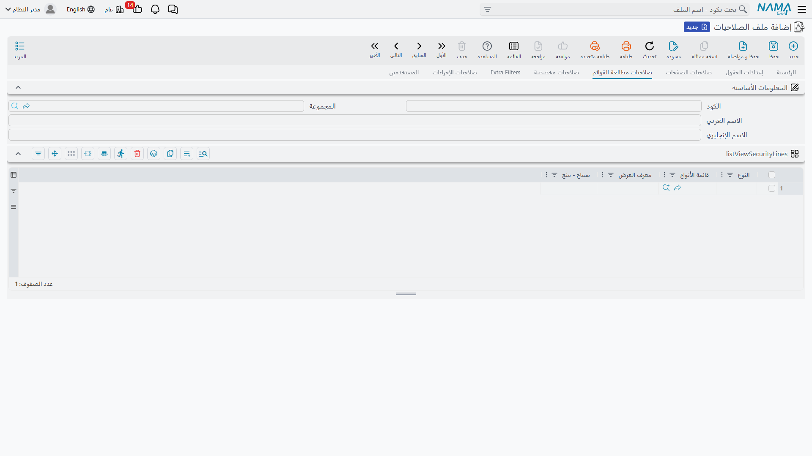

<rtl>

# صلاحيات الحقول والصفحات والقوائم

الصلاحيات الأساسية تجيب عن سؤال "ماذا يفعل المستخدم بالنوع؟". لكنك كثيراً ما تحتاج لمسات أدق: إخفاء عمود *التكلفة* عن المندوبين، إقفال صفحة *الحركات النظامية* أمام مدخلي البيانات، أو منع دور من فتح شاشة عرض حساسة. هذا بالضبط ما تفعله هذه الصفحات الثلاث — وكل واحدة منها موجودة **في مكانين**: على ملف الصلاحيات وعلى سجل المستخدم، وسطور المستخدم تتقدم على سطور الملف عند تطابق النطاق.

## إعدادات الحقول (Field Settings)

افتح صفحة **إعدادات الحقول** في شاشة ملف الصلاحيات (أو المستخدم).

كل سطر يستهدف نوعاً (أو قائمة أنواع، أو لا شيء — فيسري على كل الأنواع) وحقلاً واحداً:

| العمود | المعنى |
|---|---|
| **النوع / قائمة الأنواع** | الأنواع التي يسري عليها السطر. اتركهما فارغين ليسري على الجميع. |
| **الحقل (Field)** | معرف الحقل المراد التحكم فيه. استخدم `*` كرمز عام يشمل *كل* حقول النوع المستهدف. |
| **نوع التحكم (Control Type)** | **Normal** — بلا قيود؛ **Disabled** — الحقل ظاهر لكنه للقراءة فقط؛ **InVisible** — الحقل يختفي من الشاشة كلياً. |
| **تطبق عند: جديد / تعديل / مسودة** | ثلاث علامات تحدد *متى* يسري القيد. فعّل الثلاثة (أو اترك الافتراضي) ليسري دائماً؛ أو فعّل *تعديل* وحدها ليتمكن المستخدم من تعبئة الحقل عند الإنشاء دون تغييره لاحقاً. |
| **منع ادراج سطر / منع حذف سطر / منع نسخ سطر** | عندما يكون "الحقل" جدول تفاصيل (مثل بنود الفاتورة)، تمنع هذه الأعمدة إضافة سطور أو حذفها أو نسخها في ذلك الجدول — بمعزل عن قابلية تعديل السطور الموجودة. |

### كيف تُحسم سطور الحقول؟

عندما تُعرض شاشة ما حقلاً، يبحث النظام عن أول سطر مطابق بهذا الترتيب:

1. سطور المستخدم ثم سطور ملف الصلاحيات — سجل المستخدم يفوز.
2. داخل كل مجموعة: سطر النوع المحدد بعينه، ثم سطر قائمة أنواع تحتوي النوع، ثم سطر بلا نوع إطلاقاً.
3. السطر الذي يسمي الحقل بعينه يتقدم على سطر الرمز العام `*` في نفس المستوى.

إذا لم يطابق أي سطر، يتصرف الحقل طبيعياً. وأصحاب ملفات الصلاحيات الكاملة يتجاوزون صلاحيات الحقول كلياً.

::: tip إقفال بيانات لحظة الإنشاء
الطلب الشائع جداً — "حقل العميل في الفاتورة يجب ألا يتغير بعد إنشاء المستند" — هو سطر واحد: استهدف الفاتورة، الحقل `customer`، نوع التحكم *Disabled*، ويطبق عند **تعديل** فقط.
:::

::: warning صلاحيات الحقول حاجز واجهة، لا خزنة
إخفاء الحقل يخفيه عن شاشة التحرير. البيانات نفسها قد تظهر عبر التقارير أو أعمدة القوائم أو التصدير — فاجمع بين صلاحيات الحقول وقيود التقارير وشاشات العرض (انظر *صلاحيات مطالعة القوائم* أدناه) عندما تكون البيانات ذاتها حساسة.
:::

## صلاحيات الصفحات (Page Security)

شاشات تحرير الأنواع منظمة في صفحات (Tabs). صفحة **صلاحيات الصفحات** تتيح لك إزالة صفحات كاملة أو تجميدها لكل دور بدلاً من تعطيل الحقول واحداً واحداً.

| العمود | المعنى |
|---|---|
| **النوع / قائمة الأنواع** | الأنواع التي يسري عليها السطر (أحدهما مطلوب هنا — لا يوجد سطر عام شامل). |
| **اسم الصفحة (Page Name)** | معرف الصفحة — أو ببساطة *رقم* الصفحة كما يراها المستخدم (1، 2، 3...). |
| **نوع التحكم (Control Type)** | **Disabled** — تفتح الصفحة للقراءة فقط؛ **InVisible** — تُخفى الصفحة؛ **Normal** — بلا قيود صراحةً. |

سطور الصفحات على مستوى المستخدم تُفحص قبل سطور الملف، والصلاحيات الكاملة تتجاوز الميزة كلها.

## صلاحيات مطالعة القوائم (List View Security)

قد يكون للنوع الواحد عدة شاشات عرض — ويمكنك إضافة شاشات مخصصة. وأحياناً تكشف شاشة عرض أعمدة لا ينبغي لدور ما تصفحها (أعمدة التكاليف، هوامش الربح...). هذه الصفحة تسمح بشاشات عرض بعينها أو تمنعها.

| العمود | المعنى |
|---|---|
| **النوع / قائمة الأنواع** | الأنواع التي يسري عليها السطر. |
| **معرف العرض (List View ID)** | معرف شاشة العرض. |
| **سماح - منع (Allow / Prevent)** | هل شاشة العرض المستهدفة مسموحة أم ممنوعة. |

الحسم يتبع النمط المعتاد — سطور المستخدم أولاً ثم سطور الملف، وأول سطر يطابق الشاشة والنوع هو الذي يقرر. **وإذا لم يطابق شيء فالشاشة مسموحة**: صلاحيات مطالعة القوائم قيد اختياري، فلا تضيف سطوراً إلا للشاشات التي تعنيك.

::: info
ملف الصلاحيات الكاملة لا يمكن أن يحتوي على سطور صلاحيات مطالعة قوائم أصلاً — النظام يرفض هذا الجمع عند الحفظ، لأن الصلاحيات الكاملة ستتجاهلها على أي حال.
:::

## مفاتيح ذات صلة تستحق المعرفة

- **اقل عدد حروف للبدأ بالبحث** (على سطور الصلاحيات الأساسية) يمنع البحث المرجعي من سرد الملفات الضخمة — راجع [ملف الصلاحيات](/guide/security/security-profiles.md).
- **أقصى عدد سجلات في صفحة القوائم** موجود في رأس ملف الصلاحيات وإعدادات المستخدم والإعدادات العامة، والقيمة الأكثر تخصيصاً تفوز.
- لتقييد *الصفوف* الظاهرة داخل شاشة عرض مسموحة، فأنت تريد الفلاتر الإضافية (Extra Filters) — راجع [الصلاحيات على مستوى السجلات](/guide/security/record-level-security.md).
- ولقصر مستخدم على سنة مالية أو فترة محددة في المستندات والتقارير راجع [قصر المستخدم على سنة مالية](/guide/list-views/limit-user-to-year.md).

</rtl>
