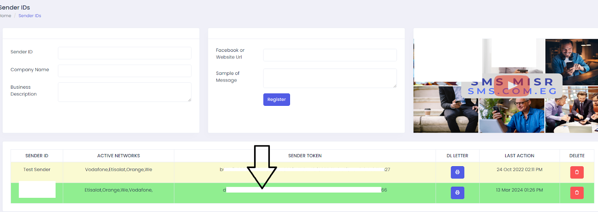
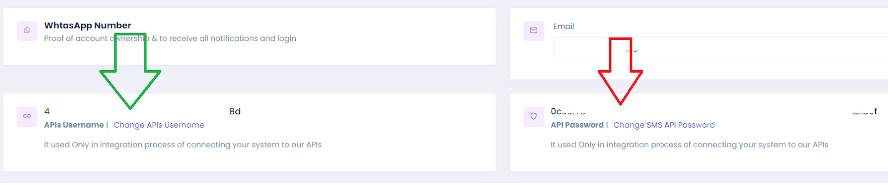
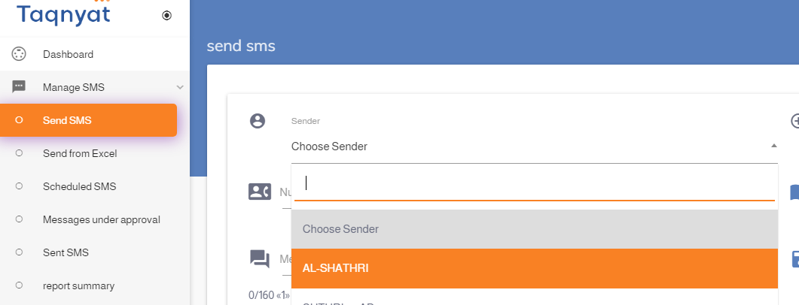
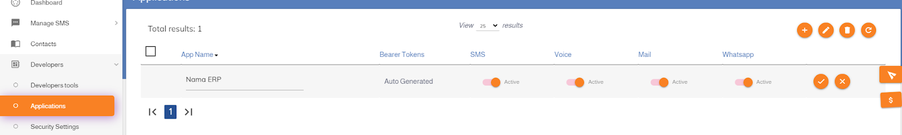
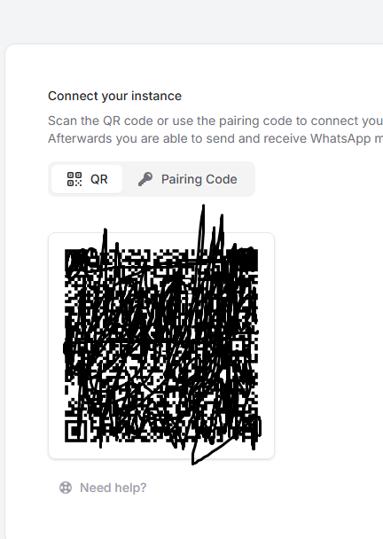
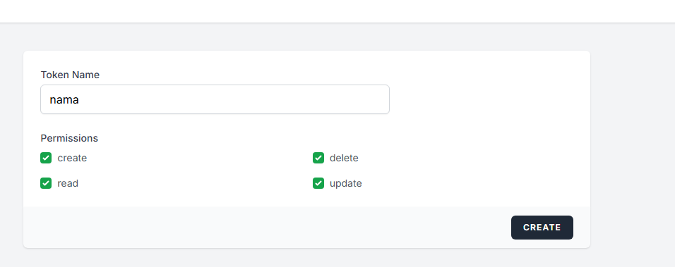
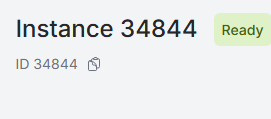
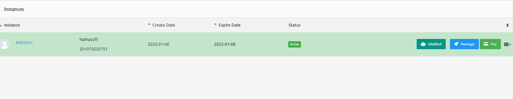
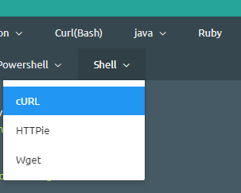

Here is a refined version suitable for inclusion in the Nama ERP documentation site (using VuePress):

---

# SMS and WhatsApp Configuration in Nama ERP

Nama ERP supports sending messages via SMS and WhatsApp to users, customers, suppliers, and other entities.
To enable this feature, configure the appropriate settings from the **Global Configuration** screen.

## SMS Provider: SMS Misr ([smsmisr.com](https://smsmisr.com/))

* **SMS Provider**: `SMS Misr`
* **Sender Token**: Obtain from [smsmisr.com/Client/senderid](https://smsmisr.com/Client/senderid)
  
* **API Username** and **API Password**: Get them from [smsmisr.com/Client/Settings](https://smsmisr.com/Client/Settings)
  

---

## SMS Provider: Taqnyat ([taqnyat.sa](https://portal.taqnyat.sa))

* **SMS Provider**: `Taqneyat`
* **Sender**:
  Visit [portal.taqnyat.sa](https://portal.taqnyat.sa), go to **Send SMS**, and copy the sender name from the dropdown list.
::: tip
💡 Use Chrome's Inspect Tool to accurately copy the value.
:::
  
* **Password (Bearer Token)**:
  Go to **Developers > Application**, click the ➕ icon, provide a name, then click the ✔️ mark. Copy the resulting **Bearer Token**.
  

---

## SMS Provider: Vodafone Egypt

* **SMS Provider**: `Vodafone Egypt`
* **User Name**: Account ID
* **Password**: API Password
* **Sender**: Sender Name
* **Other Settings**: Secret Key
* **Correction Query** (to ensure correct phone format):

  ```sql
  select case when {to} like '2%' then {to} else '2'+{to} end
  ```

::: tip
✅ After saving the configuration, Nama ERP will be able to send notifications and messages via the selected provider. Make sure credentials and sender IDs are valid and verified with the provider.
:::

إليك إعادة صياغة احترافية ومهيكلة لقسم "تكامل واتساب" لتوثيق موقع Nama ERP، مع تنسيق واضح ومتوافق مع VuePress، بالإضافة إلى ملحوظات منظمة:

---

# WhatsApp Integration

## WAAPI.app WhatsApp Integration

<rtl>

لتفعيل إرسال الرسائل عبر WhatsApp باستخدام منصة [waapi.app](https://waapi.app)، اتبع الخطوات التالية:

---

### خطوات الإعداد

1. **إنشاء الحساب وربط واتساب**

  * قم بإنشاء "Instance" جديدة من خلال موقع [waapi.app](https://waapi.app)
  * سجّل الدخول إلى WhatsApp عبر مسح رمز QR
    
::: tip
    ⚠️ **يجب** مسح رمز QR باستخدام الهاتف الذي عليه حساب WhatsApp الفعّال.
::: 

2. **الحصول على API Token**

  * انتقل إلى [صفحة API Tokens](https://waapi.app/user/api-tokens)
  * أدخل اسمًا مناسبًا، ثم اضغط "Create"
  * سيتم عرض الـ Token في نافذة منبثقة — انسخه وضعه في حقل **كلمة المرور** في إعدادات Nama
    

3. **الحصول على Instance ID**

  * انتقل إلى [صفحة Instances](https://waapi.app/account/instances)
  * انسخ **معرّف الـ Instance**
  * ضعه في حقل **اسم المستخدم** أو **الإعدادات الأخرى** في إعدادات الرسائل القصيرة في Nama
    

---

### إعدادات Nama ERP

في شاشة إعدادات الرسائل:

* **مزود الخدمة**: `waapi.app WhatsApp Integration`
* **اسم المستخدم** أو **Other Settings**: معرّف الـ Instance (Instance ID)
* **كلمة المرور**: رمز الـ Token

---
صحيح، كلمة "حالة" ليست الترجمة المناسبة لكلمة **instance** في هذا السياق التقني. الأفضل استخدام الكلمة كما هي "Instance" لأنها تشير إلى كيان محدد في خدمة UltraMsg، واستخدامها كما هي يجنّب أي لبس.

إليك النص بعد التعديل:

---

## التكامل مع WhatsApp باستخدام ultramsg.com

لإرسال رسائل WhatsApp من نظام نما ERP باستخدام [ultramsg.com](https://ultramsg.com)، اتبع الخطوات التالية:

### الخطوة 1: إنشاء وربط الـ Instance

* سجّل الدخول إلى [لوحة تحكم UltraMsg](https://user.ultramsg.com/).
* أنشئ **Instance** جديد وقم بربطه بحساب WhatsApp عن طريق مسح رمز QR.

### الخطوة 2: الدخول إلى إعدادات الـ Instance

* بعد الربط، انتقل إلى [لوحة المستخدم في UltraMsg](https://user.ultramsg.com/).
* اختر الـ **Instance** الخاص بك، ثم اضغط على **Manage** (إدارة).



### الخطوة 3: الحصول على الـ Instance ID والرمز (Token)

* ستجد **Instance ID** في رابط المتصفح، مثلًا:
  `https://user.ultramsg.com/app/instances/instance.php?id=103251`
  في هذا المثال، الـ Instance ID هو `103251`.

* من قسم اختبار الواجهة، اختر **Shell (cURL)** لعرض مثال الاستخدام.



* انسخ **Instance ID** و**Token** من النموذج الظاهر.


### الخطوة 4: الإعداد داخل نظام نما

* استخدم **Instance ID** كاسم المستخدم (Username) أو كمُعرف للخدمة.
* استخدم **Token** ككلمة مرور (Password) للمصادقة.


## WaboxApp WhatsApp Integration


لتفعيل إرسال رسائل WhatsApp من نظام Nama ERP باستخدام WaboxApp، اتبع الخطوات التالية:

---

### خطوات الإعداد

1. **تسجيل رقم الهاتف**
   قم بتسجيل رقم WhatsApp الخاص بالشركة على هاتف متصل دائمًا بالإنترنت.
   💡 يفضل استخدام محاكي أندرويد مثل [www.memuplay.com](https://www.memuplay.com) لتوفير اتصال دائم.

2. **إنشاء حساب في WaboxApp**

  * انتقل إلى [www.waboxapp.com](https://www.waboxapp.com)
  * أنشئ حسابًا جديدًا (يتطلب إدخال بيانات بطاقة ائتمان)

3. **إضافة رقم الهاتف إلى WaboxApp**

  * ادخل إلى [https://www.waboxapp.com/manager/accounts](https://www.waboxapp.com/manager/accounts)
  * اختر **Add New Phone Number**

4. **إعداد إضافة كروم الخاصة بـ WaboxApp**

  * حمّل الإضافة من متجر Chrome
  * انسخ **API Key** من موقع WaboxApp إلى الإضافة، ثم اضغط **Validate**

5. **ربط واتساب ويب**

  * افتح [web.whatsapp.com](https://web.whatsapp.com) باستخدام نفس متصفح كروم الذي يحتوي على الإضافة
  * امسح رمز QR من الهاتف

6. **الحصول على بيانات الاتصال**

  * من لوحة التحكم في WaboxApp، انسخ:

    * **API Token**
    * **رقم الهاتف بصيغة دولية** (مثال: `201065122360` بدلاً من `01065122360`)

7. **إعداد Nama ERP**

  * افتح شاشة إعدادات الرسائل القصيرة
  * أضف سطرًا جديدًا واختر المزود: `WaboxApp WhatsApp Integration`
  * أدخل:

    * **رقم الهاتف بصيغة دولية** في حقل *المرسل* أو *اسم المستخدم*
    * **API Token** في حقل *كلمة المرور*


::: tip Important Notes

* يجب إبقاء الهاتف **يعمل دائمًا** واتصال الإنترنت مستمر.
* يجب إبقاء **WhatsApp Web مفتوحًا** في متصفح كروم.
* في حالة إغلاق أي من الطرفين، **لن تُرسل الرسائل**.
* WaboxApp يخصم مبلغًا من بطاقة الائتمان إذا تجاوزت **100 رسالة/شهر** (مرسلة أو مستقبلة).
* يفضل استخدام هذا المزود في حقل `مزود الرسائل المفضل` ضمن إعدادات التنبيهات والمهام المجدولة.
* استخدم الحقل `يُستعمل فقط إذا كان مضافًا في المرسل المفضل` في إعدادات مزود الخدمة (كما في الطلب `KKDRQ00577`) لتجنب استبدال مزود الرسائل دائمًا بـ WhatsApp.
* يجب أن يكون رقم الهاتف بصيغة دولية، أي يبدأ بـ **كود الدولة**.

:::

 

</rtl>
