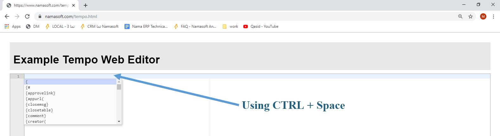

# Tempo Manual

In this document we will demonstrate the commands of Tempo language that is created by NAMA development team. The target of this language is to give the implementer a facility to write dynamic content that can be sent to customers, employees, or suppliers using Notifications, Emails, SMS, Error message of criteria based validation.
An example of using Tempo language, if we want to display an error  message that the  employee (Employee Name) cannot can not have a vacation more than five days. In this case we have to find a way to write the employee mentioned in the current record. In this case, the employee of the vacation could be written as {employee.name1} inside the error message, and if we need a hyperlink for this employee we should write {link(employee)}.

Remember that to know a field name in any screen, just use the shortcut (CTRL+ALT+I), and then right-click on field names to display the ids of screen fields (including table names and column names).

NAMA introduced a web editor to ease writing, while it will autocomplete the commands by using (Ctrl + Space) as well as checking the syntax of Tempo language. To use this editor, simply go to [Tempo Editor](https://www.namasoft.com/tempo.html), and then write what you want.


Tempo language will help the implementer to display what he wants in the messages.
Following, a manual of Tempo language commands that you may have to know to display something.
::: tip
There are two methods of using tempo.
- To render query results (in dashboards, notification by queries, criteria based validation messages if there is a message query, and other use cases)
- To render records (entities) in notifications, approval summary, in combination with fields-maps of entity flows similar to `EAFieldsValuesCalculator` and other use cases
- The main difference between using tempo to render query results and records is the ability to navigate record properties in case of records, this is not possible for query results
- For example, you can access the code of the customer group in the invoice if in record-mode like this:
```
{customer.group.code}
```
- If in query-result-mode, `{customer_id.group}` will not work as expected 
:::
- To write a comment in a tempo code, use the following syntax:
```
{comment}  The comment   {endcomment}
```
Ex:
```
{comment}  Written by Khaled   {endcomment}
```
- To Prevent Parsing the whole template as a tempo file, add the following to any part of the text (helpful when sending html emails)
```
<notempo/>
```
- To parse the content of a field as tempo template use {tempo} node
```
{tempo}{customer.remarks}{endtempo}
```
- You can escape curly-brackets by prepending `\` before them
```
\{code\}
```
This will be rendered as `{code}`, the tempo-engine will not try to render the value of code field

- To make HTML css content easier to handle, you can add the tag `<useCSSFriendlyBrackets/>` to the start of your temp
  This will change brackets handling, instead of { and } you will use %{ and }%
  - For example instead of writing `{code}`, you will write `%{code}%`


## Write a field that exists in the current record
Write this field between two brackets `{}` wherever to be displayed in the sentence

Ex1. to display the arabic name of an employee, write a sentence like this
```
This Employee arabic name is  {name1}
```

Ex2. to display the arabic name of an employee that exists in the vacation document, write a sentence like this 
```
This Employee arabic name is  {employee.name1}
```

Ex3. to display the arabic name of an employee that exists in the sales invoice but is in the subsidiary field , write a sentence like this 
```
This Employee arabic name is  {subsidiary.$toReal.name1}
```
## Write # character if the editor did not accept field and marks it as incorrect
Sometimes Tempo editor does mark a syntax to be corrected while it is already correct.
In this case write the # character to accept this syntax

Ex1. Writing {`time.$hours}` will be marked as having an error (a red mark will appear next to it)

This syntax will be accepted in NAMA; however, if you want to delete the red mark, you can use # character, and then it could be written as 
```
{#time.$hours}
```

## Write Enter command to create a new line
To create a new line in Tempo language, you must write `{enter}` before the new line, as HTML does not recognize the normal enter (line break).

## Write a link for a field in a sentence
You have two methods in order to give a link for a specific field like Employee:
First method to display the field as it is in the hyperlink, Write 
```
{link(Targeted Field)}
```
EX: To give a link for the customer,  Write:
```
{link(customer)}
```
Second method to display a specific title in the hyperlink , Write:
```
{titledlink(Targeted Field)} Title {endlink}
```
EX: To give a link for the customer by the title (Current Customer code is ABC),  Write the following syntax:
```
{titledlink(customer)} Current Customer code is {code} {endlink}
```
## Write a link relative to the current web-page

If the link will be written in a notification - not for email - , it's preferred to begin with the following command:
```
{shortlinks}
```
Or 
```
{directlinks}
```
This way, you are expecting that the targeted user that will use this link, will use it  from the same page of this link, like http://crm.namasoft.com:8080/erp
However,  `{shortlinks}` and `{directlinks}` will not work with Email as it is outside the site.

Ex1
```
{shortlinks}
The user {#firstAuthor.name2} created the document {#code}
```
Ex2
```
{directlinks}
The user {#firstAuthor.name2} created the document {link($this)}
```
If you are using a query for the notification, the following will work:
```
{titledlink(entityType,id)}{code}{endlink} 
```
## To open a record in a specific menu, use the following syntax:
```
{link(record,menu="MenuCode",newindow="true or false",view="ViewName")}
```
OR
```
{titledlink(record,menu="MenuCode",newindow="true or false",view="ViewName")}Link Content Expression{endlink}
```
Ex:
```
{link(employee,menu="NewEmp",newindow="true" ,view="NewEmpsView")}
```
OR
```
{titledlink(employee,menu="NewEmp",newindow="true" ,view="NewEmpsView")}Employee code {code} Name {name1} {endlink}
```
This example will open the employee in a new window in a customized menu named "NewEmp" by the modified screen (of type copy) named "NewEmpsView".
### To work on a specific server URL, use the following syntax:
{appurl("server-url")}
Ex1:
```
{appurl("http://crm7.namasoft.com:8080/erp/")}
```
This will make any links inside the template use http://crm7.namasoft.com:8080/erp/ as the base url for any links AFTER the statement. It should be used at the beginning of the template

## Loops in tempo
### Writing information within a loop
- To write a data like the data informed in a document details, you can use the two commands:
`{loop(details)}` , `{endloop}`
EX1: to write all data of the fields (Item code, Arabic item name, item quantity, item net value)  in the sales invoice table, use the following sentence:
```
{loop(details)}
{@rownumber} - {#details.item.item.code} - {#details.item.item.name2} - {#details.quantity.quantity.primeQty.value} - {#details.price.netValue}
{endloop}
```
### Getting the la last line in details
To get the last line in a table use the following syntax
```
{loop(details,last)}
```
### Manual Counters
You can declare a manual counter that can be used instead of `@rownumber` variable, or `@@last` and `@@end`.
There are three statements:
```
{incrementcounter(counterName)}
{decrementcounter(counterName)}
{countervalue(counterName)}
```
Also, it can be used as follows in the row statement of quick creators:
```
{r(@@counterName)}
```
- Here is a complete example that creates a stock transfer from MnOrder document, the counter name is c1:
```
{creator(entity="StockTransferReq",menu="StockTransDocumentsStockTransferReq",title="Create StockTransferReq",newwindow="true")}
{f("book")}{v("STR01")}
{f("term")}{v("STR02")}
{f("branch")}{v("MS")}
{f("warehouse")}{v("W001")}
{f("toWarehouse")}{v(spareParts.warehouse.code)}
{f("toLocator")}{v(spareParts.location.code)}
{loop(spareParts)}
{ifnot(spareParts.n1)}
{incrementcounter(c1)}
{f("details.item.item")}{v(spareParts.sparePart.code)}{r(@@c1)}
{f("details.quantity.quantity.primeQty.value")}{v(spareParts.quantity)}{r(@@c1)}
{f("details.quantity.quantity.primeQty.uom")}{v(spareParts.uom.code)}{r(@@c1)}
{f("details.specificDimensions.warehouse")}{v("W001")}{r(@@c1)}
{f("details.toWarehouse")}{v(spareParts.warehouse.code)}{r(@@c1)}
{f("details.toLocator")}{v(spareParts.location.code)}{r(@@c1)}
{endif}
{endloop}
{endcreator}

```
## Usage With Approval Notification Templates
### To notify the user about lines that are applicable to an approval rule, use the following syntaxes:
```
The lines that are below the default sales price: {loop($map.approvalRuleLines)} {link($map.approvalRuleLines.item.item)} - {$map.approvalRuleLines.price.unitPrice}
{endloop}
```
### To make a link for approval, use one of the following syntaxes:
```
{approvelink}
{rejectlink}
{returnlink}
{escalatelink}
```
::: tip
Note that these four types of links are primarily used in Email Template or SMS template in the approval definition record.
Note also, these links are usually used together (in the Email text for example)
:::
## Tables In Tempo
### Drawing a table
To draw a table, write the table content between the two commands `{opentable}`, `{closetable}`

Ex1: to Write the previous data of the sales invoice in a table
```
{opentable}
{row}{cell}#{cell}Item Code{cell}Item Name {cell}Quantity{cell}Net Value{endrow}
{loop(details)}
{row}{cell}{@rownumber}{cell}{#details.item.item.code}{cell}{#details.item.item.name2}{cell}{#details.quantity.quantity.primeQty.value}{cell}{#details.price.netValue}{endrow}
{endloop}
{closetable}
```
::: tip
Note that `{@rownumber}` is the syntax for the line number. It is corresponding to the cell # written in the row header
:::

### Drawing a row in a table
Use the two commands to draw a row `{row}` , `{endrow}`
Ex1 the following sentence is to draw a table header
```
{row}{cell}#{cell} Item Code {cell} Item Name {cell} Quantity {cell} Net Value {endrow}
```
### Drawing a cell in a table row
Use the two commands to draw a cell `{cell}` , `{endcell}`
Ex1
```
{cell}  Item Name {endcell}
```
::: tip
Note that {endcell} is optional, you can neglect it.
:::

## Functions available to tempo
- Writing the current user
You can access all current user data using `{$user.PROPERTY_NAME}`
Example: to get the code of current user `{$user.code}`

## Date and Time Functions
- To format a date expression use the following syn:
```
{formatDate(dateExpression,formatExpression)}
```
Ex: 
```
{formatDate(valueDate,"yyyy-MM-dd")}.
```
- Writing the creation date (including time) of a record
Use the syntax `{$creationDate}`

- Writing the creation date only without time of a record
Use the syntax `{$creationDate.$toDate}`
- Get Today's Date
Use the syntax `{$today}`
- Get Next and previous Month Date on Same Day as any date field
```
{date.$nextMonth}
{date.$previousMonth}
```
- Get Current Date and Time
Use the syntax `{$now}`

- Writing the time of the creation date of a record
  Use the syntax `{$creationDate.$toTime.$toStringNormal}` => 12:50:10
::: tip
Note that the syntax $toStringNormal is to convert the time formula to a string
:::
- Writing the day of the value date of a record
  Use the syntax `{valueDate.day}`

- Writing the month of the value date of a record
Use the syntax `{valueDate.month}`

- Writing the year of the value date of a record
Use the syntax `{valueDate.year}`
- Writing the day Arabic name (like السبت) of the value date of a record
  Use the syntax 

```
{valueDate.$arDayName}
{#valueDate.$arDayName} 
{#valueDate.$enDayName}
{#valueDate.$dayName}
```
- Writing the day English name (like saturday) of the value date of a record
Use the syntax 
```
{valueDate.$enDayName}
```
- Writing the day name (according to current language) of the value date of a record
Use the syntax 
```
{valueDate.$dayName}
```
- Writing the Hijri value date of a record
Use the syntax 
```
{valueDate.$asHijriString}
```
- Writing the value in the string format (DD_MM_YYYY) date of a record
Use the syntax 
```
{valueDate.$toStringDD_MM_YYYY}
```
- Writing the value in the string format (YYYYMMDD) date of a record
Use the syntax 
```
{valueDate.$toStringYYYYMMDD}
```
- Writing the next day of the value date of a record
Use the syntax 
```
{valueDate.$nextDay}
```
- Writing the previous day of the value date of a record
Use the syntax 
```
{valueDate.$previousDay}
```
- Writing the next month of the value date of a record
Use the syntax 
```
{valueDate.$nextMonth}
```
- Writing the previous month of the value date of a record
Use the syntax 
```
{valueDate.$previousMonth}
```
- Writing the next year of the value date of a record
Use the syntax 
```
{valueDate.$nextYear}
```
- Writing the previous year of the value date of a record
Use the syntax 
```
{valueDate.$previousYear}
```
- Writing the start date of the month that including the value date
Use the syntax 
```
{valueDate.$monthStart}
```
- Writing the end date of the month that including the value date
Use the syntax 
```
{valueDate.$monthEnd}
```
- Writing the hour of time date of the month that including the value date
Use the syntax 
```
{valueDate.$monthEnd}
```

- Getting specific element from array
Use the syntax 
```
{details.$get(index)}
```
::: tip Index is zero based
For example if you need to fetch the first line of grid called details you will write `{details.$get(0)}`
:::
- Remove all spaces from a field
Use the syntax 
```
{description1.$removeAllSpaces}
```
- Normalize arabic text inside of a field (replace all similar characters with one of them)
Use the syntax 
```
{description1.$normalizeAr}
```
   - Example of what the utility does:
    If you have the following text
    `منى ذهبت إلى المدرسة مع فؤاد`
    It will become
    `مني ذهبت الي المدرسه مع فواد`
### Time related functions for record-mode

::: tip For the following examples, we will suppose there is a time field called time
:::
- Writing the hour of that time date
Use the syntax 
```
{time.$hours}
```

- Writing the minute of that time date
Use the syntax 
```
{time.$minutesOfHour}
```
- Writing the second of that time date
Use the syntax 
```
{time.$secondsOfMinute}
```
- Writing the millis of second of that time date
Use the syntax 
```
{time.$millisOfSecond}
```
### Time related functions for query-mode
- To display the time in a correct form, use the following syntax
```
{time(timeField)}
```
Ex:
```
{time(fromTime)}
```
Where fromTime is a time field.

The corresponding function that is not usually used in record-mode is $toStringNormal.
Ex: 
```
{fromTime.$toStringNormal}
```
If the number is total number of hours, use:
```
{decimalToTime(decimalField)}
```

### Translations in tempo

- Writing the arabic value of an enumeration field  (like orderStatus- for example)
Use a syntax like 
```
{#orderStatus.$arabic}
```
- Writing the arabic value of an enumeration field  (like orderStatus - for example)
Use a syntax like 
```
{#orderStatus.$english}
```
- To translate a value of an enumeration field, use the following syntax: 
```
{translate(enumuratedField)}
{translateAr(enumuratedField)}
{translateEn(enumuratedField)}
```
Ex: 
```
{translate(orderStatus)}
```

This function will translate the value in the order status field into corresponding value in the second language. I.e. Translate the English value into Arabic, and vice versa.

::: tip
Remember that, you can use also {orderStatus.$english}
:::

### Number-related functions in tempo
- Converting a text (like description) to integer ---If possible
Use a syntax like 
```
{#description1.$tryToInt}
```
- Converting a text (like description) to decimal ---If possible
Use a syntax like 
```
{#description1.$tryToDecimal}
```
- Formatting dates and numbers
```
{creationDate.$format."yyyy-MM-dd HH:mm:ss"}
{money.total.$format."###,###.00"} 
```

## If Statements (conditionals) in tempo

- To check if a field is empty or not
```
{if(code)}content here will be rendered if code is not empty {endif}
```
This syntax means if there is a value in the code field, write the content between if and endif.
- To check if a number is not zero
```
{if(money.remaining)} Remaining is {#money.remaining}{endif}
```
- To check if a boolean is true
```
{if(commitedBefore)} Record is committed before{endif}
```
- Negated if statement
  - If you want to render content if a condition is not met use `{ifnot(code)}{endif}` or `{if!(code)}{endif}`
  This syntax means if there is no value in the code field.
  Ex
```
{ifnot(money.remaining)} No Remaining {endif}
```
Writing If statement to check if the text is a number not equal to zero
Use the syntax like 
```
{ifnumber(description1)}
```
Here are all syntax of (If statement):

If syntax
Desc
{If(string)}
- If the string is not empty, render the inner values, else do nothing.
  {if!(string)}
  {ifnot(string)}
- If the string is empty, render the inner values, else do nothing.
  {if=(string1,string2)}
  {ifequal(string1,string2)}
  If string1 = string2, render the inner values, else do nothing.
  {if!=(string1,string2)}
  {ifnotequal(string1,string2)}
  If string1 = string2, do nothing, else  render the inner values.
  {if<(string1,string2)}
  {ifless(string1,string2)}
  If string1 is less than string2, render the inner values, else do nothing.
  {if<=(string1,string2)}
  {iflessoreq(string1,string2)}
  If string1 is less than or equal  string2, render the inner values, else do nothing.
  {if>(string1,string2)}
  {ifgreater(string1,string2)}
  If string1 is greater than string2, render the inner values, else do nothing.
  {if>=(string1,string2)}     {ifgreateroreq(string1,string2)}
  If string1 is greater than or equal  string2, render the inner values, else do nothing.
  {ifnumber(N)}
  If N is not zero render inner values, else do nothing
  {ifnumber!(N)}
  {ifnumbernot(N)}
  If N is zero render inner values, else do nothing
  {ifnumber=(Number1,Number2)} {ifnumberequal(Number1,Number2)}
  If Number1 = Number2, render the inner values, else do nothing.
  {ifnumber!=(Number1,Number2)}   {ifnumbernotequal(Number1,Number2)}
  If Number1 = Number2, do nothing, else  render the inner values.
  {ifnumber<(Number1,Number2)}    {ifnumberless(Number1,Number2}}
  If Number1 is  less than Number2, render the inner values, else do nothing.
  {ifnumber<=(Number1,Number2)}   {ifnumberlessoreq(Number1,Number2)}
  If first Number1 is less than or equal  Number2, render the inner values, else do nothing.
  {ifnumber>(Number1,Number2)}
  {ifnumbergreater(Number1,Number2)}
  If Number1 is  greater than Number2, render the inner values, else do nothing.
  {ifnumber>=(Number1,Number2)}
  {ifnumbergreateroreq(Number1,Number2)}
  If first Number1 greater than or equal Number2, render the inner values, else do nothing.
  {if=(code,"a")}case 1 {else if=(code,"b")}case 2{else if<(n1,5)} case 3{else}nothig applicable{endif}
  You can use if else syntax with any if condition
  You can write it as else if= or elseif=
  You can prepend else infront of any if condition (with space or without)
  If you use {else} it will be applied if all conditions fails
  Make sure that the simple else expression is the last one
  If you want you can use {endelse} to close else expressions, but it's optional and we do not recommend it

## Tafqeet in Tempo
This function converts the amount value from numbers into alphabetical characters based on tafqeet configuration in global configuration.
This function takes the syntax 
```
{tafqeet("Number","currency")}
```

Ex1: 
```
{tafqeet("500","EGP")}
```
This function will display `five hundred Egyptian Pounds` - in English interface
And will display `خمسمائة جنيه مصري` - in Arabic interface

Ex2: 
```
{tafqeet(money.netValue,money.currency.Code)}
```
This sentence will work as the previous, but with the amount of the field (money.netValue), and with currency code mentioned for this currency in the "global Configurations" file.
::: tip
Note that if -  for example -  the code is "جم", and the "altcode" is "EGP" in the "global Configurations" file, and you want to display the amount by EGP, use the following sentence
{tafqeet(money.netValue,money.currency.altCode)}
:::

tafqeetAr
Behaves exactly like tafqeet, but will always convert to Arabic alphabetical characters.

tafqeetEn
Behaves exactly like tafqeet, but will always convert to English alphabetical characters.

## Executing entity flows by links through tempo
- To execute an entity flow via a link, (sent by Email for example), use the following syntax:
```
{flow(record, flowCode="EntityFlowName")}
```
Ex: 
```
{flow(employee, flowCode="CreateJobOffer")}
```
This example will execute the entity flow "CreateJobOffer" for the employee field.

## Email-related functions
- To specify the subject of an email, use one of the following two methods:
- First method: Start the first line with the keyword subject:  and write whatever you want after it. The system will consider this method only if it is the first line.
```
subject:Required subject to be sent
```
Ex:
```
subject:The employee {name2} was updated by {$user.name2}
```
- Second  method: Put the subject between `{subject}` and `{endsubject}`
Ex:
```
{subject} The employee {name2} was updated by {$user.name2} {endsubject}
```
- To add an attachment to the email:
```
{emailattachment(attachmentField)}
{emailattachment("attachmentPathOnTheServer")}
```
Ex: To Send Attachments of an employee:
```
subject:Attachments of employee {code} - {name1}
Dear Sir, Please note that the employee {name1} was changed. The email contains all files attached to the employee
{emailattachment(attachment)}{emailattachment(attachment1)}{emailattachment(attachment2)}{emailattachment(attachment3)}{emailattachment(attachment4)}{emailattachment(attachment5)}{emailattachment(mainFile)}
```
Another Example:
```
Attached our catalog {emailattachment("E:\Media\Prochures\catalog.pdf")}
```
::: tip
<rtl>
يفضل ان يتم وضع جملة المرفقات في نهاية الايميل
يفضل ان لا يتم وضع مسافات او سطور بين جمل المرفقات - حيث ان هذه السطور ستبقى في الايميل
اذا كان المرفق فارغا فسيتم تجاهله
</rtl>
:::

- To send the email as is without trying to attach images , add the following to any part of the text (helpful when sending html emails)
```
<donothandleimages/>
```
## String-manipulation related functions in tempo

- Trim spaces in the beginning and end of a field
  Use the syntax
```
{description1.$trim}
```
- Convert arabic numbers to english
  Use the syntax
```
{mobile.$replaceArNumerals}
```
- Parsing Json String
  Use the syntax
```
{text1.$parseJSONToMap}
```
- Convert text separated by comma to list
  Use the syntax
```
{remarks.$parseCSVToList}
```
- To extract a number of characters from a string (starting from the left), use the following syntax:
```
{left(String,Length)}
```
Ex: 
```
{left(code,3)}
```
This example will extract the first three characters from the field Code (Starting from left)

- To extract a number of characters from a string (starting from right), use the following syntax:
```
{right(String,Length)}
```
Ex: 
```
{right(code,3)}
```
This example will extract the last three characters from the field Code (Starting from right)

- To extract some characters from a string (starting from a specific index to a specific index), use the following syntax:
```
{substring(targetedString,startIndex, endIndex)}
```
Ex: 
```
{substring("NamaSoft",3,5)}
```
This example will return "maS"

Ex: 
```
{substring(code,3,5)}
```
This example will return "maS" if the code value is "NamaSoft"
- Padding: To lengthen or shorten a text by a specific length, use the following expressions:
```
{leftpad(length)}Whatever you want here{endpad}
{rightpad(length)}Whatever you want here{endpad}
```

Ex: 
```
{leftpad(10)}123{endpad}
```
This example will put 7 spaces at the left of the text as the text length is 3 characters
Result `       123`
Ex: 
```
{rightpad(10)}123{endpad}
```
This example will put 7 spaces at the right of the text as the text length is 3 characters
Result `123       `

Ex: 
```
{leftpad(5)}123456789{endpad}
```
This example will shorten the length of the number to be 5 digits from the left.

Result `12345`

Ex: 
```
{rightpad(5)}123456789{endpad}
```
This example will shorten the length of the number to be 5 digits from the right.
Result `56789`

## Numeric fields related functions

- Rounding Numbers
    - Use the syntax `{n1.$round0}`
      Will convert 19.9 to 20 , 19.3 to 19
    - Use the syntax `{n1.$round1}`
      Will convert 15.86 to 15.9 , 10.33 to 10.3
    - `{n1.$round2}, {n1.$round3},{n1.$round4}, {n1.$round5}`
      The number after round indicates the decimals to keep
- To round a number expression by a specific number of decimal places, use the following syn:
```  
{round(numberExpression,fractionalDecimalPlacesExpression)}
```
Ex: 
```
{round(n1,"2")}
```
This example will round fraction of field n1 2 decimal places
Ex: 
```
{round(money.value,money.currency.fractionalDecimalPlaces)}
```
This example will round the fraction of the field (money.value) to the fraction fractional Decimal Places of its currency.

To format a number expression use the following syn:
```
{formatNumber(numberExpression,formatExpression)}
```
Ex: 
```
{formatNumber(n1,"###,###.00")}
```
## URL Shortening in tempo

- URL Shortening is very helpful with SMS messages, instead of 200 character long links, you get a 30 or 40 characters links depending on the domain name.
- First, you will need to install a YOURLS server on a server which supports php. 
- Then you will need a signature. 
  - Alternatively you can rent from namasoft URL shortening service using our servers.
- Then you can use the following to obtain short links:
```
{shortenurl(server="https://namasoft.com/s/",signature="SIGNATURE_HERE")}{link($this,plainLink=true)}{endshortenurl}
```

## Dynamic Report Links in notifications and dashboards

Suppose we have a report with code 1000 that takes two parameters: entityType (String), and document (Reference).
- To add link to that report in a notification definition:
```
{reportlink(reportCode="1000",runType="launch",newwindow="true")}{paramname("entityType")}{paramvalue(ref1.entityType)}{paramname("document")}{paramvalue(ref1)}{endreportlink}
```
To add link to that report in a dashboard :
```
{reportlink(reportCode="1000",runType="launch",plainLink=true)}{paramname("entityType")}{paramvalue(entityType)}{paramname("document")}{paramvalue(id,entityType)}{endreportlink}
```
- Here are all the available nodes:
```
{paramname(expression)}
{paramvalue(expression)}
{paramrefvalue(entityType=expression,id=expression,code=expression,name1=expression,name2=expression)}
```
Code, name1,nam2 are all optional
```
{parammultivalue}expressions here like {code} and {name1}{endmutlivalue}
```

## CRM Questionnaire Sending in Emails and URLS
- Send an email to a third party from a questionnaire notification with the survey as the content of the email:
```
Dear Sir, {enter}
We would love you to answer the following survey.{enter}
{$renderQuestionsForMailEmbedded} {enter}
Thanks and Best Regards
```
- Send an email to a third party from a questionnaire notification with the survey as a link:
```
Dear Sir, {enter}
We would love you to answer a quick survey on the following <a href='{$questionsURL}' >URL</a>.{enter}
Thanks and Best Regards
```
## Sending HTTP Requests from Tempo

- The following should be used with the EASendHttpRequestByTempo entity flow
  The following is an example for sending http requests to a url for each line in details
  Example 1:
  
```{loop(details)}
{httprequest}
{requesturl}https://namasoft.com/api/v3.0/item{endurl}
{requestmethod}POST{endmethod}
{contenttype}application/json{endcontenttype}
{charset}utf8{endcharset}
{headername}api-key{endheadername}
{headervalue}xxHjjk889523{endheadervalue}
{paramname}company_name{endparamname}
{paramvalue}{legalEntity.name2}{endparamvalue}
{bodypartname}user_whatsapp_number{endbodypartname}
{bodypartvalue}{details.ref1.$toReal.contactInfo.mobile}{endbodypartvalue}
{bodypartname}ordernumber{endbodypartname}
{bodypartvalue}{details.ref2.$toReal.code}{endbodypartvalue}
{bodypart("complexObject")}
{bodypartname}property1{endbodypartname}
{bodypartvalue}abc{endbodypartname}
{bodypartname}property2{endbodypartname}
{bodypartvalue}abcd{endbodypartname}
{endbodypart}
{requestdescription1}optional description that can be viewed in the list view{enddescription1}
{requestdescription2}Add row number {@rownumber} to use as extra info{enddescription2}
{requestrelatedtoid1}{id}{endrelatedto1}
{requestrelatedtoid2}{customer.id}{endrelatedto2}
{endrequest}
{endloop}
```
Example 2:
```
{loop(details)}
{httprequest}
    {requesturl}https://namasoft.com/api/v3.0/item{endurl}
    {requestmethod}POST{endmethod}
    {contenttype}application/json{endcontenttype}
    {charset}utf8{endcharset}
    {headername}api-key{endheadername}
    {headervalue}xxHjjk889523{endheadervalue}
    {paramname}company_name{endparamname}
    {paramvalue}{legalEntity.name2}{endparamvalue}
    {requestbody}
        \{
        "user_whatsapp_number":"{details.ref1.$toReal.contactInfo.mobile}"
        ,"ordernumber":"{details.ref2.$toReal.code}"
        \}
    {endbody}
{endrequest}
{endloop}
```

## Nama POS Pole-display configuration using tempo
- Nama ERP is a web-based application. But we have a standalone desktop application for Points Of Sales.

- Nama POS provides the ability to to work offline because it has it's own database.

- Nama POS keeps pos-db synchronized with Nama ERP db automatically

- Nama POS provides integrations with payment terminals, and it has an embedded credit-card processor for mobile phones 
 in the captain order mobile application
- Captain Order mobile app provides access to Nama POS functionality on android and iOS devices
- We will discuss configuring simple text-based POS Pole Displays using tempo
### POS Pole Display Setup
  In order to handle a pole display in Point of sale system, you have to define its properties from the screen "Pos Pole Display Specs", and define the following properties:
  Define the communication method
  From the two fields "Communication Type", and "Printer Name Or Port Number", you can define how Nama POS will communicate with the pole display.
  To link the pole display properties to a specific Machine, enter its code in the field "Pos Pole Display Specs" of the required machine record.

* Displaying information via templates

To display your required information in the pole display machine, you will use the template methodology, as Nama supports a template for each event while creating POS invoices. These templates are defined in the "Pos Pole Display Specs" screen.

In order to support required information in the templates, NAMA has developed the following functions
```
@CLEARLINE@
```
This function will clear one line from the data displayed in the pole display.
Ex
```
@CLEARLINE@@CLEARLINE@ Welcome
```
This sentence will clear two lines from the pole display and display the word Welcome.
```
{lastModifiedLine}
```
This function could be used rather than lastline in order to get information from the last line
Ex
```
{lastModifiedLine.qty.value}
```
This sentence will get the quantity of the item in the invoice last line
#### Idle Template
Via this template, you can define the information that will be displayed before creating a new invoice.
Ex
```
@CLEARLINE@@CLEARLINE@**** Welcome to Register {name2}
```
This example will clear two lines and display the sentence(****Welcome to Register) followed by the current register name.

#### Line Adding Template
Via this template, you can define the information that will be displayed while adding a new line.
Ex
```
@CLEARLINE@@CLEARLINE@{padleft(20)}Item: {lastModifiedLine.item.name2}{endpad}{padleft(20)}Qty: {lastModifiedLine.qty.uom.name2} - {round(lastModifiedLine.qty.value,0)}{endpad}
```
This example will clear two lines and display the item name of the last line followed by the word "Qty:",  its unit, and then its quantity.

#### Total Template
Via this template, you can define the information that will be displayed upon opening the Tender screen
Ex
```
@CLEARLINE@@CLEARLINE@{padleft(20)}Total: {round(netPrice,2)}${endpad}
```
This example will clear two lines and display the word "Total" followed by the total invoice value.


#### Remaining Template
Via this template, you can define the information that will be displayed after entering the total value paid by the customer including the change value.
Ex
```
@CLEARLINE@@CLEARLINE@{padleft(20)}Remainig: {round(change,2)}${endpad}
```
This example will clear two lines and display the word "Remaining" followed by the change value.
