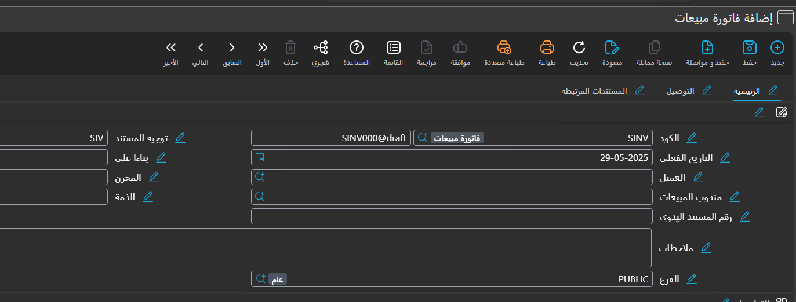
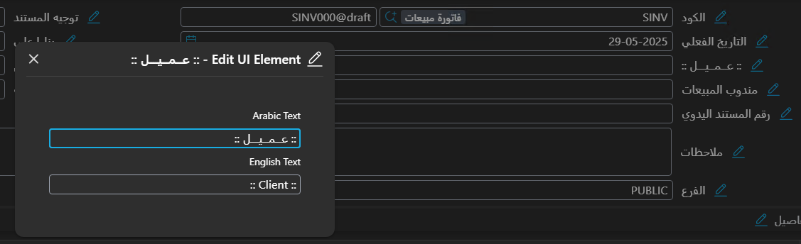
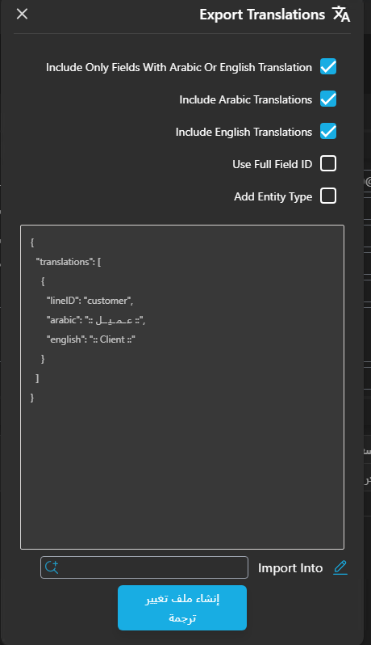

<rtl>

# تعديل الترجمات في نظام نما

* يمكن تعديل الترجمات باستخدام **ملف تغيير الترجمة**.
* تتيح سطور ملف الترجمة تعديل ترجمات:

    * الحقول
    * الشاشات
    * عناوين الصفحات
    * المجموعات
    * الإجراءات النظامية
      وذلك باللغة العربية أو الإنجليزية أو كليهما. (يمكن ترك إحدى اللغتين فارغة).

### اللغات المدعومة:

* العربية
* الإنجليزية
* الفرنسية (تُعتبر بديلة للإنجليزية)

---

### ترجمة أسماء الشاشات (مفرد / جمع):

* تُستخدم ترجمة المفرد في شاشة التحرير (مثلاً: *فاتورة مبيعات*).
* تُستخدم ترجمة الجمع في شاشة القائمة (مثلاً: *فواتير مبيعات*).

لتعديل هذه الترجمات:

* **للمفرد**: اختر النوع، واترك حقل "المعرف" فارغًا، ثم املأ الحقول "عربي" و"إنجليزي".
* **للجمع**: اختر نفس النوع، واكتب `s` في حقل "المعرف"، ثم املأ الحقول "عربي" و"إنجليزي".

---

### ترجمة الحقول:

* **ترجمة عامة للحقل**:

    * ضع معرف الحقل في حقل "المعرف".
    * املأ الحقول "عربي" و"إنجليزي".

* **ترجمة حقل داخل شاشة محددة**:

    * حدد اسم الشاشة في حقل "النوع".

* **ترجمة حقل في عدة شاشات**:

    * أنشئ ملف "قائمة أنواع" يحتوي على هذه الشاشات.
    * استخدم هذا الملف في حقل "قائمة الأنواع".

---

### تسهيل الترجمة باستخدام اختصار لوحة المفاتيح

* استخدم الاختصار **Alt + Ctrl + T** لعرض أزرار بجانب الحقول والعناوين لتعديل الترجمة.

* بالضغط على الزر يظهر مربع يحتوي على حقلين: عربي وإنجليزي.

* يتم تعديل الترجمة بشكل مباشر مؤقتًا داخل النظام.
* بعد الانتهاء، من قائمة "المزيد" اختر **تصدير الترجمات**.

---

### نافذة تصدير الترجمات

تحتوي على الخيارات التالية:

* **Include Only Fields With Arabic Or English Translation**
  تضمين فقط الحقول التي تم تعديل ترجمتها.

* **Include Arabic Translations**
  إضافة الترجمة العربية.

* **Include English Translations**
  إضافة الترجمة الإنجليزية.

* **Use Full Field ID**
  استخدام المعرف الكامل للحقول.

* **Add Entity Type**
  إضافة النوع في ملف الترجمة (لربط الترجمة بالشاشة الحالية فقط).

بعد تحديد الخيارات، اضغط **"إنشاء ملف الترجمة"**، وستظهر نافذة تحتوي على الترجمات المختارة.
املأ بقية البيانات واضغط "حفظ"، وسيتم تحميل الترجمات مباشرة.

</rtl>
