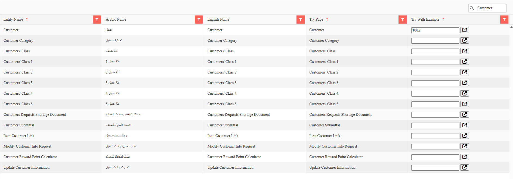

# واجهة برمجية REST لنظام نما ERP

يوفر نظام نما ERP واجهة برمجية REST شاملة لإجراء عمليات CRUD على جميع كيانات النظام، مع دعم كامل لمواصفة OpenAPI 3.0 لتحقيق تكامل سلس مع الأنظمة الخارجية.

للبدء بسرعة، شاهد هذا الفيديو: [مقدمة في Nama ERP Rest API](https://youtu.be/lUxZMIoxxUY)

::: tip هل تبحث عن الصورة الكاملة للتكامل؟ (بالعربية)
قبل الغوص في تفاصيل الواجهة البرمجية، قد ترغب في قراءة المقال [سيناريوهات الربط بين نظام نما والأنظمة الأخرى](./system-integration-scenarios.md). يُحدد المقال الاتجاهات الأربعة الممكنة للتكامل (قراءة/كتابة × نما/النظام الآخر)، ويوضح أي السيناريوهات متاحة مجاناً من الصندوق وأيها يستلزم تطويراً مخصصاً، مع قائمة بالأسئلة التي ينبغي طرحها على العميل قبل تسعير أي تكامل.
:::

## نظرة عامة على متصفح الواجهة البرمجية (API Browser)

يوفر متصفح الواجهة البرمجية في نما ERP واجهة تفاعلية لاستعراض جميع واجهات REST المتاحة في نظامك واختبارها.

### الوصول إلى متصفح الواجهة البرمجية

يمكن الوصول إلى متصفح الواجهة البرمجية عبر عدة نقاط:

#### الصفحة الرئيسية لمتصفح الواجهة البرمجية
```
http[s]://<server-ip-or-domain>/erp/browseapi/
```
تعرض الصفحة الرئيسية مع روابط لأقسام الواجهات البرمجية المختلفة.

#### متصفح واجهات الكيانات
```
http[s]://<server-ip-or-domain>/erp/browseapi/browseentitiesapi.html
```
يسرد جميع واجهات الكيانات المتاحة بأسمائها العربية والإنجليزية.

#### متصفح الواجهات ذات الأغراض الخاصة
```
http[s]://<server-ip-or-domain>/erp/browseapi/browsespecialpurposesapi.html
```
يسرد الواجهات المتخصصة لتكاملات محددة (مثل مزامنة أجهزة الحضور والانصراف).



### مميزات متصفح الواجهة البرمجية

يولّد متصفح الواجهة البرمجية التوثيق تلقائياً بناءً على إعدادات نظامك:

* **قائمة الكيانات**: تعرض جميع الكيانات المتاحة للمستخدم الحالي بناءً على:
  - صلاحيات الوحدات
  - حقوق الوصول للمستخدم
  - الميزات المُفعَّلة
  - الإعدادات الخاصة بالعميل
  
* **دعم متعدد اللغات**: يعرض أسماء الكيانات بالعربية والإنجليزية
* **لكل كيان، يُوفَّر مصدران أساسيان:**

  1. **مواصفة OpenAPI بصيغة JSON**: تعريف الواجهة البرمجية بصيغة قابلة للقراءة آلياً
  2. **Swagger UI**: توثيق تفاعلي وواجهة اختبار

### مواصفات OpenAPI بصيغة JSON

#### نقطة OpenAPI الأساسية
```
http[s]://<server-ip-or-domain>/erp/browseapi/openapi/{EntityName}.json
```

#### OpenAPI مع بيانات مثال
```
http[s]://<server-ip-or-domain>/erp/browseapi/openapi/{EntityName}.json?exampleCode={code}
```

**المعاملات:**
- `{EntityName}`: نوع الكيان (مثل SalesInvoice وCustomer وItem)
- `{code}`: اختياري - كود سجل محدد أو UUID لاستخدامه كمثال

**أكواد الأمثلة الخاصة:**
- `Find@First`: يستخدم أول سجل متاح كمثال
- أي كود أعمال أو UUID صالح في نظامك

::: tip أمثلة على الروابط
```
# الحصول على مواصفة OpenAPI لـ SalesInvoice مع أول سجل متاح
http://localhost:8080/erp/browseapi/openapi/SalesInvoice.json?exampleCode=Find@First

# الحصول على مواصفة OpenAPI لـ Customer مع عميل محدد
http://localhost:8080/erp/browseapi/openapi/Customer.json?exampleCode=CUST001

# الحصول على مواصفة OpenAPI لـ Item بدون أمثلة
http://localhost:8080/erp/browseapi/openapi/Item.json
```
:::

### بنية استجابة الواجهة البرمجية

تتضمن مواصفة OpenAPI تعريفات مخطط تفصيلية لكل كيان:

#### تعيين أنواع الحقول
- **حقول النص**: Text وBigText وDate وDateTime وTime وEmail وColor وLatLng وEnum
- **حقول الأرقام**: Decimal وInteger
- **حقول القيم المنطقية**: حقول من نوع Boolean
- **حقول المرجع**: تُرجع كود الكيان المُشار إليه
- **المراجع العامة**: كائن يحتوي على `entityType` و`code`
- **Collections/التفاصيل**: مصفوفات من الكائنات (مثل بنود الفاتورة وتفاصيل الدفع)

#### الحقول المستثناة
تستثني الواجهة البرمجية تلقائياً:
- الحقول التي يولدها النظام (ما لم يُطلب ذلك تحديداً)
- الحقول المحسوبة
- الحقول الثنائية (الصور والمستندات)
- حقول تتبع المستخدمين الداخلية

### التعامل مع collections الكيانات

تتضمن كثير من الكيانات collections تفصيلية (علاقات one-to-many):

```json
{
  "invoiceLines": {
    "type": "array",
    "items": {
      "properties": {
        "itemCode": { "type": "string" },
        "quantity": { "type": "number" },
        "unitPrice": { "type": "number" }
      }
    }
  }
}
```

تمثل collections السجلات التفصيلية مثل:
- بنود الفاتورة
- بنود الدفع
- بنود الطلب
- بنود قيد اليومية

---

## المصادقة والوصول إلى الواجهة البرمجية

### طرق المصادقة

تدعم واجهة REST لنما ERP طريقتين للمصادقة:

#### 1. المصادقة بمفتاح الواجهة البرمجية API Key (موصى بها)

تعد API Keys الطريقة الأساسية للمصادقة في تكاملات الإنتاج.

**المصادقة عبر الترويسة (Header):**
```http
apiKey: {your-api-key}
```

**المصادقة عبر معامل الاستعلام (للاختبار فقط):**
```
http://localhost:8080/erp/browseapi/openapi/SalesInvoice.json?apiKey={your-api-key}
```

::: warning
يجب استخدام المصادقة عبر معامل الاستعلام للاختبار في متصفح الواجهة البرمجية فقط. يجب أن تستخدم تكاملات الإنتاج المصادقة عبر الترويسة لأسباب أمنية.
:::

#### 2. المصادقة بالجلسة

في الاختبار عبر المتصفح، يمكن استخدام ملفات تعريف الارتباط (cookies) من جلسة مستخدم مُسجَّل دخوله.

### كيفية إنشاء مفتاح الواجهة البرمجية

يستطيع **مسؤول النظام** إنشاء API Keys عبر شاشة **API Credentials**:

1. افتح شاشة API Credentials
2. أنشئ سجلاً جديداً يتضمن:
   - **الكود**: معرّف فريد لبيانات اعتماد الواجهة البرمجية
   - **الاسم**: اسم وصفي للتكامل
3. اختر **المستخدم** الذي ستُطبَّق صلاحياته على هذا المفتاح
4. احفظ السجل
5. **مهم**: يظهر API Key مرة واحدة بعد الحفظ — انسخه فوراً
6. أرسل المفتاح بأمان إلى فريق التطوير أو التكامل

::: tip وراثة الصلاحيات
يرث API Key جميع صلاحيات الوصول من المستخدم المختار:
- حقوق الوصول إلى الكيانات
- صلاحيات الوحدات
- قواعد رؤية البيانات
- قيود الشركة/الفرع
:::

### عرض API Keys بعد الإنشاء

لعرض API Key مجدداً بعد إنشائه:

1. افتح سجل API Credentials
2. حدد خيار **"View API Key"**
3. انقر **حفظ**
4. سيظهر API Key على الشاشة

::: info سجل التدقيق
يُسجَّل إعادة عرض API Key في سجل التدقيق لأغراض التتبع الأمني.
:::

### أفضل الممارسات لـ API Keys

1. **أنشئ مفاتيح منفصلة** لكل تكامل
2. **استخدم أسماء وصفية** لتحديد كل تكامل
3. **امنح أدنى الصلاحيات** اللازمة لكل تكامل
4. **جدِّد المفاتيح دورياً** لأسباب أمنية
5. **راقب استخدام الواجهة البرمجية** عبر سجلات التدقيق
6. **ألغِ المفاتيح غير المستخدمة** للحد من المخاطر الأمنية

---

## إعداد CORS

يتولى متصفح الواجهة البرمجية تلقائياً إدارة Cross-Origin Resource Sharing (CORS) لطلبات الواجهة البرمجية:

- يسمح بالطلبات عبر المنشأ من أي نطاق (وضع التطوير)
- يدعم طلبات OPTIONS التمهيدية (preflight)
- يتضمن ترويسات CORS اللازمة في الاستجابات

::: warning CORS في الإنتاج
في بيئات الإنتاج، قم بإعداد سياسات CORS لتقييد الوصول على نطاقات محددة لأسباب أمنية.
:::

---

## نقاط نهاية REST API

### بنية رابط الأساس
```
http[s]://<server>/erp/rest/v1/{entity}/{operation}/{idOrCode}
```

**معاملات المسار:**
- `{entity}`: اسم نوع الكيان (مثل Customer وSalesInvoice وItem)
- `{operation}`: العملية المراد تنفيذها (findByIdOrCode وlist وsave وdelete)
- `{idOrCode}`: اختياري - UUID الكيان أو كود الأعمال

### دعم أساليب HTTP

تدعم الواجهة البرمجية عدة أساليب HTTP للمرونة:

| أسلوب HTTP | العمليات المدعومة | الاستخدام |
|-------------|---------------------|--------|
| **GET** | findByIdOrCode | استرجاع كيان واحد بالمعرّف/الكود |
| **POST** | جميع العمليات | الأسلوب الشامل لكل العمليات |
| **PUT** | save | تحديث الكيانات الموجودة |
| **DELETE** | delete | حذف الكيانات |

::: tip مرونة RESTful
بينما تدعم الواجهة البرمجية اتفاقيات RESTful، يمكن تنفيذ جميع العمليات باستخدام أسلوب POST للتوافق مع مختلف تطبيقات العملاء.
:::

### العمليات المدعومة

#### 1. استرجاع كيان (GET)
```http
GET /erp/rest/v1/{entity}/findByIdOrCode/{idOrCode}
apiKey: {api-key}
responseFields: code,name1,contactInfo.email  # ترويسة/معامل اختياري
```

**الاسترجاع الدفعي:**
```http
POST /erp/rest/v1/{entity}/findByIdOrCode
apiKey: {api-key}
Content-Type: application/json

["CUST001", "CUST002", "550e8400-e29b-41d4-a716-446655440000"]
```

#### 2. سرد الكيانات مع التصفيح (POST)
```http
POST /erp/rest/v1/{entity}/list
apiKey: {api-key}
Content-Type: application/json

{
  "startPage": 1,      # رقم الصفحة (يبدأ من 1)
  "pageSize": 25,      # الحد الأقصى 1000 سجل لكل صفحة
  "textCriteria": "status,Equal,Active,AND;city,Equal,Riyadh,AND;",
  "orderBy": "creationDate:desc,code"
}
```

**تتضمن الاستجابة:**
- `totalRecordsCount`: إجمالي السجلات المطابقة
- `records`: مصفوفة السجلات المطلوبة
- `records_count`: عدد السجلات في الاستجابة

#### 3. إنشاء/تحديث كيان (POST/PUT)
```http
POST /erp/rest/v1/{entity}/save
apiKey: {api-key}
Content-Type: application/json

# ترويسات/معاملات الطلب:
saveAsDraft: false           # الحفظ كمسودة بدون التحقق
addRecord: true              # السماح بإنشاء سجلات جديدة
updateRecord: true           # السماح بتحديث السجلات الموجودة
addToCurrentLines: false     # الإضافة إلى البنود التفصيلية الموجودة
trimExtraSpaces: false       # إزالة المسافات الزائدة من النصوص
continueOnErrors: true       # الاستمرار في المعالجة عند الأخطاء
useUserDimension: true       # تطبيق فلاتر محددات المستخدم
ignoredUnFoundRefs: false    # تجاهل المراجع غير الموجودة
responseFields: code,id      # الحقول المُرجَعة بعد الحفظ

# الجسم: بيانات الكيان بصيغة JSON
{
  "code": "CUST001",
  "name1": "Customer Name",
  "contactInfo": {
    "email": "customer@example.com",
    "phone": "+966501234567"
  },
  "invoiceLines": [
    {
      "itemCode": "ITEM001",
      "quantity": 5,
      "unitPrice": 100
    }
  ]
}
```

**الاستجابة:**
```json
{
  "saved_records_count": 1,
  "saved_records": {
    "Customer": [
      {
        "code": "CUST001",
        "id": "550e8400-e29b-41d4-a716-446655440000"
      }
    ]
  }
}
```

#### 4. حذف كيان (DELETE)
```http
DELETE /erp/rest/v1/{entity}/delete/{idOrCode}
apiKey: {api-key}
```

**الحذف الدفعي:**
```http
POST /erp/rest/v1/{entity}/delete
apiKey: {api-key}
Content-Type: application/json

["CUST001", "CUST002", "550e8400-e29b-41d4-a716-446655440000"]
```

**الاستجابة:**
```json
{
  "deleted_records_count": 2,
  "deleted_records": ["CUST001", "CUST002"],
  "failed_records_count": 1,
  "failed_records": [
    {
      "entityType": "Customer",
      "code": "550e8400-e29b-41d4-a716-446655440000",
      "indexInRequest": 2,
      "errors": [
        {
          "message": "Record is referenced by other entities"
        }
      ]
    }
  ]
}
```

## اختبار الواجهات البرمجية

### استخدام متصفح الواجهة البرمجية للاختبار

يوفر متصفح الواجهة البرمجية عدة طرق لاختبار الواجهات:

#### 1. الوصول المباشر إلى OpenAPI JSON
```bash
# الحصول على مواصفة OpenAPI مع أمثلة
curl -H "apiKey: {api-key}" \
  "http://localhost:8080/erp/browseapi/openapi/Customer.json?exampleCode=Find@First"
```

#### 2. الاستيراد إلى Postman
1. انسخ رابط OpenAPI JSON
2. في Postman: Import → Link → الصق الرابط
3. أضف API Key إلى مصادقة المجموعة
4. اختبر جميع عمليات CRUD

#### 3. Swagger UI التفاعلي
ادخل إلى واجهة Swagger للاختبار التفاعلي (إن كانت مُهيَّأة).

### أمثلة على صيغ الطلبات

#### البحث عن سجل واحد
```http
GET /erp/rest/v1/Customer/findByIdOrCode/CUST001
apiKey: {api-key}
```

#### البحث عن سجلات متعددة
```http
POST /erp/rest/v1/Customer/findByIdOrCode
apiKey: {api-key}
Content-Type: application/json

["CUST001", "CUST002", "CUST003"]
```

#### إنشاء سجل جديد
```http
POST /erp/rest/v1/Customer/save
apiKey: {api-key}
Content-Type: application/json
addRecord: true
updateRecord: false

{
  "code": "CUST001",
  "name1": "Customer Name",
  "contactInfo": {
    "email": "customer@example.com",
    "phone": "+966501234567"
  }
}
```

#### تحديث سجل موجود
```http
POST /erp/rest/v1/Customer/save
apiKey: {api-key}
Content-Type: application/json
addRecord: false
updateRecord: true

{
  "code": "CUST001",
  "name1": "Updated Customer Name",
  "contactInfo": {
    "email": "newemail@example.com"
  }
}
```

#### السرد مع الفلاتر
```http
POST /erp/rest/v1/Customer/list
apiKey: {api-key}
Content-Type: application/json

{
  "startPage": 1,
  "pageSize": 50,
  "textCriteria": "city,Equal,Riyadh,AND;status,Equal,Active,AND;",
  "orderBy": "status,creationDate:desc,name1"
}
```

---

## معالجة الأخطاء

تُرجع الواجهة البرمجية رموز حالة HTTP قياسية ورسائل خطأ تفصيلية:

### رموز الاستجابة الشائعة
- **200 OK**: طلب ناجح
- **201 Created**: تم إنشاء المورد بنجاح
- **400 Bad Request**: معاملات طلب غير صالحة
- **401 Unauthorized**: مفتاح API مفقود أو غير صالح
- **403 Forbidden**: صلاحيات غير كافية
- **404 Not Found**: المورد غير موجود
- **500 Internal Server Error**: خطأ على جانب الخادم

### صيغة استجابة الخطأ
```json
{
  "error": {
    "code": "ENTITY_NOT_FOUND",
    "message": "Customer with code CUST999 not found",
    "details": "Additional error information"
  }
}
```

---

## الواجهات البرمجية ذات الأغراض الخاصة

بالإضافة إلى عمليات CRUD القياسية، يوفر نما ERP واجهات متخصصة:

### تكامل أجهزة الحضور والانصراف
- نقطة النهاية: `attcron-open-api-template`
- الغرض: مزامنة بيانات الحضور من أجهزة البصمة البيومترية
- يدعم المعالجة الدفعية لسجلات الحضور

### واجهة برمجية لتصدير البيانات
- تصدير السجلات بصيغة JSON مع بيانات العلاقات الكاملة
- يدعم الفلترة والتصفيح
- يحافظ على سلامة البيانات للنسخ الاحتياطي/الترحيل

### العمليات الدفعية
- معالجة سجلات متعددة في طلب واحد
- معالجة تعاملية مع التراجع عند الأخطاء
- محسَّنة للتكاملات ذات الحجم الكبير

---

## اعتبارات الأداء

### التصفيح
تدعم جميع نقاط نهاية السرد التصفيح بحجم صفحة قابل للتهيئة:

```http
POST /erp/rest/v1/{entity}/list
Content-Type: application/json

{
  "startPage": 1,     # ترقيم يبدأ من 1
  "pageSize": 50      # الحد الأقصى 1000 لكل طلب
}
```

**استجابة التصفيح:**
```json
{
  "totalRecordsCount": 2547,
  "records_count": 50,
  "records": { ... }
}
```

### اختيار الحقول
تحكم في الحقول المُرجَعة لتحسين حجم البيانات:

```http
GET /erp/rest/v1/{entity}/findByIdOrCode/{code}
responseFields: code,name1,status,balance
```

**استخدام معامل responseFields:**
- مررها كترويسة HTTP: `responseFields: field1,field2,field3`
- أو كمعامل استعلام: `?responseFields=field1,field2,field3`
- تدعم الحقول المتداخلة: `contactInfo.email,address.city`
- الحقول الافتراضية إذا لم تُحدَّد: `code,id`

### العمليات الدفعية
عالج سجلات متعددة في طلب واحد لأداء أفضل:

#### الاسترجاع الدفعي
```http
POST /erp/rest/v1/Customer/findByIdOrCode
Content-Type: application/json

["CUST001", "CUST002", "550e8400-e29b-41d4-a716-446655440000"]
```

#### الاستيراد/الحفظ الدفعي
```http
POST /erp/rest/v1/Customer/save
Content-Type: application/json
continueOnErrors: true

[
  {
    "code": "CUST001",
    "name1": "Customer 1"
  },
  {
    "code": "CUST002", 
    "name1": "Customer 2"
  }
]
```

### المعايير والترتيب
استخدم صيغة المعايير النصية المنظَّمة في نما ERP للفلترة والترتيب:

```json
{
  "textCriteria": "code,StartsWith,INV,AND;status,Equal,Active,AND;balance,GreaterThan,1000,AND;",
  "orderBy": "status,creationDate:desc,code:asc"
}
```

**صيغة المعايير النصية:**
يتبع كل شرط النمط التالي: `fieldID,operator,value,logic;`

**أمثلة على المعايير:**
```
code,StartsWith,01,AND;
name1,Contains,abc,AND;
date1,Equal,06-07-2025,AND;
creationDate,GreaterThanOrEqual,2025-07-06T13:05:00.000,AND;
amount,GreaterThan,1000,AND;
status,Equal,Active,OR;
type,In,Type1|Type2|Type3,AND;
```

**المشغّلات المدعومة:**
- **المساواة**: `Equal` و`NotEqual`
- **المقارنة**: `GreaterThan` و`GreaterThanOrEqual` و`LessThan` و`LessThanOrEqual`
- **مطابقة النص**: `StartsWith` و`NotStartsWith` و`EndsWith` و`NotEndWith` و`Contains` و`NotContain`
- **عمليات القوائم**: `In` و`NotIn`
- **التجميع**: `OpenBracket` و`CloseBracket`

**العلاقات المنطقية:**
- `AND` - يجب أن تتحقق جميع الشروط
- `OR` - يكفي تحقق شرط واحد على الأقل

**صيغ قيم الحقول:**
- **حقول التاريخ**: `dd-MM-yyyy` (مثال: `06-07-2025`)
- **حقول التاريخ والوقت**: `yyyy-MM-ddTHH:mm:ss.SSS` (مثال: `2025-07-06T13:05:00.000`)
- **حقول المرجع**: `id:entityType:code` أو استخدام اللاحقة `.id`/`.code`
  - مثال: `customer.id,Equal,ffff0001-79e2-11f2-8800-0000ff79c2dd,AND;`
  - مثال: `customer.code,Equal,CUST001,AND;`

::: tip بناء المعايير
استخدم شاشة **Criteria Definition** في نما ERP لبناء شروط الفلتر بصرياً، ثم انقر **Convert to Text** للحصول على التمثيل النصي للاستخدام في الواجهة البرمجية.
:::

### صيغة الترتيب
حدد ترتيب الفرز لحقل واحد أو أكثر باستخدام قيم مفصولة بفواصل:

**الصيغة:** `fieldName:direction,fieldName2:direction,fieldName3`

**أمثلة:**
- حقول متعددة: `"orderBy": "code:desc,name1,creationDate:asc"`
- حقل واحد: `"orderBy": "code:asc"`
- الاتجاه الافتراضي (تصاعدي): `"orderBy": "name1,code"`
- اتجاهات مختلطة: `"orderBy": "status,creationDate:desc,code:asc"`

**قيم الاتجاه:**
- `:asc` - ترتيب تصاعدي (أ-ي، 0-9، من الأقدم للأحدث) - **الافتراضي إذا حُذف**
- `:desc` - ترتيب تنازلي (ي-أ، 9-0، من الأحدث للأقدم)

**ملاحظات:**
- الاتجاه اختياري؛ عند حذفه يُطبَّق الترتيب التصاعدي (`:asc`) افتراضياً
- الحقول المتعددة مفصولة بفواصل
- يمكن لكل حقل أن يملك اتجاه فرز خاص به
- يُزال تلقائياً أي تكرار في الحقول

### خيارات الاستيراد
ضبط دقيق لسلوك الاستيراد عبر ترويسات الطلب:

| المعامل | الافتراضي | الوصف |
|-----------|---------|-------------|
| `saveAsDraft` | false | الحفظ بدون قواعد التحقق |
| `addRecord` | true | السماح بإنشاء سجلات جديدة |
| `updateRecord` | true | السماح بتحديث السجلات الموجودة |
| `addToCurrentLines` | false | الإضافة إلى البنود التفصيلية الموجودة بدلاً من استبدالها |
| `trimExtraSpaces` | false | إزالة المسافات البادئة واللاحقة |
| `continueOnErrors` | true | الاستمرار في معالجة السجلات المتبقية عند الخطأ |
| `useUserDimension` | true | تطبيق فلاتر محددات المستخدم |
| `ignoredUnFoundRefs` | false | تخطي التحقق من حقول المرجع |

---

## استكشاف الأخطاء وإصلاحها

### المشكلات الشائعة وحلولها

#### API Key لا يعمل
- تحقق من أن المفتاح نشط في شاشة API Credentials
- تحقق من صلاحيات المستخدم على الكيان
- تأكد من صحة صيغة ترويسة Authorization

#### بيانات مثال فارغة
- تحقق من وجود سجلات للكيان
- تحقق من صلاحيات رؤية البيانات للمستخدم
- استخدم `Find@First` للحصول على أي سجل متاح

#### حقول مفقودة في الاستجابة
- حقول النظام مستثناة افتراضياً
- الحقول الثنائية غير مدرجة في استجابات الواجهة البرمجية
- الحقول المحسوبة غير متاحة عبر الواجهة البرمجية
