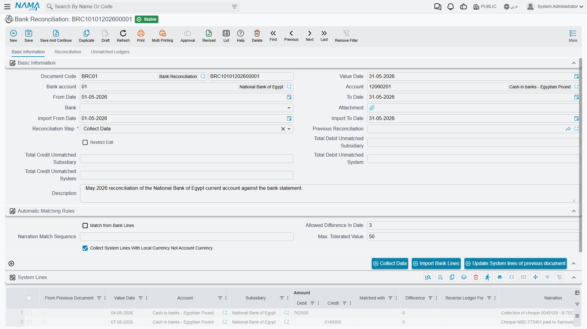

# Bank Reconciliation

Your bank balance in your books rarely matches the bank statement moment for moment: a cheque you deposited isn't yet collected, a fee the bank deducted you haven't recorded yet, a transfer in transit. **Bank Reconciliation** (`Banks > Cheques > Bank Reconciliation`) is the systematic process that places the bank statement next to your transactions, matches what matches, and surfaces the differences so they can be handled.

::: info Required license
Bank reconciliation is part of the banks license `accounting-banks`.
:::

::: warning Reconciliation doesn't post by itself
The bank reconciliation document produces **no accounting effect**; it's a comparison and difference-detection process only. The differences it finds (fees, interest...) are then recorded via a [bank adjustment](./banks-and-bank-accounts.md) or the appropriate document. Don't confuse "reconciliation" (comparison) with "adjustment" (an entry).
:::

## The three-step workflow

The document moves through a **reconciliation step** in three stages:

1. **Collect Data** — you specify the **bank account** and a date range, and the system gathers your transactions (system lines) and imports the bank statement (bank/subsidiary lines).
2. **Reconciliation** — you match the bank-statement lines against your transaction lines (manually or by matching rules on the reference/narration), within the allowed **value tolerance** and **date-difference tolerance**. The system shows the **system total**, the **subsidiary total**, the **unmatched lines** on both sides, and the **total difference**.
3. **Finished** — the document is closed once matching is complete.

Each document links to the **previous reconciliation**, so it continues where the last one ended and locks its past — a closed period isn't re-reconciled.

## Turning an unmatched line into an entry

Most unmatched lines are the bank's own movements — a charge, an interest credit, a transfer fee — that nobody has recorded in your books yet. You do not have to leave the screen to record them.

Standing on the **Reconciliation** step, select the row in the unmatched lines grid and press **Create Journal Entry**. A new journal entry opens in a popup already carrying that line: the line's value date, the fiscal year and period worked out from it, and one entry line holding the line's account, the bank account as its subsidiary, and the line's debit or credit amount.

You complete the other side of the entry, then save it. That is what actually records the difference — the reconciliation itself still posts nothing, and the entry you have just created is an ordinary journal entry with its own life. Collect the data again afterwards and the newly recorded movement is there to match against.

::: tip The button only works mid-reconciliation
It needs the document to be on the **Reconciliation** step with a row selected. On the Collect Data or Finished step it will tell you so rather than open anything.
:::

## The buttons that drive the three steps

Each step of the workflow is a button, and the reason a reconciliation "does nothing" is nearly always that the document is on the wrong step for the button being pressed.

**On the Collect Data step:**

- **Collect Data** — the button behind step 1. With the **bank account**, the ledger **account** and the from/to dates set, it pulls your side into the **system lines** grid, continuing from the previous reconciliation.
- **Import Bank Lines** — loads the bank's own statement from a file. Attach the file and fill the **bank name** first; without both, it refuses and tells you which is missing. **Import Subsidiary Lines** does the same for the other grid.
- **Update System lines of previous document** — refreshes the system lines that were carried over from the previous reconciliation, so movements that changed since it was closed show their current figures. It works only on this step.

**On the Reconciliation step:**

- **Automatic Match** — runs the matching engine across both grids on its own, honouring the **value tolerance**, the **date-difference tolerance** and the **narration match sequence**, and matching from whichever side **match from subsidiary lines** points at. This is what clears the bulk of the lines.
- **Manual Match** — the same engine, but it pairs only what you have set up rather than searching freely. Use it for the lines automatic matching left behind.
- **Macth** — applies the pairings you typed into the unmatched grids: fill a row's **matched with** (or **reverse of**) column, press it, and those rows are matched and drop out of the unmatched lists. The label reads exactly like that on screen.
- **Create Journal Entry** — records an unmatched line as an entry; described in full under *Turning an unmatched line into an entry* above.

**Any time:**

- **Calculate Totals** — recomputes the system and subsidiary totals, the unmatched totals on both sides, and the total difference from the grids as they currently stand. Press it after a round of matching to see where you are.

**Automatic Match**, **Manual Match** and **Macth** all require the **Reconciliation** step; on Collect Data or Finished they say so and do nothing.

## Difference from subsidiary reconciliation

The same reconciliation idea applies to customers and suppliers via **Subsidiary Reconciliation** (`Accounting > Reconciliations > Subsidiary Reconciliation`): it matches the party's balance in your books against their external statement using the same three-step workflow, and chains the documents historically. The only difference is the nature of the party: a bank account here, a customer/supplier there.

## Reports

Reconciliation results and the related bank statements are in the bank reports (`SYSR-BNK*`) mentioned in [Cheques & financial papers](./cheques-financial-papers.md).

## For Support

- **"The reconciliation didn't move the bank balance"** — that's correct; reconciliation doesn't post. Record the differences yourself: **Create Journal Entry** from the unmatched line is the quickest route, or use a bank adjustment.
- **"Many lines won't match even though they actually match"** — review the **value tolerance**, the **date-difference tolerance**, and the reference/narration matching rules.
- **"I can't edit an old document"** — because it's linked to a later document that locks it; this is expected, to preserve the reconciliation sequence.
