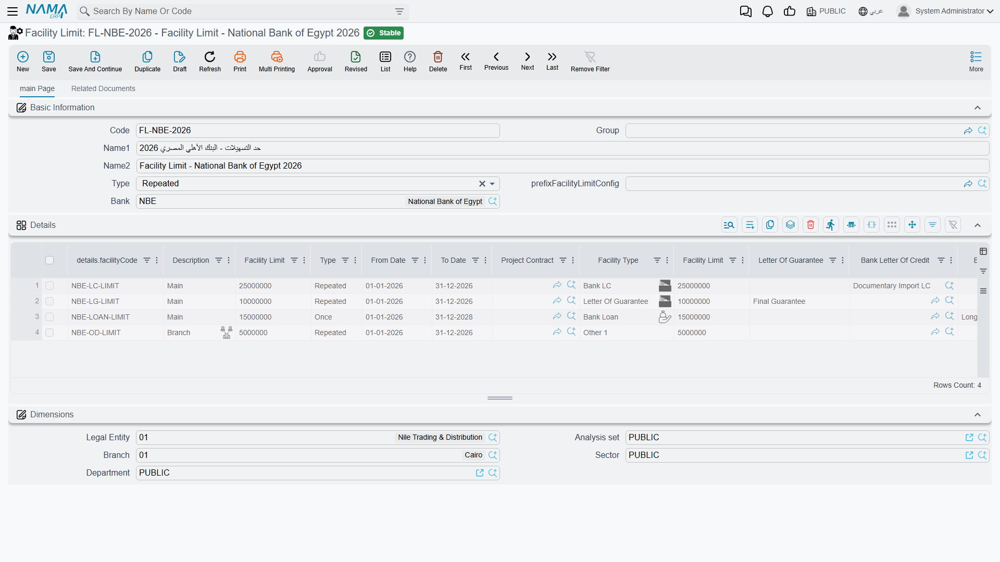
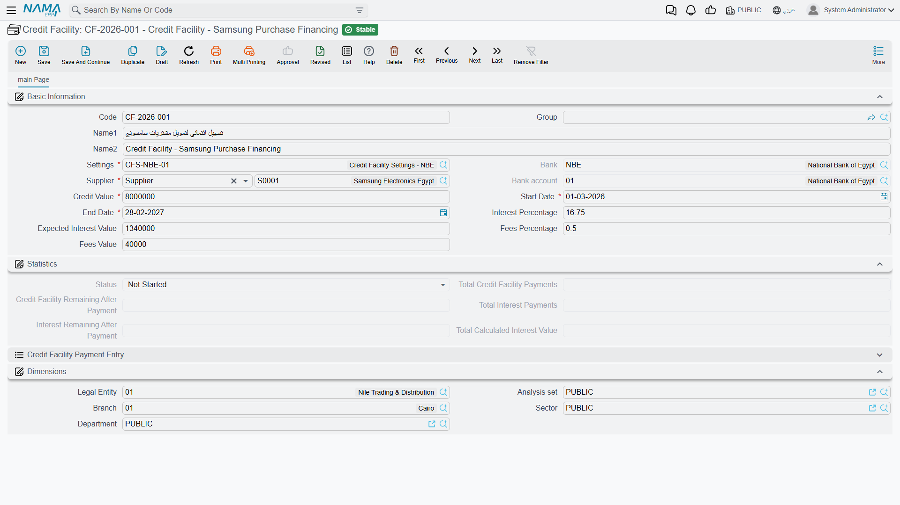
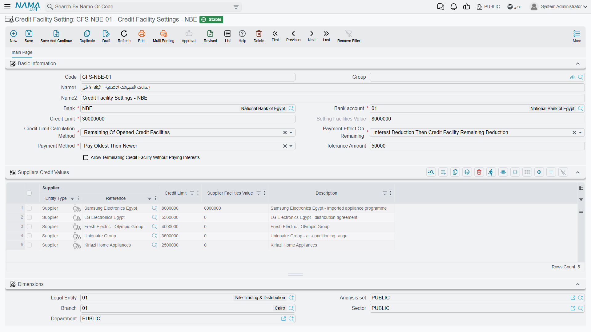

# Credit Facilities & Facility Limits

Two related but distinct ideas meet on this page:

- A **facility limit** is the **ceiling** the bank grants you, shared by a number of instruments — a loan here, a letter of guarantee there, a letter of credit — each of which reserves part of the ceiling, and the system tracks the **consumed and remaining** amounts.
- A **credit facility** is a standalone instrument: a revolving-drawdown agreement with the bank with its own value, interest and fees, issued, repaid and terminated through its own documents.

::: info Required license
Credit facilities are part of the `accounting-loans` license — the same license that covers [Bank Loans](./bank-loans.md) and [Fixed Deposits](./fixed-deposits.md).
:::

## Facility limit: the shared ceiling

On the **Facility Limit** screen (`Banks > Credit Facilities > Facility Limit`) the ceiling granted by a particular **bank** is defined, and its details are configured through the **Facility Limit Config** (`Banks > Credit Facilities > Facility Limit Config`).

As soon as a loan, letter of guarantee or LC is linked to a facility limit, it draws down from it at issue/opening; the system blocks any issue that would push the consumed amount over the ceiling. And because the three instruments share the same ceiling, the **Details of banking facilities** report (SYSR-LON002) gives you a unified picture of what's reserved across all of them.

## Credit facility: from setup to termination

A credit facility is a revolving-drawdown instrument, and its cycle runs like this:

1. **Credit Facility Setting** — the shared template: the interest-calculation method, the rule for allocating a payment between principal and interest, and the accounts.
2. **Credit Facility** — the master file in its "Not Started" status.
3. **Credit Facility Issuance** — activates the facility (it posts to the ledger, and the status flips to "In Progress").
4. **Credit Facility Payment** — repaying an installment that gets split between principal and interest per the setting (it posts to the ledger).
5. **Credit Facility Termination** — terminating the facility (status "Terminated").

### The facility master file

On the **Credit Facility** screen (`Banks > Credit Facilities > Credit Facility`) the terms are defined: the linked **setting**, the **supplier**, **bank** and **bank account**, the **credit facility value**, the **interest percentage** and **expected interest value**, the **fees percentage/value**, and the **start / end date**. The file shows live tracking totals: **total calculated interest value**, **total credit facility payments**, **total interest payments**, and the **credit-facility/interest remaining after payment**.

**Facility statuses:** Not Started → In Progress → Terminated.

### The setting

The **Credit Facility Setting** gathers the rules shared by similar facilities: the interest-calculation method (the **days per year for credit-facility interest calculation** option sets the calculation basis, default 365 — see [Accounting configuration](./support/accounting-configuration.md)) and the rule for splitting each payment between principal and interest.

### Issuance, payment and termination

**Issuance** activates the instrument and posts its effect (a **debit/credit** pair). Then each **payment document** splits its installment between principal and interest per the setting, posting via the sides: **payment of credit-facility value debit/credit**, **payment of interest value debit/credit**, and **payment value debit/credit**. Finally, the **termination document** closes the facility. (Where the accounts come from is in the [Document terms](./support/accounting-document-terms.md) reference.)

## Actions on this screen

The **Credit Facility Payment** is the one screen here you should not fill in by hand — two buttons find the facilities a payment should go against:

- **Collect Credit Facilities** — you enter the **payment value** and, optionally, narrow by **setting**, **supplier**, **bank**, **bank account** and a start-date range; it then fills the payment's details with the outstanding facilities and spreads the payment across them. Tick **collect by oldest then newest facilities only** to have it settle in age order. The payment value must be greater than zero, or the button refuses with *"Payment value should be more than zero"*.
- **Collect Credit Facilities Without Payment Value** — the same search, but it brings in the matching facilities *without* allocating an amount to each. Use it when you want to see everything outstanding for a supplier or bank and decide the split yourself.

## Reports

| Report | Answers |
|---|---|
| Details of banking facilities (SYSR-LON002) | What's reserved and remaining of the facility limits across loans, guarantees, credits and facilities. |

## For Support

- **"What's the difference between a facility limit and a credit facility?"** — a facility limit is a ceiling shared by several instruments, while a credit facility is a standalone drawdown instrument with its own documents.
- **"Issuing a loan/letter/LC was rejected because of the limit"** — the consumed amount exceeds the linked facility-limit ceiling; check the Details of banking facilities report.
- **"The facility interest calculation looks wrong"** — check the **days per year** in [Accounting configuration](./support/accounting-configuration.md) and the allocation rule in the facility setting.
- **"Where do the payment accounts come from?"** — from the **Credit Facility Payment** term; see [Document terms](./support/accounting-document-terms.md).
- The accounting-processing mechanism is in [How documents are processed into accounting effects](./support/accounting-request-processing.md).

## Messages you may see

| Message | Why | What to do |
|---|---|---|
| *Payment value should be more than zero* — «يجب ان يكون المبلغ المدفوع اكبر من صفر» | The **Collect Credit Facilities** button was pressed with the **payment value** empty, zero or negative. | Enter the amount you are paying first, or use **Collect Credit Facilities Without Payment Value** to bring the facilities in unallocated. |
| *End date must be greater than start date* — «تاريخ النهاية يجب أن يكون أكبر من تاريخ البداية» | The credit facility's **start date** is after its **end date**. (The same wording is used by several HR screens.) | Correct whichever of the two dates is wrong. |
| *Setting {0} Credit Limit {1} Is Less Than The Remaining Of Opened Credit Facilities {2}* — «الحد الائتماني {1} للإعداد {0} أقل من المتبقي من التسهيلات الائتمانية المفتوحة {2}» | Saving this facility would push the remaining value of all In Progress facilities that share the same **Credit Facility Setting** over the setting's **credit limit**. | Lower the facility value, raise the limit on the setting, or terminate a facility that is finished. |
| *Supplier {0} Credit Limit {1} Is Less Than The Remaining Of Opened Credit Facilities {2}* — «الحد الائتماني {1} للمورد {0} أقل من المتبقي من التسهيلات الائتمانية المفتوحة {2}» | The same check, but against the per-supplier limit line inside the setting rather than the setting's overall limit. | Raise that supplier's limit in the setting's suppliers grid, or reduce the facility value. |
| *Credit facility {0} is not issued yet* — «لم يتم إصدار التسهل الائتمانى {0}» | A payment (or another document) refers to a facility that has no committed **Credit Facility Issuance**. Nothing can be paid against a facility that was never activated. | Issue the facility first, then re-save the document. |
| *You can not change the bank because the current document is used in {0}* — «لا يمكن تغير البنك لأن الملف الحالى مستخدم فى {0}» | The **bank** on a **Credit Facility Setting** is being changed after committed facilities were already created from it. | Create a new setting for the new bank instead of editing the old one. |
| *Credit limit {0} for supplier {1} is less than the total remaining credit facilities {2}* — «الحد الائتمانى {0} للمورد {1} أقل من إجمالى المتبقى من التسهيلات الائتمانية {2}» | A supplier limit line on the setting is being saved with a ceiling below what that supplier's existing facilities still owe. | Raise the line's credit limit, or settle/terminate facilities for that supplier first. |
| *Value date {0} can not be after credit facility {1} start date {2}* — «لا يمكن ان يكون التاريخ الفعلى {0} بعد تاريخ البداية {2} للتسهيل الائتمانى {1}» | The **Credit Facility Issuance** carries a value date later than the facility's own **start date** — the facility would be active before it was issued. | Move the issuance date back to the start date or earlier, or push the facility's start date forward. |
| *Credit facility {0} was issued before in {1}* — «التسهيل الائتمانى {0} تم إصداره مسبقاً فى {1}» | A second issuance document is being created for a facility that already has one; a facility is issued once. | Use the existing issuance document; delete this one. |
| *Credit facility {0} is already terminated by {1}* — «تم انشاء مستند إنهاء تسهيل {1} للتسهيل الائتمانى {0}» | The facility has a committed **Credit Facility Termination**, so it accepts no further payment or termination. | If the termination was wrong, delete it first; otherwise nothing more is due on this facility. |
| *Credit facility {0} has payments in document {1}* — «التسهيل الائتمانى {0} له مدفوعات فى مستند {1}» | The issuance document is being edited or deleted while payment documents already exist against the facility. | Delete the payment documents named first, then change the issuance. |
| *Payment value {0} must be equal to the sum of payment of credit facility {1} and payment of interest {2}* — «المبلغ المدفوع {0} يجب ان يساوس مجموع المدفوع من التسهيل الإتماني {1} و المدفوع من الفائدة {2}» | On a payment line whose effect on the remaining is entered by hand, the line **payment value** does not equal principal plus interest. | Make the three figures agree, or let **Collect Credit Facilities** fill the line. |
| *Payment value in line {0} can not be greater than the sum of payment of credit facility and payment of interest* — «لا يمكن ان يكون المبلغ فى السطر {0} أكبر من مجموع المُسدد من التسهيل الائتمانى و المُسدد من الفائدة» | The line pays more than the principal and interest portions it is split into; the number in the message is the line number. | Reduce the line payment value, or raise the principal/interest split to match it. |
| *Payment of interest value {0} can not be grater than the interest remaining before payment {1}* — «لا يمكن ان تكون قيمة المدفوع من الفائدة {0} أكبر من قيمة المتبقي من الفائدة قبل الدفع {2}» | The interest portion of the line exceeds the interest still outstanding on that facility before this payment. | Cap the interest portion at the remaining interest; put the rest against principal. |
| *Total payment of the details {0} is greater than {1}* — «إجمالى المدفوع فى السطور {0} اقل من {1}» | The header **payment value** is larger than the total the detail lines actually allocate. (The Arabic wording of this message says "less than"; the check is the one described here.) | Either lower the header value or allocate the difference onto a facility line. |
| *Credit facility {0} has {1} remaining unpaid amount* — «متبقى من التسهيل الائتمانى {0} مبلغ {1} غير مدفوع» | A **Credit Facility Termination** is being saved while the facility still has an unpaid balance, and the setting does not allow terminating with interest outstanding. | Record the remaining payments first, or tick **allow terminating credit facility without paying interests** on the setting if that is the policy. |
