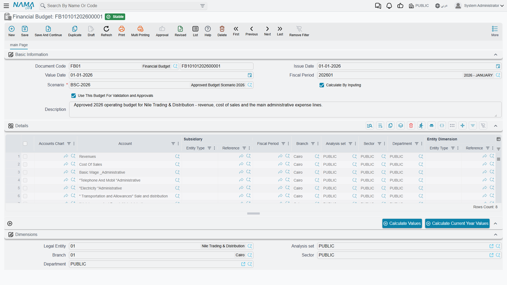

# Financial Budgets

A budget is a plan with teeth: you decide up front how much each account may spend (or should earn) over a period, and then — if you want — the system holds your documents to that plan, warning or even blocking spending that would blow past it. Nama's **financial budgets** let you set those targets per account, per period, and per dimension, and then validate actual activity against them.

::: info Required license
Financial budgets are part of the `accounting-budget` license, and live under the **Budgets** menu root.
:::

## Building a budget

The **Financial Budget** (`BUDGETS > Budgets > Financial Budget`) is the plan document. Each **details** line targets one **account** (within a chosen **accounts chart**) and carries a planned **value for the year** — and because budgeting is often multi-year, the line holds up to **six years** of values side by side, with optional **change percentages** to grow each year off the previous one automatically. The credit/debit split per year can be filled directly or calculated for you.

Every line is scoped by the **dimensions** that matter to you — legal entity, sector, branch, department, analysis set, subsidiary, even a record (entity dimension) — and by a **fiscal year / period** (a from–to period range). So "marketing department, branch Riyadh, this year: 500,000" is a single, precise budget line.

You can keep several budgets as **scenarios** (`BUDGETS > Master Files > Budget Scenario`) — an optimistic plan, a conservative one — and tag the budget with the scenario it belongs to.

## Turning a budget into a control

A budget only constrains spending if you tell it to. The switch is **"use this budget for validation"** — set on the budget (and per line, with an optional **validate-from / validate-to** date window). Once a budget is marked for validation, the system checks documents that hit its accounts against the planned figure.

**What happens on an overrun is decided per account**, by the account's **Budget Exceeded Behavior** (see [Budget control on the account](./accounts.md#Budget-control-on-the-account)):

- **Prevent Saving** — the document is blocked outright.
- **Request Approval** — the over-budget document is routed for **approval**, so an authorized user can let it through.

Two switches in the accounting configuration (see the [Accounting configuration](./support/accounting-configuration.md) catalog) unlock those choices: an account cannot be saved with **Prevent Saving** (or with **Prevent Save If No Budget Was Found For The Account**) until **Enable Prevent Saving For Budgets** is on, nor with **Request Approval** until **Enable Approvals For Budgets** is on. An account left on **Allow** is never stopped — its budget is informational only, tracked and reportable.

Only movement that grows the account on its **natural side** is checked — a debit on a debit account, a credit on a credit account — and only against budget lines that are saved, not drafts, and have **Use This Budget For Validation and Approvals** ticked. If no such line matches, the budget total is zero and the document passes, unless the account has **Prevent Save If No Budget Was Found For The Account** ticked.

### Matching the right budget line

When it validates, the system needs to know *which* budget line a document maps to. The **Budget Validation Options** include a set of **"consider…"** toggles — consider sector, branch, department, analysis set, subsidiary, record (entity dimension), references 1–3, and fiscal period — that define how precisely actuals are matched to budget lines. Turn on the dimensions you budget by; leave off the ones you don't, so the match isn't too narrow to find its line.

## Actions on this screen

Budget lines are rarely typed one figure at a time — two buttons fill the numbers for you once the lines name their accounts and dimensions:

- **Calculate Values** — fills the planned figures across the budget's year columns from the scenario, the fiscal period range and each line's account and dimensions, applying the line's **change percentages** to grow one year off the previous. This is what turns "these are the accounts I budget by" into an actual multi-year plan.
- **Calculate Current Year Values** — the narrower version: it computes only the current year's figures, leaving the later years alone. Use it when the out-years were agreed and you are only re-basing this year.

Both act on the **details** grid, so add and scope your lines first, then press.

## For Support

- **"My budget isn't stopping anything"** — three things must line up: the budget line is saved and marked **Use This Budget For Validation and Approvals**, the account's **Budget Exceeded Behavior** is **Prevent Saving** or **Request Approval**, and the document moves the account on its natural side. Otherwise the budget is informational only.
- **"A document was blocked / sent for approval unexpectedly"** — it hit an account that has a validation budget and would exceed it; check the budget figure and the document's amount and dimensions.
- **"The system can't find the matching budget line"** — review the **consider…** toggles in the Budget Validation Options; if you budget by branch but "consider branch" is off (or vice-versa), the actual won't match the line.
- **"I want to compare plans"** — keep each plan as a separate **Budget Scenario** and tag its budget accordingly.

## Messages you may see

The refusals a document meets when it overruns a budget — *The account {0} has a budget {1}, and this document will exceed the budget because it will it make the balance {2}* and the approval-definition ones — are listed with the setting behind each under [Budget control on the account](./accounts.md#Budget-control-on-the-account). The ones below come from setting budgets up.

| Message | Why | What to do |
|---|---|---|
| *The account {0} does not have a budget* — «لم يتم عمل موازنة للحساب {0}» | The account has **Prevent Save If No Budget Was Found For The Account** ticked, and no saved budget line marked **Use This Budget For Validation and Approvals** matches this document's account, dimensions and period. | Add a budget line for that account and dimension mix, or check the **consider…** toggles: every dimension they switch on must match exactly, empty included, so with **Consider Department** on, a line with no department is not found for a document that names one. |
| *You must enable the option {0} in accounting configuration to be able to use prevent saving when budget is exceeded* — «يتوجب عليك تفعيل الأوبشن {0} في إعدادات الحسابات لتتمكن من تفعيل منع الحفظ عند تخطي الموازنات» | The account is being saved with **Budget Exceeded Behavior** = **Prevent Saving** while **Enable Prevent Saving For Budgets** is off. | Turn the option on in the accounting configuration, then save the account again. |
| *You must enable the option {0} in accounting configuration to be able to use prevent saving if no budget was found* | The same, for **Prevent Save If No Budget Was Found For The Account** — it is unlocked by the same option. | As above. The message has no Arabic translation and appears in English on Arabic screens. |
| *You must enable the option {0} in accounting configuration to be able to use request approval when budget is exceeded* — «يتوجب عليك تفعيل الأوبشن {0} في إعدادات الحسابات لتتمكن من تفعيل طلب الموافقة عند تخطي الموازنات» | The account is being saved with **Request Approval** while **Enable Approvals For Budgets** is off. | Turn the option on, then save the account again. |
| *You can not enable replication and use request approval when budget is exceeded at the same time* — «لا يمكنك تفعيل الريبليكشن و طلب الموافقة عند تخطي الموازنات في نفس الوقت» | The installation runs Replication, and **Request Approval** on an account is not allowed there. | Use **Prevent Saving** on that account instead. |
