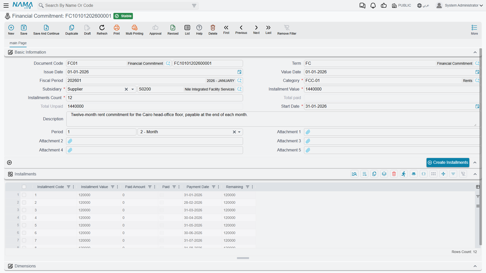
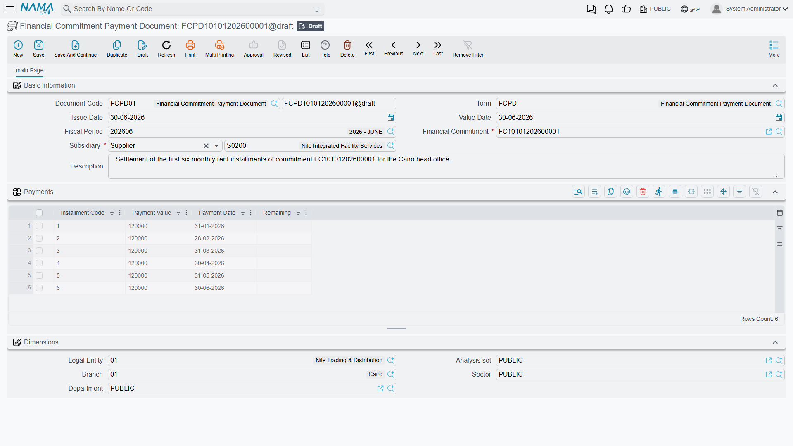

# Financial Commitments

A company carries many recurring obligations that aren't invoices yet but are very real: a yearly rent paid in quarterly installments, an insurance policy, a financing agreement with a fixed repayment schedule. The **financial-commitments** system is where you register these obligations, lay out their installment schedule, and track what's been paid against what's still due — a regulation-and-tracking layer that sits beside your ordinary vouchers.

::: info Required license
Financial commitments are part of the `accounting-financial-commitments-regulation` license.
:::

::: tip A tracking layer, not a posting document
The commitment and its payment document **do not post to the general ledger themselves**. They track the obligation and its settlement against the schedule; the actual money movement is recorded by your normal receipt/payment vouchers. Think of this system as the planner and watchdog over those obligations, not a replacement for the vouchers that move the cash.
:::

## The pieces

All screens are under the **Accounting > Financial Commitment Management** root:

1. **Financial Commitment Category** — a master file for classifying commitments (rent, insurance, financing…), so you can group and report on them.
2. **Financial Commitment** — the obligation itself: its total value, its **category**, a **start date**, a repayment **period** (every *n* months/…), and the resulting **installment schedule**.
3. **Financial Commitment Payment Document** — records a payment against a specific installment, updating that installment's paid/remaining figures.
4. **Financial Commitment Reschedule** — changes the schedule after the fact (add, edit or remove installments), keeping a before/after record of the change.

## Setting up a commitment

On the **Financial Commitment** (`Accounting > Financial Commitment Management > Financial Commitment`) you enter the obligation's **category**, its **start date**, the **installments count** and **installments value**, and the recurrence **period** (value + unit, e.g. every 1 month). From these the **Installments** grid is built — one line per installment carrying its **installment code**, **value**, **payment date**, and the running **paid amount** / **remaining** and a **paid** flag. The header keeps the rolling **total paid** and **total unpaid** so you can see at a glance where the obligation stands.

## Paying an installment

The **Financial Commitment Payment Document** (`Accounting > Financial Commitment Management > Financial Commitment Payment Document`) points at a **financial commitment** and records a payment against it. When committed, it updates the matching installment's **paid amount** and **remaining**, and flips the installment to **paid** once fully settled — so the commitment's totals always reflect reality.

## Actions on this screen

The installment schedule is generated, not typed:

- **Create Installments** — builds the **Installments** grid from the **installments value**, the **installments count**, the **start date** and the recurrence **period**, dividing the value evenly and stepping the payment date forward by one period each time. All four fields are required; leave one blank and the button says which. It also refuses to run if any existing installment is already **paid** or carries a paid amount — regenerating would wipe settled history — so reschedule those with a **Financial Commitment Reschedule** instead.
- **Create Installments For Selected Documents** — the same generation, but from the **commitments list view** across every commitment you have selected. This is how you lay schedules onto a batch of commitments that were imported or entered without them.

## Rescheduling

Plans change — an installment is deferred, the amounts are renegotiated. The **Financial Commitment Reschedule** (`Accounting > Financial Commitment Management > Financial Commitment Reschedule`) lets you add, edit or delete installment lines on an existing commitment. It keeps two grids — the **details** (the new schedule) and the **details before edit** (the schedule as it was) — so the change is auditable.

## For Support

- **"The commitment didn't create a journal entry"** — that's expected; commitments and their payment documents don't post to the ledger. Record the actual cash movement with a normal receipt/payment voucher.
- **"The paid/remaining figures look wrong"** — they're driven by the **payment documents** linked to the commitment; check that each payment is committed and points at the right installment.
- **"I need to change the schedule"** — use a **Reschedule** document rather than editing the original commitment; it preserves the before/after history.
- **"An installment still shows unpaid after I paid it"** — confirm the payment document fully covered the installment value; partial payments leave a **remaining** balance until topped up.

## Messages you may see

| Message | Why | What to do |
|---|---|---|
| *Installments Count must be {0}* — «عدد الإقساط يجب أن يكون {0}» | The **installments count** on the header does not match the number of lines in the **Installments** grid; the number shown is the line count actually found. | Either correct the count, or press **Create Installments** again so the grid and the count are built together. |
| *Sum of installments values {0} must equal installments value {1} in document header* — «مجموع قيم الأقساط {0} يجب ان يساوى {1} فى رأس المستند» | The installment lines add up to something other than the header **installments value**. | Adjust a line value or the header figure. **Create Installments** always produces an even split that balances. |
| *Paid installment with code {0} can not be removed* — «لا يمكن حذف القسط المدفوع الذى كوده {0}» | A payment document already exists against that installment code, and the line has been deleted from the grid. | Put the line back. A schedule that has been paid against is changed with a **Financial Commitment Reschedule**, not by editing the commitment. |
| *Payment value must be greater than zero* — «يجب ان تكون قيمة الدفع اكبر من الصفر» | A line on the **Financial Commitment Payment Document** has an empty or negative payment value. | Enter a positive amount on that line, or delete the line. |
| *Could not find installment line with code {0} in {1}* — «لا يوجد قسط بكود {0} فى {1}» | The installment code typed on a payment or reschedule line does not exist on the commitment the document points at. | Pick the code from the commitment's **Installments** grid; codes are not free text. |
| *Installment code {0} can not be repeated* — «لا يمكن تكرار كود القسط {0}» | Two lines of the same payment document pay the same installment code. | Merge them into one line carrying the total amount. |
| *Cannot change financial commitment from {0} to {1} in document {2}* — «لا يمكن تغيير الالتزام المالى {0} الى {1} فى المستند {2}» | A saved **Financial Commitment Reschedule** is being repointed at a different commitment. | Delete the reschedule and create a new one against the other commitment. |
| *Cannot edit document {0} on date {1} because of the reschedule document {2}* — «لا يمكن تعديل المستند {0} فى تاريخ {1} لوجود مستند اعادة جدولة التزام مالى {2}» | A later reschedule exists for the same commitment; only the most recent reschedule may be edited. | Edit or delete the later reschedule first, then come back to this one. |
| *Installment with code {0} is already paid and cannot be changed or deleted* — «القسط الذى كوده {0} مدفوع مسبقاً ولا يمكن تعديله او حذفه» | A reschedule line targets an installment already flagged **paid**. | Remove that line; only unpaid installments can be rescheduled. Reverse the payment document first if the installment really must move. |
| *Installment value {0} can not be less than paid amount {1}* — «لا يمكن ان يكون القسط {0} أقل من المبلغ المدفوع {1}» | The reschedule would drop an installment's value below what has already been paid against it. | Raise the new value to at least the paid amount, or reduce the payment first. |
| *Payment date {0} of add installment must be after payment date {1} of installment {2}* — «تاريخ الإستحقاق {0} للقسط المضاف يجب ان يكون بعد تاريخ الدفع {1} للقسط {2}» | An **Add** line inserts a new installment after an existing one but gives it an earlier or equal payment date. | Move the new installment's payment date past the date of the installment it is added after. |
| *Installment payment date {0} for installment code {1} can not be before installment payment date {2} for installment code {3}* — «تاريخ الدفع {0} للقسط {1} لا يمكن ان يكون قبل تاريخ الدفع {2} للقسط {3}» | The date given would put the installment out of order against a later installment in the schedule. | Keep the schedule's payment dates ascending; shift the later installments too if the whole plan is moving. |
| *Can not delete current document because {0} was created after it* — «لا يمكن حذف المستند الحالى لأنه تم إنشاء المستند {0} بعده» | You are deleting a reschedule that a later reschedule for the same commitment was built on top of. | Delete the newest reschedule first and work backwards. |
| *Subsidiary {0} is used in {1} and can not be removed* — «لا يمكن ازالة الذمة {0} حيث انه مستخدم فى {1}» | A party line was removed from a **Financial Commitment Category** while a committed commitment still uses that category-and-party pairing. | Put the line back, or move the commitments named onto another category first. |
| *Subsidiary {0} is repeated* — «الذمة {0} مكرر» | The category's party grid lists the same party twice. | Delete the duplicate line. |
| *Can not delete the file because it is used in {0}* — «لا يمكن حذف الملف لأنه مستخدم فى {0}» | You are deleting a **Financial Commitment Category** that a committed commitment is classified under. | Re-classify (or delete) the commitments named first, then delete the category. |
