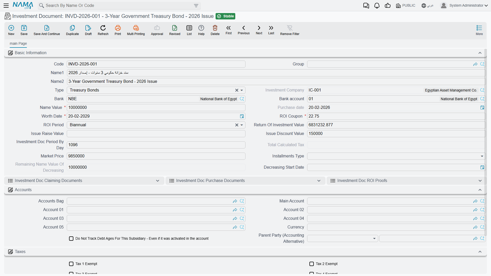
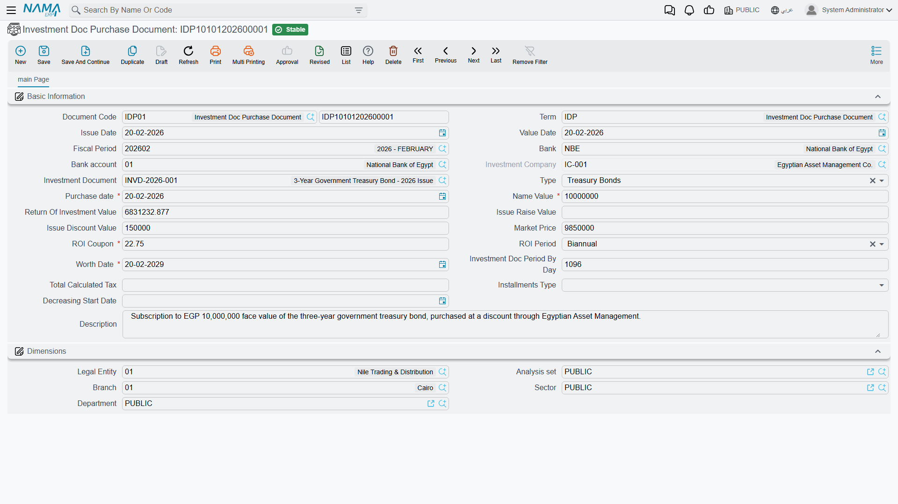
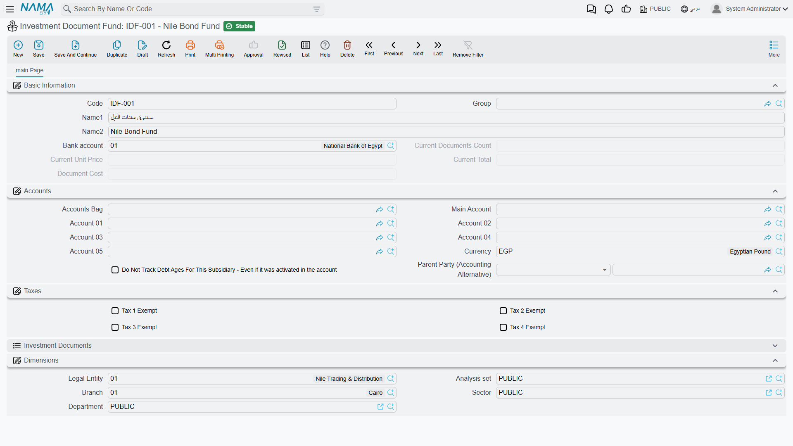

# Investment Documents & Fund Certificates

Beyond the portfolio system that tracks investment *assets*, Nama has a second investment world for the **paper instruments** a company buys and holds: bonds and fund certificates. These behave very differently from an equity stake, so they get their own documents. This page covers both — and they themselves split into two kinds, which is the first thing to get straight.

::: info Required license
Investment documents are part of the `accounting-investment-documents` license — the same license that covers **[treasury bills](./treasury-bills.md)**. Screens are under **Banks > Investment Documents** (and **Banks > Document Investments** for funds).
:::

## Two kinds of instrument — and why both exist

The two answer different needs, so don't mix them up:

- **Investment Document** (سند استثمار) — a **bond-like** instrument. You lend money against a paper that has a **nominal (name) value** and pays a periodic **coupon return** (ROI). It can be a **treasury bond** or a **company bond**, and its principal repayment can be **fixed** (the whole nominal comes back at maturity) or **decreasing** (the nominal is paid down over the life of the bond). The return is a known coupon — you're a lender.
- **Investment Document Fund** (صندوق استثمار وثيقة) — a **unit-based** fund certificate. You buy a **number of units** at a **unit price**, and your holding is worth units × current price. There's no fixed coupon; your gain or loss is the movement in the unit price — you're a unit-holder.

In short: bonds for a fixed, coupon-style return; funds for a price-driven holding. Treasury **bills** (a third, short-term discount instrument) are covered on their [own page](./treasury-bills.md).

## Investment documents (bonds)

The **Investment Document** master (`Banks > Investment Documents > Investment Document`) describes the bond: its **type** (treasury / company bond), **nominal value**, **coupon** rate and **ROI period**, the **fixed / decreasing** installments type (with a **decreasing start date** and the **remaining nominal of decreasing** tracked), the **issue discount / issue premium**, the **market price**, and the **investment company**. Its **status** follows the familiar **Initial → Ongoing → Closed** path.

The bond is brought to life by a chain of documents:

1. **Investment Doc Purchase Document** (`Banks > Investment Documents > Investment Doc Purchase Document`) — the purchase, and the document that **posts**. Its effect carries the **nominal value** debit/credit, plus the **issue discount** and **issue premium (raise)** sides — because a bond is rarely bought exactly at par.

   

2. **ROI Proof** (and **Aggregated ROI Proof** for several at once) — locking in the periodic coupon return.
3. **Claiming** — collecting the document's value at maturity.

## Investment document funds (unit certificates)

The **Investment Document Fund** master (`Banks > Investment Document > Investment Document Fund`) tracks a unit-based holding, valued as units × unit price.

It has its own three documents: a **Purchase** (buying units), a **Sale** (selling units), and a **Price Update** (revaluing the holding as the unit price moves). Because a fund's worth tracks the market, the price-update document is what keeps its value current between buying and selling.

## Actions on this screen

One button here saves real work, and it is on the batch document rather than the bond itself:

- **Collect Investment Documents** — on the **Aggregated ROI Proof**, it fills the proof lines with the bonds whose return is due to be locked in, so you do not add them one by one. It gathers the documents that are **Ongoing** and of type **treasury bond**; company bonds and anything already closed are left out, which is why a bond you expected may not appear.

## Profit distribution

When investments yield profit to be shared out among partners, the **Profits Distribution Doc** (`Accounting > Documents > Profits Distribution Doc`) records and distributes it. Its printed form is `SYSF-ACC023`.

## For Support

- **"Which one do I create — a document or a fund?"** — a bond with a nominal value and coupon → **Investment Document**; a holding measured in units at a unit price → **Investment Document Fund**.
- **"There's no screen to create the bond manually"** — the bond master is set up, but its accounting starts with the **Purchase Document**; the return then comes via **ROI Proof**.
- **"The fund's value is stale"** — funds are revalued by a **Price Update** document; without one, the holding shows its last known price.
- **"A decreasing bond's nominal isn't going down"** — check the **decreasing start date** and installments type; the **remaining nominal of decreasing** tracks what's left.
- **"Where do the nominal / discount / premium accounts come from?"** — from the **Investment Doc Purchase** term; see [Document terms](./support/accounting-document-terms.md).

## Messages you may see

| Message | Why | What to do |
|---|---|---|
| *Can not make more than one Investment Document Purchase Document For Same Investment Document {0}* — «لا يمكن إنشاء أكثر من مستند شراء ملف استثمار لنفس سند الاستثمار {0}» | A second purchase document is being created for a bond that already has one; a bond is bought once. | Edit the existing purchase document instead of creating another. |
| *Can not make Investment Document Claiming Document Before Investment Document Purchase Document For Investment Document {0}* — «لا يمكن عمل مستند استحقاق سند استثمار قبل عمل مستند شراء سند استثمار للسند {0}» | A claiming document for the bond carries a value date earlier than the purchase document being saved. | Move the purchase date back before the claiming date, or move the claiming document forward. |
| *Can not make Investment Document ROI Proof Document Before Investment Document Purchase Document For Investment Document {0}* — «لا يمكن عمل مستند إثبات عائد سند استثمار قبل عمل مستند شراء سند استثمار للسند {0}» | An ROI proof document for the bond is dated before the purchase document being saved — the return would be proven before the bond was owned. | Correct whichever date is wrong; purchase must always come first. |
| *You can not use field {0} with type {1}* — «لا يمكنك استخدام الحقل {0} مع النوع {1}» | The purchase document is of type **Treasury Bonds** and an **installments type** has been chosen; treasury bonds have no installment plan. | Clear the installments type, or change the document type. |
| *Can not delete Investment Document Purchase Document For An Investment Document has Investment Document Claiming Document* — «لا يمكن مسح مستند شراء سند استثمار لديه مستند استحقاق سند استثمار» | You are deleting the purchase document of a bond that already has a claiming document. | Delete the claiming document first. |
| *Can not delete Investment Document Purchase Document For An Investment Document has Investment Document ROI Proof Document* — «لا يمكن مسح مستند شراء سند استثمار لديه مستند اثبات عائد سند استثمار» | The same, for a bond that has a committed ROI proof document. | Delete the ROI proof documents first, then the purchase. |
| *Can not make Investment Document ROI Proof Document Before making Investment Document Purchase Document* — «لا يمكن عمل مستند إثبات عائد سند استثمار قبل عمل مستند شراء سند استثمار» | The ROI proof is being saved for a bond with no purchase document at all, or with a purchase dated after the proof. | Record the purchase first, and date it on or before the proof. |
| *Investment Documents with Type Treasury Bonds only Can be selected* — «سندات الاستثمار من نوع سندات خزانة فقط التي يمكن اختيارها» | A line on the **Aggregated Investment Doc ROI Proof** points at a bond that is not of type **Treasury Bonds**; the aggregated screen only handles those. | Remove the line and prove that bond's return on the single **Investment Doc ROI Proof** screen. |
| *Can not make Investment Document Claiming Document For Investment Document {0} Without making Investment Document Purchase Document* — «لا يمكن إنشاء مستند استحقاق سند استثمار للسند {0} بدون إنشاء مستند شراء سند استثمار» | The bond named on the claiming document has no purchase document. | Create the purchase document for that bond first. |
| *Investment Document Purchase Document Value Date is Greater than Investment Document Claiming Document Value Date* — «التاريخ الفعلي لمستند شراء سند الاستثمار أكبر من التاريخ الفعلي لمستند استحقاق سند الاستثمار» | The purchase document is dated on or after the claiming document, so the bond would be claimed before it was bought. | Move the claiming document to a date after the purchase. |
| *Can not make Investment Document ROI Proof Document for Investment Document {0} After making Investment Document Claiming Document* — «لا يمكن عمل مستند إثبات عائد لسند الاستثمار {0} بعد عمل مستند استحقاق سند استثمار» | An ROI proof exists with a value date later than the claiming document being saved — the bond would earn a return after it had already been claimed. | Delete or re-date the later ROI proof, or move the claiming document. |
| *You can not use decreasing value because the claiming value date {0} is before decreasing start date {1}* — «لا يمكنك استخدام قيمة التناقص حيث أن التاريخ الفعلي للاستحقاق {0} أقل من تاريخ بداية التناقص {1}» | A **decreasing value** was entered on a claiming document dated before the bond's **decreasing start date**; the nominal has not begun to fall yet. | Clear the decreasing value, or correct the decreasing start date on the bond. |
