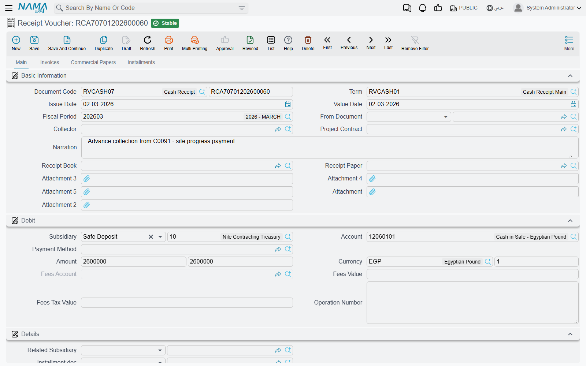
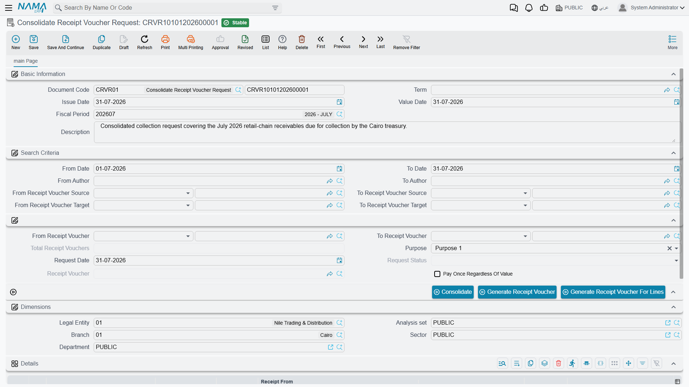

# Receipt & Payment Vouchers

Every bit of money that enters or leaves your safe or bank passes through this family of documents. They're designed as a **three-stage chain** that separates "who requests the payment", "who authorizes it", and "who actually executes it" — an important control structure in organizations that segregate duties.

::: info Required license
Receipt and payment vouchers, orders, and requests are part of the core `accounting` license.
:::

## The chain: Request → Order → Voucher

- **Receipt Request / Payment Request** (`Accounting > Documents > Receipt Request`) — a demand to collect or pay an amount. It's an organizational document that produces **no accounting effect**; it merely records the need.
- **Receipt Order / Payment Order** (`Accounting > Documents > Receipt Order`) — the authorization to execute the receipt or payment. It carries an **order status** that tracks its progress until it becomes a voucher.
- **Receipt Voucher / Payment Voucher** (`Accounting > Documents > Receipt Voucher`) — the moment of truth: cash actually moves, and this is where the **accounting effect** is recorded in the general ledger.

Not every organization needs the full chain; many start straight from the **voucher**. But those who need to separate "request" from "approval" from "disbursement" find the structure ready.

## Anatomy of a receipt voucher

In the header you set the **Document Term**, **Creation Date**, and **Value Date** (which determines the **Period**), the **Collector**, the **Receipt Book** and **Receipt** number, and **Based On** if the voucher was generated from a prior document.

In the **Debit** block you specify the party the amount concerns: the **Subsidiary** (the party type and value: customer/supplier/employee...), the **Account**, the **Amount**, and the **Currency**. The voucher is organized into tabs:

- **Details** — extra lines to distribute the amount across more than one account/subsidiary.
- **Invoices** — match the received amount against specific invoices to settle them or reduce their balance.
- **Financial Papers** — link the receipt to a cheque/financial paper (see [Cheques & financial papers](./cheques-financial-papers.md)).
- **Payments** — payment-method lines (cash, transfer, card...).

The voucher also provides **installments** and **cost allocation** across cost centers.

## The accounting effect

A **receipt** voucher makes the cash/bank side **debit** (money came in) and the party's account **credit** (what they owe us decreased, or what we owe them increased, depending on the case). A **payment** voucher reverses this exactly. The source of each of these accounts — as well as the two tax sides and the fees account — comes from the **document term**; details are in the [Document terms](./support/accounting-document-terms.md) reference.

## Consolidated requests

When many receipt/payment requests for the same party pile up and you want to execute them at once, the **Consolidated Receipt Request** / **Consolidated Payment Request** (`Accounting > Documents > Consolidate Receipt Voucher Request`) gathers them: it bundles several requests into one document from which a single combined voucher is generated, instead of issuing a voucher per request.

## Actions on this screen

The three stages of the chain each carry their own buttons, and knowing them is the difference between typing a voucher line by line and letting the screen fill itself.

**On the voucher (and the order):**

- **Collect Vouchers** — the workhorse. It asks for a **from date**, a **to date**, the **document type** to look for (sales invoice, sales return, purchase invoice, purchase return, credit note, debit note, service-centre invoices and returns, or journal entry) and whether to **ignore the amount in the header**; it then fills the **Invoices** tab with that party's outstanding documents in the range, allocating the voucher's amount across them oldest first. Leave "ignore amount in header" off and it stops once the header amount is used up; tick it and it brings everything it finds.
- **Copy Lines Accounts From Subsidiaries With Term Config** — fills the **account** on each detail line from that line's subsidiary, using the account bag and account type configured on the voucher's term. Use it after entering a batch of lines where only the parties were typed, instead of picking each account by hand.
- **Create FP Lines From Installments** — turns the instalment lines you have selected into **Financial Papers** lines, one per instalment, each carrying that instalment's value and due date ready for the cheque details. The bridge from "these are the instalments being settled" to "these are the cheques settling them".
- **Invoices System Entry Related To Payment/Receipt Documents** — opens the invoices this voucher was matched against. The quickest answer to "which invoice did this receipt actually settle?".

**On the request:**

- **Accept** and **Reject** — set the request's status, which is how a request is authorised or turned down before anyone raises a voucher for it.
- **Generate Receipt Voucher** / **Generate Payment Voucher** — creates the voucher from the request's header: one voucher for the whole requested amount.
- **Generate Receipt Voucher For Lines** / **Generate Payment Voucher For Lines** — the same, but the voucher comes out carrying one line per request line, so the detail survives the hand-over.

**On the consolidated request:**

- **Consolidate** — gathers the individual requests into the details grid. You give it a **from date** and **to date** (both required) and may narrow by author range, source party range, target party range and purpose type; matching requests come in as lines.
- **Generate Payment Voucher** / **Generate Receipt Voucher**, and their **For Lines** variants — produce the single combined voucher from the gathered lines. The **For Lines** variant deliberately allows only one voucher per consolidated request; if a voucher already exists for it, it says so rather than issuing a second.

## Reports and forms

- Receipt/payment voucher, request, and entry statements (`SYSR-ACC015` to `ACC019` and `ACC046`–`ACC047`) are covered in [Account statements & trial balance](./reports-account-statements-and-trial-balance.md).
- Printed forms: receipt voucher `SYSF-ACC002`, payment voucher `SYSF-ACC003`, receipt order `SYSF-ACC010`, payment order `SYSF-ACC022`, receipt request `SYSF-ACC014`, payment request `SYSF-ACC021`, consolidated payment request `SYSF-ACC017`.

## For Support

- **"The request/order has no effect in the accounts"** — that's expected; the request doesn't post, and the accounting effect is recorded at the **voucher**.
- **"The received amount didn't settle the invoice"** — check the **Invoices** tab and that the line is matched to the correct invoice.
- **"The wrong cash/party account in the entry"** — the accounts' source is the **document term**; review the receipt/payment voucher term in the [Document terms](./support/accounting-document-terms.md) reference.
- **"Tax/fees fields don't appear"** — their switches are in the [Accounting configuration](./support/accounting-configuration.md) catalog.
- How a voucher turns into an effect and how to reprocess a stuck voucher are in [How documents are processed into accounting effects](./support/accounting-request-processing.md).
