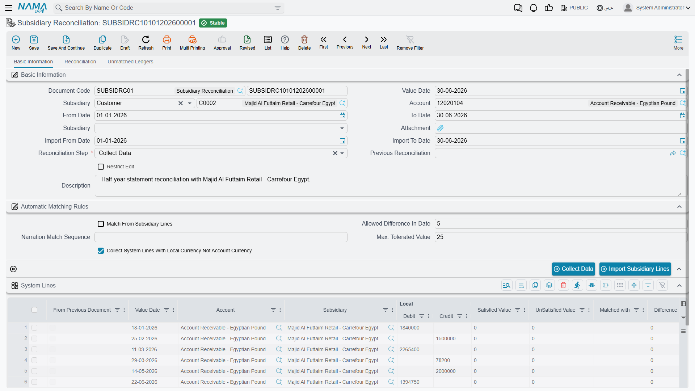

# Subsidiary Reconciliation

A customer or supplier almost always keeps their own account of your dealings — and it rarely lines up with yours to the penny: an invoice they haven't booked, a payment in transit, a credit note one side recorded and the other didn't. **Subsidiary Reconciliation** is the systematic way to lay your books for a party next to their external statement, match what matches, and surface the differences. It's the customer/supplier twin of [bank reconciliation](./bank-reconciliation.md), using the very same workflow.

::: info Required license
Subsidiary reconciliation is part of the core `accounting` license. Its screen is under **Accounting > Reconciliations**.
:::

::: warning Reconciliation doesn't post by itself
The subsidiary reconciliation document produces **no accounting effect**; it's a comparison and difference-detection process only. Any genuine differences it surfaces are corrected with the appropriate document (a credit/debit note, a voucher…) afterwards. "Reconciliation" is comparison, not an entry.
:::

## The three-step workflow

The document moves through a **reconciliation step** in three stages — exactly as bank reconciliation does:

1. **Collect Data** — you specify the **account** and **subsidiary** (the customer/supplier) and an **import date range**, and the system gathers your transactions (**system lines**) and the party's statement (**subsidiary lines**).
2. **Reconciliation** — you match the subsidiary lines against your system lines, within the allowed **value tolerance** and **date-difference tolerance**, optionally driven by a **narration match sequence** or matching from the subsidiary side. What doesn't match lands in the **unmatched system lines** and **unmatched subsidiary lines** grids, where the real discrepancies become visible.
3. **Finished** — the document is closed once matching is complete.

Each document links to the **previous reconciliation** for the same party, so it continues where the last one ended and locks the period behind it — a settled period isn't re-reconciled.

## The buttons that drive the three steps

The toolbar is the same one bank reconciliation uses, and the same rule applies: a button that "does nothing" is almost always being pressed on the wrong step.

**On the Collect Data step:**

- **Collect Data** — step 1 in a button. With the **account**, the **subsidiary** and the import date range set, it pulls your books for that party into the **system lines** grid, continuing from the previous reconciliation for the same party.
- **Import Subsidiary Lines** — loads the party's own statement from a file. Attach the file and name the **subsidiary** first; miss either and the button tells you which. (**Import Bank Lines** sits beside it and behaves identically — it is the bank-reconciliation wording of the same import.)
- **Update System lines of previous document** — refreshes the system lines carried over from the previous reconciliation, so movements that changed since it was closed show their current figures. This step only.

**On the Reconciliation step:**

- **Automatic Match** — runs the matching engine over both grids, honouring the **value tolerance**, the **date-difference tolerance** and the **narration match sequence**, and working from whichever side **match from subsidiary lines** points at. This clears the bulk.
- **Manual Match** — the same engine restricted to the pairings you have set up, for what automatic matching could not resolve.
- **Macth** — applies what you typed into the unmatched grids: fill a row's **matched with** (or **reverse of**) column, press it, and those rows are matched and leave the unmatched lists. The label reads exactly like that on screen.
- **Create Journal Entry** — records a selected unmatched line as a journal entry carrying that line's account, subsidiary, value date and amount, ready for you to complete the other side and save. Note that the reconciliation still posts nothing itself — the entry does.

**Any time:**

- **Calculate Totals** — recomputes the system and subsidiary totals, both unmatched totals and the total difference from the grids as they stand. Press it after a round of matching to see where you are.

## For Support

- **"The reconciliation didn't change the party's balance"** — correct; it doesn't post. Record any true difference with the appropriate document (note/voucher) afterwards.
- **"Lines that clearly match aren't matching"** — review the **value tolerance**, the **date-difference tolerance**, and the **narration match sequence**.
- **"I can't edit an old reconciliation"** — it's chained to a later document that locks it, preserving the reconciliation sequence; this is expected.
- **"Which side is which?"** — **system lines** are your books; **subsidiary lines** are the party's external statement.
