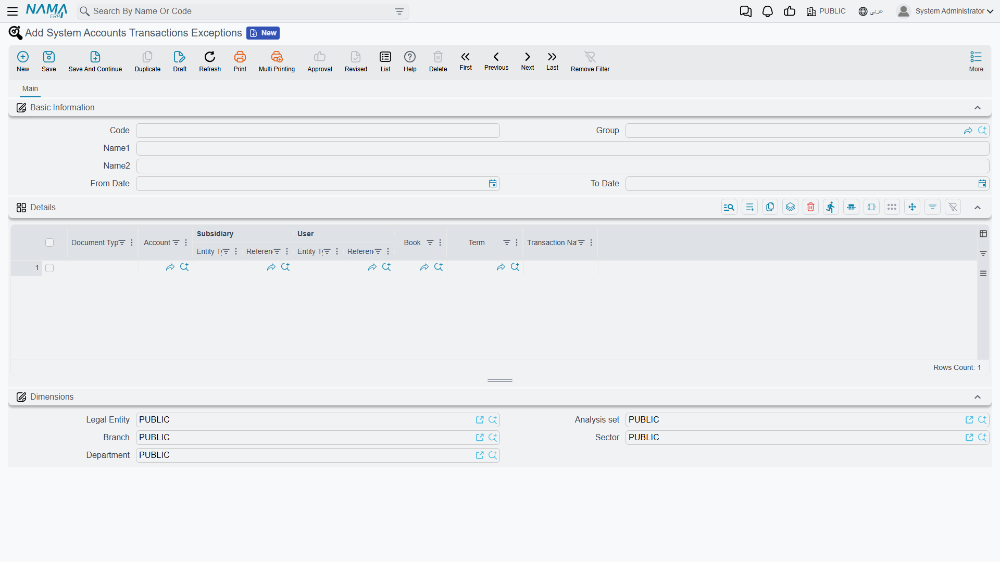

# System Accounts & Transaction Exceptions

Some accounts in the ledger are not meant to be touched by hand. An inventory control account, a retained-earnings account, a tax-payable account produced by the tax engine — these carry balances that the system itself builds out of the documents it processes. The moment a user records a manual journal entry on one of them, the account stops reconciling against the sub-ledger that owns it, and nobody notices until a month-end that doesn't balance.

Nama's answer is the **System Account** flag on the account. Tick it, and the account becomes off-limits to manual accounting documents while the system keeps using it freely. But a blanket lock is rarely what a business actually wants: the accountant closing the year genuinely needs to move the inventory control account, and the chief accountant genuinely needs to correct one wrong balance on one day. That is what the **System Accounts Transactions Exceptions** screen is for — it opens a precise, dated, auditable hole in the lock instead of forcing you to switch the lock off.

::: info Required license
Both the **System Account** flag and the exceptions screen are part of the core `accounting` license.
:::

## What the System Account flag actually blocks

The flag lives on the account itself (**Accounting → Master Files → Account**), in the block of control flags, labelled **System Account**.

When it is on, saving any of these documents with that account on a line is refused with the message *"The Account … Can Be Used Only By The System"*, pointing at the offending line:

- **Journal Entry** (and adjustment entries)
- **Receipt Voucher**
- **Payment Voucher**
- **Bank Transfer**
- **Inter-Company Transfer**

Everything else is untouched. A sales invoice, a stock issue, a depreciation run or a payroll document still records its effect on the account normally — the flag polices what a **user types**, not what the system generates. Two internally-generated documents are deliberately exempt as well: the **closing entry** produced at year-end, and the roll-up journal produced by data purging. Both restate balances the system itself created, so refusing them would mean refusing to restate history.

## The three ways to open a system account

Before the check refuses a line, it looks for three escape routes, in this order. The first one that applies wins, so it pays to know which one is in play when a user tells you "it lets me do it now".

### 1. The module option — open for a whole document type

In the accounting module configuration there is one option per document type: **allow using a system account in receipt voucher / payment voucher / bank transfer / journal entry**. Ticking one switches the check off entirely for that document type — every user, every account, every date. It is the bluntest instrument available and it should normally stay off; see [Accounting Configuration](./support/accounting-configuration.md).

### 2. Allow System Account In Opening — open outside normal periods

Next to the **System Account** flag on the account sits **Allow System Account In Opening**. With it ticked, the account can be used manually in any period whose type is **not** Normal — that is, in **Opening**, **Adjustment**, **Closing** and purge periods. It exists for exactly the case above: loading opening balances and making year-end adjustments on accounts that are otherwise system-owned, without leaving them open during the year. In ordinary (Normal) periods the lock still applies. Period types are set on the fiscal calendar — see [Year-End Closing & Period Control](./year-end-and-period-control.md).

### 3. The exceptions master file — open one account, for one purpose

When neither blanket route fits, you create a **System Accounts Transactions Exception** record. It names the account, the window of dates it applies to, and — as narrowly as you like — the document type, the subsidiary, the user, the book, the term and the side of the entry it applies to.

## The exceptions screen

You reach it at **Accounting → Master Files → System Accounts Transactions Exceptions**. It is a master file, not a document: it has a code, a name, and a validity window, and it takes effect as soon as it is saved.

### The header

| Field | What it does |
|---|---|
| **Code**, **Name1/Name2**, **Group** | Ordinary master-file identity. Give the record a name that says *why* it exists ("Year-end inventory control corrections"), because that name is all a later reviewer has to go on. |
| **From Date** / **To Date** | The window the exception is valid in, compared against the document's **Value Date**. Either can be left empty for an open-ended window: only a **From Date** means "from that day on", only a **To Date** means "up to that day", both empty means "always". |

::: warning The comparison is against the Value Date
The window is matched against the document's **Value Date**, not the date it was entered. A document with no value date matches no exception at all.
:::

The **Dimensions** block (Legal Entity, Branch, Sector, Department, Analysis Set) is the standard master-file block, but be aware that **it does not narrow the exception**. The engine reads every saved exception record regardless of dimensions and matches only on what is in the details grid. If you want an exception limited to one company's books, express that through the **Book** or **Term** column, not through the Legal Entity on the header.

### The details grid

Each line is one permission. A document line is allowed through if **at least one** detail line matches it — and a detail line matches only when **every** column you filled in matches. **An empty column means "any"**, so the fewer columns you fill, the wider the hole you have opened.

| Column | Effect when filled | Effect when empty |
|---|---|---|
| **Document Type** | The exception applies only to that type: Journal Entry, Receipt Voucher, Payment Voucher or Bank Transfer. | Any of them (this is also how you cover an Inter-Company Transfer, which is checked but is not offered in the list). |
| **Account** | The account being unlocked. **This column is required** — an exception is always about one specific account. | — |
| **Subsidiary** | Only lines carrying that exact party (customer, supplier, employee, bank account, fixed asset, item section, resource, partner, warehouse). | Any subsidiary, including lines with none. |
| **User** | Only that user. You may instead pick a **Security Profile**, and then every user carrying that profile is covered — which is the practical way to say "the chief accountants". | Any user. |
| **Book** | Only documents recorded in that book. | Any book. |
| **Term** | Only documents using that document term. | Any term. |
| **Transaction Nature** | **Debit** allows the account only on the debit side, **Credit** only on the credit side, **Debit and Credit** allows both. | Both sides. |

::: tip Subsidiary and User are picked in two steps
Both columns are open-ended references, so each shows up as a pair: first choose the **entity type** (Customer, Supplier, Warehouse… / User, Security Profile), then pick the record itself in the column beside it. Setting the type alone narrows nothing — the exception matches on the chosen record.
:::

::: tip Book and Term follow the Document Type
Pick the **Document Type** on the line first. The **Book** and **Term** searchers then only offer books and terms belonging to that type, which saves you from attaching a receipt-voucher book to a journal-entry exception.
:::

### How Transaction Nature reads the side

For a **journal entry**, the side is read from the line itself: a line with a debit amount is a debit, a line with a credit amount is a credit. A line with neither has no side, and a **Debit**-only or **Credit**-only exception will not match it — such a line needs **Debit and Credit** (or an empty column).

For a **receipt voucher, payment voucher or bank transfer**, the side is not per line — it comes from what the document is. Payment-voucher detail lines are on the debit side, receipt-voucher detail lines on the credit side. So a **Debit** exception on a receipt voucher never matches, however the individual lines look.

## A worked example

The finance team needs to correct one wrong balance on the **Inventory Control** account, which is a system account. Only the chief accountant should be able to do it, only through the manual journal book used for corrections, only in March, and only as a credit.

One exception record does all of that:

- Name it *"March inventory control correction"*.
- **From Date** 01-03, **To Date** 31-03.
- One detail line: **Document Type** = Journal Entry, **Account** = Inventory Control, **User** = the chief accountant's security profile, **Book** = the corrections journal book, **Transaction Nature** = Credit.

Anyone else, any other book, any other month, or a debit on that account is still refused. And when April arrives the hole closes by itself — nobody has to remember to untick anything, which is the whole point of preferring this screen over the module option.

## For Support

- **"The Account … Can Be Used Only By The System" when saving a journal entry or voucher** — the account has **System Account** ticked. Decide which of the three routes fits before changing anything: an exception record is almost always the right answer, and the module option almost never is.
- **"It used to refuse it and now it doesn't"** — check, in order: the module option for that document type, **Allow System Account In Opening** together with the period's type, and finally the exceptions list. An exception whose window has just opened is the usual culprit.
- **"I created the exception but it still refuses the entry"** — work through the columns one at a time. The most common causes are the document's **Value Date** falling outside the window, a **Transaction Nature** that contradicts the side of the entry (especially **Debit** on a receipt voucher), a **Book** or **Term** that belongs to a different document type, and a **User** column holding a user where a security profile was meant.
- **"The exception works for the wrong company"** — the header dimensions do not filter anything. Add a **Book** or **Term** column to the detail line instead.
- **"I need the account open only while loading opening balances"** — that is **Allow System Account In Opening** on the account, not an exception record.
- **The exception grid rejects the line without an account** — the **Account** column is required; there is no "all accounts" exception by design.
