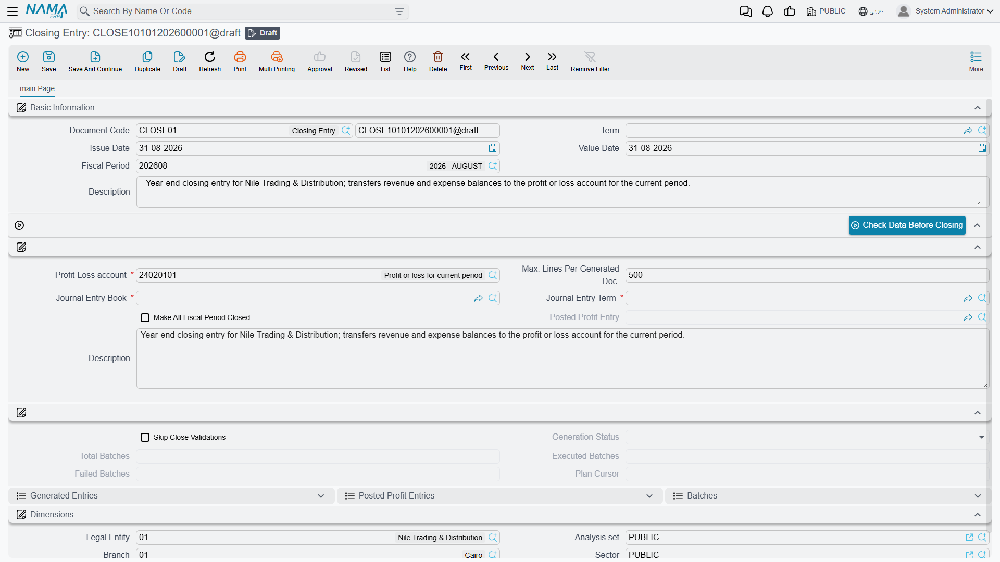
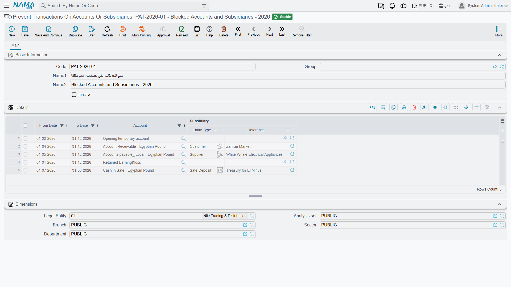

# Year-End Closing & Period Control

At the end of each fiscal year comes the moment of closing: carrying the year's profit/loss into equity, and closing the result accounts in preparation for a new year. And throughout the year you need tools to control who posts, where, and when. This page gathers those tools: the **Closing Entry**, **year and period status control**, **Prevent Accounting Transactions**, the **Ledger Revise Document**, and **purging transactions**.

::: info Required license
These tools are part of the core `accounting` license.
:::

## The Closing Entry

The **Closing Entry** (`Accounting > Documents > Closing Entry`) is the document that closes the year. Its idea: it reads the balances of the **income-statement** accounts (revenue and expenses) and generates a balancing **journal entry** that moves the net profit or loss into the **Profit-Loss account** you specify, so the result accounts are zeroed and only the balance sheet carries over to the next year.

Its key fields:

- **Profit-Loss Account** — the account that receives the year's net result (mandatory).
- **Entry Term** and **Entry Book** — the term and book the generated entry is recorded with.
- **Max Lines Per Generated Document** — splits the generated entry into several documents if it exceeds this limit (useful with many accounts).
- **Close All Fiscal Year Periods** — automatically closes all the year's periods after closing.
- The **Check Data Before Closing** button — the readiness check you run before executing the close. It asks for an optional **from period**: leave it empty to check the closing entry's own period, or name an earlier period to cover a whole range. That period must not start after the closing entry's period and must belong to the same calendar — give it one that breaks either rule and it says so instead of running. The closing entry must be saved before the button will work.

::: warning Before closing
- The period the closing entry falls in must be of type **Adjustment** or **Closing** (see [Concepts & setup](./accounting-concepts-and-setup.md)).
- The system blocks closing if there are transactions whose processing hasn't completed (a behavior governed by a module option); process the stuck transactions first, as in [How documents are processed into accounting effects](./support/accounting-request-processing.md).
:::

### Correcting a closing entry, or closing again

A close is not a one-way door, and the way back is never to hunt down the journal entries it produced: the closing entry owns them, so whatever you need to do, you do it to the closing entry itself.

- **Save it again.** This is the correction for the closing entry's own fields. Saving a committed closing entry redoes the entire close from the balances as they stand at that moment: the pre-close checks run again, the journal entries of the previous run are deleted, and a fresh set is generated in their place. Wrong **Profit-Loss Account**, wrong **Entry Book**, wrong **Max Lines Per Generated Document** — change the field, save, and the entries are rebuilt. What it will not do is pick up adjustments, because you cannot enter those while the closing entry stands; see below.
- **Delete it** and the entries it generated go with it — the year-end entries and the profit-posting entries both — and the closing entry itself is gone from the database. This is what you do when the close has to be undone: either because it should never have existed, or because the year has to be reopened for corrections.
- **Cancel it** with a [Document Cancel Document](../../platform/document-cancel-document.md) and the generated entries are deleted exactly as on a delete, but the closing entry stays in the system with the status **Cancelled**, keeping its number and its place in the list. It lifts the date lock just as a delete does, and it leaves an audit trail of the close having happened — at the cost of a cancelled document that can no longer be deleted.

::: tip Deleting is refused while it is still generating
A large close runs as background batches, and the document refuses to be deleted until they finish: *"Closing entry generation is still in progress, please wait until it completes before deleting this document"* (editing it while the batches run is refused with the same wording, ending "before editing this document"). Wait for the generation to finish, then delete. This message has no Arabic text in the product, so it appears in English on Arabic screens too.
:::

#### Adjustments that arrive after the close

A committed closing entry does not only close its own period — it draws a line across the whole legal entity at its **value date**. From then on, **any** document dated on or before that date is refused when you try to save it, in every module, not only in accounting:

> You can not edit the document {0} at date {1} because there is a closing entry on {2}

Moving a document's value date across the line is refused for the same reason, with its own message — you cannot take a document dated before the closing entry and push it after it:

> You can not change the document {0} value date from {1} to {2} because there is a closing entry on {3}

So "post the adjustment and then re-run the close" is not a sequence the system will allow. The order has to be:

1. **Delete the closing entry** (or cancel it), which lifts the line.
2. **Enter the adjustments** now that their dates are free again.
3. **Create the closing entry again** and commit it, which closes the year on the corrected figures.

::: danger Do not reach for the option that lifts the lock
There is a global-config switch — **Do Not Prevent Modifying Documents Before Last Closing Entry** ([Documents tab](../../platform/global-config/global-config-documents.md)) — that turns this check off, and there is a fiscal-year flag, **Allow Cost, Quantity, and Ledger Processing For Documents Before Closing Entry**, that lets business requests dated before the close carry on processing. Both exist for recovery situations and neither belongs in normal year-end work: with them on, a document can change a period that has already been closed, audited and reported, and the closing entry's own figures are left describing balances that no longer exist. Delete the close, make the corrections in the open year, close again.
:::

::: info The same message with no closing entry in sight
The line is drawn by the latest **committed** closing entry *or* the latest committed **Freeze Processing Document** for that legal entity, whichever is later. If the message names a date nobody can account for, look for a freeze document as well as for a closing entry.
:::

::: warning Deleting the closing entry does not re-open the periods
If **Close All Fiscal Year Periods** was ticked, the close set every other period of the year to **Closed**, and deleting the closing entry does not undo that. So step 2 above can still be refused — this time because the period itself is closed, a different message from the closing-entry one. Re-open the period you need from the **Fiscal Year** screen's **Open Periods** button before entering the adjustments, and close it again afterwards if you want it locked.
:::

## Year and period status control

Opening and closing periods in bulk is done from the **Fiscal Year** screen via the **Open Periods**, **Close Periods**, and **Create Next Fiscal Year** buttons (covered in [Concepts & setup](./accounting-concepts-and-setup.md)). A **closed** period rejects any new transaction dated within it, and is the first line of defense in periodic-close control: you close the month after its figures are approved, freezing its past.

## Prevent Accounting Transactions

Sometimes you need a lock **finer** than closing a whole period: blocking transactions on a specific account, on a specific party's subsidiary, or within a date range. That's the role of **Prevent Transactions On Accounts Or Subsidiaries** (`Accounting > Master Files > Prevent Transactions On Accounts Or Subsidiaries`).

In the document's lines you specify, per rule: the **Account**, the **Subsidiary** (optional), and a **From Date** and **To Date**. Any posting attempt falling within these constraints is rejected. An **Inactive** flag lets you disable the rule temporarily without deleting it.

## Ledger Revise Document

The **Ledger Revise Document** (`Accounting > Documents > Ledger Revise Document`) is an internal-review tool: you set the **Auditor** and **Accountant** and a date range (**From/To**), and record review remarks on the transactions in that period in its lines. It's a control record that produces no accounting effect; it documents that the books were reviewed and by whom.

## Purging transactions

As years of transactions accumulate, you may need to **purge/archive** the old ones to lighten the database. The **Purge Journal** document (`Administration > Purge Documents > Purge Journal`) handles this. It's a sensitive administrative operation carried out on periods of type **Purge Period**, and is best performed under technical supervision and after taking a backup.

## Printed forms

- Closing Entry: `SYSF-ACC020`.
- Ledger Revise Document: `SYSF-ACC016`.
- Prevent Accounting Transactions: `SYSF-ACC018`.

## For Support

- **"Closing won't complete / refuses to execute"** — use the **Check Data Before Closing** button; the cause is usually transactions not yet processed, or the entry's period not being Adjustment/Closing type.
- **"The closing entry was created wrong — do we delete it and start over?"** — no. Fix the wrong fields and save it again; the previous entries are deleted and regenerated. Delete or cancel it only when the close should not exist at all. See [Correcting a closing entry, or closing again](#Correcting-a-closing-entry-or-closing-again).
- **"Adjustments came in after the year was closed"** — you cannot enter them while the closing entry stands; every document dated on or before its value date is refused. Delete the closing entry, re-open the period if **Close All Fiscal Year Periods** closed it, enter the adjustments, then create the closing entry again. Do not switch on **Do Not Prevent Modifying Documents Before Last Closing Entry** to get around it.
- **"You can not edit the document {0} at date {1} because there is a closing entry on {2}"** — exactly that lock, and it applies to every module, not only accounting. If no closing entry explains the date, look for a committed **Freeze Processing Document**; it sets the same line.
- **"The closing entry cannot be deleted"** — either it is still generating (a large close runs in batches — wait for it to finish), or it has already been cancelled, and a cancelled document cannot be deleted.
- **"A transaction is rejected even though the period is open"** — check for an active **Prevent Accounting Transactions** document covering the account/subsidiary/date.
- **"I want to suspend a prevention temporarily without deleting it"** — enable the **Inactive** flag on the prevention document.
- **"Where is the tolerance for closing with incomplete transactions set?"** — in the [Accounting configuration](./support/accounting-configuration.md) catalog.
- Details of the period and currency cycle are in the **Fiscal periods & currency** reference.

## Messages you may see

| Message | Why | What to do |
|---|---|---|
| *There are unprocessed or failed transactions, please fix them first (you can use bizRequestView screen to find them)* — «يوجد طلبات نظامية فشلت معالجتها او لم تعالج بعد. يرجي اصلاح هذه الطلبات اولا (يمكنك معرفتها من خلال شاشة bizRequestView(» | The **Closing Entry** found ledger transaction requests for this company that are not in **Processed** status. Closing on top of them would close the wrong balances. | Open the **Business Requests** list view, filter on the failed/unprocessed statuses, fix the cause and reprocess, then save the closing entry again. |
| *There is ledger trans for {0} - {1} has delete request or it is generated for cancelled document* — «يوجد قيد محاسبي للمستند {0} - {1} له طلب حذف او تم إنشاؤة لستند تم إلغاؤة فيما بعد» | A ledger entry inside the year being closed belongs to a document that was later cancelled, or that has a pending delete request. | Clear the pending delete requests and the cancelled documents' leftover entries before closing; the document type and code are in the message. |
| *There is QtyTrans for {0} - {1} has delete request or it is generated for cancelled document* — «يوجد قيد كميات للمستند {0} - {1} له طلب حذف او تم إنشاؤة لستند تم إلغاؤة فيما بعد» | The same condition on the quantity (inventory) side: a quantity entry in the period belongs to a cancelled document or has a delete request waiting. | Same remedy — resolve the delete request or the cancelled document first. |
| *The currency of account {0} has been changed. You need to regenerate accounting effects (or recommit) the document {1}* — «تم تغيير عملة الحساب {0}. تحتاج إلى إعادة إنشاء التأثيرات المحاسبية (أو إعادة حفظ) المستند {1}» | An account's currency was changed after entries had already been written against it, so the stored local and foreign amounts no longer agree. | Reprocess (recommit) the document named so its effect is rebuilt with the account's current currency, then close. |
| *The account {0} foreign balance is {1} and local balance is {2} , you need to make and exchange rate update document for this account* — «رصيد الحساب {0} بالعملة الأجنبية هو {1} والرصيد المحلي هو {2} ، تحتاج إلى إنشاء مستند تغيير سعر صرف لهذا الحساب.» | A foreign-currency account carries a foreign balance and a local balance that no longer correspond at any single rate. | Issue an **Exchange Rate Update** document for that account, then re-run the closing entry. |
| *The account {0} foreign amount is {1} - {2} and the local amount is {3} - {4}. Please use {5} document to fix this account* — «الحساب {0} العملة الاجنبية {1} - {2} والعملة المحلية {3} - {4}. الرجاء استخدام مستند {5} لحل مشكلة الحساب» | The stronger form of the same problem: the account's foreign side and local side sit on opposite sides — one debit, one credit — which no rate can reconcile. | Use the document type the message names (**Exchange Rate Update**) on that account before closing. |
| *The account {0} has invalid subsidiary type* — «الحساب {0} لديه نوع ذمة غير صحيح» | Entries exist on an account whose subsidiary type does not match the types the account allows — usually a detail account carrying a subsidiary, or a subsidiary type removed from the account after the entries were written. | Restore the subsidiary type on the account, or correct the entries, before closing. |
| *There is no fiscal year defined for posted profit date {0}, legal entity {1}* — «لا توجد سنة مالية معرفة للتاريخ الفعلي {0} لسند القيد، والشركة {1}» | The closing entry posts the carried profit on the day after the period ends, and no fiscal period exists for that date in this legal entity. | Create the next fiscal year (and its periods) for the company, then run the closing entry. |
| *You must at least provide account or subsidiary* — «يجب علي الأقل إدخال الحساب او الذمة» | A **Prevent Accounting Transactions** detail line names neither an account nor a subsidiary, so it would block everything. | Fill the **Account** column, the **Subsidiary** column, or both on that line. |
| *The Account {0} is detail account can not have subsidiary* — «الحساب {0} حساب فرعي لايمكن ان يكون له ذمة» | A prevention line pairs a **detail** account with a subsidiary; only subsidiary-type accounts take a party. | Remove the subsidiary from the line, or point the line at the subsidiary account you meant. |
