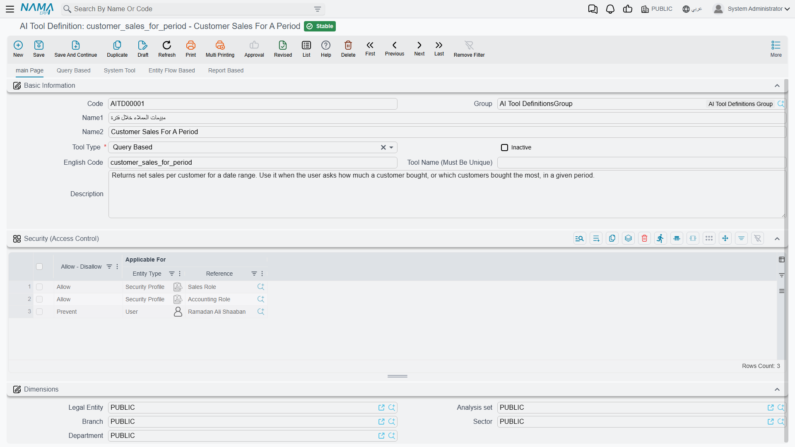
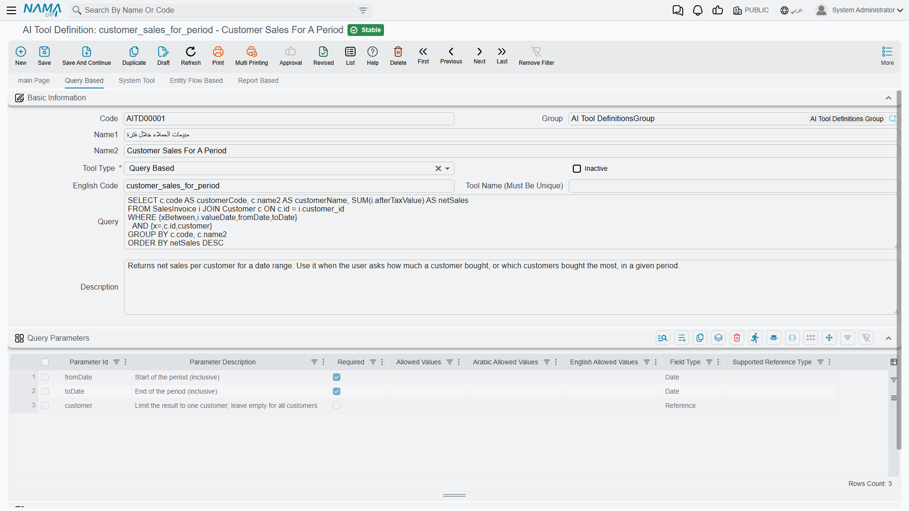
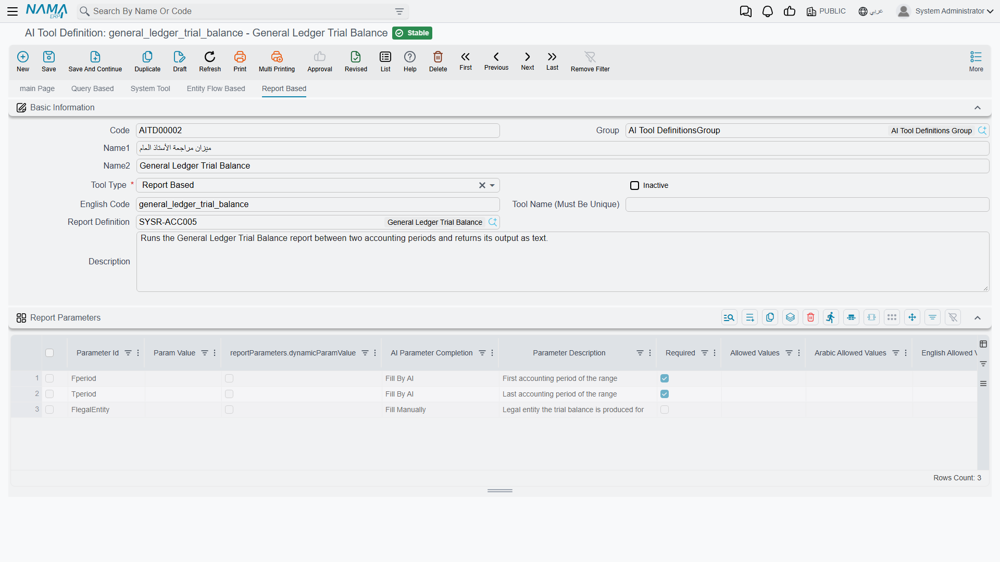
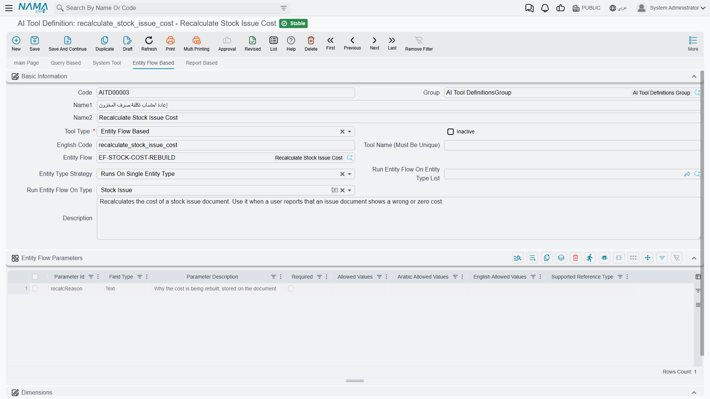
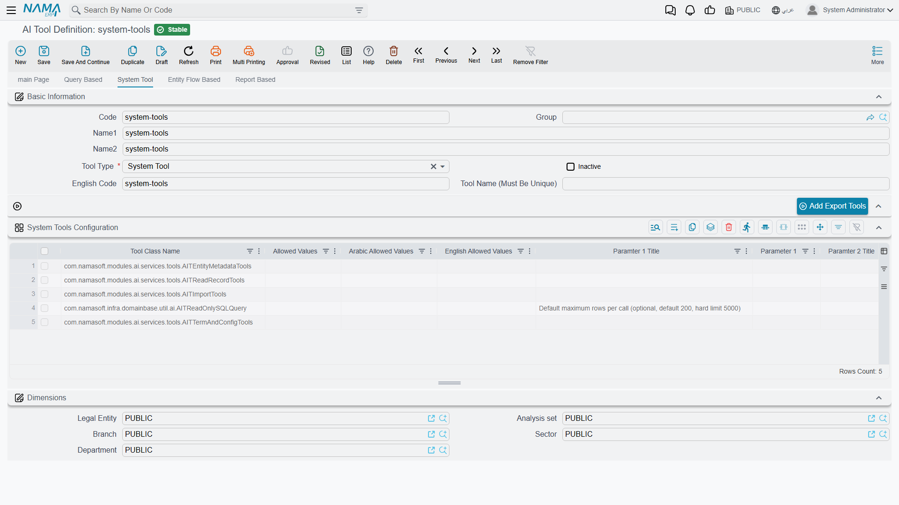

# AI Tool Definitions

When an AI assistant talks to Nama ERP — whether it is the assistant built into the system or an external client connected through the [MCP server](./ai-mcp-server.md) — it can do nothing on its own. Every capability the assistant has is a **tool** that a system administrator defined beforehand: a query that answers a specific question, a report run with parameters, an entity flow executed on a document, or one of Nama's ready-made system tools.

The **AI Tool Definition** screen in the AI module is where these tools are defined. Each record on the screen becomes a tool (or a set of tools) the language model can call, along with a description that tells it when and how to use it.

::: info Required License
This screen requires the AI module to be installed and licensed.
:::

## Basic Data

The screen header identifies the tool and controls its general behavior:

| Field | Role |
|---|---|
| **Tool Type** | The kind of tool: `Query Based`, `Report Based`, `Entity Flow Based`, or `System Tool` — this decides which page of the screen you will use |
| **Alt Code** | The name the tool is advertised under to the language model for the first three types (query/report/entity flow) |
| **Tool Name (Must Be Unique)** | For System Tools, used as the prefix of the generated tool names — see "Tool Naming" below |
| **Description** | The tool description. This is **what the language model reads to decide when and how to call the tool** — the more precise the description, the better the model uses the tool |
| **In Active** | Disables the tool without deleting it — an inactive tool is never shown to the model |

::: tip When does a tool appear to the assistant?
A tool is only offered to the language model when it is **committed** and not inactive. Later edits or deletions are picked up automatically — the tool list is rebuilt on the next connection, no restart needed.
:::

### Tool Naming

- **Query, report, and entity-flow tools** are advertised under their **Alt Code** as-is.
- **System Tools**: each line in the tools grid may generate one or more tools, and each tool name is composed of a prefix plus the internal tool name. The prefix is the first non-empty value of **Tool Name**, then **Alt Code**, then the record **code**, followed by an underscore. For example, a record whose code is `import` containing the `AITReadRecordTools` tool generates two tools, `import_FindRecords` and `import_GetRecord`.

## Security (Access Control)

The **Security (Access Control)** grid decides who may execute the tool. Each line holds:

- **Applicable For**: a user, a security profile, or a user group.
- **Allow / Prevent**.

When the tool is executed, the system looks for the first line matching the current user in this order: the **user's** own line first, then the user's **security profile** line, then the **group** line. The first matching line decides. If the grid is empty (or no line matches), the tool is available to everyone.

::: warning Access is checked at execution time
The advertised tool list is the same for all users, but **execution** is what gets the access check: if a prevented user tries to run a tool, the call is rejected with a clear message. Record-level security and dimensions (legal entity, branch, ...) also still apply to everything the tool reads or writes, because everything goes through the system's standard service gates.
:::

## Type 1: Query Based

The simplest and most common tool type: a SQL query written by the administrator, which the language model can run with parameters it chooses.

On the **Query Based** page:

1. Write the query in the **Query** field, referencing each parameter with the `{paramName}` placeholder syntax (such as `{fromDate}` and `{toDate}`).
2. Define each parameter in the **Query Parameters** grid.
3. In **Description**, explain when this tool should be used and what it returns.

At execution time the query runs with the parameter values the model sent, and the result is returned to it as JSON (column names and row values).

::: tip Optional and conditional parameters
Query parameters go through the same engine as field-map SQL, so the full [Advanced SQL Parameter Syntax](../../entity-flows/core/ai-generated-field-maps-documentation.md#Advanced-SQL-Parameter-Syntax) is available — not just the plain `{fromDate}` placeholder. This matters because an AI tool usually exposes many *optional* filters, and these helpers let a single query handle them whether or not the model sends a value:

- `{x>=,valueDate,fromDate}` — a comparison that turns into `1 = 1` (no-op) when the model omits `fromDate`, instead of an `({fromDate} IS NULL OR ...)` wrapper around every filter.
- `{xBetween,column,fromDate,toDate}` — a range where either bound may be missing.
- `{xIN,column,codes}` — an IN clause that gracefully tolerates an empty list.
- `{!paramName}` — direct literal substitution (for dynamic table/column names; never for untrusted input).
:::

### The Parameters Grid

Each line in the parameters grid defines one parameter:

| Column | Role |
|---|---|
| **Param Id** | The parameter identifier — must match the name used in the query, and cannot be repeated |
| **Parameter Description** | The description the model reads to know what to send |
| **Required** | Whether the parameter is mandatory |
| **Field Type** | The value type: `Text`, `Number`, `Date`, or `Reference` |
| **Allowed Values** / **Allowed Values Ar** / **Allowed Values En** | The list of allowed values (if any) with their translations — shown to the model inside the parameter description so it sticks to them |
| **Supported Reference Type** | For `Reference` parameters: the entity type the parameter points to (such as `Customer`) |

Notes on the types:

- **Date**: the model sends dates in the `yyyy-MM-dd HH:mm` format (this format is automatically appended to the parameter description).
- **Reference**: the model can send a record code or id, which is looked up directly. If it sends free text instead (such as an approximate customer name) and the entity type is indexed in the records-embedding service, the system performs a semantic search and returns the closest records — and when several match, the model is asked to pick a specific one.

## Type 2: Report Based

Turns any existing report definition in the system into a tool the model can run and read the output of.

On the **Report Based** page:

1. Pick the report in the **Report Definition** field.
2. Define the report parameters in the **Report Parameters** grid — one line per report parameter, with **Param Id** matching the report's parameter id.
3. For each parameter, choose how it is filled in the **AI Parameter Completion** column:
   - **Fill By AI**: the language model chooses the value itself based on the user's request (with the parameter description and allowed values, as in query tools).
   - **Fill Manually**: the value is fixed in the definition itself — a literal value, a reference, a date/time, or a dynamic value, in the same style as report parameters in task schedules — and is never shown to the model.

At execution time the report runs with the collected parameters, and its output is returned to the model **as text** for it to read and build its answer on.

::: warning Picking the report fills the grid once — and freezes the drop-down labels
Choosing a report in **Report Definition** rebuilds the **Report Parameters** grid from the report's own design: one line per parameter, each with its type, whether it is required, and — for a parameter that offers a drop-down — its values in **Allowed Values** together with their Arabic and English labels in **Arabic Allowed Values** and **English Allowed Values**.

Those labels are copied as they read at that moment and are never looked up again. They are what the model is told the parameter accepts, so if someone later renames a value through the Translation OverRider, the report's own prompt shows the new label while the tool keeps offering the model the old one, with nothing to warn you. The same applies to a report whose parameters change after the tool was built: the grid does not follow.

The cure for both is to pick the report in **Report Definition** again, which rebuilds the grid from scratch. Because it rebuilds *every* line, anything you typed into the grid yourself — **Fill Manually** values, parameter descriptions — is lost and has to be entered again, so note those down before you re-pick.
:::

## Type 3: Entity Flow Based

Lets the model **perform an action** in the system through a predefined entity flow — here the AI does not just read, it makes changes.

On the **Entity Flow Based** page:

1. Pick the flow in the **Entity Flow** field.
2. Choose the **Entity Type Strategy** — which record the flow runs on:

| Strategy | Meaning |
|---|---|
| **Runs On Single Entity Type** | Runs on one specific entity type set in **Run Entity Flow On Type** |
| **Runs On Entity Type List** | Runs on one of the types listed in **Run Entity Flow On Entity Type List**; the model picks which |
| **Runs On Any Document Type** | Runs on any document type |
| **Runs On Any Master File Type** | Runs on any master file type |
| **Runs On Any Type** | Runs on any entity type |
| **Does Not Need A Record** | Needs no record — the flow executes directly |

3. Define any extra parameters the flow needs in the **Entity Flow Parameters** grid (same columns as query parameters).

When the strategy requires a record, the system automatically adds two parameters for the model: the target entity type (unless fixed in the definition) and the record code or id. At execution time the record is fetched, the parameter values are placed into the record's map, and the flow runs — any flow failure is returned to the model as an error message.

## Type 4: System Tools

Ready-made tools built into Nama, added by the administrator as lines in the **System Tools Configuration** grid: each line holds a **Tool Class Name** plus up to five text parameters (Parameter 1–5) that configure the tool when needed, and description/title fields that are filled automatically.

The **Tool Class Name** field has a suggestion list showing **every system tool available in the system** — you pick one by name.

::: warning A class is not a tool
What you pick in **Tool Class Name** is a *class*, and most classes generate several tools: pick `AITReadRecordTools` and the model ends up with two tools, `<prefix>FindRecords` and `<prefix>GetRecord`. The suggestion list also offers the class under its full name — `com.namasoft.modules.ai.services.tools.AITReadRecordTools` — so when you are looking for a particular tool, search the **Generated tool(s)** column of the tables below and add the class in its row; typing the tool's own name into the field finds nothing.
:::

### The buttons above the grid

Picking classes one by one from the suggestion list is slow, and a tool group is rarely useful half-added — so the page carries a row of buttons, each adding a whole group in one press:

| Button | What it adds | Who it is for |
|---|---|---|
| **Add Export Tools** | 3 classes, 9 tools — understand an entity, search and read records, import records | anyone connecting an external MCP client to read and write data |
| **Add Report Tools** | 2 classes, 4 tools — read a report's SQL, run it, correct it | administrators and support staff chasing wrong figures in a report |
| **Add Term and Config Tools** | 2 classes, 4 tools — read and change document terms and configuration entries | administrators who configure documents |
| **Add Discussion Tools** | 2 classes, 2 tools — add a discussion to a record, list a record's discussions | an in-app assistant that comments on records |

A button adds only the lines that are not on the definition yet and fills each line's description automatically, so pressing two buttons adds up and pressing the same one twice changes nothing. Delete any line you do not want afterwards — that is how a definition is kept read-only.

#### Record export/import tools (Add Export Tools)

The most-used group with external MCP clients: three classes generating nine tools between them, which let a client read system data and import new records as JSON.

| Tool Class Name | Generated tool(s) | Purpose |
|---|---|---|
| `AITEntityMetadataTools` | `<prefix>ResolveEntityType`, `<prefix>DescribeFields`, `<prefix>GetEnumValues`, `<prefix>GetEntitySchema` and `<prefix>SearchByTranslation` | Everything a client needs to understand an entity before it queries it: resolve an Arabic or English term to an entity type, list the field ids that can be used as search criteria, list the allowed values of enum fields, return the physical table and column names behind the entity, and resolve a term to entity types, fields and enum values at once |
| `AITReadRecordTools` | `<prefix>FindRecords` and `<prefix>GetRecord` | Search records by entity type and criteria, and read a single record as JSON |
| `AITImportTools` | `<prefix>GetImportSchema` and `<prefix>ImportRecord` | Get the JSON import schema of an entity type, and import one or more records into the system |

The details of these tools — their parameters and usage examples — are documented on the [Nama ERP MCP Server](./ai-mcp-server.md) page.

#### Report tools (Add Report Tools)

Almost every question about a report — why is this total wrong, why is this row missing, which parameter drives that filter — is a question about its query and its parameters, and that is a few hundred bytes out of a report file of 70–120 KB. These two classes let the assistant read exactly that much, run the report to see the effect, and correct the query when the query is what is wrong.

| Tool Class Name | Generated tool(s) | Purpose |
|---|---|---|
| `AITReportReadTools` | `<prefix>GetReportQuery` and `<prefix>RunReport` | Return a report's parameters and the SQL of its own query, of each of its sub-datasets and of each of its subreports; and run the report with given parameters and return its output |
| `AITUpdateReportTools` | `<prefix>UpdateReportQuery` and `<prefix>UpdateReportContent` | Replace the SQL of one dataset without touching the rest of the report file, or replace a whole report file |

A report runs with the permissions of the user the tool acts for, and an unknown parameter id is refused rather than ignored. Dates in these parameters are day-first (`31-01-2026`), unlike the record tools.

::: tip Read the numbers, don't look at a picture
`RunReport` returns **TXT** by default, the format whose figures can be checked line by line against the read-only SQL tool. **HTML** returns the rendered table. Both come back inside the answer itself, cut off at the length the call asks for. The binary formats — PDF, XLSX, DOCX, RTF, ODT, ODS, PPTX, XLS — are stored on the server instead and answered with a **single-use link that expires after thirty minutes**, for a person to open: the link serves the file once and deletes it. Set `ai-file-download-base-url` in `nama.properties` if those links should carry the server's public address rather than a path.
:::

::: warning A report is never saved unless it still compiles
`UpdateReportQuery` and `UpdateReportContent` compile the report before sending it, and refuse to save anything that does not compile — the answer comes back with the compiler's own complaint and the stored report untouched, so a bad query costs a failed call rather than a broken report. The file is rewritten by JasperReports itself: the design survives exactly, but XML comments (the Jaspersoft Studio banner among them) and the original indentation do not.
:::

#### Term and configuration tools (Add Term and Config Tools)

Document terms and configuration entries are settings rather than records, so the record tools above cannot reach them at all — these two classes are the only way an assistant reads or changes them.

| Tool Class Name | Generated tool(s) | Purpose |
|---|---|---|
| `AITTermAndConfigReadTools` | `<prefix>ListTermAndConfigTargets`, `<prefix>GetTermOrConfigSchema` and `<prefix>ReadTermOrConfig` | List the document terms and configuration entries that can be configured, describe one target's settings the way its screen groups them, and read the values it currently holds |
| `AITTermAndConfigWriteTools` | `<prefix>UpdateTermOrConfig` | Change the settings of one document term or configuration entry |

#### Discussion tools (Add Discussion Tools)

| Tool Class Name | Generated tool(s) | Purpose |
|---|---|---|
| `AITAddDiscussionToRecord` | `<prefix>AddDiscussionToRecord` | Add a discussion (comment) to any record |
| `AITListDiscussionsOfARecord` | `<prefix>ListDiscussionsForARecord` | List the discussions of a given record |

### Other system tools

The remaining ready-made tools are single classes with no group of their own; add them by picking the class name from the **Tool Class Name** suggestion list:

| Tool Class Name | Generated tool(s) | Purpose |
|---|---|---|
| `AITCountRecordsTools` | `<prefix>countEntities` and `<prefix>countEntitiesCreatedWithinDateRange` | Count records of an entity type — in total, or between two dates |
| `AINamaERPDocsTool` | `<prefix>erpDocs` | Search the Nama ERP documentation and return the passages closest to the question |
| `AITReadOnlySQLQuery` | `<prefix>runReadOnlySqlQuery` | Run a single read-only SQL `SELECT` against the database and return the rows — see the warning below |

::: tip Building a read-only assistant
Reading and writing are deliberately kept in separate classes so you can leave the writing ones out: `AITTermAndConfigReadTools` without `AITTermAndConfigWriteTools` lets the assistant explain how a document term is configured while having no way to change it, and the same holds for `AITReportReadTools` without `AITUpdateReportTools`, and for `AITEntityMetadataTools` and `AITReadRecordTools` without `AITImportTools`. Each group button adds both halves, so on a read-only definition press the button and then delete the writing line.
:::

::: info Module-specific system tools
Some modules add their own system tools that appear in the same list. For example, the HR module provides tools for an employee's vacation balance (for the current employee or any employee). The available set grows with the modules you have installed and licensed.
:::

::: warning The ERP docs tool and semantic search
`AINamaERPDocsTool` relies on a semantic index of the documentation; it does not work until the vector store is configured in [AI Module Configuration](./ai-configuration.md#Semantic-Search-and-Embedding-Setup).
:::

::: danger The read-only SQL tool ignores record permissions
Everything else on this screen runs through the standard gates, so a tool never shows a user more than the screens would. `AITReadOnlySQLQuery` is the exception: it reads the database directly and therefore sees every legal entity, branch, salary and price regardless of what its user may open. Only a single `SELECT` is accepted and the statement runs in a transaction that is always rolled back, so it can never change anything — but restrict it to administrators through the **Security (Access Control)** grid. Its first parameter column sets the default maximum rows per call (200 by default, 5000 at most). See [Getting Better Support with an AI Coding Agent](./ai-assisted-support.md) for how support teams use it.
:::

::: info The statement is checked by JSqlParser 5.0 first
Before it runs, the statement is validated with **JSqlParser 5.0**, which is stricter than SQL Server itself: anything JSqlParser cannot parse is rejected even if the server would run it. As an example, JSqlParser rejects `FOR XML PATH(''), TYPE).value(...)` and `ORDER BY` inside a `FOR XML PATH` subquery, so use `STRING_AGG(expr, ', ') WITHIN GROUP (ORDER BY …)` for string aggregation. Braces `{…}` inside string literals are passed through to the database unchanged.
:::

## Where Are These Tools Used?

- **[The in-app AI assistant](./ai-assistant.md)** calls the tools while chatting with the user to answer questions and carry out requests.
- **External MCP clients**: any client that speaks the MCP protocol — such as Claude Desktop or Claude Code — can connect to the system and use the same tools under the same permissions. See [Nama ERP MCP Server](./ai-mcp-server.md).
