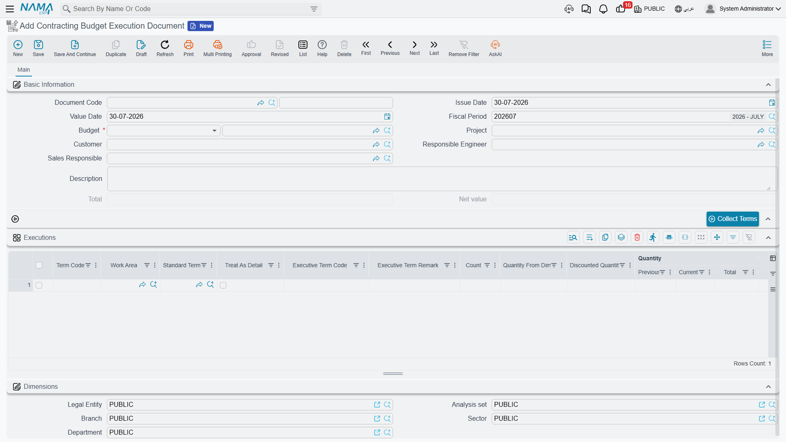

# Budget Execution

The English name on the menu invites you to expect a variance report — budget against actual, in one screen. It is not that. **Budget Execution is a quantity survey**, the same measuring document a quantity surveyor fills in at the end of every period, except that it is measured against a *budget* instead of against a contract.

The Arabic name says it exactly: **حصر كميات موازنة** — a budget take-off. You walk the site, you write down how much of each item of work has been done, you save, and the surveyed quantity is stamped onto the budget's term lines so that the budget itself shows physical progress next to planned quantity.

You will find it at **Contracting > Costs > Contracting Budget Execution Document**, under licence `contracting`.

## Why survey against a budget at all

The module already has quantity surveys against the [project contract](/modules/contracting/project-contracting/contracting-project-execution.md) and against subcontracts, and those are the ones that feed billing. This one feeds nothing — it books no money and no stock, and no extract is built from it.

What it gives you is progress recorded in *your* structure rather than the client's. A budget's term codes are your internal breakdown; the contract's are what you agreed to bill against, and the two are often not the same shape. Surveying against the budget lets the site team report progress in the codes the cost plan is written in, so that a budget line's planned quantity, executed quantity and actual cost all sit in one row.

## Filling one in

The document has a single page.

**The header.** A document book and code, issue date, value date and fiscal period as on any document, and then:

| Field | Notes |
|---|---|
| **Budget** (الموازنة) | **required** — and it accepts either an [estimated budget](/modules/contracting/budgets/contracting-estimated-budget.md) or an [executive budget](/modules/contracting/budgets/contracting-executive-budget.md) |
| **Project** (المشروع) | must be the same project as the budget's, or the save fails |
| **Customer** (العميل) | must be the same customer as the budget's, or the save fails |
| **Responsible Engineer**, **Sales Responsible** | who measured and who owns the commercial side |
| **Total** and **Net** | calculated from the grid's price columns; informational only |

There is no document term (توجيه) on this document and nothing to configure for it — it has no accounting side to route.

**The Executions grid.** One row per item of work surveyed. Press **Collect Terms** (تجميع البنود) above the grid to pull the budget's term codes in rather than typing them, then fill in the measurements.

| Column | What it is for |
|---|---|
| **Term Code** (كود البند) | must resolve to a term on the chosen budget |
| **Standard Term**, **Treat As Detail**, **Work Area**, term categories, **Phase** | inherited from the budget line; the phase decides which milestone slot the quantity is credited to |
| **Count**, **Quantity From Dimensions**, **Discounted Quantity** | measure by physical dimensions instead of typing a quantity — length × width × height × count, less anything discounted |
| **Current Quantity** (الكمية الحالية) | **the number you actually fill in**: how much of this item was executed |
| **Contracted Quantity** (الكمية \| متعاقد عليها) | brought in from the budget line; you do not type it |
| **Assay Quantity**, **UOM** | reference figures from the budget |
| the price block | unit price, total, discount, the two sales taxes and the net — these produce the header total and are for information |
| **% OF Finished** (نسبة التنفيذ) | the completion percentage for this line |
| **Term Remark**, **Description** | free text |

A **Dimensions** (المحددات) block closes the page.

## What the survey writes back

When the document is processed — not while it is still a draft or awaiting approval — the surveyed quantity is written onto the **matching term line of the budget**, into the column **Quantity | From Execution** (الكمية | من حصر الكميات). If the line names a phase, the quantity goes into that phase's executed-quantity slot instead. Parent term lines are then re-totalled from their children.

::: info The figure on the budget is stored, not live
*Quantity | From Execution* is a snapshot that a survey put there. Opening the budget does not recompute it, and no report reaches back into the survey documents to add them up on demand. The whole module works this way: figures are written when a document is processed and read straight off the record afterwards. It is fast, and it is also why the number on the budget is only as current as the last survey that was processed.
:::

## The one check that can stop you

Everything else the document validates is about consistency — the grid must not be empty, the term codes must exist on the budget, the project and the customer must match the budget's. One check is a real ceiling on quantity:

**The permitted percentage.** Each budget term line carries a **Permitted Percentage** (نسبة السماحية) — how much over-measurement that item tolerates. The survey fails when the surveyed quantity for a line goes past the contracted quantity *and* the overrun beyond the planned quantity is a larger percentage than the line allows, with the message *"Current Quantity Percentage can not Exceed Permitted Percentage … %"*. Leave the permitted percentage at zero and any over-measurement is refused; set it to 10 and you have a 10% tolerance.

The whole check can be switched off for the database by the module setting **Allow Current Quantity Percentage Exceed Permitted Percentage** (السماح بتجاوز نسبة الكمية الحالية للنسبة المسموح بها) — see [Contracting Configuration](/modules/contracting/contracting-configuration.md).

Separately, when the module setting **Prevent Update Execution If Extract On It** (منع التعديل في حصر الكميات إذا تم عليه مستخلص) is on, a survey that an extract has already drawn on can no longer be edited.

## The tower, three months in

Executive budget `CEB-EXE-001` for **Tower A** plans `X-1` *Excavation* at 1,000 m³, `X-2` *Reinforced concrete* at 60 m³, `X-3` *Blockwork* at 2,000 m² and `X-4` *Plastering* at 1,000 m². At the end of month three the site engineer raises survey `CBE-2026-003` against that budget:

| Term code | Item of work | Planned | Current Quantity | % OF Finished |
|---|---|---|---|---|
| `X-1` | Excavation | 1,000 m³ | 1,000 | 100 |
| `X-3` | Blockwork | 2,000 m² | 900 | 45 |

The concrete was measured in an earlier month and the plastering has not started, so neither is on this survey. The header total reads **91,400** from the price columns, which nobody will use for anything. What matters is on the budget afterwards: line `X-1` now shows *Quantity | From Execution* 1,000, and line `X-3` shows 900.

## "Actual" does not come from here

This is the distinction that makes the difference between reading a budget correctly and misreading it.

- **Quantity | From Execution** — from this document. **Physical progress.** How much work is on the ground.
- **Actual Quantity** and **Actual Cost** (الكمية الفعلية / التكلفة الفعلية) — **money and materials actually consumed**, written by every document that spends against a term code: material issues, the daily labour book, subcontractor extracts, purchase orders, miscellaneous invoices. These are the budget-versus-actual columns, and this survey contributes nothing to them. What does contribute is listed on [How Project Cost Is Built](/modules/contracting/costs/contracting-cost-model.md).
- **Quantity | From Extract**, **Quantity | From Cost Execution**, **Quantity | From Opening Extracts** — quantities already billed or rolled up by other documents.
- **Term Quantity From Contractors Extract** (كمية البند المنفذة بمستخلصات مقاول باطن) — quantity certified through [subcontractor extracts](/modules/contracting/contractor-contracting/contracting-contractor-extracts.md), pushed onto budget lines when the matching module setting is on.

So: a budget line whose *Quantity | From Execution* is 900 and whose *Actual Cost* is far above plan is telling you that 45% of the blockwork is standing and it has already eaten more than 45% of the money. That comparison is the reason to keep budgets at all — and it is a comparison you make with your eyes, because nothing in the module blocks anything on the strength of it. The one ceiling that can be switched on is described on [Budget Item Requests](/modules/contracting/budgets/contracting-budget-item-requests.md).
