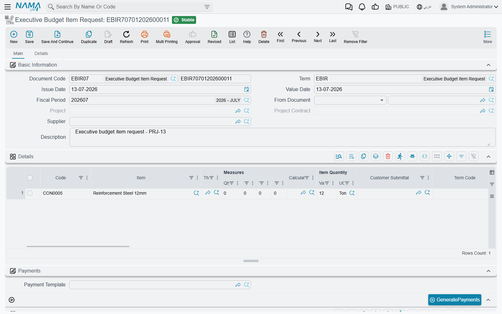

# Budget Item Requests

An approved [executive budget](/modules/contracting/budgets/contracting-executive-budget.md) says which materials the job needs, how much of each, and at what price the client approved them. The **Executive Budget Item Request** is how the site asks for that spend to happen: a purchase request, raised against the budget, whose lines are tied back to the approvals the client signed.

Its Arabic name spells out the intent — **طلب شراء خامات من الموازنة التنفيذية**, a request to purchase raw materials from the executive budget.

You will find it at **Contracting > Project Contracting > Executive Budget Item Request**, under licence `contracting`.

## What kind of document this is

It is a genuine purchase request, built on the standard supply-chain purchase document, living in the contracting module. That is why the screen has a shipping and incoterm page, eight discount slots, four taxes, serials and lots, warehouse and locator columns, and a payment schedule — all of it inherited. What contracting adds is the link back to the budget.

**The header.** Document book and code, **Term** (توجيه المستند), issue date, value date, fiscal period, then:

| Field | Notes |
|---|---|
| **From Document** (بناءا على) | the budget this request is raised against. It accepts an executive or an [estimated budget](/modules/contracting/budgets/contracting-estimated-budget.md), but only the executive one produces the approvals the lines link to. |
| **Project** (المشروع) and **Project Contract** (عقد مشروع) | filled by the system from the chosen budget — you do not type them |
| **Supplier** (مورد), **Request** (الطلب) | who you intend to buy from, and the originating request |
| **Valid From** / **Valid To** (صالح من / صالح حتي) | how long the request stands |

The document's term options are covered on [Other Contracting Document Terms](/modules/contracting/document-terms/contracting-terms-other.md).

**The Details grid** is a full purchase line — item, quantity in both units, price, discounts, taxes, net value, warehouse, dimensions — plus three contracting columns:

| Column | What it does |
|---|---|
| **Customer Submittal** (اعتماد العميل للصنف) | names the client's approval of this material. Picking one fills the line's item, forces the prime unit of measure to that item's base unit, and copies the approval's term code and description onto the line. |
| **Term Code** (كود البند) | filled by the system from the submittal |
| **Term Remarks** (وصف البند) | filled by the system from the submittal |

Then the payments block — a payment template, a **Generate Payments** action and the instalment grid, validated against the amount still outstanding — the totals block, and the **Dimensions** (المحددات) block.

## Does the budget stop me overspending?

This is the question everyone asks, and the honest answer has to be given carefully, because the intuitive answer is wrong.

**Nothing on a budget blocks anything.** Committing an estimated or executive budget runs three checks and all three are about term codes lining up — does this code exist in the counterpart budget, does that code exist on the contract. Not one of them compares a quantity or an amount to a limit. The budget is a plan you can read; it is not a lock.

**This request does not check the budget either.** It records an intention to buy. It books no cost against a budget term, so there is no accumulated figure for it to compare anything to, and no budget-related refusal will ever come out of saving one. Raise a request for ten times the budgeted quantity and it will save.

**There is exactly one budget-aware ceiling in the module, and it fires on the document that spends — not on the budget, and not on the request.** It is a **total-cost** check, and it only exists when somebody has switched it on. Three things have to be true:

1. **The spending document's line must be attributable to the budget.** That means the line is against a project contract that has the budget linked to it, and the line carries that budget's term code in its **Executive Term Code** (كود بند الموازنة التنفيذية) or **Estimated Term Code** (كود بند الموازنة التقديرية) column. A line with no budget term code contributes nothing to the budget's actual cost, so there is nothing to compare.
2. **The document must be one that books cost against a term** — a material issue, a purchase order, a labour book, a subcontractor extract, and so on. Cost records are written when the document is processed, and they are what the budget's **Actual Cost** column is summed from.
3. **That document's document term (توجيه) must have the option ticked**: **Do Not Save If Actual Cost Greatr Than Planned Cost** — Arabic *منع الحفظ اذا تعدت التكلفة الفعلية التكلفة المخططة*.

With all three in place, the document refuses to save the moment the accumulated actual cost booked against that budget term code goes past the term line's planned total cost, with the message *"Actual cost … must be less than total cost … for term code …"*.

::: tip What to tick, on which documents
The option lives on the **document term** of each spending document, so it has to be ticked once per term you use — there is no single global switch. The documents that offer it are the [contracting purchase order](/modules/contracting/costs/contracting-purchasing.md), the [material issue and material return](/modules/contracting/costs/contracting-project-materials.md), the [miscellaneous contracting request, order and invoice](/modules/contracting/costs/contracting-misc-spend.md), the [daily labour book](/modules/contracting/costs/contracting-daily-labour.md), the [subcontractor extract](/modules/contracting/contractor-contracting/contracting-contractor-extracts.md) and the contracting fines — plus, outside the module, the journal entry, the receipt/payment voucher and the credit/debit note.

The option's own wording mentions the analysis card, but the check it turns on applies just as much to **budget** and **contract** term lines. Ticking it to police analysis cards will also start refusing budget overruns, which is usually what you wanted — but know that it does both.
:::

### Two things not to rely on

**The companion quantity option.** Next to the cost option sits **Do Not Save If Actual Quantity Greatr Than Planned Quantity**. On budget and contract term lines it does not bite — only analysis-card lines are compared this way. If you need a quantity limit against a budget, do not expect this option to give you one.

**A purchase order can cap quantity, though.** On the [contracting purchase order](/modules/contracting/costs/contracting-purchasing.md) term there is a third option, **Do Not Exceed Quantity** (عدم تخطي الكمية), and that one *does* work against a budget line: it compares the quantity already on order against the budget line's planned quantity and refuses the order when it would go past it. If the discipline you want is "never order more of this material than the budget planned", that is the option to tick, and the purchase order is where to tick it.

## The tower, worked through

Executive budget `CEB-EXE-001` for **Tower A** (*Al-Fanar Development*, contract `PC-2026-001`, value **230,000**) plans line `X-3` *Blockwork* at 2,000 m², total cost **82,000**. Three months in, the material issues and labour booked against `X-3` have accumulated an actual cost of **34,800** — so 47,200 of the planned cost is still unspent.

**Request one — comfortably within budget.** `EBIR-2026-014` asks for blocks and mortar worth **24,000** against submittal `SUB-0031`, whose term code `X-3` is copied onto the line. It saves.

**Request two — well past the plan.** `EBIR-2026-019` asks for a further **30,000** against the same budget line. Committed spend would reach 34,800 + 24,000 + 30,000 = **88,800** against a plan of 82,000. **It also saves, without a word of complaint** — because a request books no cost, and nothing on the request looks at the budget's remaining balance.

So far, both requests behave identically. The difference appears one step later.

**Nobody ticked the option.** Both requests become material issues. Both are processed. Line `X-3`'s **Actual Cost** climbs to 58,800, then to 88,800, sitting in the grid next to a planned 82,000. Nothing was ever refused; the overrun is visible, and only visible.

**Somebody ticked the option.** The material-issue document term has *Do Not Save If Actual Cost Greatr Than Planned Cost* ticked. The first issue takes actual cost to 58,800, still under 82,000, and saves. The second issue would take it to 88,800 and is **refused**: *"Actual cost 88,800 must be less than total cost 82,000 … for term code X-3"*. The buyer has to split the order, get the budget revised, or get the overrun approved — which is exactly the control the budget was supposed to give you, and exactly the control you do not get until that box is ticked.

::: info Where the limit really lives
If you take one thing from this page: the budget is the number, the **document term is the enforcement**, and the **term code on the spending line** is what connects them. Get all three right and a contracting budget is a hard ceiling. Miss any one of them and it is a reference document.
:::
