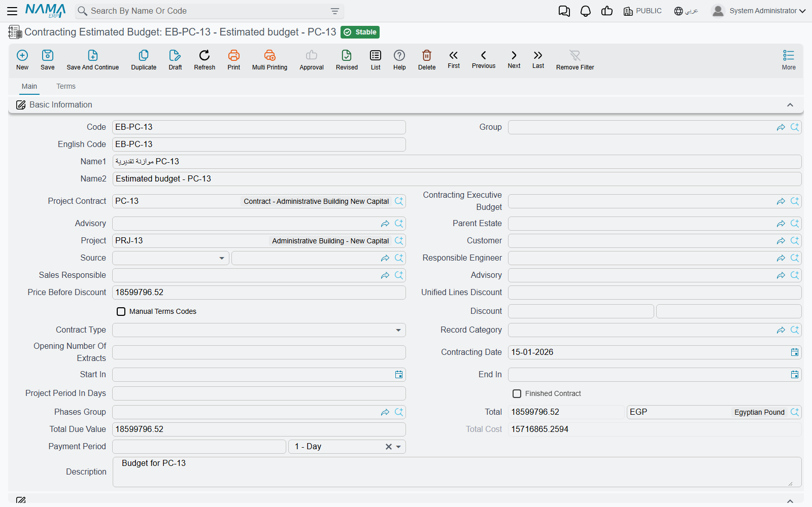
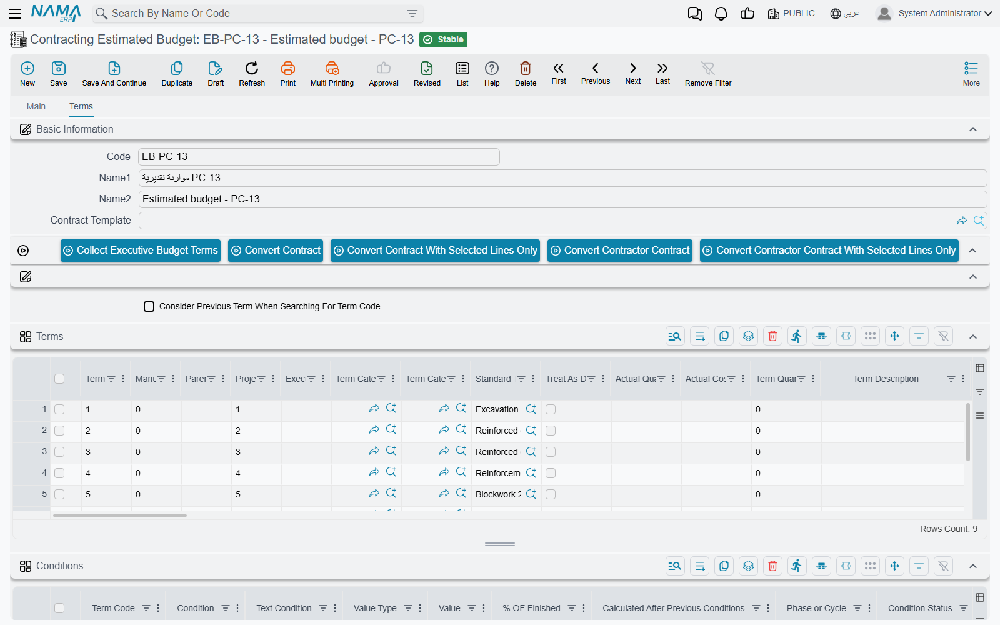

# Estimated Budgets

Winning a job at 230,000 tells you what the client will pay. It says nothing about whether you will make money on it. The estimated budget is where the estimating team writes down its own answer to the second question: for every item of work in the contract, what do we actually expect it to cost us?

On the **Tower A** contract for *Al-Fanar Development* — `PC-2026-001`, value **230,000** — the estimating team's answer is **180,000**. That number is the estimated budget, and this page is about the record that holds it.

You will find it at **Contracting > Master Files > Contracting Estimated Budget**, under licence `contracting`.

## Two budgets, and neither one creates the other

Before anything else, clear up the single biggest misconception about this part of the module.

There are two budget files — the **estimated** budget and the [**executive** budget](/modules/contracting/budgets/contracting-executive-budget.md) — and readers almost always assume a pipeline: draft the estimated one, approve it, and the system turns it into the executive one. **That pipeline does not exist.** There is no "generate executive budget" action, no approval that promotes one into the other, and no rule that says one must exist before the other.

What actually exists is much simpler:

- **Both are master files.** Neither is a document. They have a code, a group, an Arabic name and an English name; no document book, no value date, no fiscal period, and **no document term (توجيه)** — which is why neither of them ever produces a journal entry or a stock movement. Both live in the same menu group, **Master Files**, alongside projects and contractors.
- **They point at each other.** The estimated budget has a **Contracting Executive Budget** field and the executive budget has a **Contracting Estimated Budget** field. Fill in either one and the system fills in the other side for you on save. The pairing is one-to-one and it is enforced: if the budget you pick is already paired with a different budget of your type, the save fails with *"The record … is already related to record …"*.
- **Each of them can point at a project contract.** The **Project Contract** (عقد المشروع) field links the budget to the contract it plans, and saving the budget also stamps it onto the contract, so the contract's own header shows which budgets belong to it.
- **A contract can exist with neither, and a budget can exist with no contract.** Nothing in the contract requires a budget. Every budget-side check that involves a contract simply stops if the Project Contract field is empty. Budgets are opt-in cost-control files — powerful if you use them, entirely skippable if you do not.

::: tip A budget is structurally a contract that nobody signs
The estimated budget is built on the same foundation as the project contract, which is why the screen looks so familiar: contracting date, start and end dates, a phases group, an accounting subsidiary, header discounts and taxes, and a full bill-of-quantities grid. Read it as "a contract-shaped record holding cost intentions rather than commercial commitments", and the layout stops being surprising.
:::

## The header

Most of the header is identification or a total you never type. These are the fields that do work:

| Field | Why it matters |
|---|---|
| **Project Contract** (عقد المشروع) | the contract this budget plans; leaving it empty is allowed, but it switches off the project-term-code checks described below |
| **Contracting Executive Budget** | the counterpart budget — filling it here also fills the mirror field over there |
| **Project** (المشروع) and **Customer** (العميل) | the site and the client, as on the contract |
| **Advisory** (الإستشاري) | the supervising [consultant](/modules/contracting/setup/contracting-contractors-and-consultants.md); a labelling and reporting reference, nothing calculates from it |
| **Parent Estate** (العقار الأعلى) | the Real Estate project this construction belongs to, when [construction cost is to be pushed down onto units](/modules/contracting/costs/contracting-realestate-cost-bridge.md) |
| **Source** (المصدر) | where the bill of quantities was copied from |
| **Manual Terms Codes** (تكويد البنود يدويا) | switches automatic term coding off so you can type your own codes |
| **Contract Type** (نوع العقد) and **Addendum contract** (العقد الرئيسي) | as on a contract — despite the English caption, the second field is the **main, parent** record this one hangs off, and it is required when the type is *Addendum* |
| **Phases Group** (مجموعة مراحل) | the default set of [milestones](/modules/contracting/setup/contracting-phases-and-work-areas.md) applied to term lines |
| **Calculate Price From Profit When Save** | tick it and each line's price is back-computed from its cost plus the margin, instead of the margin being derived from a price you typed |

Alongside them sit the calculated money figures — **Price Before Discount**, the header discount pair, the total price with its currency, **Total Due Value** and **Total Cost** — and, at the bottom of the page, five attachment slots and the **Dimensions** (المحددات) block: legal entity, analysis set, branch, sector, department.

Because the screen is inherited from the contract screen, you will also meet fields that belong to contract life rather than budget life: the extract-numbering seed, the finished-contract flag, the payment period, the project duration in days. Fill the ones that genuinely describe your plan and leave the rest alone.

## The Terms page — where the estimate actually lives

Page 1 carries no grids at all. Everything you came to do happens on page 2, **Terms**.

The grid is the same bill-of-quantities grid you know from the contract — one row per item of work, each pointing at a [standard term](/modules/contracting/setup/contracting-standard-terms.md), rows forming a tree through their dotted codes, only leaf rows carrying money. What makes it a *budget* line rather than a contract line is three extra columns:

| Column | What it does |
|---|---|
| **Project Term Code** (كود بند المشروع) | names the line's opposite number in the linked project contract. It is checked on save: the code must exist on that contract. |
| **Executive Term Code** (كود بند الموازنة التنفيذية) | names the line's opposite number in the paired executive budget, again by code, and again checked on save. |
| **Executive Term Remark** | free description of that counterpart line. |

Two more columns are filled by the system and are the whole point of keeping a budget at all:

- **Actual Quantity** (الكمية الفعلية) and **Actual Cost** (التكلفة الفعلية). Every document that spends money against a term code — material issues, the daily labour book, subcontractor extracts, purchase orders, miscellaneous invoices — writes a cost record when it is processed, and those records are then summed back onto the matching budget line. So *Actual Cost* on a budget line is your budget-versus-actual figure, sitting one column away from the cost you planned. The full list of what contributes is on [How Project Cost Is Built](/modules/contracting/costs/contracting-cost-model.md).
- **Quantity | From Execution** (الكمية | من حصر الكميات) is written by a [budget quantity survey](/modules/contracting/budgets/contracting-budget-execution.md) — physical progress, as opposed to money spent.

Above the grid sits **Collect Executive Budget Terms** (تجميع بنود الموازنة التنفيذية), and next to it the same **Update Codes** / **Update Empty Term Codes Only** pair the contract has, plus the four *Convert to contract* buttons.

::: warning Collect Executive Budget Terms replaces what is in the grid
The button clones every term line of the paired executive budget into this budget's grid — prices and costs included. It is a copy, not a merge. Use it when you want to bring an already-built structure across; do not press it on a budget you have spent an afternoon typing into. Its mirror image on the executive budget is **Collect Estimated Budget Terms**.
:::

Below the terms grid come the four cost-analysis grids — **Material**, **Workers**, **Contractors** and **Other Expenses** — identical to the ones on an [offer](/modules/contracting/project-contracting/contracting-offers.md) or a [term analysis card](/modules/contracting/setup/contracting-term-analysis-cards.md). They are where a line's unit cost is built up from its components rather than typed as a single number. Finally there is a **Conditions** grid, for recording the retention and deduction clauses the plan assumes.

## The tower's estimated budget

Contract `PC-2026-001` carries four priced leaves: `1.01` *Excavation* (1,000 m³), `2.01` *Reinforced concrete* (60 m³), `3.01` *Blockwork* (2,000 m²) and `3.02` *Plastering* (1,000 m²). The estimating team's budget `CEB-EST-001` mirrors them:

| Term code | Project term code | Executive term code | Item of work | Quantity | Unit cost | Total cost |
|---|---|---|---|---|---|---|
| `E-1` | `1.01` | `X-1` | Excavation | 1,000 m³ | 36.00 | 36,000 |
| `E-2` | `2.01` | `X-2` | Reinforced concrete | 60 m³ | 740.00 | 44,400 |
| `E-3` | `3.01` | `X-3` | Blockwork | 2,000 m² | 40.00 | 80,000 |
| `E-4` | `3.02` | `X-4` | Plastering | 1,000 m² | 19.60 | 19,600 |

Header total cost **180,000** against a contract value of 230,000 — a planned gross margin of 50,000. Note that these unit costs are the estimator's own targets and are deliberately tighter than the rate-based cost figures the contract's term lines carry; the budget is where cost gets thought about properly, and the contract is only where it was first sketched.

## What the system checks when you save

All three checks are about **term codes lining up**, and it is worth saying plainly what that means:

1. The counterpart executive budget must not already be paired with a different estimated budget.
2. Every **Executive Term Code** on a line must exist as a term code in the paired executive budget — and the check runs in both directions, so every executive-budget line naming an estimated code must find it here too.
3. Every **Project Term Code** must exist as a term code on the linked project contract.

On top of that, the conditions grid is validated the way a contract's is, and the parent/child consistency of the dotted term codes is checked.

::: info These are referential checks, not spending limits
Not one of them compares a quantity or a value against anything. A budget will happily save with lines whose costs bear no relation to the contract, and saving it never stops any other document from being raised. If you are looking for the answer to "does the budget stop overspending?", it is on [Budget Item Requests](/modules/contracting/budgets/contracting-budget-item-requests.md) — and the short version is that the budget itself blocks nothing.
:::

## Turning a budget into a contract

The four *Convert* buttons above the terms grid — to a project contract, to a subcontract, and the two "selected lines only" variants — are the same actions an offer or an assay carries. Each opens a new, unsaved contract pre-filled from this budget's header and term lines, for you to review and save. It is a genuine route into the contract chain, useful when the budget was built before anything was signed, and it explains why a budget can exist with no Project Contract of its own: it may be the thing the contract came from rather than the thing that describes it.

## Where to go next

The counterpart record and the one thing only it does — generate customer approvals — is on [Executive Budgets](/modules/contracting/budgets/contracting-executive-budget.md). Measuring progress against a budget is [Budget Execution](/modules/contracting/budgets/contracting-budget-execution.md). And the enforcement question is answered in full on [Budget Item Requests](/modules/contracting/budgets/contracting-budget-item-requests.md).
