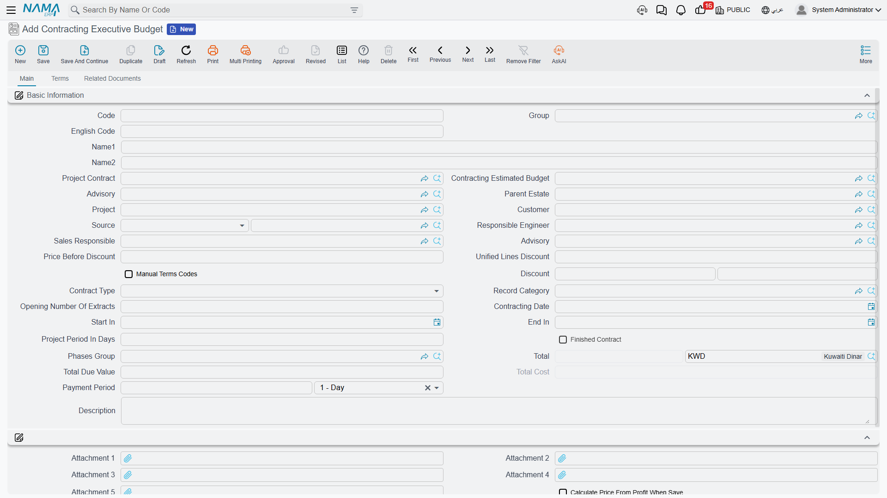
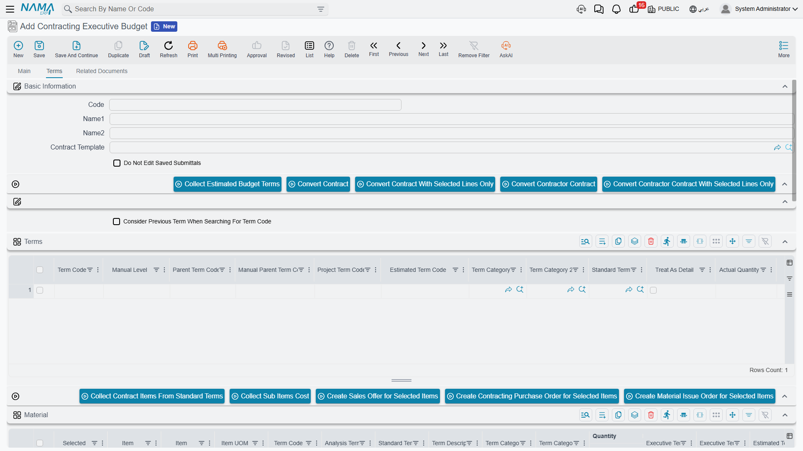

# Executive Budgets

The [estimated budget](/modules/contracting/budgets/contracting-estimated-budget.md) is what the estimating team thinks the job will cost. The executive budget is the number the business has agreed to spend. Same shape, different authority — and one real functional difference, which is that the executive budget is the only record in the module that can generate **customer submittals**: the per-item approvals a client or consultant signs before you are allowed to buy.

Carrying on with **Tower A** for *Al-Fanar Development*: contract `PC-2026-001` at **230,000**, estimated budget `CEB-EST-001` at 180,000, and now the approved version of that same plan, `CEB-EXE-001`, at **185,000**.

You will find it at **Contracting > Master Files > Contracting Executive Budget**, under licence `contracting`.

## What it is, and what it is not

Everything said about the estimated budget's *nature* applies here word for word, and it is worth repeating because it is the part people get wrong:

- It is a **master file**, not a document. No document book, no value date, no fiscal period, **no document term (توجيه)** — and therefore **no accounting effect and no stock movement, ever**. Committing an executive budget moves no money.
- It lives under the **Master Files** menu group, not under a documents group, even though it behaves like a plan you revise over time.
- **Neither budget creates the other.** The two are linked by a mutual reference field plus a pair of symmetric copy buttons, and that is the whole relationship. There is no approval step that promotes an estimated budget into an executive one.
- **A project contract can exist with neither budget**, and an executive budget can exist with no contract. The **Project Contract** (عقد المشروع) field is optional on both sides.

::: tip The practical order of work
Price the job with an [offer](/modules/contracting/project-contracting/contracting-offers.md) or an [assay](/modules/contracting/project-contracting/contracting-assays.md) → sign the [project contract](/modules/contracting/project-contracting/contracting-project-contract.md) → create the estimated budget and point it at the contract → create the executive budget, point it at the contract *and* at the estimated budget, then press **Collect Estimated Budget Terms** to bring the structure across and refine the numbers. None of those steps is enforced; this is a convention, not a workflow.
:::

## The header — one option the estimated budget does not have

The header is the estimated budget's header: project contract, the counterpart budget link, project, customer, the [consultant](/modules/contracting/setup/contracting-contractors-and-consultants.md), parent estate, source, contract type, phases group, the dates, the calculated money block, attachments and the **Dimensions** (المحددات) block.

The addition is on page 2, and it is important:

**Do Not Edit Saved Submittals** (عدم التعديل في الإعتمادات التي تم إنشاؤها). Tick it and the submittal-generation described below is skipped entirely from then on. It is the switch you use once the client has approved a set of submittals and you do not want a later edit of the budget to touch them.

## The Terms page

The grid is the bill-of-quantities grid, with the budget-specific columns pointing the other way from the estimated budget's:

| Column | What it does |
|---|---|
| **Project Term Code** (كود بند المشروع) | the matching term code on the linked project contract; checked on save |
| **Estimated Term Code** (كود بند الموازنة التقديرية) | the matching term code in the paired estimated budget; checked on save, in both directions |
| **Actual Quantity** (الكمية الفعلية) / **Actual Cost** (التكلفة الفعلية) | filled by the system. Every spending document writes a cost record against a term code when it is processed, and those records are summed back onto the matching budget line. This pair is your budget-versus-actual. |
| **Quantity \| From Execution** (الكمية \| من حصر الكميات) | filled by a [budget quantity survey](/modules/contracting/budgets/contracting-budget-execution.md) — physical progress rather than money |
| **Permitted Percentage** (نسبة السماحية) | how much over-execution this item tolerates; it is what the budget survey's quantity check measures against |

Above the grid: **Collect Estimated Budget Terms** (تجميع بنود الموازنة التقديرية), the **Update Codes** / **Update Empty Term Codes Only** pair, and the four *Convert to contract* buttons.

::: warning Collect Estimated Budget Terms replaces the grid
It clones every term line of the paired estimated budget — prices and costs included — into this grid. It is a copy, not a merge. Press it first, then re-code and refine; do not press it after you have done the refining.
:::

Below the terms grid sit the four cost-analysis grids (**Material**, **Workers**, **Contractors**, **Other Expenses**) that break a line's unit cost into its components, and a **Conditions** grid.

### Naming an item on a budget line

One column decides whether this budget can drive purchasing at all: **Item** (الصنف), and next to it **Customer Submittal** (اعتماد العميل للصنف). Neither appears by default. They show up only when the module setting **Show Item And Submittal In Contract And Executive And Estimated Budgets** is on — see [Contracting Configuration](/modules/contracting/contracting-configuration.md).

That matters because submittal generation, below, only looks at lines that name an item. A budget of pure work items — excavation, blockwork — generates nothing. A budget whose lines name the materials those items consume generates one approval per material.

## The tower's executive budget

`CEB-EXE-001`, paired with `CEB-EST-001`, linked to contract `PC-2026-001`. The user pressed **Collect Estimated Budget Terms**, then re-coded the four cloned lines and revised the numbers upward:

| Term code | Project term code | Estimated term code | Item of work | Quantity | Unit cost | Total cost |
|---|---|---|---|---|---|---|
| `X-1` | `1.01` | `E-1` | Excavation | 1,000 m³ | 37.50 | 37,500 |
| `X-2` | `2.01` | `E-2` | Reinforced concrete | 60 m³ | 760.00 | 45,600 |
| `X-3` | `3.01` | `E-3` | Blockwork | 2,000 m² | 41.00 | 82,000 |
| `X-4` | `3.02` | `E-4` | Plastering | 1,000 m² | 19.90 | 19,900 |

Header total cost **185,000** against the 230,000 contract — an approved gross margin of 45,000, 5,000 tighter than the estimate. On commit the three cross-checks pass: `E-1`…`E-4` exist in the estimated budget, `X-1`…`X-4` exist here, and `1.01`, `2.01`, `3.01` and `3.02` exist on the contract.

## Customer submittals — the one thing only the executive budget does

Many construction contracts oblige the contractor to get the client's or the consultant's written approval of each material before buying it: this brand of steel, at this price, in this quantity. In Nama that approval is a **Customer Submittal** (اعتماد العميل للصنف), and the executive budget can create them for you rather than making somebody type one per material.

It works like this, at the moment the budget is committed:

1. If **Do Not Edit Saved Submittals** is ticked, nothing happens at all.
2. Otherwise, generation runs only if the module setting **Create Submittal For Each Line With Item** (إنشاء سند اعتماد عميل للصنف لكل سطر به صنف) is on. With it off, nothing happens either — this is the master switch.
3. For each term line that **names an item** — lines with no item are skipped — the system finds the submittal it made for that line before, or creates a new one, and copies across the quantity, the unit of measure, the description, the unit price, the unit cost and the term code, with the budget recorded as the submittal's source document.
4. The new submittal's document book and document term come from the module settings **Generated Submittal Book** and **Generated Submittal Term**. Set those two before you turn generation on, or there is nothing for the submittal to be filed under.
5. The submittal's id is written back onto the budget line, into the **Customer Submittal** column, so you can see from the budget which approval belongs to which line.

::: warning Re-saving the budget prunes submittals it no longer recognises
Generation is a synchronisation, not an append. Any submittal previously generated from this budget that no longer matches one of its lines is **deleted** when the budget is saved again — and deleting the budget deletes its generated submittals too. If approvals have already been obtained, tick **Do Not Edit Saved Submittals** before touching the term lines.
:::

What happens to a submittal afterwards — who records the quantity and price approvals on it, and what the approval statuses mean — is covered in [Measurements, Submittals and Handover](/modules/contracting/project-contracting/contracting-measurements-and-approvals.md).

## The Related Documents page

The executive budget has a third page, **Related Documents**, that the estimated budget does not. It carries two embedded lists filtered to this budget: the **Customer Submittals** generated from it, and the [**Executive Budget Item Requests**](/modules/contracting/budgets/contracting-budget-item-requests.md) raised against it. It is a convenience view — there is nothing to fill in there — but it is the quickest way to see what a budget has set in motion.

## What the system checks, and what it does not

The three checks on save are the same as on the estimated budget, and they are all about term codes lining up: the counterpart budget must not already be paired elsewhere; every **Estimated Term Code** must exist in the paired estimated budget (checked both ways); every **Project Term Code** must exist on the linked project contract. The conditions grid and the parent/child term-code tree are validated too.

::: info The executive budget does not lock spending
Approving a budget here does not stop a single purchase, issue or invoice. The only budget-aware ceiling in the module lives on the documents that *spend*, and only when an option on their document term is ticked. That is explained in full, with the exact option to tick, on [Budget Item Requests](/modules/contracting/budgets/contracting-budget-item-requests.md).
:::
