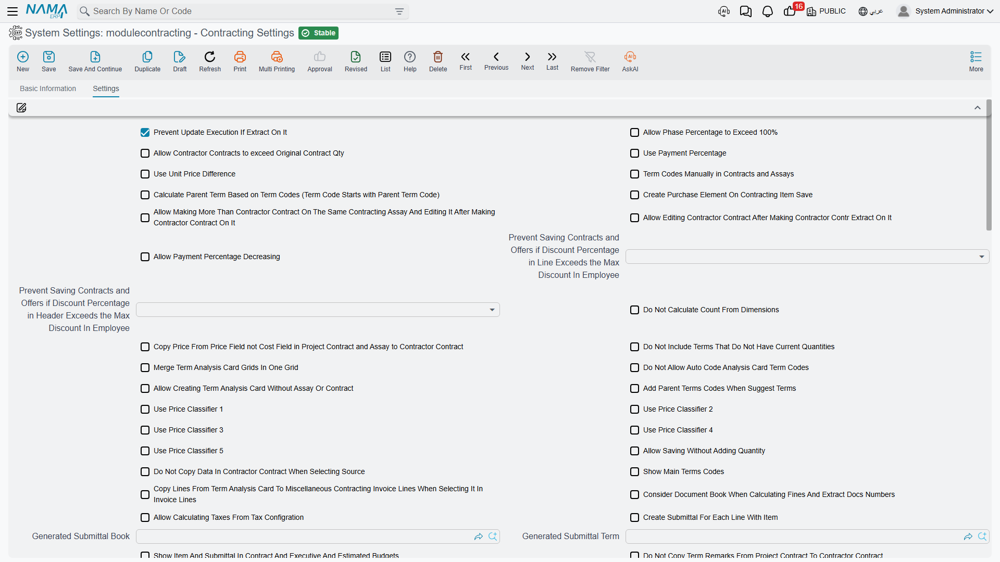

# Contracting Configuration

The Contracting module keeps its settings in a single record, and that record shapes the behaviour of every contract, extract and cost document in the database. A handful of the switches on it change arithmetic rather than appearance — whether an extract prices this month's quantity or the cumulative quantity, whether term codes are typed or generated, which cost figure a subcontract inherits — so it is worth one careful read before the first live contract rather than a puzzled read afterwards.

There are around ninety options on the screen, and they arrive as one long alphabet soup in declaration order: **one page, one block, no tabs and no group titles**. That is why this page ignores the screen order entirely and groups the options by what they affect. If you are hunting for one option, use your browser's find rather than scrolling the screen.

## One Record for the Whole Database

Two facts about the record itself matter more than any individual option.

**There is exactly one.** Every piece of code that reads these settings reads the same single record, with no company or dimension passed in. So there is **no per-company override**: a group running three legal entities out of one database runs all three on the same contracting settings. If two companies need different term-coding rules or different extract pricing, that is not something this screen can give them.

**It is read live.** Nothing is cached into your contracts. Changing an option changes the behaviour of the next document you save, including documents that already existed — so a switch that changes how an extract prices its lines will change how an existing draft extract recalculates the moment you reopen and save it. Change these settings deliberately, and preferably not in the middle of a billing run.

Only two options ship switched on by default: *Prevent Update Execution If Extract On It* and *Allow Calculating Taxes From Tax Configuration*. Everything else starts off, so the module's out-of-the-box behaviour is the conservative one described throughout these pages.

## Term Codes and the Parent-Term Rule

A term code is the dotted outline number — `1`, `1.1`, `1.2`, `2` — that identifies a line of work inside a contract and that every later document quotes when it bills, measures or costs that work. By default the system generates these codes for you from the position of the line in the grid. This group is about taking that away from it.

| Option | What it changes | When to turn it on |
|---|---|---|
| **Term Codes Manually in Contracts and Assays** | Term codes on contracts and assays are typed by the user instead of generated from grid position. | When the client's bill of quantities already has an official numbering that must be reproduced exactly — a government or consultant-issued BOQ, typically. |
| **Manually Coded Terms Entities** | A grid of document types. Anything listed here is manually coded; anything not listed is generated. **If this grid has even one row it completely overrides the option above.** Allowed types are the assay, both budgets, the project contract and the subcontract. | When only some documents need manual codes — for example manual codes on the contract because the client dictates them, generated codes everywhere else. |
| **Calculate Parent Term Based on Term Codes** | The parent/child relationship in the term tree is derived from the code prefix, so `1.2.1` becomes a child of `1.2`, rather than from the line's position in the grid. **Requires manual term coding** — the settings screen refuses to save this option without it. | Whenever term codes are typed. With manual codes and this option off, the outline the user typed and the tree the system believes in can drift apart. |
| **Do Not Allow Auto Code Analysis Card Term Codes** | Suppresses the automatic analysis-term code on a term analysis card. | Only if your cost analysts maintain their own analysis coding scheme. |
| **Add Parent Terms Codes When Suggest Terms** | Term-code suggestion offers parent (roll-up) codes as well as leaf codes. | When users habitually bill or cost against header lines. Leave it off to force everyone onto leaf terms. |
| **Consider Terms Project Remarks While Suggesting Term Code** | Term-code suggestion also matches on the project remarks typed against a term line, not just the code and description. | When term descriptions are generic ("brickwork") and the useful distinguisher is in the remarks ("brickwork — block C stairwell"). |
| **Show Main Terms Codes** | Header (roll-up) lines appear on extracts as well as leaf lines. Off by default. | Only when the extract has to be printed with the client's full outline visible. Roll-up lines complicate the postings, so leave it off unless a client demands the layout. |
| **Show Main Term Code In Executions** | The same, for quantity execution documents. | Same reasoning. |

## Phases

Phases are milestones inside a single term: "foundations 30%, structure 50%, finishes 20%". A term line carries exactly **five phase slots** — that is a hard ceiling, not a setting — and the percentages on them are expected to add up to 100%.

| Option | What it changes | When to turn it on |
|---|---|---|
| **Allow Phase Percentage to Exceed 100%** | Removes the check that a term's phase percentages sum to 100. | For contracts where the phase percentages are indicative progress markers rather than a billing split. Leave it off if phases drive billing, because the check is the only thing catching a mistyped percentage. |
| **Show Term Phase Lines** | Adds the per-phase term grid to extracts, and — this is the important half — switches the extract's billing lines to be built **from the phase lines** rather than typed directly. | When the client is billed per phase completed rather than per quantity executed. It changes how the extract is filled in, so decide it before the first extract, not during. |

The phase master files themselves, and the five-slot ceiling, are covered in [Phases and Work Areas](/modules/contracting/setup/contracting-phases-and-work-areas.md).

## What the Extract Calculates

These are the options that change the money. Most of them exist because different clients define "this month's value" differently.

| Option | What it changes | When to turn it on |
|---|---|---|
| **Use Payment Percentage** | Turns on the payment-percentage mechanism on extracts and shows its columns. Instead of billing the executed quantity outright, each term is billed at an agreed percentage of what is due. | Contracts written as "we certify 90% of measured work now, the balance on completion". |
| **Allow Payment Percentage Decreasing** | Lets a later extract use a lower payment percentage than the previous one. | Rarely. The default block exists because a falling percentage usually means a keying error. Turn it on only where genuine renegotiation downwards happens. |
| **Calculate Prices Based On Total Quantity** | Line prices are computed from the cumulative quantity to date and the previous extracts are then netted off, rather than from this extract's quantity alone. Cannot be combined with the next option — the settings screen rejects both together. | Cumulative-certificate contracts, where the certificate states total work to date and deducts previous payments. This is the classic international construction certificate shape. |
| **Calculate Prices Difference From Previous Extract Only** | Price differences are measured only against the immediately preceding extract instead of against everything billed before. | When a client agrees revised rates from a given certificate onwards and does not want earlier certificates re-opened. |
| **Use Unit Price Difference** | Enables the unit-price-difference mechanism on extracts, which carries a rate adjustment separately from the quantity being billed. | When rates are revised mid-contract — an escalation clause, or an agreed variation to a rate — and the adjustment must be visible as its own figure rather than folded into the price. |
| **Do Not Include Terms That Do Not Have Current Quantities** | *Collect Terms* on an extract skips any term with nothing to bill this period. | Almost always. On a 200-line bill of quantities it is the difference between an extract you can read and one padded with zero rows. |
| **Copy Manual Total From Previous Quantity With From Document** | When an extract is built "based on" an earlier document, the manually typed total is carried across too. | Where the extract total is negotiated as a round figure and re-typing it every period is error-prone. |
| **Subtract Remaining Tax Value With Percent From Due Value With Every Extract** | With the "percentage of due value" payment method, the remaining tax portion is subtracted on every extract instead of being left to the end. | When the tax on an advance or deduction must be relieved gradually alongside the recovery rather than in one lump. |
| **Consider Document Book And Calculating Fines And Extract Docs Numbers** | Extract and fine sequence numbers are counted per document book instead of globally. | When each project or branch has its own book and each needs its own "extract no. 1". |
| **Allow Creating Documents For Contracts That Have a Final Extract** | Lets new documents be raised against a contract that has already been closed with a final extract. | For genuine post-closure work — a snagging bill, a late-agreed variation — that the business does not want to handle as a new contract. |

### The Eight Discount-Percentage Switches

There are eight discount slots on an extract line, and for each one there is an option — *Calculate discount 1 percentage from value* through *Calculate discount 8 percentage from value* — that reverses the direction of the calculation. Off, you type a percentage and the system computes the amount. On, you type the amount you actually negotiated and the system derives the percentage.

Turn on the slots your business negotiates as flat amounts and leave the rest off. It is worth knowing that this is resolved in a three-level cascade: the module setting is the default, the contract can override it, and the extract's document term can override that. So this screen sets house style, not law.

## Quantity Executions

| Option | What it changes | When to turn it on |
|---|---|---|
| **Prevent Update Execution If Extract On It** | Blocks editing an execution document once an extract has consumed it. **On by default.** | Leave it on. Editing a measurement that has already been billed is how billed quantities and measured quantities silently diverge. |
| **Allow Current Quantity Percentage Exceed Permitted Percentage** | Lets the current-quantity percentage on an execution go past the permitted percentage set on the contract's term line. | Where the permitted percentage is guidance rather than a contractual cap. |

## When a Contract, Assay or Subcontract Can Still Be Edited

The module locks documents once downstream money exists. These options unlock them again, and each one is a deliberate trade of safety for flexibility.

| Option | What it changes | When to turn it on |
|---|---|---|
| **Allow Edit Prices And Quantities In Project Contract After Make Extracts** | Unlocks prices and quantities on a project contract that already has extracts. | Only where the alternative — a contract update document — is genuinely impractical. The update document exists precisely so that this option is not needed; see [Project Contract Updates](/modules/contracting/project-contracting/contracting-project-contract-updates.md). |
| **Allow Editing Contractor Contract After Making Contractor Contr Extract On It** | The same, for a subcontract that has been extracted against. | Same reasoning. |
| **Allow Making More Than Contractor Contract On The Same Contracting Assay And Editing It After Making Contractor Contract On It** | Lets several subcontracts be created from one assay, and lets the assay be edited afterwards. | When one priced bill of quantities is split between several subcontractors — a common arrangement when trades are let separately. |
| **Allow Saving Without Adding Quantity** | Lets a contract term line be saved with an empty quantity. | For provisional or rate-only items whose quantity is genuinely unknown at signature. |
| **Project Term Code Can Be Empty In Contractor Contracts** | Makes the link from a subcontract line back to a project-contract term optional. | Rarely, and with care: that link is what attaches the subcontractor's cost to the project term. Leaving it empty means the cost lands nowhere. |
| **Allow Contractor Contracts to exceed Original Contract Qty** | Lets the total quantity subcontracted for a term exceed the quantity contracted with the owner. | When subcontractors are deliberately over-let — wastage allowances, or overlapping scopes that will be reconciled later. |
| **Calculate Price From Profit Percent With Commit** | Recomputes the term price from cost plus the profit margin on every save. | When pricing is genuinely formula-driven. Leave it off if negotiated prices must survive a re-save. |
| **Copy Price From Price Field not Cost Field in Project Contract and Assay to Contractor Contract** | When a contract or assay is converted into a subcontract, the subcontract inherits the **price** rather than the **cost** figure. | When you sublet at your selling rate rather than at your internal cost — for instance where the subcontractor takes the whole scope at the contracted rate. Off, the subcontract starts from your cost estimate. |
| **Do Not Copy Data In Contractor Contract When Selecting Source** | Picking a source document on a subcontract stops copying that document's data across. | When subcontracts are built by hand and the copy is more nuisance than help. |
| **Do Not Copy Term Remarks From Project Contract To Contractor Contract** | Suppresses copying term remarks into a subcontract. | When the owner-facing remarks are commercially sensitive or simply irrelevant to the trade contractor. |

### Discount Ceilings from the Employee File

Two options — **Prevent Saving Contracts and Offers if Discount Percentage in Line Exceeds the Max Discount In Employee** and the matching **… in Header …** — enforce the maximum discount recorded on the employee's own file against contracts and offers. One covers discounts typed on a line, the other the discount on the document header. Each is a choice of how strictly to enforce, so set the one that matters and leave the other alone if header discounts are not used. Turn them on when sales staff have individual discount authority that has to hold.

## Cost Attribution and the Analysis Card

A **term analysis card** breaks one term's cost into the materials, workers, subcontractors and expenses that deliver it. These options change how the card behaves and where its numbers travel.

| Option | What it changes | When to turn it on |
|---|---|---|
| **Merge Term Analysis Card Grids In One Grid** | The card's four cost grids — materials, workers, subcontractors, other expenses — collapse into one grid. | When analysts prefer one list they can sort and filter over four tabs. It changes the screen layout, so agree it once rather than toggling it. |
| **Allow Creating Term Analysis Card Without Assay Or Contract** | Lets a card be saved with no source assay or contract. | When cost analysis is done as library work — standard recipes built in advance — rather than always against a live job. |
| **Analysis Card Cost Copied Field To From Doc** | Names which of the card's cost fields is pushed back onto the document the card was built from. | Where the card computes several cost variants and only one of them is the number the contract should carry. |
| **Do Not Copy Data In Analysis Card When From Doc Is Contracting Offer** | An analysis card built from a contracting offer does not copy that offer's data. | When cards built from offers are meant to start clean because the offer's figures were commercial, not analytical. |
| **Calculate Estate Cost From Term Analysis Card** | Actual cost pushed onto Real Estate units is taken from the analysis card instead of from the contract's term lines. | Developer-contractors who cost their own units and keep the detailed recipe on the card. See [Pushing Cost onto Real Estate Units](/modules/contracting/costs/contracting-realestate-cost-bridge.md). |
| **Copy Lines From Term Analysis Card To Miscellaneous Contracting Invoice Lines When Selecting It In Invoice Lines** | Picking an analysis card inside a miscellaneous contracting invoice line copies the card's lines into the invoice. | When sundry purchases mirror an analysis recipe and re-typing them is wasted work. |
| **Show Only Analysis Card Terms With Items** | On a miscellaneous contracting invoice, only analysis-card terms that carry an inventory item are offered. | When those invoices are only ever used for item-based spend, so the list is not cluttered with labour and expense lines. |

The card itself, and how its analysed cost becomes a unit cost and then a selling price, is in [Term Analysis Cards](/modules/contracting/setup/contracting-term-analysis-cards.md).

## Material Issue and Purchasing Rules

| Option | What it changes | When to turn it on |
|---|---|---|
| **Show Items In Analysis Card Only** | On a contracting material issue, the item lookup is restricted to items that appear on the analysis card. | When the analysis card is treated as the authorised material list for the term — the closest thing the module has to a material budget on issue. |
| **Create Purchase Element On Contracting Item Save** | Saving a direct-cost item automatically creates its purchasing element. | When cost items are routinely bought, so the purchasing side does not have to be set up twice. |
| **Update Tax Reg No And Commercial Reg No With Save In Contracting Misc Invoices** | Refreshes the supplier's tax-registration and commercial-registration numbers on a miscellaneous contracting invoice each time it is saved. | Where those numbers appear on printed or e-invoiced documents and must reflect the supplier file as it stands today. |

The two material streams themselves behave very differently — project issues carry no money, subcontractor issues are invoices — and that distinction is covered in [Issuing Material to a Project](/modules/contracting/costs/contracting-project-materials.md) and [Selling Material to a Subcontractor](/modules/contracting/costs/contracting-contractor-materials.md).

## Price Lookup and Measuring

| Option | What it changes | When to turn it on |
|---|---|---|
| **Use Price Classifier 1** … **Use Price Classifier 5** | Each switch reveals one more classifier column on contracting price lists and adds it to the price lookup, so a rate can be qualified by up to five extra attributes. | Turn on only as many as you actually price by. Every classifier you enable is another column that must be matched for a price to be found. |
| **Do Not Calculate Count From Dimensions** | Stops the term sheet's count being derived from the length, width and height entered on the line. | When quantities are surveyed and typed directly, and the dimension fields are descriptive only. |

How a rate is resolved when several price lists overlap is explained in [Contracting Price Lists](/modules/contracting/setup/contracting-price-lists.md).

## Showing the Measurement Behind a Quantity

One option — **Add Dimensions Fields To Contracts And Extracts And Executions** — adds the length, width and height columns to those three document families, so a quantity can be shown as the measurement it was derived from rather than as a bare number. Turn it on when quantity surveyors work from measured dimensions and want the working shown on the document; leave it off to keep the grids narrow.

## Budgets and Customer Submittals

| Option | What it changes | When to turn it on |
|---|---|---|
| **Show Item And Submittal In Contract And Executive And Estimated Budgets** | Adds the inventory-item and customer-submittal columns to contracts and to both budgets. | When material approval matters commercially — that is, when the client approves specific products before they may be bought. |
| **Create Submittal For Each Line With Item** | A customer submittal is created automatically for every executive-budget line that carries an item. | When every specified material must go to the client for approval as a matter of course. Off, submittals are raised by hand. |
| **Generated Submittal Term** | The document term stamped on those auto-created submittals. | Fill it whenever the option above is on, or the generated submittals arrive with no term. |
| **Generated Submittal Book** | The document book stamped on them, which also supplies their numbering. | Same — fill it together with the term. |
| **Update Term Quantity From Contractors Extract In Budget** | Subcontractor extracts write their certified quantity back onto the budget's term line. | When the budget is used to track progress as well as money, and the subcontractors are doing the work being tracked. |

What the budget does and does not prevent is answered squarely in [Budget Item Requests](/modules/contracting/budgets/contracting-budget-item-requests.md).

## Tax Setup Shortcuts

| Option | What it changes | When to turn it on |
|---|---|---|
| **Allow Calculating Taxes From Tax Configuration** | Extract and budget-execution lines may take their tax from the central tax configuration instead of only from the term. **On by default.** | Leave it on unless taxes are deliberately maintained per standard term and must never be sourced elsewhere. |
| **Project Contract Term To Calculate Tax** | Names the document term whose tax setup an assay borrows when it computes tax for a **project** contract. | Fill it if assays are used and their tax figures must match what the eventual extract will charge. |
| **Contractor Contract Term To Calculate Tax** | The same, for a **subcontract**. | Same. |

Tax on extracts is a bigger subject than these three switches — the tax extract terms and the missing-term strategy are covered in [Taxes on Extracts](/modules/contracting/project-contracting/contracting-extract-taxes.md).

## Real-Estate Cost Distribution

For developer-contractors who build what they sell, construction cost can be pushed onto individual Real Estate units.

| Option | What it changes | When to turn it on |
|---|---|---|
| **Calculate Estate Estimated Cost With** | Names the **one** document type whose commit feeds estimated cost onto the units: the project contract, the subcontract, or one of the two budgets. | Pick the document your business treats as the cost plan of record. Leaving it empty means no estimated cost is pushed. |
| **Calculate Estate Estimated Cost Based On** | The basis on which a cost is spread across the units — unit area, for example. This one setting governs **both** the estimated and the actual distribution passes. | Set it to whatever your cost-sharing convention is. Empty falls back to unit area. |
| **Calculate Estate Cost From Term Analysis Card** | Takes actual cost from the analysis card instead of from contract terms. | As described under the analysis card above. |

The bridge itself is described in [Pushing Cost onto Real Estate Units](/modules/contracting/costs/contracting-realestate-cost-bridge.md).

## Employees, Equipment and Labour Cost

Stationing a person or a machine on a project is an allocation document; turning that allocation into money is a separate cost document. These options tune both.

| Option | What it changes | When to turn it on |
|---|---|---|
| **Term Code Required In Employee Equipment Allocation** | Makes the term code mandatory when allocating a person or machine to a project. | When allocation cost must always land on a specific term rather than on the project generally. Recommended, since a cost line with no term code contributes nothing. |
| **Allow Date Overlapping In Employee And Equipments Project Allocation** | Lets one person or asset be allocated to overlapping date ranges. | When people and plant genuinely split their time across projects in the same week. Off, the system treats an overlap as a mistake. |
| **Cost Salary Components** | A grid naming which payroll components flow into contracting labour cost. Each row picks a component and, for components whose effect type is "Other", also the effect it should be treated as. | Fill it before the first cost distribution. Only listed components reach project cost — an empty grid means salaries never become project cost. |
| **Copy Last Project To Employee In Field** / **… To Asset In Field** / **… To Car In Field** | Each names a field on the employee, asset or vehicle master file that receives the most recent project the resource was allocated to. | When supervisors need to see current deployment on the resource's own file rather than by searching allocations. |
| **Copy Last Branch To Employee In Field** / **… To Asset In Field** / **… To Car In Field** | The same three, for the branch instead of the project. | Same, where branch matters for reporting or authorisation. |

The salary-components grid is validated line by line: a component whose effect type is "Other" must say which effect to treat it as, and a component of any other type must leave that column empty. Get it wrong and the settings screen names the offending row.

The documents themselves are in [Employees, Equipment and Their Costs](/modules/contracting/costs/contracting-equipment-and-allocations.md), and the labour side in [Daily Labour and Site Diary](/modules/contracting/costs/contracting-daily-labour.md).

## Cheques on Payment Schedules

One grid on this screen controls which contracts can mint financial papers — cheques — from their payment schedule. Listing the project contract, the subcontract, or both, makes the cheque-creation columns appear on that contract's payment-schedule grid; leave the grid empty and no contract can generate cheques. Its label says only *Documents*, which does not hint at what it does, so it is easy to miss.

Fill it when the business hands over post-dated cheques against an instalment plan at signature — a common arrangement on subcontracts.

## What Blocks Saving the Settings Screen

Three rules are checked when you save, and each produces a message that names the fields involved:

1. **Calculate Parent Term Based on Term Codes without manual term coding.** The parent-from-code rule only makes sense when the codes are typed, so the screen refuses the combination.
2. **Calculate Prices Based On Total Quantity together with Calculate Prices Difference From Previous Extract Only.** These are two different definitions of the same thing and cannot both be true.
3. **An inconsistent salary-component row**, as described above.

If a save is refused, the message points at the option pair or the row index — fix that and save again.
