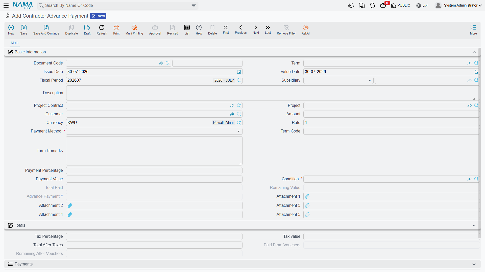

# Subcontractor Advances and Other Payments

A blockwork subcontractor cannot start without buying scaffolding, hiring a gang and putting a
mixer on site, and he will not have been paid a penny yet because nothing has been measured. So you
pay him up front — a mobilisation advance — and you get it back out of the extracts he earns later.
That is the whole idea behind the **Contractor Advance Payment** (دفعة مقاول باطن مقدمة), and behind
its twin the **Contractor Other Payment** (دفعة مقاول باطن أخرى), which does the same job for money
paid to him that is not a mobilisation advance at all.

Both live under **Contracting > Contractor Contracting**.

## What is the same as the project side

The document is the mirror of
[Project Advance Payments](/modules/contracting/project-contracting/contracting-project-advances.md),
with the direction of money reversed: there the client advances money to you and receipt vouchers
bring the cash in; here you advance money to a subcontractor and **payment vouchers** take it out.
The recovery mechanism — a recovery rule on the document, and a condition line on each later extract
that consumes it — is identical.

Two things are different, and both matter:

- There is a **second document**, the other payment, with no owner-side equivalent.
- The recovery competes with the fines and the material charge-backs that also come off a
  subcontractor's extract, and all of them are held to the same ceiling and the same
  no-negative-balance rule.

## The example this page follows

Subcontract **CC-0042**, blockwork, 2,000 m² at 40 → **80,000**. Before the gang arrives you pay a
mobilisation advance of **16,000** — 20% of the subcontract — and agree that it comes back at 20% of
the value of each extract. The subcontract will produce three extracts worth 32,000, 28,000 and
20,000.

## The document

It is a short document. Pick the **Contract** and the subcontractor, project, project contract and
client fill themselves. Type the **Amount** and the currency; add a **tax percentage** if the advance
is taxed and the tax value and the total after taxes are worked out for you. Then the two fields that
make the document do anything:

**Payment Method** is the recovery rule. Five choices, and the amount taken off each future extract
depends entirely on which you pick:

| Payment Method | What comes off each extract |
|---|---|
| First Next Extract | the whole remaining balance, on the very next extract |
| Fixed Value With Every Extract | the fixed amount you typed, or the remaining balance if that is less |
| Percentage With Every Extract | that percentage of the advance's own value |
| Percentage From Due Value With Every Extract | that percentage of **the extract's** value |
| Final Extract | nothing at all until the Final extract, then the whole remaining balance |

The screen follows your choice: the **Payment Percentage** field is only enabled for the two
percentage methods, and the **Payment Value** field only for the fixed-value method. Whichever the
method needs is required before the document will save.

**Condition** is the clause the recovery will post through — the same kind of clause that carries
retention, from the
[contract conditions](/modules/contracting/setup/contracting-conditions.md) catalogue. It is required,
and it is what decides which accounts the recovery entry lands on when the extract collects it. The
picker only offers conditions that have not been marked as belonging to the owner side.

Two optional fields are worth knowing. **Term Code** restricts the advance to one subcontract term,
which is how you keep an advance for the blockwork out of the plastering surveyor's extracts; if you
fill it, it must be a term that exists on the contract. **Subsidiary** (الذمة) is the account the
money is paid from or to when your chart of accounts wants it stated on the document.

::: tip Standardise the recovery on the document term
Picking the **document term** (توجيه) pre-fills the payment method, the percentage, the value and the
condition from the term's settings. That is how a company makes "all mobilisation advances recover at
20% of each extract, through the advance-recovery clause" a rule rather than a habit — the surveyor
picks the right book and the fields arrive correct.
:::

Two read-only fields track the recovery — **Total Paid** and **Remaining** — and two more track the
cash, **Paid From Vouchers** and **Remaining After Vouchers**, because paying the advance and
recovering it are separate stories. Each advance also gets a sequential number within its
subcontract, so the second advance on CC-0042 is advance number 2 regardless of the document book.

## What it books

Committing the advance sends an accounting **business request** (طلب أعمال) to the queue, processed in
the background; failures are visible and retryable from the **Business Requests** view under
**More > Reprocess / Recommit**.

The entry is deliberately simple — two pairs on the document term, and each pair only posts if both
sides are configured:

- the amount, on the main debit and credit pair;
- the tax value, on the tax pair.

Typically that reads **debit "Advances to subcontractors", credit the bank** (or the subcontractor's
payable, if the advance is going to be settled with a voucher later). What makes the mechanism close
properly is what happens next: each recovery on an extract **credits that same advance account
through the condition**, so the advance account nets to zero exactly when the advance is fully
recovered.

## Recovery, extract by extract

Nothing about the recovery is manual. Each
[subcontractor extract](/modules/contracting/contractor-contracting/contracting-contractor-extracts.md)
scans the subcontract for advances, other payments and fines that are committed and still carry a
balance and are dated no later than the extract, and writes a deduction line for each into its
**Additions And Deductions** grid, carrying this document as the condition document. Either the
surveyor presses *Collect Conditions*, or the extract's document term has it collect on every save.

With *Percentage From Due Value With Every Extract* at 20%, the 16,000 advance on CC-0042 unwinds
like this:

| | Extract value | Recovered | Total Paid | Remaining |
|---|---|---|---|---|
| Extract 1 | 32,000 | 6,400 | 6,400 | 9,600 |
| Extract 2 | 28,000 | 5,600 | 12,000 | 4,000 |
| Extract 3 (Final) | 20,000 | 4,000 | 16,000 | 0 |

Because the advance was 20% of the contract and is recovered at 20% of each extract, it clears
exactly as the last extract closes. That is not automatic — set the percentage lower and a balance
survives into the Final extract, where a different rule takes over.

**On a Final extract the whole remaining balance is taken**, whatever the recovery method says. And a
Final extract **refuses to save while any advance, other payment or fine still has a balance** —
*"the payment … for the contract … still has a remaining …"*. In other words the system will not let
you close a subcontract and walk away from money you advanced. Rounding is handled for you: a
remaining balance of a hundredth or less is snapped to zero, so a penny does not keep an advance
alive.

::: info Where to see what was actually recovered
Two places. On the advance itself, **Total Paid** and **Remaining**. On the extract, the
**Statistics** page lists row by row which advance or other payment gave up how much on that extract,
with the term code and the value date — the audit trail for the conversation that starts "why was he
only paid 24,800?".
:::

## What you can and cannot change afterwards

The guards on this document all exist to protect a recovery already in progress:

- **The contract is required**, even though it is not starred on the screen.
- You **cannot reduce the amount below what has already been recovered**.
- You **cannot change the amount at all** once a Final extract exists on the subcontract.
- You **cannot change or remove a term code** that already has recovery transactions against it.
- You **cannot delete** the document once anything has been recovered from it.
- You cannot raise a new advance against a subcontract that a Final extract has already closed.
- The amount is checked against the value of the term it is tied to, so an advance cannot exceed the
  work it is an advance against.

One term option relaxes the arithmetic: it allows the remaining balance to go **negative**, for
organisations that would rather over-recover and settle up than have a save refused.

## The other payment, and when to use it

The **Contractor Other Payment** is, in every mechanical respect, the same document: the same screen,
the same payment methods and condition, the same recovery machinery, the same validations, its own
sequential number. Ask it to behave differently and it will not.

What it gives you is **separation**. It is a different document type with its own book, its own
numbering and — because the accounts come from the document term, and the term is per document type —
**its own pair of accounts**. So you post a mobilisation advance to "Advances to subcontractors" and
an accommodation payment, a fuel float, a loan or a one-off settlement to "Other receivables —
subcontractors", and your trial balance tells the two apart without anybody reading document
descriptions. If your chart of accounts does not care about the distinction, you do not need the
document.

The more interesting question is why either document exists when the extract can already carry
additions and deductions. The answer is that **an extract can only value contracted work**. Every
detail line on an extract is a term of the subcontract with a quantity and a price, and committing it
moves that term's billed quantity. A fuel float has no term, no quantity and no unit price; putting
it on an extract line would corrupt the contract's progress figures and make the bill of quantities
lie. So it is raised as its own document, books its own entry, and comes back through the conditions
grid — which is the part of the extract designed to carry money that is not work.

The third document that rides exactly the same machinery is the
[subcontractor fine](/modules/contracting/contractor-contracting/contracting-contractor-fines.md) —
money he owes you rather than money you lent him — and the clause each of them recovers through was
agreed when the
[subcontract](/modules/contracting/contractor-contracting/contracting-contractor-contract.md) was
signed.
