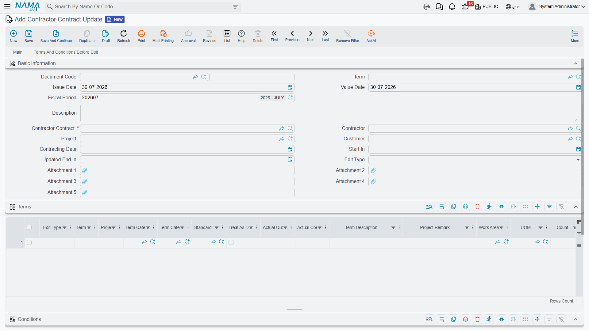
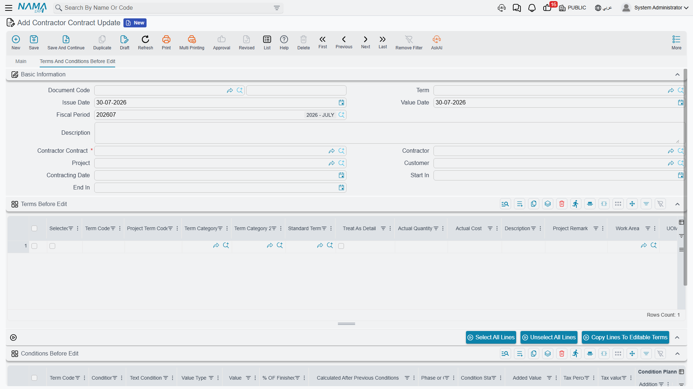

# Subcontract Updates

Scope moves. The client adds 300 m² of wall, a rate is renegotiated after the first month, an item nobody priced has to be added, the programme slips. Early in a subcontract's life you simply open it and edit it — but [the subcontract](/modules/contracting/contractor-contracting/contracting-contractor-contract.md) freezes its prices, quantities and conditions as soon as the first extract has been certified against it, and from that point the sanctioned way to change it is this document.

::: tip It is the same document as the owner-side variation order
The subcontract update and the [project contract update](/modules/contracting/project-contracting/contracting-project-contract-updates.md) are one mechanism with two front doors: the same behaviour, the same buttons, the same "before" grids, the same rules about ordering and cancellation. **Read that page for how a variation order works.** This page covers only what is different when the contract being amended is a subcontract — which is three fields and one important consequence.
:::

Unlike the offer and the subcontract, this **is** a real document: a book, a document code, an issue date, a value date, a fiscal period and the platform's audit trail — which is the point of it, because a change to a signed agreement needs a dated, numbered, attributable record of its own. It has a *Document Term* field because every document does, but **there are no contracting term options for this document type**, and it produces **no journal entry**. A variation order changes the contract's numbers; the money consequence appears on the next [extract](/modules/contracting/contractor-contracting/contracting-contractor-extracts.md).

You will find it at **Contracting > Contractor Contracting > Contractor Contract Update**, under licence `contracting`.

## The same headline behaviour as the owner side

Three things carry over from the owner-side page and are worth restating rather than making you follow a link mid-task.

::: warning The subcontract is overwritten in place. There is no versioning.
There is no contract-version table and no effective-dated subcontract. Committing an update opens the subcontract, rewrites its terms and conditions, and re-commits it. The record you look at tomorrow is simply the amended one.

The history therefore lives outside the contract: in the chain of update documents, each carrying its own frozen "before" snapshot, and in the platform's audit trail. To answer "what did CC-0042 look like in April?" you read the update documents in order.
:::

::: warning The Conditions grid replaces the contract's conditions wholesale
Condition lines have no edit type and there is no line-by-line diffing. Leave the *Conditions* grid **empty** and the subcontract's clauses are left alone. Put **anything** in it and it becomes the contract's **complete new list** — every clause not in your grid is deleted. If CC-0042 carries a retention clause and you raise an update to add a penalty clause, list **both**.
:::

::: warning Re-pick the contract on an update that has been sitting around
The contract's term list after commit is *the snapshot plus your changes*, and the snapshot is taken when you choose the contract. If you drafted the update in May, somebody added a line to the subcontract in June by another route, and you commit in July, that June line is deleted. Re-picking the **Contractor Contract** field re-snapshots the contract as it now stands. Duplicating an update (نسخة مماثلة) deliberately clears both "before" grids for the same reason.
:::

Those two grids do two jobs at once, and it is worth seeing them as both. They are the **pick-list**: you tick the lines you intend to amend and copy them across to the editable grids, so you never re-key a term. And they are the **undo image**: they are what the subcontract is rebuilt from if the update is cancelled. That is why a stale snapshot is dangerous and why re-picking the contract refreshes it.

The three edit types behave as they do on the owner side: **Add** (إضافة) inserts a new line after the code in *Add After* and can derive its term code for you; **Edit** (تعديل) overwrites the matching contract line's content *without touching the system progress figures*, so quantities already measured, certified and costed survive a change of rate; **Delete** (حذف) removes it. The header edit type is only a default stamped onto lines as they arrive in the grid — it is the line's own value that is obeyed.

## What is different on a subcontract update

**The contract field is the subcontract.** Choosing **Contractor Contract** fills the client, the contracting date, the start date and the end date — all then read-only — and snapshots every term line and every condition line into the two "before" grids.

**Two extra header fields.** Picking the subcontract also fills the **Contractor** and the **Project**, so the document says on its face whose agreement is being varied and on which job. On the owner-side document neither field exists.

**A project term code column in the terms grid.** The cross-reference that ties a subcontract line to the client-contract item it delivers appears here too, immediately after the term code — and its picker suggests **from the client contract's own terms**, so you can only ever tie the line to an item Al-Fanar's contract actually carries. When the edit type is *Edit*, choosing a term code brings the project term code across with the rest of the line, so an amendment does not quietly orphan the line from the client contract.

And that last point leads to the consequence that matters most on this side:

::: warning An update is not a way around the cross-subcontract quantity ceiling
The update re-commits the subcontract through its ordinary route, so **every rule on [the subcontract page](/modules/contracting/contractor-contracting/contracting-contractor-contract.md) applies** — including the two checks that exist only on the cost side. Raise a quantity beyond what the client contract carries for that item, across all subcontracts on it, and the commit fails and names the totals. Leave a new line's project term code blank and the commit fails on that too. Vary the client's contract first, then the subcontract.
:::

## The worked example: 300 m² more blockwork

CC-0042 is three months in. One extract has been certified — 800 m² of the 2,000 — so the subcontract is frozen. Al-Fanar has since varied its own contract to 2,300 m² of blockwork through a [project contract update](/modules/contracting/project-contracting/contracting-project-contract-updates.md), and the extra wall is going to the same firm.

The subcontract before:

| Code | Term | Quantity | Unit price | Total price | Certified so far |
|---|---|---|---|---|---|
| `3.01` | Blockwork 200 mm | 2,000 m² | 40.00 | 80,000 | 800 m² |

Retention clause 10% → planned deduction 8,000, total due value 72,000.

The update document:

1. New update, value date 1 June. **Contractor Contract** = CC-0042. The client, the contractor, the project, the contracting date and the dates fill themselves; the single term line and the retention clause are snapshotted into the "before" grids.
2. On the "before" terms grid, tick line `3.01`, set the header **Edit Type** to *Edit*, and press **Copy Lines To Editable Terms** (نقل السطور الي البنود المعدلة). One editable row appears, already carrying the project term code `3.01`.
3. Change its quantity from 2,000 to **2,300**. The rate stays at 40.
4. Leave the **Conditions** grid empty — the retention clause is not changing, and anything typed there would become the contract's complete new list of clauses.
5. Optionally set **Updated End In** to the new completion date, four weeks out.
6. Commit.

The subcontract after:

| Code | Term | Quantity | Unit price | Total price | Certified so far |
|---|---|---|---|---|---|
| `3.01` | Blockwork 200 mm | **2,300 m²** | 40.00 | **92,000** | 800 m² — *preserved* |

Total 92,000, retention now planned at **9,200**, total due value **82,800**, and the end date moved. The 800 m² already certified came through untouched, so the next extract still shows 800 as the previously certified quantity and bills only what is measured next.

And — the point worth repeating — **none of this produced a journal entry**. The extra 12,000 of commitment reaches the ledger only as the extra wall is built and certified.

Had the order been reversed — the subcontract raised to 2,300 while the client contract still carried 2,000 — the commit would have been refused, because the total sublet against that client-contract item would have exceeded what was sold.

## What blocks a commit or a delete

| Rule | Message you will see |
|---|---|
| No **later** update may already exist for this subcontract. Value dates are compared, and for same-day documents the order they were created in. | *"Cannot edit document … on date … because of the update document …"* |
| The contract may not be swapped once the document has been saved. | *"Cannot change contract from … to … in document …"* |
| The same term code may not appear twice with the same edit type. | *"The term code … with edit type … is repeated in lines … and …"* |
| **Add After** is required on any *Add* line. | column-required |
| An *Add*, *Edit* or *Delete* line must match a code the snapshot actually has. | *"Could not find term line with the code …"* |
| Deleting the update is refused while a later update exists for the contract. | *"Cannot delete document … because of the update document …"* |
| Anything the subcontract itself rejects, since it is re-committed on your behalf. | the subcontract's own messages |

Cancelling an update restores the subcontract from the two snapshots — which also restores the progress figures as they stood **when the snapshot was taken**, so after cancelling an old update, check those figures.

## Where to read next

- [Subcontracts](/modules/contracting/contractor-contracting/contracting-contractor-contract.md) — the record this document rewrites, and the freeze that makes it necessary.
- [Project contract updates](/modules/contracting/project-contracting/contracting-project-contract-updates.md) — the same document on the revenue side, described in full.
- [Subcontractor extracts](/modules/contracting/contractor-contracting/contracting-contractor-extracts.md) — where the amended quantity becomes money.
- [The subcontractor cycle](/modules/contracting/contractor-contracting/contracting-contractor-cycle.md) — the chain this sits in.
