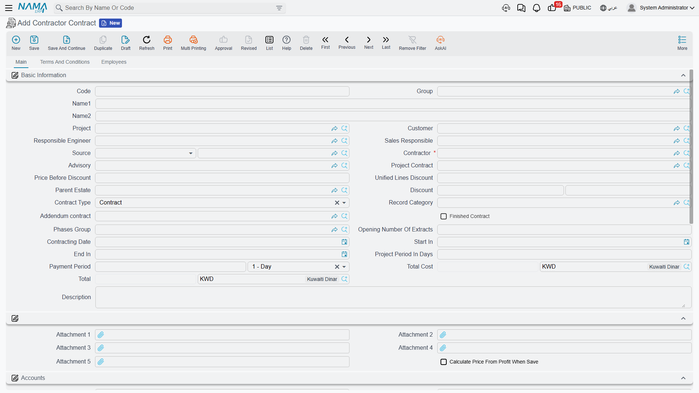
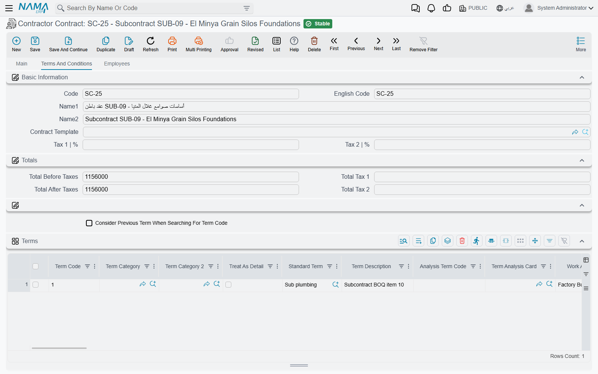

# Subcontracts

The subcontract is the centre of gravity of the cost side, exactly as [the project contract](/modules/contracting/project-contracting/contracting-project-contract.md) is of the revenue side: the rates you have agreed to pay one firm for one package, the clauses that will reduce every certificate you issue him, his instalment plan, his site team — and the record that then accumulates, line by line, how much of the package has been measured, certified and paid.

Structurally the two records are the same thing. The subcontract is built from the same term lines, the same conditions, the same phases and the same validation as the project contract, and the sensible way to use these pages is to read [the project contract page](/modules/contracting/project-contracting/contracting-project-contract.md) for how a bill of quantities behaves on a contract, and this page for what changes when the money flows outward.

You will find it at **Contracting > Contractor Contracting > Contractor Contract**, under licence `contracting`.

::: tip Master file, no term, nothing posted
A subcontract has **no document book, no document code, no value date, no fiscal period and no document term (توجيه)** — it has a code, a group, an Arabic name and an English name. Because there is no term there are no accounts on it, so **saving or amending a subcontract produces no journal entry and no stock movement**. Cost and the payable reach the ledger only when a [subcontractor extract](/modules/contracting/contractor-contracting/contracting-contractor-extracts.md) is issued against it, using the accounts on the [standard terms](/modules/contracting/setup/contracting-standard-terms.md) and on the extract's own document term.
:::

That is the rule, and it is true. But it is not quite the same thing as "nothing happens when you save":

::: warning Committing a subcontract creates the subcontractor's financial papers
Each line of the payments grid can mint a **commercial paper** — a cheque or promissory note — **issued to the contractor**, with an issued status, when your [module configuration](/modules/contracting/contracting-configuration.md) allows this document type to create them. This is the one real side effect of signing. It is the mirror of the owner contract, where the same grid produces papers *received from* the customer, and it catches people who have just been told that a subcontract books nothing: no journal entry is created, but real paper appears in the treasury.
:::

Our worked example is subcontract **CC-0042** on the **Tower A** project for **Al-Fanar Development**: the blockwork package, 2,000 m² at 40 — **80,000** — with **10% retention** withheld from every certificate, and a **16,000** mobilisation advance which is a document of its own rather than a line on this screen.

## How a subcontract gets its content

Three routes, and none of them is a "copy terms" button — there is no such button anywhere in the module.

**From a subcontractor's quotation.** *Convert To Contract* on a [subcontractor offer](/modules/contracting/contractor-contracting/contracting-contractor-offers.md) opens a new subcontract with his terms, his rates and his conditions already in place, and a **Source** reference back to the offer.

**From what you sold.** *Convert Selected Lines To Contractor Contract* on the [project contract](/modules/contracting/project-contracting/contracting-project-contract.md) is the natural route when you are simply subletting part of your own scope: tick the client-contract lines you are giving away and a subcontract opens carrying them, with this contract as its **project contract** and as its source. The same conversion exists on a [contracting assay](/modules/contracting/project-contracting/contracting-assays.md) and on both [budgets](/modules/contracting/budgets/contracting-executive-budget.md).

**From a template.** Choosing a [contract template](/modules/contracting/setup/contracting-contract-templates.md) in the *Contract Template* field on page 2 copies the template's terms and conditions onto the record. Selecting the template is what triggers the copy; there is nothing to press afterwards.

When the source is a project contract, the contract does one more thing for you on save: it fills the **project contract** field from the source, and then stamps that project contract onto every term line.

## The header — and the nine lists underneath it

The basic-information block is the project contract's, with three fields that are particular to this side:

| Field | Why it matters |
|---|---|
| **Contractor** (مقاول باطن) | mandatory — the firm you are paying, and the party the payable will stand against |
| **Project Contract** (عقد المشروع) | the client contract this package sits inside. Filled for you when the subcontract came from a project contract, and the anchor for the cross-checks described below |
| **Advisory** (الإستشاري) | the consultant, where one supervises the package |

Then the familiar ones: **Project** and **Customer** — the *client's* project and the *client*, carried as context because a subcontract always lives inside a client contract — the responsible engineer and sales owner, the **Contract Type** with its *Contract* / *Addendum* / *Modify To Contract* values, and the field whose English caption reads *Addendum contract* but which is in fact the **main, parent contract** this one hangs off (the Arabic `العقد الرئيسي` says it correctly). **Finished Contract** is switched on for you by a Final extract, and **Opening Number Of Extract** seeds extract numbering for a package migrated in mid-life with certificates already issued elsewhere.

The dates — contracting date, start, end, project period in days — and the **Payment Period** (مدة السداد) matter more here than they look: the payment period is what the extract uses to work out when his certificate falls due.

Two blocks follow that are easy to skip past. The five **attachments** and the *calculate price from profit when save* checkbox sit together in an untitled group. And the **Accounts** and **Taxes** blocks make *the subcontract itself* an accounting subsidiary, so a company that wants each package's balance separately visible can post to the contract rather than to the contractor.

Then comes the part that has no owner-side equivalent, and it is the reason this screen is the first one a site accountant opens: **nine collapsible lists**, all filtered to this subcontract, sit directly on the main page rather than on a Statistics page.

| The list | What it answers |
|---|---|
| Contractor Contract Execution | what has been measured |
| Contractor Extract | what has been certified and booked |
| Fine Documents | what he has been penalised |
| Daily Labor Book | the labour recorded against the package |
| Equipment Statement Document | the equipment statements raised on it |
| Contractor Advance Payment | what he was paid up front |
| Contractor Other Payment | other payments made outside the certificates |
| Contractor Material Issue | material sold to him |
| Contractor Material Return | material he handed back |

Below them sit a free *Additional Info* grid — a scratch pad of numbers, texts, dates and references that nothing in the system reads — and the dimensions block.

## Page 2 — terms, conditions and payments

### The terms grid

This is the bill of quantities you are buying, and it behaves exactly as it does on a project contract: every row points at a mandatory **Standard Term** which supplies the unit, the default rate and the accounts the extract will post to; dotted **term codes** form a tree in which only leaf rows carry money and parent rows are zeroed and re-totalled from their children on every save; **Treat As Detail** forces a heading term to behave as a priced line here; **Update Codes** and **Update Empty Term Codes Only** sit above the grid, the second being the safe one.

CC-0042 carries a single priced line:

| Code | Standard term | UOM | Quantity | Unit price | Total price | Project term code |
|---|---|---|---|---|---|---|
| `3.01` | Blockwork 200 mm | m² | 2,000 | 40.00 | **80,000** | `3.01` |

Read the money in the right direction. **Unit price on a subcontract is what you pay**, not what you charge — and the 40 here is the same 40 that appears as the *unit cost* of blockwork on Al-Fanar's contract, where you sell it at 46. That is the whole commercial point of the package, and this grid is where the two numbers meet.

Three families of column are worth separating:

**What you fill.** Quantity, unit price, the discount and tax pairs, the **permitted percentage** (the tolerance above the contracted quantity that measurement is allowed to reach), the physical dimensions and count, the warranty block, work area and the term categories.

**The cross-references, which exist only on this side.** The **project term code** and its two budget siblings — the estimated and executive budget term codes, each with a remark column. The project term code is not decoration:

::: warning Every priced line must name the client-contract item it belongs to
Unless the module configuration says the project term code may be empty in subcontracts, **the save fails on any non-parent line whose project term code is blank**. It is the single most frequently hit validation on this screen, and it exists because almost everything interesting on the cost side is computed by grouping subcontract lines by the client-contract item they deliver.
:::

**What the system fills.** *Quantity | From Execution*, *Quantity | From Extract*, *Quantity | From Cost Execution*, the actual quantity and actual cost, the purchase-order quantity, and the per-phase measured and certified quantities. You never type them. After the first certificate on CC-0042, line `3.01` still reads 2,000 contracted while its *from extract* quantity reads 800 — which is why this record, and not a report, is where you look to see where the package stands.

### The conditions grid

A condition is a money rule that will be applied to every extract, not a note. Each line names a **Condition** from the [conditions catalogue](/modules/contracting/setup/contracting-conditions.md), a value type and a value, optionally narrowed to one term code and one phase. Whether the amount is added to or deducted from what he is paid comes from the condition master file, not from the line.

CC-0042 has one:

| Condition | Value type | Value | Planned deduction |
|---|---|---|---|
| Retention | Percentage From Total | 10 | **8,000** |

Which is why the header's *Total Due Value* reads 72,000 against a *Total* of 80,000. The 8,000 is not deducted once — 10% is withheld from each certificate as it is issued, and released later under a separate agreement. The columns showing what has actually been deducted so far are maintained by the extracts and disabled on screen.

The 16,000 advance is **not** a condition line. An advance is [its own document](/modules/contracting/contractor-contracting/contracting-contractor-advances-and-payments.md), which names a condition from the catalogue and then presents itself on later extracts as a deduction until it has been recovered; [fines](/modules/contracting/contractor-contracting/contracting-contractor-fines.md) work the same way. So the conditions grid holds the standing clauses of the agreement, and the events arrive from their own documents.

### The payments grid

Instalment code, description, percentage, value, paid value, remaining, payment date, and the commercial paper the instalment is settled by — the same grid as on the owner contract, filled by hand or by choosing a **Payment Template** and letting the system spread the amount over a number of instalments with a grace period and a rounding rule. What is different is only the direction: these papers are issued *to* the subcontractor, as described at the top of this page.

## The Employees page

The third page carries the site team assigned to this package, with a from-date and a to-date on each row. The grid's column heading reads *Technician* while the page and the collection are called *Employees*; read it as "the assigned employee". Like the additional-info grid, these rows are documentary — nothing validates or costs them.

## The work breakdown, and the phase ceiling

The three axes are the project contract's and they do not nest inside one another: the **term tree** carries the money, **work areas** are a separate descriptive tree that is copied forward but never filtered or totalled on, and **phases** are milestones held on the line itself.

::: warning Phases are exactly five slots
A term line has five fixed phase slots, not a list. A phases group with more than five phases silently fills only the first five, and the contract then fails its "phase price percentages must add up to 100%" check — with a message that points at the contract even though the problem is in the group. Design [phase groups](/modules/contracting/setup/contracting-phases-and-work-areas.md) with five phases or fewer.
:::

## Two checks that exist only on this side

Both are about the relationship between what you sold and what you are subletting, and both are the reason the project term code is mandatory.

**You cannot sublet more than you sold.** When the subcontract names a project contract, the save adds up the quantity of **each client-contract item across every subcontract on that client contract** and refuses if the total exceeds the quantity on the client contract itself — *"The total of contractor contracts for term … in the project contract … is …, while term quantity is …"*. Al-Fanar's contract carries 2,000 m² of blockwork; CC-0042 takes all of it, so a second blockwork subcontract on the same item would be refused until the client's contract is varied. A module configuration option lifts the check for organisations that would rather over-let and vary afterwards.

**A confirmed assay cannot be reused.** If the subcontract is based on a [contracting assay](/modules/contracting/project-contracting/contracting-assays.md) whose status is confirmed, the save is refused unless the module configuration permits editing and more than one contract on the same assay.

## What else blocks a save

| Rule | Note |
|---|---|
| At least one term line | an empty contract cannot be saved |
| Term codes must be unique | *"Can not insert a dublicated term"* |
| Tax percentages must not exceed 100 | on lines and on the header |
| A condition's term code must exist among the contract's term codes | and the same condition may not be repeated for the same term and phase |
| The main contract is required when the contract type is *Addendum* | |
| Line rates must satisfy the [price list](/modules/contracting/setup/contracting-price-lists.md), where one applies | |
| The budget term codes must be consistent where they are filled | |
| Every non-parent line needs its project term code | unless the configuration says otherwise |
| The total sublet per client-contract item may not exceed what was sold | unless the configuration says otherwise |

## Once an extract exists, the subcontract freezes

As soon as **any** extract has been issued against the subcontract — and unless your configuration explicitly allows editing prices and quantities after extracts — the header's commercial fields, every condition line, and the term lines that have been measured or certified all become read-only.

Untouched lines stay editable and you can still add new ones. For anything else you raise a [subcontract update](/modules/contracting/contractor-contracting/contracting-contractor-contract-updates.md), which is the audited path through the freeze. Note that the update re-commits the contract through its ordinary route, so every rule on this page — including the two checks above — still applies to it.

## Where to read next

- [The subcontractor cycle](/modules/contracting/contractor-contracting/contracting-contractor-cycle.md) — where this record sits, and the full list of ways this side differs from the owner side.
- [Subcontract updates](/modules/contracting/contractor-contracting/contracting-contractor-contract-updates.md) — the variation order.
- [Subcontractor execution](/modules/contracting/contractor-contracting/contracting-contractor-execution.md) and [subcontractor extracts](/modules/contracting/contractor-contracting/contracting-contractor-extracts.md) — what writes back onto these term lines, and what finally books.
- [Advances and other payments](/modules/contracting/contractor-contracting/contracting-contractor-advances-and-payments.md), [fines](/modules/contracting/contractor-contracting/contracting-contractor-fines.md) and [material sold to a subcontractor](/modules/contracting/costs/contracting-contractor-materials.md) — the documents that arrive on his certificates as deductions.
- [Project contracts](/modules/contracting/project-contracting/contracting-project-contract.md) — the same record on the revenue side, described in full.
- [Standard terms](/modules/contracting/setup/contracting-standard-terms.md), [conditions](/modules/contracting/setup/contracting-conditions.md), [phases and work areas](/modules/contracting/setup/contracting-phases-and-work-areas.md) and [contract templates](/modules/contracting/setup/contracting-contract-templates.md) — the vocabulary this screen is built from.
