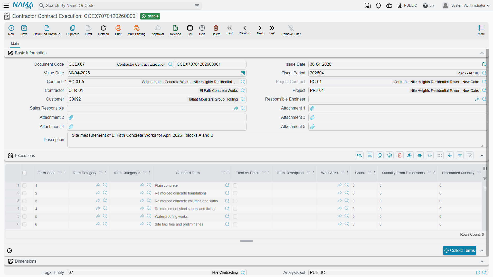

# Subcontractor Execution

A subcontractor's invoice is only as trustworthy as the measurement behind it. Before you certify
that the blockwork gang is owed money for 800 square metres of wall, somebody has to stand on the
floor slab with a tape measure and write down that 800 square metres of wall exist. That written
record is the **Subcontractor Execution** — حصر كميات مقاول باطن — and its whole purpose is to
separate *measuring* from *paying*, so that the quantity surveyor who raises the extract is billing
measured work rather than typing numbers freehand.

You will find it under **Contracting > Contractor Contracting > Contractor Contract Execution**.

## What is the same as the project side

Mechanically this document is the twin of
[Project Execution](/modules/contracting/project-contracting/contracting-project-execution.md): the
same *Collect Terms* button, the same quantity columns, the same incremental rule, the same
percentage and dimension shortcuts, and the same total pushed back onto the contract's term lines.
Read that page for the measuring mechanics in full; this page covers only what changes when the work
being measured belongs to a subcontractor rather than to you.

The differences are short and worth knowing before you open the screen:

- The contract it points at is a **subcontract**, so the term codes offered are the subcontract's
  terms — the slice of the job you handed out — not the whole client contract.
- The project and the **project contract** are both carried on the header as context, because a
  subcontract always lives inside a client contract.
- It needs **no document term** (توجيه). There is nothing to configure and nothing to route; the
  document has no accounting or inventory effect whatsoever.
- The extract it feeds is a subcontractor extract, and money will flow **out** as a result.

## The one rule that catches everybody: each document is a period, not a total

The **current quantity** column is what you fill, and it means *what was measured this time*. It is
not the running total. The system keeps the running total for you in the two read-only columns beside
it: the **previous quantity** is everything measured on earlier executions of this subcontract for
the same term and phase, and the **total quantity** is simply the two added together.

Carry the blockwork example. Subcontract **CC-0042** with the blockwork subcontractor covers term
**3.01**, *blockwork 200 mm*, with a contracted quantity of **2,000 m²** at **40** each — an
**80,000** subcontract.

**End of month one.** The site engineer measures 800 m² of finished wall and raises the first
execution:

| Column | Value |
|---|---|
| Contracted quantity | 2,000 |
| Previous quantity | 0 |
| **Current quantity** | **800** |
| Total quantity | 800 |
| Execution percentage | 40 |

**End of month two.** Another 200 m² go up. The second execution is not for 1,000 — it is for
**200**:

| Column | Value |
|---|---|
| Previous quantity | 800 |
| **Current quantity** | **200** |
| Total quantity | 1,000 |

Half the blockwork is now certified, and the subcontract's term line carries **1,000** as the
quantity measured from executions. If you had typed 1,000 into the second document you would have
told the system that 1,800 m² of wall exist.

::: tip You can type the total if you prefer thinking that way
Fill the **manual total** column instead and the system works backwards: the current quantity becomes
your total minus the previous quantity. Typing 1,000 there on the second document gives you a current
quantity of 200 — the right answer, reached from the other direction.
:::

There are two more ways in. Type an **execution percentage** and the quantity is derived from the
contracted quantity. Or, when the module configuration adds the dimension columns, type a count and
length, width and height and let the quantity come out of the arithmetic.

## Filling the grid

Press **Collect Terms** and the document loads itself from the subcontract: one line per term, or
one line per phase where a term is split into phases, each line arriving with its unit, its
contracted quantity, its description and its work area already in place, and with the previous
quantity fetched from the earlier executions on that subcontract.

Two things it deliberately does *not* do. It leaves the current quantity **empty** — that is the
engineer's job, and nothing else on the document is allowed to guess it. And it skips **parent**
term codes, the headings in a dotted term tree, unless the module configuration has been set to show
main term codes in executions; a heading is a total, not a wall you can measure.

You can also add lines by hand. Pick a term code (and a phase if the term has phases) and the same
descriptive columns, unit price, unit cost, contracted quantity and previous quantity fill
themselves; the phase picker is narrowed to the phases that term actually uses.

## What the save checks

Five things, and all five are worth understanding because each has a business reason:

1. **The grid may not be empty.** A measurement with nothing measured is not a document.
2. **The project must match the subcontract's project.** Both fields are filled from the contract,
   so this only fires if somebody has edited one of them.
3. **The client must match the subcontract's client.** The client on a subcontractor document is the
   *project's* client, copied down from the subcontract — the practical advice is to leave the field
   exactly as the contract filled it.
4. **You may not measure more than the contract allows.** Each contract term carries a permitted
   percentage — a tolerance above the contracted quantity — and the cumulative measured quantity is
   checked against it. Measuring 2,150 m² against a 2,000 m² term with a 5% tolerance is accepted;
   2,300 m² is refused. There is a module configuration option that lifts the check for
   organisations that would rather vary the contract afterwards.
5. **An execution an extract has already consumed can be frozen.** When the module configuration
   turns on the rule that prevents updating an execution once an extract exists on it, the save is
   refused and names the extract. This is the option to switch on if you want measurements to become
   evidence the moment they are billed.

## What committing it changes

Nothing in the ledger and nothing in the warehouse — this document moves no money and no stock. What
it does move is the picture on the subcontract:

- Each contract term line's **quantity from executions** and, where phases are used, each phase's
  measured quantity are brought up to date, and parent lines are re-totalled from their children.
- Any **later** execution on the same subcontract has its previous quantity and its percentages
  re-based. So if you discover in March that January's measurement was wrong, correcting January
  quietly fixes February's running totals as well.

## How the extract picks it up

On a new [subcontractor extract](/modules/contracting/contractor-contracting/contracting-contractor-extracts.md)
you have two mutually exclusive routes, and this document is the first of them:

- Put the execution in the **Based On** field. The extract pulls the measured lines in and, unless
  its document term allows otherwise, the billed quantities must stay exactly as measured. The
  picker only offers executions of the same subcontract that no extract has taken yet, and two
  extracts can never share one execution.
- Or leave **Based On** empty and press *Collect Terms* on the extract itself, which reads the
  subcontract directly. The extract refuses to collect terms while *Based On* is filled — it is one
  route or the other, never both.

When an extract built from an execution is committed, it writes back: the execution is marked as
extracted, and each of its lines records how much of it was billed. That is what stops the same
800 m² of wall being paid for twice.

Recording an execution is **optional**. Plenty of organisations raise the extract straight off the
subcontract and let the extract be both the measurement and the bill. The cost of doing that is
exactly the control this document exists to give you: no independent record of what was measured,
and no separation between the engineer who measures and the surveyor who bills.
