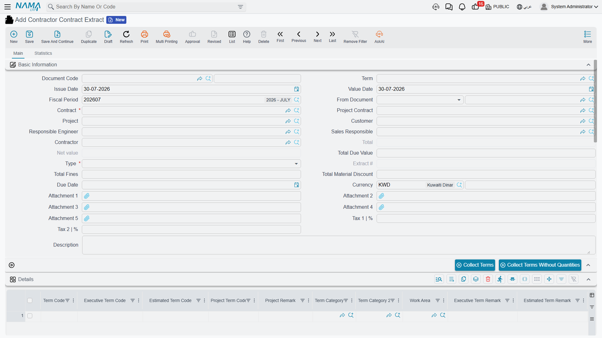
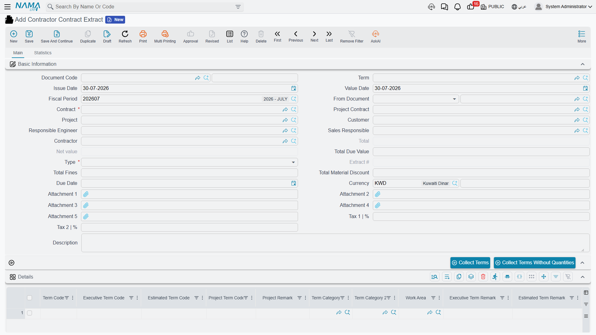
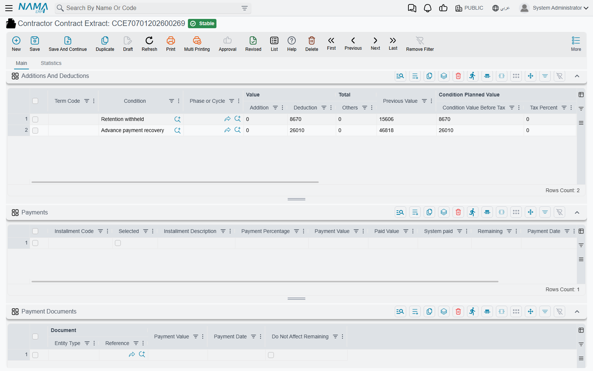

# Subcontractor Extracts

Everything else on the subcontractor side is preparation. The subcontract records what you agreed,
the execution records what was built, the advance records what you lent him and the fine records what
he owes you back — and none of those four reaches the general ledger. The **subcontractor extract**
(مستخلص مقاول باطن) is the one document that does. It is his payment application: the certificate
that says *this much work was done this period, this much is being held back, this much of your
advance is coming off, and this is what you will actually be paid.*

You will find it under **Contracting > Contractor Contracting > Contractor Contract Extract**.

## What is the same as the project extract

The document is built from the same machinery as the owner-side
[Project Extract](/modules/contracting/project-contracting/contracting-project-extracts.md): the same
details grid and *Collect Terms* buttons, the same incremental billing quantity, the same conditions
grid, the same strict time ordering between extracts on one contract, and the same three extract
types. Read that page for the shape of the document; this page is about the ways the cost side
differs, and there are more of them here than anywhere else in the module.

The headline differences:

| | Project extract | Subcontractor extract |
|---|---|---|
| Direction of money | a receivable — the client owes you | a **payable** — you owe the subcontractor |
| Settled by | receipt vouchers | **payment vouchers** |
| Deductions collected from | contract conditions, project advances, project fines | contract conditions, **subcontractor advances, other payments, fines — and material you sold him** |
| Taxes | a tax-term mechanism derives the tax lines automatically | tax percentages typed on the document |
| Actual-cost accounting entries | yes | no — the amounts are always zero on this side |
| Closing the contract | — | a **Final** extract marks the subcontract finished |

## The example this page follows

Subcontract **CC-0042**, blockwork, with the blockwork subcontractor:

| | |
|---|---|
| Term **3.01** *blockwork 200 mm* | 2,000 m² contracted at **40** → **80,000** |
| Retention condition on the contract | **10%** deduction, «استقطاع ضمان» |
| Mobilisation advance already paid | **16,000**, recovered at 20% of each extract's value |
| VAT | **15%** |
| Cement sold to him during month one | 80 bags at 30 → **2,400** |

Three extracts will bill the 2,000 m²: 800, then 700, then a Final 500.

## Anatomy: three grids, three different ways of filling them



The header identifies the document and the money. **Contract** is the subcontract, and picking it
fills the contractor, the project, the responsible engineer and sales owner, the client — and the
**project contract**, which is then locked, because a subcontract can only ever sit inside one client
contract. The due date is worked out from the payment period agreed on the subcontract. **Type** is
Initial, Ongoing or Final, and **Extract Number** is filled on commit: a sequence per subcontract, so
the third extract on CC-0042 is number 3 no matter how many extracts exist elsewhere.

Below that sit the two grids that matter.

### The details grid — the work



One line per term, or per phase of a term. It is a wide grid — sixty-odd columns — but the money
comes from a handful of them:

| Column | What it is |
|---|---|
| **Term Code** | which line of the subcontract is being billed |
| Contracted Qty | the subcontract's quantity for that term, for reference |
| Previous quantity | everything billed on **earlier** extracts of this subcontract |
| **Quantity \| Paid Amount** | **the quantity being billed on this extract.** This is the field you fill and the number every value on the line is derived from |
| Total quantity | previous plus current |
| Unit Price / Price | the price from the subcontract, and the extended value |
| Unit Cost / Total Cost | the cost view of the same work |
| Discounts, Tax 1, Tax 2, Net Value | the money block |
| Additions From Conditions / Deductions From Conditions | what the conditions grid contributed to this line |
| Project Term Code, Executive/Estimated Budget Term Code | the cross-references that tie the subcontract item back to the client contract and to the budgets |

Those last three are worth pausing on, because they exist only on this side. A subcontract term is a
slice of a client-contract term: *your* term 3.01 sold to the client may be delivered by three
different subcontractors' term 3.01s. Filling the project term code — which *Collect Terms* does for
you from the subcontract — is what lets the system add up how much of the client's blockwork has been
subcontracted, and it is what makes the write-back described further down possible.

The extract also fills the **analysis term code** and the **analysis card** on each line from the
matching subcontract term, when you leave them empty. That is how the money on this document later
finds its way into cost analysis.

### The conditions grid — everything that moves the net payable



**Additions And Deductions** is the single most important grid on the subcontractor side, because
*every* reduction of what he gets paid arrives here. Retention, advance recovery, other payments
being clawed back, fines, and the material you sold him are not separate mechanisms — they are all
condition lines on this grid. Each carries a **condition** (شرط), the term code it applies to, an
addition value, a deduction value, an other value, a tax percentage and, where the line came from a
document, the **condition document** it came from.

## Filling the details grid

There are two routes and they exclude each other.

**From an execution.** Put a
[subcontractor execution](/modules/contracting/contractor-contracting/contracting-contractor-execution.md)
in the **Based On** field. The measured lines come across, and unless the document term allows
otherwise the billed quantities must stay exactly as measured.

**From the subcontract.** Leave *Based On* empty and press **Collect Terms**. The extract asks the
server what has been measured but not yet billed on this subcontract, builds a line for each, and
then adds a line for every remaining contract term. Each line arrives with its contracted quantity,
its previous quantity, the unit price and unit cost from the subcontract, the term's discount and tax
percentages, and a suggested billing quantity — normally *measured so far minus already billed*.
Parent lines are then re-totalled from their children.

The button refuses to run while *Based On* is filled, and it needs the contract first. There is a
second button, **Collect Terms Without Quantities**, which does everything except suggest the
quantities — the choice for a surveyor who wants the bill of quantities laid out but insists on
typing every figure himself. Two options on the document term change the suggestion as well: one makes every
collected quantity zero, and the other fills it with the quantity remaining after the previous
extract.

::: tip Terms with nothing left to bill are hidden — look in the More menu
*Collect Terms* deliberately skips any term whose remaining quantity has reached zero. When you do
need those lines — a corrective extract, a re-measurement — the variants that pull **every** contract
term regardless (*Collect All Terms* and *Collect All Terms Without Quantities*) are not in the
actions block above the grid; they live in the generic **More** menu.
:::

For the first extract on CC-0042, the line is:

| | |
|---|---|
| Contracted Qty | 2,000 |
| Previous quantity | 0 |
| **Quantity \| Paid Amount** | **800** |
| Unit Price | 40 |
| Price | 32,000 |
| Tax 1 at 15% | 4,800 |
| Net Value | 36,800 |

## Previous extracts, and the three ways a line can be priced

By default the extract is **incremental**: the quantity you fill is this period's quantity, and every
value on the line is that quantity times the price. The previous figures are carried for context and
for printing — each line records the cumulative net value and due value of the earlier extracts for
the same term and phase, so a certificate can show "previously certified / this period / to date"
without any of it affecting what is being paid.

"Previous" means committed extracts on the same subcontract with an earlier value date. Two term
options on the extract's [document term](/modules/contracting/document-terms/contracting-terms-extracts.md)
change the arithmetic, and they cannot both be switched on:

- **Calculate Prices Based On Total Qty** prices the line on the cumulative quantity instead. Be
  precise about what this gives you: the line's pricing does change in every case, but the part that
  then subtracts the previous extract's price and previous discounts only runs when the
  **phase term lines** feature is enabled in the module configuration. Switch it on without that,
  and you get cumulative pricing without cumulative netting — which is almost never what you want.
- **Calculate Prices Diff From Previous Extract Only** works everywhere. It finds the last previous
  extract line for the term and fills a parallel set of difference columns — price difference, net
  value difference, discount differences — and the amount claimed for the line becomes this net value
  minus the previous one. Those difference columns have their own accounts on the document term, so a
  difference-only extract books the movement rather than the gross.

Separately, a header-level option makes the **total due value** cumulative-minus-previous regardless
of how the lines are priced, for organisations whose certificate format expects that.

## Retention, advance recovery and fines: the conditions grid at work

Press **Collect Conditions** above the grid and the extract assembles the deductions from two places.

**From the subcontract's own conditions.** Every clause on the subcontract that is not driven by a
separate document and is not flagged to stay out of extracts is evaluated against this extract's
value. This is how **retention** works. There is no retention field anywhere on the extract; there is
a condition on the contract, and it produces a deduction line here. Its value comes from the clause's
value type — a percentage of the extract, a fixed amount, a percentage of a term's net value, a
custom equation — and clauses can be told to calculate *after* the clauses above them, so a
"retention on the net of discount" rule can be expressed honestly. See
[Contract Conditions](/modules/contracting/setup/contracting-conditions.md) for how a clause is
written.

**From outstanding documents.** The extract scans the subcontract for anything still owed back and
turns each into a condition line carrying the document it came from. On this side that means
**subcontractor advance payments**, **other payments**, **fines** and **material issued to him**. It
looks for documents on the same subcontract, committed, with a remaining balance, dated no later than
the extract. How much each one gives up is decided by the recovery method on that document:

| Recovery method | Taken on each extract |
|---|---|
| First Next Extract | the whole remaining balance, on the next extract raised |
| Fixed Value With Every Extract | the fixed amount on the document, or the remaining if less |
| Percentage With Every Extract | that percentage of the document's own value |
| Percentage From Due Value With Every Extract | that percentage of **this extract's** value |
| Final Extract | nothing until the Final extract, then the whole remaining |

An owner-side fine is deliberately excluded from this scan, so a penalty you levied on your client's
contract can never appear as a deduction against a subcontractor.

For the first extract on CC-0042, *Collect Conditions* produces three lines:

| Condition | From | Deduction |
|---|---|---|
| Retention 10% | the subcontract's retention clause | 3,200 |
| Advance recovery, 20% of the extract's value | advance payment of 16,000 | 6,400 |
| Material charge-back | the cement issue | 2,400 |

::: info You can have the extract do this on save
The extract's document term carries a collect-type setting with three positions: never collect
automatically, collect on every extract, or collect on the **Final** extract only. Set it to collect
on every extract and the grid is rebuilt server-side each time you save, which is the safer default
for a busy site office — the *Collect Conditions* button then becomes a way of previewing the
deductions before committing.
:::

Two guards protect the conditions grid. A condition can never recover more in total than the
subcontract planned for it, unless the clause is explicitly allowed to exceed its planned value —
this is what stops you withholding 12% of retention on a 10% clause, counting all the extracts
together. And no advance, other payment or fine may be driven negative; the save fails and names the
document and the term.

Each condition line also records, per term and per source document, what earlier extracts already
took, so the grid shows the recovery to date beside this period's amount.

## Material sold to a subcontractor comes back as a deduction

This is the mechanism with no owner-side equivalent, and the one that surprises people most.

When you issue material from your own store to a subcontractor, that is not a project cost — it is a
**sale**. The
[Contractor Material Issue](/modules/contracting/costs/contracting-contractor-materials.md) is a
priced invoice: he is charged for the cement, VAT and all, and a receivable is created. Nobody
expects him to write you a cheque for it, though. The money comes back the only way money moves
between you: **off his next extract**.

The path is worth understanding because it explains what you see:

1. Committing the material issue records a charge against the subcontract, one entry per issued line,
   carrying the term code and the net value.
2. Because the issue carries a condition and a recovery method just like an advance does, the next
   extract's *Collect Conditions* finds it and writes a **deduction** line for it.
3. Committing the extract stamps each charge with the extract that absorbed it, so it is never
   collected twice, and the issue's remaining balance falls to zero.
4. From that moment the issue is **frozen**: change or delete a line whose charge an extract has
   already taken, and the save is refused, naming the extract that consumed it. Correct the extract
   first, or issue a material return.
5. A **material return** is the mirror image. It reverses the sale, brings the stock back, and on the
   next extract it appears as an **addition** rather than a deduction — you are giving him his money
   back.

On CC-0042 the 80 bags of cement at 30 became a 2,400 deduction on the first extract. Had he handed
20 bags back, the following extract would have carried a 600 addition. The material issue's own
Statistics page answers the question the site office actually asks — *has this material been deducted
yet, and on which extract?*

## Taxes

Tax percentages are set on the document header and flow into the lines' tax columns, which then feed
the tax accounts on the document term. There is no automatic tax-term derivation on this side; that
mechanism belongs to the [owner extract](/modules/contracting/project-contracting/contracting-extract-taxes.md)
alone, along with its tax detail grid. If you change prices after the taxes were calculated, an
action in the **More** menu recalculates them.

Tax on a **condition** is handled separately: the accounts for it come from the condition record
itself rather than from the document term, so if a retention clause is meant to carry tax, that is
where you set it up. A term option additionally rolls condition taxes into the document's main
Tax 1 amount.

## What the extract books

The extract does not write ledger rows itself. On commit it builds an accounting **business request**
(طلب أعمال) and hands it to the queue, which is processed in the background — so the save is instant
and a failure is visible and retryable. If the entry does not appear, go to the **Business Requests**
view, filter for failures and use **More > Reprocess / Recommit**. Re-saving the extract updates the
same request rather than creating a second one, and the *Regenerate Accounting Effects* action
re-issues it.

What the request contains, in business terms:

- **The work.** Each detail line's claimed value on the document term's main debit and credit pair —
  labelled *Debit 2* and *Credit 2*, and there is no "Debit 1"; that pair is the primary one for
  every contracting document. Typically debit work in progress or project cost, credit the
  subcontractor's payable. Heading (parent) term lines never contribute; the money is on the detail
  lines.
- **The cost view.** The line's total cost on a separate cost debit/credit pair, if you configure one.
- **The taxes**, on the tax pairs.
- **Every condition line**, which is where retention, advance recovery, fines and the material
  charge-back land.
- **Difference amounts**, when the document term is in difference-only mode.

::: tip Accounts can be overridden twice over
The main pair on the document term is only the default. A **standard term** can carry its own debit
and credit, and when it does those win for the lines that use it — so concrete can go to a concrete
work-in-progress account and steel to a steel one, driven from the standard-term catalogue rather
than from the document. Independently, each **condition** can carry its own account pair, and when it
does, its value is booked there as a positive amount; a condition with no accounts of its own is
booked on the main pair, negated when it is a deduction. That is the difference between "retention
appears as a credit on a retention-payable account" and "retention appears as a negative line against
the payable".
:::

The subcontractor's side of the entry is expressed as an accounting side whose subsidiary is the
supplier: it lands on the contractor record's own accounts, or on the accounts of the supplier
record linked to him when the contractor has none. A term option shortens the entry, collapsing the
per-line rows into one row per account so the journal is not a copy of the bill of quantities.

Read as a journal, with a conventional set-up — main pair debiting work in progress and crediting the
subcontractor's payable, and each condition carrying its own pair — the first extract on CC-0042 is:

```
the work        Dr Work in progress — blockwork      32,000
                   Cr Subcontractor payable                      32,000
the tax         Dr Input VAT                          4,800
                   Cr Subcontractor payable                       4,800
retention       Dr Subcontractor payable              3,200
                   Cr Retention payable                           3,200
advance         Dr Subcontractor payable              6,400
                   Cr Advance to subcontractor                    6,400
material        Dr Subcontractor payable              2,400
                   Cr Material sold to subcontractor              2,400
```

The payable is left holding 32,000 + 4,800 − 3,200 − 6,400 − 2,400 = **24,800**, which is what the
payment voucher will pay him. A parallel cost entry is added on top if the cost pair is configured.

## The three extracts, end to end

| | Extract 1 | Extract 2 | Extract 3 (Final) |
|---|---|---|---|
| Quantity billed | 800 | 700 | 500 |
| Work value | 32,000 | 28,000 | 20,000 |
| VAT 15% | 4,800 | 4,200 | 3,000 |
| Retention 10% | −3,200 | −2,800 | −2,000 |
| Advance recovered | −6,400 | −5,600 | −4,000 |
| Material charge-back | −2,400 | — | — |
| Fine | — | −1,500 | — |
| **Net payable** | **24,800** | **22,300** | **17,000** |

Retention withheld comes to 8,000 — 10% of the 80,000 subcontract, exactly as the clause promised.
The advance clears at 6,400 + 5,600 + 4,000 = 16,000, landing on zero as the last extract closes.
The [fine](/modules/contracting/contractor-contracting/contracting-contractor-fines.md) on extract 2
is a 1,500 rework charge. The retention itself is released later, by a separate agreement — the
extract only withholds it.

## Extract types, and the rules of order

**Initial**, **Ongoing** and **Final**. Only one Initial extract is allowed per subcontract, and once
a Final extract is committed no further extract can be raised on that contract at all. A Final
extract does three extra things:

- It recovers the **whole remaining balance** of every advance, other payment and fine, regardless of
  each document's own recovery method.
- It refuses to save while anything is still outstanding — *"the payment … for the contract … still
  has a remaining …"*. You cannot close a subcontract with an unrecovered advance.
- It marks the subcontract **finished**, which is why closed subcontracts stop appearing in the
  contract picker of new documents. Cancelling the Final extract reopens it.

Extracts on one subcontract are **strictly ordered in time and only the last one is editable**.
Change a quantity, a condition or the value date while a later extract exists and the save is
refused, naming the later document; two committed extracts may not share a value date, either.
Deletion follows the same logic — a later extract blocks it, and so does a line already consumed by
a [cost execution](/modules/contracting/costs/contracting-cost-execution.md).

Other checks worth knowing: you may not bill a **parent** term code on a detail line; every term code
used must exist on the subcontract (or on the execution, when the extract came from one); the
cumulative billed quantity is held to the term's permitted percentage unless the document term allows
it to exceed the contract; a payment percentage may not exceed 100; and a term option can force line
prices to match the contract exactly, refusing any line that has been re-priced.

::: tip Duplicating an extract gives you an empty bill of quantities
Use **Duplicate** and every billing quantity comes across as zero. That is the intended behaviour and
it is genuinely useful: you get the same lines, the same prices and the same structure, ready for
this month's measurements.
:::

## What else commit changes

Beyond the ledger and the condition documents, committing an extract updates:

- **The subcontract's term lines** — the quantity billed to date, per term and per phase, and the
  last achieved phase.
- **The subcontract's condition totals**, so the contract itself shows how much retention has
  accumulated.
- **The execution it came from**, marked as extracted with the billed quantity recorded per line.
- **The contracting cost pool**, which is what
  [Cost Execution](/modules/contracting/costs/contracting-cost-execution.md) and the budgets later
  read.
- **The client contract and the budgets** — but only when the module configuration turns on the
  option to update term quantities from subcontractors' extracts. When it is on, the system gathers
  every subcontract on the same client contract, sums their extracted quantities by project term
  code, estimated budget term code and executive budget term code, and writes those totals onto the
  [project contract](/modules/contracting/project-contracting/contracting-project-contract.md) and
  both [budgets](/modules/contracting/budgets/contracting-executive-budget.md). This is the only
  place a subcontractor document reaches up into the owner side, and it is why the cross-reference
  columns on the detail lines matter.

## Paying it

The extract creates the obligation; a **payment voucher** discharges it. Vouchers attached to the
extract appear in its payment documents grid, and the vouchers total and remaining amount sit in
their own block beside the totals — so the document itself answers "how much of this certificate has
actually been paid?". A term option redirects that settlement to the subcontract's instalment
schedule instead of the extract, for organisations that track payment against the contract.

Finally, the extract's **Statistics** page is the audit trail. It lists the fine documents this
extract consumed and, row by row, which advance or other payment gave up how much on it. When
somebody asks why the subcontractor was paid 24,800 instead of 36,800, that page and the conditions
grid are the answer.
