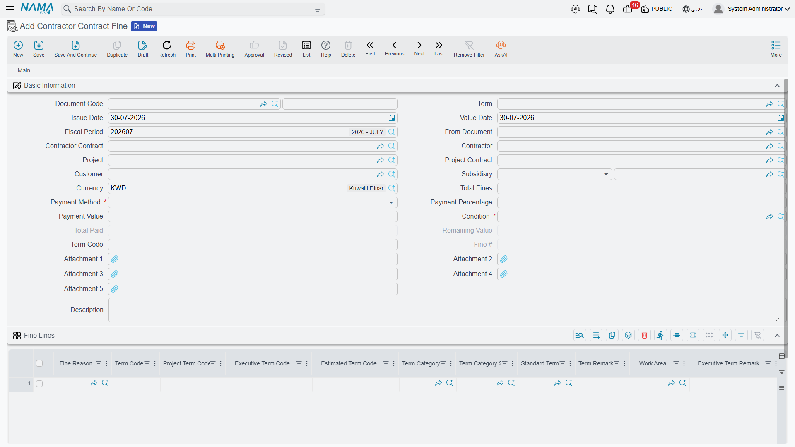

# Subcontractor Fines

A blockwork gang builds forty square metres of wall out of plumb and has to knock it down and build
it again. Somebody pays for that — the scaffolding stayed up an extra week, the crane came back, the
inspector came back — and the contract says it is the subcontractor. The **Contractor Contract Fine**
(سند غرامة عقد مقاول باطن) is where you record that charge, and the money reaches you the only way
money moves between you and a subcontractor: it comes off his next extract.

You will find it under **Contracting > Contractor Contracting > Contractor Contract Fine**.

## What is the same as the project side

It is the twin of a
[Project Fine](/modules/contracting/project-contracting/contracting-project-fines.md), with the
direction reversed: there you are penalising your client's contract, here you are penalising a
subcontractor's. Both create their own accounting entry *and* are netted off the next extract, both
are multi-line with a reason per line, and both use the same recovery machinery as an advance
payment.

Three differences are worth knowing before you start:

- A subcontractor fine is picked up by **subcontractor** extracts only. Owner-side fines are
  deliberately excluded from that scan, so a penalty on your client's contract can never turn up as a
  deduction against a subcontractor.
- Each line needs **two** term codes — the subcontract's and the client contract's — because a
  subcontract term is a slice of a client-contract term.
- Unlike an advance, a fine can **never** over-recover. There is no option anywhere that lets its
  remaining balance go negative.

## The example this page follows

Subcontract **CC-0042**, blockwork, 2,000 m² at 40 → 80,000, with a 10% retention clause and a 16,000
mobilisation advance. During month two, 40 m² of term **3.01** wall fails inspection and has to be
rebuilt. The rework is charged at **1,500** under the fine reason *rework — quality
non-conformance*, and it lands on the second extract.

## The document

The header identifies the subcontract and carries the recovery rule; the grid carries the penalties.

Pick the **Contract** and the subcontractor, project, project contract and client fill themselves.
The header then repeats the same recovery block you know from an
[advance payment](/modules/contracting/contractor-contracting/contracting-contractor-advances-and-payments.md):

- **Payment Method** — the recovery rule. The whole balance on the next extract, a fixed amount per
  extract, a percentage of the fine, a percentage of each extract's value, or nothing until the Final
  extract. As on the advance, the **Payment Percentage** field is only enabled for the percentage
  methods and **Payment Value** only for the fixed-value method.
- **Condition** — required. The clause the recovery posts through, and the thing that decides which
  accounts the deduction line on the extract lands on.
- **Total Fines**, **Total Paid** and **Remaining** — read-only, maintained as the extracts consume
  the fine.
- **Subsidiary** (الذمة) — the account the charge sits against. On a fine this field carries real
  weight: an accounting side on this document takes its subsidiary from here or from the contract, so
  if you leave it empty the entry has nothing to attach to.
- **Fine Number** — a sequence within the subcontract, filled on commit.

Picking the **document term** (توجيه) pre-fills the payment method, percentage, value and condition,
which is how a company makes its penalty policy a default rather than something typed from memory.

::: tip Finding a closed subcontract in the picker
Once a Final extract has been committed, a subcontract is finished and stops being offered in the
contract picker of new documents — with one exception. The fine's own document term carries a *show
finished contracts* option, and when it is on, closed subcontracts appear in the list again. Two
caveats. This option exists only on the fine's term, so it does not affect what the extract or the
advance offers. And being able to *pick* a closed subcontract is not the same as being able to commit
against one: that additionally needs the module configuration option which allows finalised contracts
to be used at all.
:::

### The fine lines

One row per penalty, each with its own reason, its own term codes and its own value:

| Column | What it is |
|---|---|
| **Fine Reason** | from the contracting fine reasons catalogue — delay, rework, safety violation, damage to the works, non-conforming material |
| **Term Code** | which subcontract term the penalty is charged against |
| **Project Term Code** | the matching term of the client contract |
| Executive / Estimated Budget Term Code | the matching budget lines, suggested from the client contract's budgets |
| Standard Term, Term Category, Term Description, Work Area | descriptive columns, filled from whichever term code you pick |
| **Fine Value** | the amount |
| Subsidiary | an account for this line specifically, when it differs from the header's |

The three term-code columns resolve against different contracts, and the system knows the
difference: **Term Code** is looked up on the **subcontract**, while the project and budget term codes
are looked up on the **client contract** and its budgets. Pick any of them and the descriptive columns
and the matching remark fill themselves.

**The project term code is mandatory on every line, and nothing relaxes it.** The subcontract term
code is required too, though a document-term option can make that one optional for organisations that
book penalties at project level. The reason for the hard rule is the cross-reference: a penalty that
cannot be traced to a line of the client contract cannot be reflected in that contract's cost.
Parent (heading) term codes are refused on fine lines, as they are everywhere else.

For CC-0042 the document holds a single line: reason *rework — quality non-conformance*, term code
**3.01**, project term code **3.01**, fine value **1,500**. The header total becomes 1,500 and the
remaining balance 1,500.

## What it books

Committing the fine sends an accounting **business request** (طلب أعمال) to the queue, processed in
the background and retryable from the **Business Requests** view under **More > Reprocess /
Recommit**.

The entry is one pair, posted **per fine line** — so a fine with four penalties produces four rows,
each carrying its own line's references. The accounts come from the document term, with one
alternative: a term option takes the accounts from the document's **condition** instead, falling back
to the term's own pair when the condition has none. That is useful when your penalty accounts are
already defined on the clause you recover through, and you would rather define them once.

A typical reading is **debit the subcontractor's payable, credit penalty income** — you owe him less,
and you have earned something. Note that this entry is made when the fine is committed, quite
independently of the extract. Recovering the fine on an extract is a second, separate movement.

## How it reaches the extract

Exactly like an advance. Each
[subcontractor extract](/modules/contracting/contractor-contracting/contracting-contractor-extracts.md)
scans the subcontract for fines, advances, other payments and material charges that are committed,
still carry a balance and are dated no later than the extract, and writes one deduction line per
source into its **Additions And Deductions** grid — carrying the fine as the condition document.
Either the surveyor presses *Collect Conditions*, or the extract's document term collects on every
save.

One detail specific to fines: the recovery is grouped **by term code**, not by line. A fine with three
penalties on term 3.01 and one on term 3.02 is presented to the extract as two amounts, and the recovery
rule is applied to each. So if you want penalties recovered separately, split them across documents or
across terms rather than across lines.

On CC-0042 the second extract collects:

| Condition | From | Deduction |
|---|---|---|
| Retention 10% | the subcontract's retention clause | 2,800 |
| Advance recovery | the 16,000 advance | 5,600 |
| Rework penalty | fine, term 3.01 | 1,500 |

The extract's work value of 28,000 plus 4,200 of VAT, less 9,900 of deductions, leaves **22,300** to
pay him. The fine's remaining balance drops to zero, and the extract's **Statistics** page lists this
fine among the documents it consumed — which is where you look when somebody asks what the deduction
was for.

## What you can and cannot change afterwards

The rules are tighter than on an advance, because a fine is an accusation with money attached:

- **Once an extract has consumed a fine it is locked** — *"you can not edit nor delete this fine
  because it is used in …"*. Correct the extract first if the amount was wrong.
- You cannot change or remove a term code that already carries recovery transactions.
- **The remaining balance can never go negative.** An advance has a term option that permits
  over-recovery; a fine does not, and the extract's save fails rather than recover more than the
  fine is worth.
- A **Final** extract takes the whole remaining balance of every fine regardless of the recovery
  method, and it refuses to save while any fine still has a balance. You cannot close a subcontract
  with an unsettled penalty.

## The reasons behind the fines

**Fine Reason** is a small master file of its own, and it is the only place the *why* is recorded — the
fine lines carry the amount and the term, the reason carries the classification. It is worth spending
ten minutes on the list before the first penalty is raised, because it is what makes the question
"how much did we recover from subcontractors for quality failures this year, and on which projects?"
answerable. It is set up alongside the module's other small catalogues in
[Units, Tasks and Other Lookups](/modules/contracting/setup/contracting-lookups.md).
