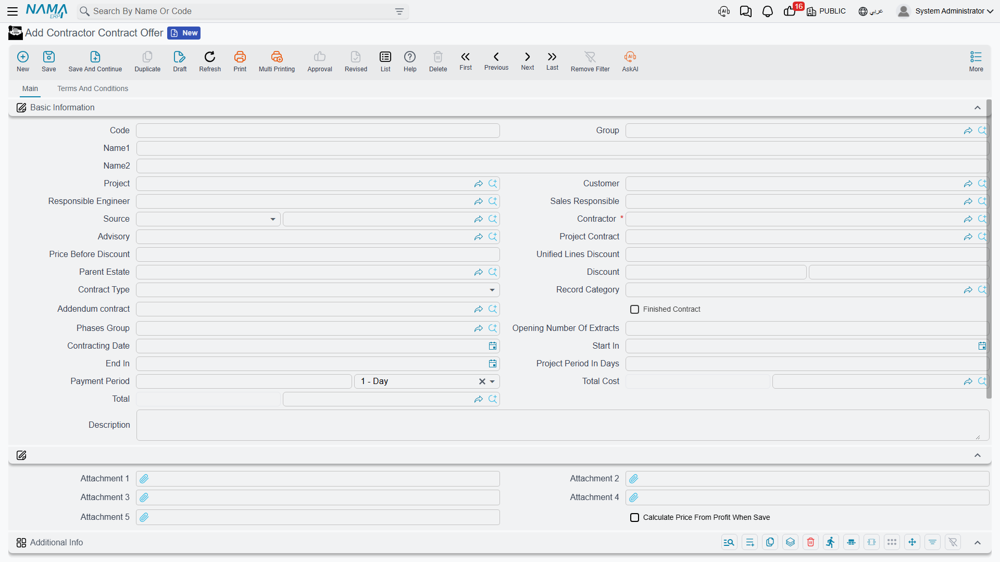

# Subcontractor Offers

Before you award a package you ask two or three firms what they want for it. Each answer is a priced bill of quantities in its own right — his rates, his retention, the advance he wants before the gang arrives — and the subcontractor offer is where you record it, one record per firm.

You will find it at **Contracting > Contractor Contracting > Contractor Contract Offer**, under licence `contracting`.

::: tip It is a master file, and it is shaped like the subcontract, not like a bid
Two things distinguish it from the [contracting offer](/modules/contracting/project-contracting/contracting-offers.md) on the owner side, and both matter.

**It is a master file.** No book, no document number, no value date, no fiscal period, no document term — a code, a group, an Arabic name and an English name, like any other master file. Nothing is posted and nothing is reserved when you save one.

**It carries no cost build-up.** The owner-side offer is the document where cost *becomes* price: four grids explode each item into materials, labour, subcontractors and expenses, and a margin turns the total into a quotation. There is nothing like that here, and there is no need for it — the subcontractor's price *is* your cost. What this record carries instead is the subcontract's own shape: the same terms grid, the same conditions grid, the same instalment schedule.
:::

That last point is the practical key to the whole screen. A subcontractor offer and a [subcontract](/modules/contracting/contractor-contracting/contracting-contractor-contract.md) are built from identical line structures, which is exactly why the conversion at the end is a straight clone rather than a mapping exercise. Read the subcontract page for the grids in detail; this page covers what is particular to the offer stage.

## The example this page follows

Three firms are asked to price the blockwork on **Tower A** for **Al-Fanar Development** — 2,000 m² of 200 mm blockwork, term `3.01` on the client contract PC-2026-001:

| Offer | Firm | Quantity | Unit price | Total | What else he asks for |
|---|---|---|---|---|---|
| `CCO-0031` | Al-Bina Blockwork | 2,000 m² | **40.00** | **80,000** | 10% retention, 16,000 mobilisation advance |
| `CCO-0032` | Rawasi Contracting | 2,000 m² | 42.00 | 84,000 | 5% retention, no advance |
| `CCO-0033` | Nahda Builders | 2,000 m² | 38.50 | 77,000 | 10% retention, 24,000 advance, four weeks longer |

We award `CCO-0031`, and it becomes subcontract **CC-0042**.

## Page 1 — who is quoting, and for what

The header is the subcontract's header, field for field, minus one thing: because an offer never produces documents, it has none of the collapsible lists of executions, extracts, fines and payments that crowd the bottom of a subcontract's main page.

The fields that carry the meaning:

| Field | Why it matters |
|---|---|
| **Contractor** (مقاول باطن) | mandatory — whose quotation this is. One offer per firm per package |
| **Project Contract** (عقد المشروع) | the client contract the package is being carved out of |
| **Project** (المشروع) and **Customer** (العميل) | carried as context, because the package lives inside a client contract |
| **Advisory** (الإستشاري) | the consultant on the job, where one is appointed |
| **Contract Type** (نوع العقد) | *Contract*, *Addendum* or *Modify To Contract*, the same three values as on a subcontract |
| **Price Before Discount**, the **Discount** pair, **Total** and **Total Cost** | the money, all calculated from the lines |
| **Contracting Date**, **Start In**, **End In**, **Project Period In Days** | the programme he is quoting to |
| **Payment Period** (مدة السداد) | the credit period he is asking for, as a value plus a unit |

Alongside them sit the accounts and taxes blocks — an offer can be an accounting subsidiary in its own right, the same as a subcontract — the dimensions, the five attachments (the natural home for the PDF he emailed you), and a free *Additional Info* grid of numbers, texts, dates and references that nothing in the system reads and you may use for anything.

## Page 2 — the priced bill of quantities

*Terms and Conditions* is where the quote actually lives, and it is the subcontract's page 2 with the same three grids in the same order.

### The terms grid

One row per item of work, each pointing at a **Standard Term** — which supplies the unit of measure, the default rate and the accounts the eventual extract will post to — with dotted **term codes** forming a tree in which only leaf rows carry money and parent rows are re-totalled from their children.

For `CCO-0031` there is a single priced line:

| Code | Standard term | UOM | Quantity | Unit price | Total price | Project term code |
|---|---|---|---|---|---|---|
| `3.01` | Blockwork 200 mm | m² | 2,000 | 40.00 | 80,000 | `3.01` |

That last column is the one that has no owner-side equivalent, and it is worth filling at the offer stage even though nothing forces you to yet: the **project term code** ties the line to the item you sold Al-Fanar, and it carries across to the subcontract, where it becomes mandatory. Its two siblings — the estimated and executive **budget term codes** — do the same job against the [budgets](/modules/contracting/budgets/contracting-executive-budget.md).

Above the grid, **Update Codes** renumbers the whole grid from scratch by walking it top to bottom (it will overwrite codes you typed yourself), and **Update Empty Term Codes Only** is the safe version that fills the blanks and leaves existing codes alone. Quantities can be typed, or derived from a count and the length, width and height columns when the module configuration puts those on screen.

### The conditions grid

The commercial clauses he is quoting under: retention, advance recovery, penalties. Each line names a **Condition** from the [conditions catalogue](/modules/contracting/setup/contracting-conditions.md), a value type and a value; whether a clause adds to or deducts from what he is paid is a property of the condition itself, not of the line.

On `CCO-0031` there is one line — *retention, percentage from total, 10* — and it is the reason to bother filling this grid at the offer stage: **conditions are copied to the subcontract on conversion**, so the clause you negotiated is not re-keyed. On the offer it is documentation and a carrier; nothing on this record calculates from it. It becomes live on the subcontract, and it produces its deduction on every [extract](/modules/contracting/contractor-contracting/contracting-contractor-extracts.md).

### The payments grid

The instalment plan he wants: instalment code, description, percentage, value, payment date. You can type the lines or choose a **Payment Template** (نموذج الدفع) and let the system spread the amount.

::: warning The payment schedule does not survive the conversion
Neither the schedule lines nor the payment template are copied to the subcontract — and the subcontract's schedule is what mints his cheques. If the instalment plan is part of what you agreed, expect to enter it again on the contract. It is the single most common thing to lose at this step.
:::

Also on this page: the **contract template** field, the two header tax percentages and the *Totals* block they fill (net before tax, tax 1, net after tax, tax 2), and a discount-calculation block that decides whether each of the eight discount slots is entered as a percentage or as a value.

## Comparing the quotes

There is no bid-comparison screen and nothing scores or ranks the offers for you. Three records, three totals: you read them side by side in the offers list view and you decide.

What the module *does* give you is the certainty that you are comparing like with like, provided all three offers were built from the same term codes. Because the terms come from the same [standard-term catalogue](/modules/contracting/setup/contracting-standard-terms.md), `CCO-0031`'s term `3.01` and `CCO-0033`'s term `3.01` are the same item of work measured in the same unit, and the difference between 40.00 and 38.50 is a real difference in rate rather than a difference in what was priced. The usual way to get there is to build the first offer, then use **Duplicate** (نسخة مماثلة) for the other two and change the rates.

Two things to weigh besides the bottom line, since both will cost you real money later: the advance he wants — 24,000 against 16,000 is 8,000 more of your cash outstanding until the [advance](/modules/contracting/contractor-contracting/contracting-contractor-advances-and-payments.md) is recovered — and the retention percentage, which decides how much of every certificate you keep hold of until the works are accepted.

## Awarding it: converting the offer to a subcontract

Save the offer first — both conversion buttons require it — and then press one of the two buttons above the terms grid:

- **Convert To Contract** (تحويل لعقد) takes the whole offer.
- **Convert To Contract With Selected Lines Only** (تحويل لعقد بالسطور المختارة فقط) takes only the term lines whose **Selected** box is ticked, for the case where you are awarding part of a package to one firm and part to another.

Either way what opens is a **new, unsaved subcontract** with the offer's content already in it. Nothing has been created yet: review the rates, fill in what did not come across, and save. Close the screen instead and there is no contract — and the offer is untouched, so you can convert it again.

What crosses over:

| Carried over | Left behind — re-enter on the contract |
|---|---|
| Contractor, project contract, advisory, project, customer | The instalment schedule and the payment template |
| Price before discount, discount value and percentage | Contracting date, start and end dates |
| Responsible engineer, remarks, contract type | The two header tax percentages, and the unified lines discount |
| **Source** — a reference back to this offer | The phases group and the parent estate |
| Every term line, with its quantities, rates and cross-references | The accounts block, the names and the English code |
| Every condition line | Attachments and the additional-info grid |

The **Source** reference is how the subcontract remembers where it came from: an auditor opening CC-0042 can walk straight back to the quotation that produced it, and the site office can see which firm's numbers the rates came from.

::: info The offer is not the only road into a subcontract
Three other routes exist, and they are all one-button conversions like this one: the [project contract](/modules/contracting/project-contracting/contracting-project-contract.md) can spawn a subcontract from its own selected term lines — which is the natural route when you are simply subletting part of what you sold — and so can a [contracting assay](/modules/contracting/project-contracting/contracting-assays.md), an [estimated budget](/modules/contracting/budgets/contracting-estimated-budget.md) and an [executive budget](/modules/contracting/budgets/contracting-executive-budget.md). Use the offer when the numbers came from the subcontractor; use the others when they came from you.
:::

## Where to read next

- [Subcontracts](/modules/contracting/contractor-contracting/contracting-contractor-contract.md) — what the winning offer becomes, and the page that describes these grids in full.
- [The subcontractor cycle](/modules/contracting/contractor-contracting/contracting-contractor-cycle.md) — where this record sits in the chain.
- [Contracting offers](/modules/contracting/project-contracting/contracting-offers.md) — the owner-side quotation, where cost drives price.
- [Standard terms](/modules/contracting/setup/contracting-standard-terms.md) and [contract conditions](/modules/contracting/setup/contracting-conditions.md) — the vocabulary the terms and conditions grids are built from.
- [Contractors and consultants](/modules/contracting/setup/contracting-contractors-and-consultants.md) — the party record the offer names.
