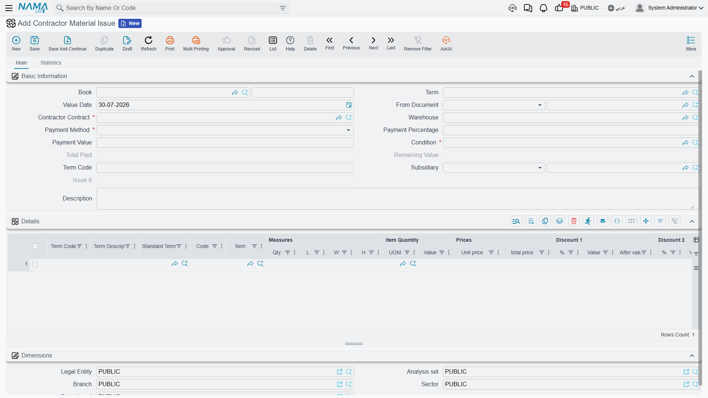
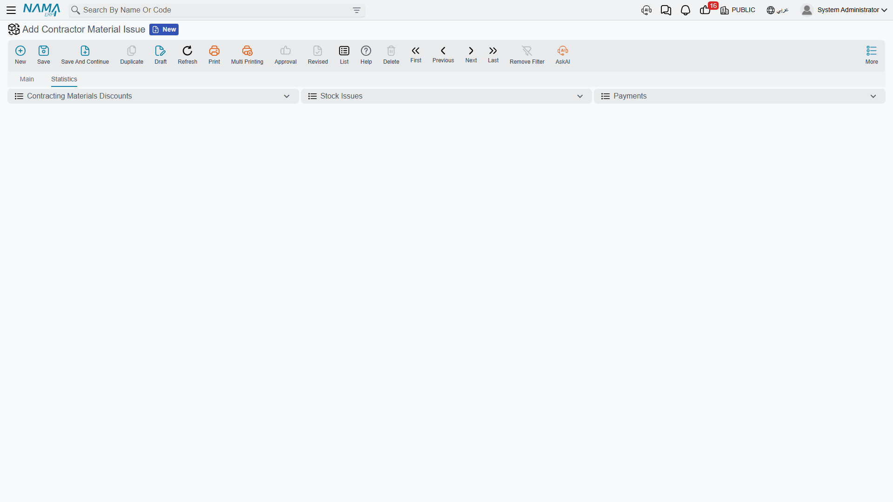
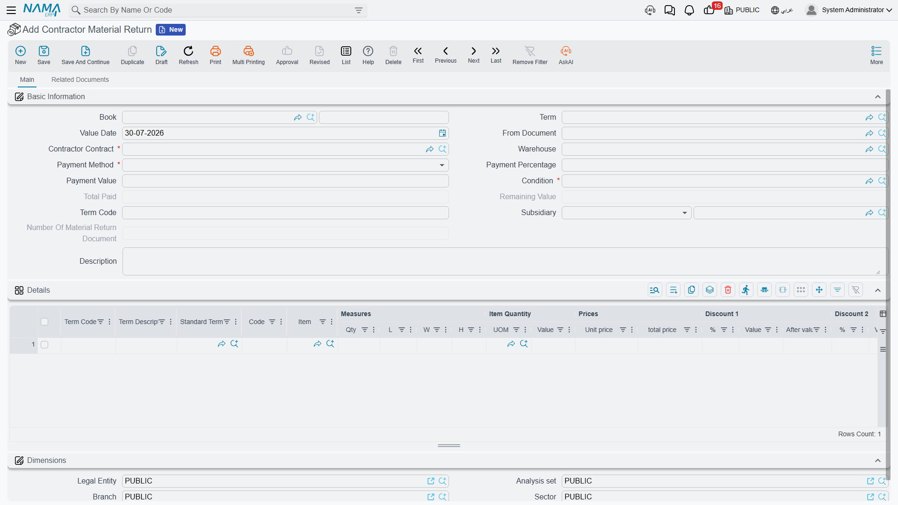

# Selling Material to a Subcontractor

Contractors supply their subcontractors constantly. You buy cement by the lorry and he buys it by the
bag, so you give him yours — but not for free. The bags come off your stock, they go on his account,
and when his payment application comes round the value is taken off what you owe him.

That is exactly what the module does, and it is the reason the *Contractor* material documents look so
different from the *Contracting* ones they sit beside in the menu. **Contractor Material Issue is a
sale.** It is a sales document with a full invoice effect: a price on every line, discounts, taxes, a
receivable raised against the subcontractor, and a charge-back record that his next extract will turn
into a deduction. Nothing about it touches project cost — the material stopped being your cost the
moment you sold it.

The three documents, all under **Contracting > Costs**, all needing the `contracting` licence:

| Document | Arabic name | What it does |
|---|---|---|
| Contractor Material Issue Request | طلب صرف خامات مقاول باطن | a priced authorisation; records nothing |
| Contractor Material Issue | صرف خامات مقاول باطن | stock out, invoice booked, charge-back created |
| Contractor Material Return | مردود خامات مقاول باطن | stock back, credit note, and the charge-back reversed |

If what you actually want is material consumed on your own project rather than sold on, that is
[Issuing Material to a Project](/modules/contracting/costs/contracting-project-materials).

## The header carries the settlement terms

The header looks like an inventory document until you reach the middle of it, at which point it starts
looking like a sale on credit.

| Field | |
|---|---|
| **Contract** | required, and it accepts a **subcontract only** — never a project contract |
| **Warehouse** | the source of the material; the header value is pushed onto every line |
| **Payment Method** | required — how the charge is to be settled, which in practice means deduction from his extract |
| **Payment Percent**, **Payment Value** | how much of the charge is settled by that method |
| **Condition** | required — the [contract condition](/modules/contracting/setup/contracting-conditions) the deduction will ride on when it reaches the extract |
| **Term Code** | a header default, pushed down onto every line |
| **Total Paid Amount**, **Remaining Value** | system — how much of the charge has been settled, and how much is still outstanding |
| **Issue Number** | system — this document's ordinal among the issues on this subcontract, so the first issue is 1, the second 2 |
| Subsidiary, dates, *From Document*, remarks | the ordinary document header |

The **Condition** field is the one people skip past, and it matters more than its position suggests.
The deduction does not arrive on the extract out of nowhere: it arrives *as a condition line*, and
this field names which condition. Pick a condition that exists for the purpose — a "material
deduction" condition — and make it the default on the document term so nobody has to remember.

The lines are ordinary sales lines: term code, standard term, item and code, measures and quantity,
then the full price block — unit price, price, the discount levels, the taxes, and **Net Value**. Net
Value is the number that becomes the deduction, so it is the figure to check before committing.

Unless the term makes it optional, **the line's term code is required and must exist in the
subcontract's term list**. That is what ties the deduction to a term of his work, and it is how the
extract knows which of its lines the deduction belongs beside.

## What committing an issue does

Four things happen, and they are worth separating because each is visible in a different place.

1. **The invoice is booked.** The document generates an ordinary ledger effect as a background business
   request, using the accounts configured on its document term: the subcontractor's receivable side
   against inventory going out, plus tax. This is a real sale in the general ledger.
2. **The stock moves.** A **Stock Issue** is generated and committed automatically, carrying the lines,
   the warehouse and the locator. As with every generated document in this family, the book and term of
   the generated stock issue come from **this document's own document term** — leave either empty and
   no stock document is created at all, so the invoice is booked and the material never leaves the
   warehouse. It also works in reverse: empty the details and the generated stock document is deleted.
3. **A charge-back record is written**, one per line, holding the subcontract, the term code, the item
   and the line's net value, with no extract against it yet.
4. **The outstanding balance is set.** The header's Remaining Value becomes the net value of the
   document, and each line's remaining value becomes the net value of its term group. That non-zero
   remaining value is the flag that makes the charge visible to the next extract.

## How the charge reaches his extract

When a [subcontractor extract](/modules/contracting/contractor-contracting/contracting-contractor-extracts)
is prepared for the same subcontract, it collects the committed material issues that still have a
remaining value and dated on or before it, and turns each one into a **condition line carrying a
deduction value** — the named condition, the term code, and the money. The deduction then flows into
the extract's net payable alongside retention, advance recovery and fines, and is reversed if the
extract is cancelled.

On committing the extract, two things settle:

- each charge-back record is **stamped with the extract that absorbed it**, which is what you see on
  the issue's **Statistics** page — the row's extract column answers "has this material already been
  deducted?" without opening anything else;
- the issue's Total Paid Amount rises to the deducted value and its Remaining Value drops to zero, so
  **the same material is never collected onto a second extract.**

::: warning Once an extract has consumed a line, the issue is frozen
From that point on the line cannot be edited or deleted. The attempt fails with *You removed or
modified line number … in document … which is linked with contractor extract …*. This is deliberate:
the deduction has already been paid out of his money. To correct it, the extract has to be reversed
first.
:::

## The return flips the sign

A **Contractor Material Return** is the same document run backwards. Material comes off his account
and back into your warehouse, so:

- a **Stock Receipt** is generated instead of a stock issue;
- the money side is booked in the credit-note direction, reversing the sale;
- and on the extract the value appears as an **addition rather than a deduction** — the system does not
  merely stop deducting, it gives him the money back.

Its header carries the same payment block and a **Return Number** counting the returns on the
subcontract, and building it from the issue copies the subcontract, the condition, the payment block
and the term code across.

## The request

The **Contractor Material Issue Request** is the paperwork stage: a priced list of what the
subcontractor has asked for, against which contract terms, at what price, on what settlement terms. It
is genuinely inert — it books nothing in the ledger, generates no stock document and writes no
charge-back record.

Its value is what it saves you when it becomes an issue. Select it in *From Document* on the issue and
the subcontract, the condition, the payment method, the payment percent, the payment value and the term
code all come across, so the priced request only has to be agreed once. As on the project side, the
issue does not require a request — you can sell material directly.

## Setting it up once

Four things on the **Contractor Material Issue** document term make the difference between a document
that works and one that half-works:

| On the term | Why |
|---|---|
| the generated document's **book and term** | without both, no stock issue is created and the material never leaves the warehouse |
| the **debit and credit accounts**, and the tax accounts | this is a sale; without them there is no ledger entry |
| default **condition**, **payment method**, **payment percent** and **payment value** | so the settlement terms are right without being retyped, on every issue |
| whether the **project term code is optional** | leave it required unless you have a reason; the term code is what places the deduction against a line of his work |

The return has the same set, pointed at a stock receipt and the credit-note accounts.

## Worked example: cement for the blockwork subcontractor

On **Tower A**, the blockwork on term `3.01` is subcontracted to Modern Construction Est. for
**80,000** — 2,000 m² at 40 — on subcontract `CC-0042`, with 10% retention. He lays and supplies the
blocks, but the mortar cement is bought from us.

**A condition exists for the purpose.** `MATDED` — *material deduction* — set up once as a
contracting condition, deducting whatever value is put on it.

1. **He asks.** `CIQ-000012`, a Contractor Material Issue Request: subcontract `CC-0042`, condition
   `MATDED`, payment method *deduct from extract*, term `3.01`, one line — 80 bags of `CEM-42.5` at
   **30.00**, net **2,400**. Nothing happens yet.
2. **We issue.** `CTI-000031`, a Contractor Material Issue with *From Document* = `CIQ-000012`, so the
   subcontract, condition and payment block copy themselves in. Commit, and:
   - stock issue `SI-001231` is generated — 80 bags leave `WH-SITE-A`;
   - the ledger entry raises 2,400 receivable on Modern Construction Est. against inventory out, plus
     tax per the term;
   - a charge-back record is written for subcontract `CC-0042`, term `3.01`, item `CEM-42.5`, net
     value 2,400, with no extract against it;
   - Remaining Value on the header is 2,400.
3. **His first extract collects it.** The blockwork extract certifies 800 m² at 40 and the deduction
   arrives on its own:

   | On the subcontractor's first extract | |
   |---|---|
   | Work certified this period, 800 m² at 40 | 32,000 |
   | Retention withheld, 10% | −3,200 |
   | Material deduction, condition `MATDED`, term `3.01` | **−2,400** |
   | Net before advance recovery and tax | **26,400** |

4. **It settles.** On commit, `CTI-000031`'s charge-back row is stamped with that extract — visible on
   the issue's Statistics page — its Total Paid Amount becomes 2,400 and its Remaining Value zero. The
   next extract will not see it again. And from now on its line cannot be touched.
5. **Twenty bags come back.** `CTR-000004`, a Contractor Material Return: 20 bags at 30.00 = **600**.
   Stock receipt `SR-000488` brings them into the warehouse, the money side is booked as a credit note,
   and on his **next** extract the 600 appears as an **addition**, not a deduction.

Two things this example does *not* do, both of them the point of the page. It never touches the tower's
cost — the 2,400 is revenue, and the blocks we issued to our own term `3.01` are a completely separate
document. And it never reduces the 80,000 subcontract value: the subcontract is still 80,000 of work,
and the cement is money he owes us that happens to be collected by netting.
