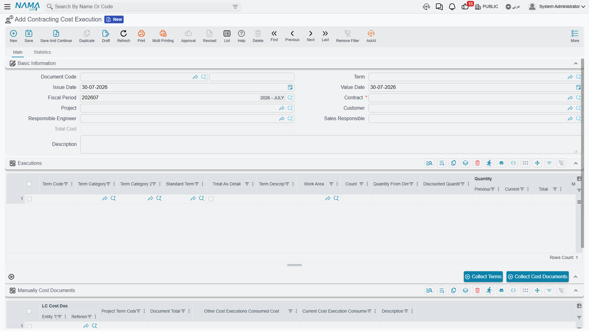
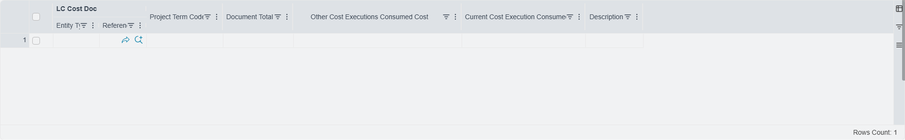

# Cost Execution

The contract's term lines will tell you that blockwork has cost 34,800 so far. What they will not tell
you is whether that is good news. For that you need the other half of the sentence — *and we built
800 square metres with it* — because only then does the number turn into 43.50 per square metre,
which you can hold up against the 41.00 per square metre the term was costed at.

**Contracting Cost Execution** (حصر تكاليف مقاولات) is the document where those two halves meet. You
declare the quantity executed in this period, term by term; the system sweeps up every slice of cost
that has been deposited against those terms and not yet absorbed, splits it by where it came from, and
divides by your quantity to give an actual **unit cost**. The result is the project's cost-side
interim statement, and it is what a customer extract later draws on to say what a billed quantity
actually cost.

You will find it under **Contracting > Costs > Contracting Cost Execution**. It needs the
`contracting` licence, and its document term (توجيه) carries exactly one option, covered below.

## The header, and why the value date matters so much

The header is short. **Contract** is required and must be a project contract; choosing it fills in the
project, the customer and the responsible engineer. **Total Cost** is a system field — the sum of the
grid. The rest is the ordinary document header.

The field to think about is **Value Date**, because it is the **cut-off for the sweep**. When the
document is processed, it considers cost slices whose value date is on or before this document's value
date, and ignores anything later. A Cost Execution dated 31 March covers the cost of March; one dated
30 April will pick up everything from April that the March document left behind.

That is also why **cost executions must be entered in date order**. The document refuses to be
committed if any other cost execution — or any project extract — already exists on the same contract
with a later value date. If you need to insert a forgotten March document after April's is in, April's
has to come out first.

## Filling the grid

### Collect Terms brings the terms in

The **Collect Terms** button reads the contract's term lines and creates one line in the Executions
grid per term. Two refinements are worth knowing:

- For a term that has phases filled in, it creates **one line per phase** rather than one line for the
  term. This is the only way phase-level cost exists in the module — cost itself is never attached to
  a phase, so the cost of a phase is exactly the cost of the execution line that names it.
- Roll-up parent terms are skipped, so you get the leaves that actually carry work. A module
  configuration option changes this if an implementation wants the parent codes in the grid too.

::: warning Collect Terms rebuilds the grid
Press it on a document where you have already typed quantities and you will lose them. Collect first,
type second.
:::

### You type one number per line

Of the many columns on the Executions grid, **Current Quantity** (الكمية | حالي) is the one you fill
in, and it is **required on every line** — the whole point of the document is to divide cost by it.
Around it sit the quantities you would expect: previous, total, contracted, discounted, the quantity
measured from physical dimensions, count, the accumulative completion percentage, the work area, the
term's phase, and the term's categories and description brought over from the contract.

Two system columns become interesting after the fact: **Consumed Qty** and **Remaining Qty**. As
extracts bill the work, they consume the quantity this document declared, and the remainder tells you
how much of it is still available to be valued.

Term codes must be **unique in the grid** — the document refuses a duplicated term.

## What happens when the document is processed

Everything in the cost breakdown is filled by the system on commit; none of it is typed. For each line
in the grid:

1. **The pool is swept.** Every unabsorbed cost slice for this contract, with a value date on or before
   the document's value date, whose term code appears in the grid, is a candidate.
2. **Material issues and returns are asked to refresh their cost first.** Inventory average cost moves,
   and the cost of a bag of cement issued in February is not necessarily what it was when the issue was
   committed. The sweep re-reads them before summing so the figures are current.
3. **Slices are drawn down, not copied.** Each slice remembers how much of it other cost executions
   have already taken. This document can take only what is left. If the numbers would overdraw a
   slice, the commit fails and says so, naming the document, the term code and the actual cost
   available — which in practice only happens in manual mode, below.
4. **What is taken is grouped by origin** and written into the seven cost columns:

| Column | Fed by |
|---|---|
| Materials Cost / التكلفة من الصرف | material issues, less material returns |
| Invoices Cost / التكلفة من الفواتير | misc contracting invoices, and ledger vouchers carrying the term code |
| Contractors Cost / التكلفة من المقاولين | subcontractor extracts |
| Workers Cost / تكلفة العمالة | daily labor books |
| Fines / الغرامات | fines on either side of the contract |
| Salaries / المرتبات | staff cost distributed onto the project, and payroll documents |
| Depreciations / الإهلاكات | machine cost distributed onto the project, and asset depreciation |

5. **Total Cost** is everything the line absorbed, and **Unit Cost = Total Cost ÷ Current Quantity**
   (left empty when the quantity is zero). The header's Total Cost is the sum of the lines.

The document has **no accounting effect of its own** — not a debit, not a credit. The money was booked
by the source documents; this is a purely analytical roll-up. What it *does* change is the contract's
term lines, whose quantity-from-cost-execution figures and completion percentages it maintains, and
which it reverses if the document is cancelled.

All of it is stored. If a source document changes after this one was committed, re-commit this one.

## Choosing the slices yourself

Automatic mode — sweep everything up to the value date — is the default and the right answer most of
the time. When you need control, tick **Manually Collect Cost Documents** on the document term
(توجيه); it is the only option that term carries.

With it on, the **Manually Cost Documents** grid becomes the thing that decides, and the **Collect
Cost Documents** button fills it. (With the option off the button deliberately does nothing.) The
button lists the unabsorbed cost for this contract up to the value date, keeps only the terms present
in your Executions grid, subtracts what other cost executions have already taken, and proposes one row
per remaining slice:

| Column | |
|---|---|
| the cost document | read-only — the source document the slice came from |
| Project Term Code | read-only |
| Document Total Cost | read-only — the whole slice |
| Other Cost Executions Consumed Cost | read-only — what other executions already took |
| **Current Cost Execution Consumed Cost** | **the one you edit** — how much of it this document absorbs |

So the workflow is: press the button, then reduce or zero the rows you do not want this period. Only
what you leave in this grid is absorbed, and the seven cost columns are built from that instead of
from the whole sweep.

## The Statistics page

The second page carries two read-only lists that answer the two questions people ask about a committed
cost execution.

- **The cost slices this execution absorbed** — one row per slice, with the source document, the cost
  type, the term code, the analysis term code and card, the amount and the quantity. This is the audit
  trail behind the seven columns: if Materials Cost says 900 and you want to know which issues, it
  is here.
- **The extracts that consumed this execution's quantities** — one row per match between an extract
  line and a line of this document, with the quantity consumed, the unit cost applied and the
  resulting cost. This is how you see which billing actually used the unit cost you produced.

## Worked example: what did a cubic metre of concrete really cost?

`CCE-000004` on contract `PC-2026-001` — Tower A — value date 31 March 2026, on a term with automatic
collection.

Press **Collect Terms**, get four lines, and type the March quantities. Plastering has not started, so
it is removed:

| Term code | Term | Unit | Current Quantity |
|---|---|---|---|
| `1.01` | Excavation | m³ | 400 |
| `2.01` | Reinforced concrete | m³ | 20 |
| `3.01` | Blockwork | m² | 800 |

Commit. The pool for this contract up to 31 March holds excavation subcontracted out, a plant-hire
invoice, the crane's depreciation, ready-mix and formwork issued from the store, a week of day labour
on the pour, the site engineer's salary, blocks issued, and the blockwork subcontractor's first
extract. All of it is drawn down and grouped:

| Term | Materials | Invoices | Subcontractors | Workers | Salaries | Depreciations | Total Cost | Current Qty | **Unit Cost** |
|---|---|---|---|---|---|---|---|---|---|
| `1.01` | – | 1,800 | 9,000 | – | – | 4,200 | 15,000 | 400 | **37.50** |
| `2.01` | 12,000 | 950 | – | 1,240 | 800 | 530 | 15,520 | 20 | **776.00** |
| `3.01` | 900 | – | 32,000 | 380 | 900 | 620 | 34,800 | 800 | **43.50** |

Header **Total Cost = 65,320**.

Now the comparison the document exists for. The concrete term was priced off a
[term analysis card](/modules/contracting/setup/contracting-term-analysis-cards) that analysed one
cubic metre of C30 into materials, labour, subcontracted work and expenses and arrived at **740.00 per
m³**, against the 900.00 selling price on the contract.

| Reinforced concrete, per m³ | |
|---|---|
| Analysed cost on the card | 740.00 |
| Actual cost from this document | 776.00 |
| **Variance** | **36.00 over, 5%** |

On 20 m³ that is 720 of margin gone, and the breakdown says where to look: 12,000 of the 15,520 is
material, so at 600 per m³ against an analysed material component of, say, 560, the ready-mix is being
over-ordered or over-poured. That is a conversation with the site, and it is available at the end of
March rather than at the end of the job.

Blockwork tells a quieter version of the same story — 43.50 actual against 41.00 planned, on a term
selling at 46.00 per m². Excavation, at 37.50 against a 42.00 planned cost and a 50.00 selling price,
is the term comfortably making its number.

## What happens to these figures next

The quantities you declared are now available to be billed. When a
[project extract](/modules/contracting/project-contracting/contracting-project-extracts) bills work on
term `3.01`, it walks the committed cost execution lines for that term in date order, takes the
quantity it needs from the earliest one with quantity remaining, and values it at **that line's unit
cost**. Bill 500 m² of blockwork and the extract recognises 500 × 43.50 = **21,750** of actual cost,
leaving 300 m² of this document's quantity for the next extract.

That is what puts a real cost figure on the extract, and — on a final extract — what makes the
reconciliation between cost recognised through billing and cost booked by cost documents meaningful.
The whole chain is summarised in
[How Project Cost Is Built](/modules/contracting/costs/contracting-cost-model).
