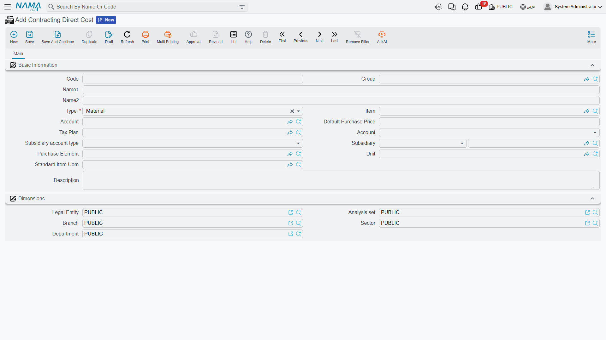
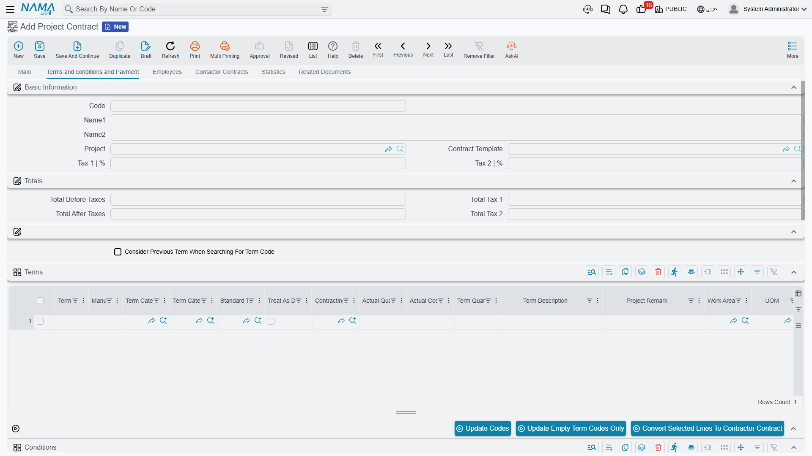

# How Project Cost Is Built

Knowing what a project is *worth* is easy: the contract says 230,000, term by term, and nobody argues
about it. Knowing what the project has *cost* so far is much harder, because cost does not arrive in
one place. It arrives as blocks leaving the site store, as a foreman's daily wage sheet, as a
subcontractor's certified extract, as a share of the site engineer's salary, as the monthly
depreciation of the tower crane, as a fencing invoice from a supplier nobody remembers hiring.

The contracting module's answer is to make every one of those documents deposit its own cost against
a **term of the project contract** at the moment it is committed. The cost figures you read on a
contract are therefore not a report that queries the whole database when you open it — they are
running totals that each cost document wrote down as it went past. Understanding that one sentence
explains almost every question people ask about contracting cost.

## Cost is written down, never worked out later

When a cost document is processed, it writes its cost in **two** places at once, and it is worth
knowing what each is for because they answer different questions.

1. **Straight onto the term line.** The cost lands immediately in the *Actual Cost* and *Actual
   Quantity* columns of the matching term line — on the project contract, and also on the estimated
   budget, the executive budget and the term analysis card if the line names those. This is the
   "how are we doing?" number, and it needs no intermediate document at all. Commit a material issue
   at 11:00 and the contract's term line is higher at 11:01.
2. **Into a pool of cost still waiting to be absorbed.** The same cost is also deposited as a
   consumable slice tagged with its term, its origin and its value date. Nothing has been "used" yet.
   Later, a [Cost Execution](/modules/contracting/costs/contracting-cost-execution) draws slices out
   of that pool, attributes them to the quantities actually executed, and turns them into a **cost
   per unit**. That is the "what did a cubic metre really cost us?" number.

Both are stored tables, rewritten whenever their source document is re-processed. Nothing in this
area is calculated live at display time. The practical consequence is worth stating plainly: **if you
change a cost document after the fact, the figures downstream do not move until that document is
processed again.** For a Cost Execution that has already been committed, you re-commit the Cost
Execution.

## Which documents put cost on a project

This is the list people most often get wrong, so here it is in full. Everything below deposits cost
against a project contract term; the "Shows up as" column is the name of the origin used throughout
the module, and the column it lands in on a Cost Execution.

| Document | Where it lives in the menu | Shows up as |
|---|---|---|
| Contracting Material Issue, Contracting Material Return | Contracting > Costs | Materials (a return is negative) |
| Misc Contracting Invoice | Contracting > Costs | Invoices |
| Subcontractor Extract | Contracting > Contractor Contracting | Subcontractors |
| Daily Labor Book | Contracting > Contractor Contracting | Workers |
| Project Contract Fine, Subcontractor Fine | Contracting > project and contractor menus | Fines |
| Employee And Equipment Project Cost Distribution | Contracting > Master Files | Salaries for a person, Depreciations for a machine |
| Contracting Purchase Request, Contracting Purchase Order | Contracting > Costs | **quantity only** — they raise the ordered quantity on the term line and add no money |

And from outside the module, against the same term codes:

| Document | Module | Shows up as |
|---|---|---|
| Journal Entry, Receipt and Payment Vouchers, Credit and Debit Notes | Accounting | Invoices |
| Asset Depreciation | Fixed Assets | Depreciations |
| Salary Document | Payroll | Salaries |
| Dues liquidation, provisions recalculation and the vehicle-insurance documents | Payroll | staff cost — salary cost, or insurance cost which the module tracks without a separate breakdown column |

That last row is the reason a general ledger entry typed by an accountant can legitimately appear in
a project's cost: any of those documents can carry a project contract term code on its lines, and
when it does, the contracting cost machinery picks it up exactly like a material issue.

### And which documents do not

Four cases surprise people regularly. None of them is a mistake on your part.

- **Contracting Employee And Equipment Issue Invoice** (فاتورة صرف عمالة ومعدات) is the invoice you
  raise for hired-in labour and plant. It books the money — a payable to whoever supplied them — and
  it contributes **nothing to project cost**. The document that puts hired staff and machine cost on
  a project is the **Employee And Equipment Project Cost Distribution**, described in
  [Employees, Equipment and Their Costs](/modules/contracting/costs/contracting-equipment-and-allocations).
- **Equipment Statement Document** (مستند بيان معدات) is an accounting document. It produces a
  journal entry for the machine usage you record on it, and it **writes no cost entries at all** —
  nothing reaches the contract's term lines and no Cost Execution can see it. Treat it as the way you
  book a plant-hire charge to the ledger, not as a way to load cost onto a project.
- **The material issue *request*** moves nothing and costs nothing; only the issue does. Same for the
  **Misc Contracting Request** and **Misc Contracting Order** — in that trio only the invoice books
  anything.
- **Signing contracts and recording execution book nothing either.** A project contract, a
  subcontract, a quantity execution and a cost execution are all free of ledger effects. On the owner
  side money reaches the ledger through the extract; on the cost side through the documents listed
  above.

## Cost hangs on a term code

Every cost line carries a **Term Code** — the code of a line in the project contract's Terms grid.
That code is the hook, and it is the single most important field on any cost document.

- **A cost line with no project term code is skipped silently.** The document still saves, still
  produces its journal entry, and still looks perfectly correct; its cost simply never reaches the
  project. If someone reports that "the cost has disappeared", this is nearly always why. The
  material and purchasing documents can make the term code mandatory through their document term
  (توجيه), and on most implementations it should be.
- Cost lines also carry an **Analysis Term Code** and a reference to the **term analysis card** the
  cost belongs to. That is the finer axis: it lets the cost that actually happened be compared with
  the cost that was analysed when the term was priced. See
  [Term Analysis Cards](/modules/contracting/setup/contracting-term-analysis-cards) for where that
  code comes from and how the analysed unit cost is built.
- Many cost documents can additionally carry an **executive budget term code** and an **estimated
  budget term code**, so the same cost also lands against the budget lines.
- The value date used for a cost slice is the **document's** value date, not the line's. That matters
  because a Cost Execution sweeps by value date.
- **There is no phase-level cost.** Phases carry quantities, not money. If you need cost per phase,
  you get it by producing one Cost Execution line per phase, which the *Collect Terms* button does
  automatically for terms that have phases.

## The catalogue behind ad-hoc cost: Contracting Direct Cost

Most site cost is not a stocked item. A mason's day, an excavator hour, site electricity, a load of
ready-mix — these have a price and an account but no warehouse. **Contracting Direct Cost**
(بند تكلفة مقاولات, under *Contracting > Master Files*) is the catalogue for exactly those things. It
is a **master file**, not a document: it books nothing on its own, it is simply the item you point at
when you are spending money on something that has no inventory item.

A direct cost record carries a code, an Arabic and an English name, a group, a default purchase
price, a unit, a tax plan and — importantly — its **Credit Side**, which decides
where the other half of the entry goes when this item is invoiced: the supplier's account, a specific
account, a specific subsidiary, the current user's subsidiary, or a miscellaneous purchase item. It
can optionally point at a stocked item, for the cases where the same thing is sometimes bought and
sometimes drawn from stores.

Its **Type** is the field that gives it meaning, and it has four values that will look familiar from
the analysis card:

| Type | What it is for |
|---|---|
| Material / مواد خام | consumables and supplied materials |
| Worker / عمالة | labour, priced per day or per hour |
| Contractor / مقاول باطن | work bought from someone else |
| Other / أخري | everything else — plant hire, utilities, permits, transport |

Those four are the same four families a [term analysis card](/modules/contracting/setup/contracting-term-analysis-cards)
uses to build up a term's planned cost, which is what makes the catalogue useful in both directions:
you analyse a term into direct cost items to arrive at a planned unit cost, then you spend against
the very same items and compare.

Where the catalogue is actually consumed:

- as the *Contracting Item* column on the [misc contracting request, order and
  invoice](/modules/contracting/costs/contracting-misc-spend) and on the employee and equipment
  invoice;
- as the item on the four cost grids of a term analysis card, a contracting offer and a contract
  template;
- as the source of the default accounting wiring for a misc contracting invoice line.

Three examples, priced the way a real catalogue would be:

| Code | Arabic name | English name | Type | Unit | Default purchase price |
|---|---|---|---|---|---|
| `CDC-LAB-01` | يومية عامل بناء | Mason day rate | Worker | DAY | 120 |
| `CDC-EQP-07` | ساعة حفار | Excavator hour | Other | HR | 300 |
| `CDC-MAT-22` | خرسانة جاهزة C30 | Ready-mix concrete C30 | Material | M3 | 260 |

Pick `CDC-EQP-07` on a misc contracting invoice for 40 hours at 300, and 12,000 of *Invoices* cost
lands on whichever project term the line names.

## Where you compare cost with contract value

### The contract's Terms grid — the everyday answer

Open the project contract, go to its Terms page, and read three columns off one row:

| What you want | Column on the term line |
|---|---|
| what we sold this term for | **Total Price** |
| what we planned it to cost | **Total Cost** (built from the term's cost analysis) |
| what it has cost so far | **Actual Cost**, next to **Actual Quantity** |

Because Actual Cost is maintained by every cost document as it commits, this row is current without
anyone producing anything. Alongside it sit the quantity columns that tell you *how much* of the term
each stream has recognised — quantity from execution, from extract, from cost execution, and the
quantity already covered by purchase orders.

The same three-way comparison is available on the **estimated budget**, the **executive budget** and
the **term analysis card**, so you can measure actual cost against the estimate, against the approved
plan, or against the original analysis.

### Cost Execution — cost by origin, and a unit cost

A [Cost Execution](/modules/contracting/costs/contracting-cost-execution) is the closest thing to a
cost report: per term it splits the actual cost into materials, invoices, subcontractors, workers,
fines, salaries and depreciation, and divides by the quantity executed to give a cost per unit. It
shows cost only — there is no revenue column on it.

### The final extract — the one screen with both sides

On a [project extract](/modules/contracting/project-contracting/contracting-project-extracts) marked
as **Final**, the header fills in a small block of cost totals: the actual cost recognised by this
extract's quantities, the actual cost recognised across all final extracts on the contract, the total
cost ever booked by cost documents, and the difference between the last two — cost that has been
incurred but not yet matched to billed work. Those sit next to the extract's own revenue totals, so a
final extract is the one place project cost and project revenue appear together on the same screen.

::: tip There is no packaged cost-versus-value report
The screens above are the answer. If a customer needs a printed cost report, it is built on their
side from the same stored figures — do not go looking for a delivered one.
:::

### For a developer building units for sale

If the project's output is sellable real estate, the same cost slices are pushed down onto the
individual units. See
[Pushing Cost onto Real Estate Units](/modules/contracting/costs/contracting-realestate-cost-bridge).

## Worked example: the tower's cost from four sources

Project contract `PC-2026-001`, **Tower A** for **Al-Fanar Development**, 230,000 across four priced
terms:

| Term code | Term | Unit | Quantity | Unit price | Total price |
|---|---|---|---|---|---|
| `1.01` | Excavation | m³ | 1,000 | 50.00 | 50,000 |
| `2.01` | Reinforced concrete | m³ | 60 | 900.00 | 54,000 |
| `3.01` | Blockwork | m² | 2,000 | 46.00 | 92,000 |
| `3.02` | Plastering | m² | 1,000 | 34.00 | 34,000 |

The blockwork is subcontracted for 80,000 — 2,000 m² at 40 — and our own engineer and crane serve the
whole site. By the end of March, 800 m² of blockwork are up, and the cost on term `3.01` has arrived
from four completely different directions:

| What happened | Document | Shows up as | Cost |
|---|---|---|---|
| Blocks, sand and consumables drawn from the site store during March | Contracting Material Issue | Materials | 900 |
| A gang hired for a week to help clear and stack | Daily Labor Book | Workers | 380 |
| The subcontractor's first extract certifying 800 m² at 40 | Subcontractor Extract | Subcontractors | 32,000 |
| March share of the site engineer's salary | Employee And Equipment Project Cost Distribution | Salaries | 900 |
| March share of the tower crane's depreciation | Employee And Equipment Project Cost Distribution | Depreciations | 620 |
| | | **Actual cost on `3.01`** | **34,800** |

Nobody assembled that figure. Each of the four documents wrote its own slice against term `3.01` as
it was processed, and the contract's term line simply shows 34,800 in *Actual Cost* against a
*Total Price* of 92,000 and a planned *Total Cost* of 82,000 (41.00 per m²).

Two-fifths of the blockwork is done, so the honest reading is 34,800 spent for 800 m² — **43.50 per m²
against a planned 41.00**. That comparison, and the arithmetic that produces it, is what a
[Cost Execution](/modules/contracting/costs/contracting-cost-execution) exists to make explicit.

Note what is *not* in the 34,800. The cement we sold to the blockwork subcontractor is not there,
because [selling material to a subcontractor](/modules/contracting/costs/contracting-contractor-materials)
is a sale, not a cost. Nor is the plant-hire charge we recorded on an equipment statement, because that
document only reaches the ledger. And if the site engineer's March salary had been distributed onto a
line whose term code was left blank, his 900 would be missing too — with no error to tell you.
