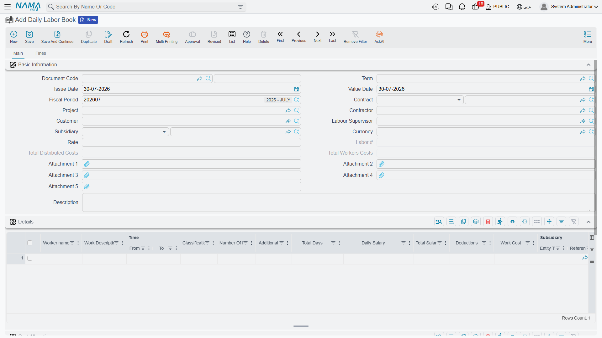
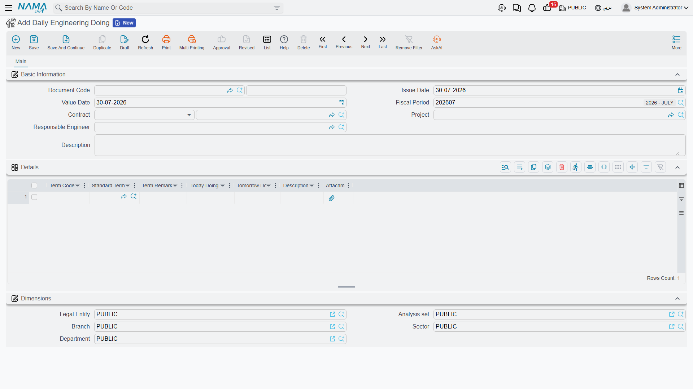

# Daily Labour and Site Diary

Two documents in this part of the module are written by the people who are actually on site, at the end
of the day, in their own handwriting before anyone types them up. The **Daily Labour Book**
(مستند السركى) records who worked and what they are owed. The **Daily Engineering Diary**
(مستند الأعمال الهندسية اليومية) records what was built. They look like a pair, and they behave nothing
alike: the first books a journal entry and puts real cost on the project, the second is a written record
and nothing else.

Both are reached from **Contracting > Contractor Contracting** and need the `contracting` licence. The
Labour Book also appears as an embedded list on the subcontract screen, so everything recorded against
a particular subcontract can be seen from it.

## The Daily Labour Book has no connection to payroll — at all

Start here, because almost everyone assumes the opposite and the assumption leads to hours of fruitless
searching.

**The worker is a name typed into a text box.** There is no employee reference on a labour line, no
lookup, no validation, nothing that ties "Rajesh K." to anything else in the system. Type the name
differently tomorrow and the system will not notice.

**The wage is arithmetic done on the document.** Days times a daily rate, less deductions. Nothing is
read from a salary structure, a grade, an allowance table or a contract of employment.

**The journal entry is the document's own.** The Labour Book books directly to the accounts named on
its document term. It does not produce a salary document, and no payroll run consumes it, absorbs it or
knows it exists.

**Even the cost bucket is different.** Labour Book cost lands in the *Workers* column of a
[Cost Execution](/modules/contracting/costs/contracting-cost-execution); payroll cost lands in
*Salaries*. They are separate totals precisely because they come from separate worlds.

This is not an oversight. It is what the document is *for*: casual, day-rate site labour — the gang the
foreman hires through a labour supplier for a week of stacking blocks, paid by the day, never on the
company payroll. If your site labour genuinely is on payroll, the Labour Book is the wrong document
entirely; use the allocation and cost-distribution chain described in
[Employees, Equipment and Their Costs](/modules/contracting/costs/contracting-equipment-and-allocations),
which reads real salary documents.

## The Labour Book, page by page

### The header

A document term is required, because this document has an accounting effect. Beyond the usual dates and
fiscal period:

- **Contract** accepts either a project contract or a subcontract. Whichever you pick, the **Project**
  fills itself in, and — importantly — the cost lines are always attributed to the **project** contract:
  choose a subcontract and the system resolves it to the project contract behind it.
- **Subsidiary** is the counterparty of the journal entry: the contractor, third party, customer or
  supplier who is going to be paid for these men. This is the field that matters accounting-wise, and a
  line can override it for one worker.
- **Currency and rate** default from the legal entity's main ledger currency, with a rate of 1.
- **Labour #** is filled by the system on commit with the sequence number of this book within its
  contract, so "the eighteenth labour sheet on Tower A" is a real, findable thing.
- Two read-only totals sit here — **Total Workers Costs** (from the details grid) and **Total
  Distributed Costs** (from the cost allocation grid) — and their agreement is what the document is
  validated on.

Three further header fields — **Contractor**, **Customer** and **Labour Supervisor** — are
informational. They are recorded on the document and can be printed or reported on, but no rule,
calculation or account selection reads them.

### The details grid — who worked

| Column | What it does |
|---|---|
| Worker name | free text; this is the labourer's name and nothing more |
| Work Description, Classification | descriptive |
| Time From, Time To | descriptive |
| Number Of Days | input |
| Additional | overtime, **expressed in days** — 0.5 means half a day extra |
| Total Days | read-only, days + additional |
| Daily Salary | the day rate |
| Total Salary | read-only, daily salary × total days |
| Deductions | anything withheld from this man |
| Work Cost | total salary − deductions — **the figure that reaches the ledger** |
| Subsidiary | overrides the header counterparty for this one line |

The wage is computed from **four fields only**: number of days, additional days, daily salary and
deductions. The times and the classification play no part in it — *Time From* 07:00 and *Time To* 17:00
do not become ten hours and do not become a day and a quarter. If a man worked overtime, express it in
*Additional* as a fraction of a day. And if all four numeric fields are left empty, a Work Cost typed by
hand is left exactly as typed, which is the escape hatch for a lump-sum arrangement with no day rate
behind it.

### The cost allocation grid — which terms carry the wage bill

The second grid answers the question the details grid does not: the site owes these men 380 between
them, but against **which terms of the contract**? Each line names a term code (plus optionally the executive and
estimated budget term codes, an analysis term code and an analysis card), a cost, and a narration.

The rule enforced on commit is a simple one and worth understanding precisely:

> **The total of the cost allocation grid must equal the total of the worker costs.** Otherwise the
> commit is refused, with the message naming both figures.

But note the condition attached to it: the check only runs **if the cost allocation grid has at least
one line**. Leave it completely empty and the document commits happily, produces a perfectly correct
journal entry — and puts **zero** cost on the project. The same is true of an individual line whose term
code is blank: it is skipped in silence. If someone reports labour cost missing from a project, the
allocation grid is the first place to look.

## What happens on commit

Three things, in this order.

1. **The project is charged.** The cost lines are written against their term codes, so the contract's
   term line moves immediately in *Actual Cost*, and the same cost is deposited in the pool that a
   [Cost Execution](/modules/contracting/costs/contracting-cost-execution) later absorbs as *Workers*
   cost.
2. **The journal entry is produced.** One debit/credit pair **per worker**, not per cost line, valued at
   that worker's Work Cost. The document's dimensions apply, unless a line overrides them. Delivery is a
   background business request, so the entry appears a moment after the save and a failure is retried
   from the Business Requests view.
3. **Subcontractor fines are created.** See the next section.

::: tip Debit 2 and Credit 2 are the *only* accounts
On this document, as on every contracting document, the accounting sides on the term are labelled
**Debit 2 / مدين 2** and **Credit 2 / دائن 2**. There is no "Debit 1" to look for. The usual wiring is
Debit 2 = the labour cost or work-in-progress account, Credit 2 = the labour supplier's subsidiary
account. Leave both empty and no entry is produced at all.
:::

The term also offers the two analysis-card ceilings — refuse the save if the actual quantity or the
actual cost on a term would exceed what its analysis card planned.

## The Fines page — real fine documents, made here

The Labour Book has a second page for something the foreman also discovers during the day: a
subcontractor who did something that costs money to put right. Rather than making the foreman open a
separate screen, the fine lines are typed here, and on commit the system **creates real Subcontractor
Fine documents** from them.

Each fine line names the subcontract, the subcontractor, a fine value, a fine reason, the contracting
condition through which it will be recovered, and a payment method with its percentage or value. The
generated fines are grouped: lines that share the same payment method, percentage, value, condition and
subcontract produce **one** fine document between them. Take a group away and re-commit and its fine
document is deleted; cancel the Labour Book and all of them are deleted.

::: warning The fine book and term must be configured, or nothing is created
The generation reads a **book** and a **document term** for the subcontractor fine from the Labour
Book's own term. If either is missing, the fine lines are stored on the document and no fine document is
ever produced — silently. This is the first thing to check when someone says "I entered the deduction
and it never reached his extract".
:::

Once created, those fines behave exactly like fines entered directly, and reach the subcontractor's
money through his extract — see
[Subcontractor Fines](/modules/contracting/contractor-contracting/contracting-contractor-fines).

## The Site Diary is a record, and only a record

The **Daily Engineering Diary** is the site diary in its purest form. Each evening the responsible
engineer writes, term by term, what was done today and what is planned for tomorrow, and attaches a
photograph if there is one. Picking the contract fills in the project and the responsible engineer; the
term code column offers the contract's terms as suggestions and, once chosen, brings the standard term
and the term's description across.

Then it stops. There is **no document term on the diary at all**, no accounting effect, no cost entries,
and — the point people get wrong — **it drives no quantities**. Today's and tomorrow's work are free
narrative text, and nothing reads them. Executed quantities come only from
[project execution](/modules/contracting/project-contracting/contracting-project-execution),
[subcontractor execution](/modules/contracting/contractor-contracting/contracting-contractor-execution)
and the [cost execution](/modules/contracting/costs/contracting-cost-execution).

That is not a shortcoming. A defensible daily record of what happened on site, term by term, signed off
by a named engineer, is exactly what wins a delay claim two years later. Its value is the record itself.

## Worked example: a week of the block-laying gang

**Tower A** for **Al-Fanar Development**, project contract `PC-2026-001`, term `3.01` *Blockwork*. The
foreman keeps one sheet per gang per week and writes each man's total days on it.

`DLB-000318`, value date 13 March 2026, contract `PC-2026-001`, subsidiary = labour supplier `SUP-0044`,
currency and rate as defaulted.

**Details — who worked:**

| # | Worker name | Classification | Days | Additional | Total days | Daily salary | Total salary | Deductions | Work Cost |
|---|---|---|---|---|---|---|---|---|---|
| 1 | Rajesh K. | Mason | 1 | 0.5 | 1.5 | 120 | 180 | — | **180** |
| 2 | Anwar S. | Mason | 1 | — | 1 | 120 | 120 | 20 | **100** |
| 3 | Bilal H. | Helper | 1 | 0.25 | 1.25 | 80 | 100 | — | **100** |
| | | | | | | | | **Total Workers Costs** | **380** |

Rajesh worked a day and a half — the extra half day is entered as 0.5 in *Additional*, not as four hours
in the time columns. Anwar had 20 withheld for a broken level, so his Work Cost is 100 rather than 120.

**Cost Allocation — where it lands:**

| Term Code | Executive Term | Cost | Narration |
|---|---|---|---|
| `3.01` | `EX-3.01` | 380 | Blockwork gang, week ending 13/03 |
| | | **Total Distributed Costs 380** | |

380 equals 380, so the commit is accepted. Then:

- **The journal entry** is three debit/credit pairs — Debit 2 the labour cost account 180, 100 and 100,
  Credit 2 the `SUP-0044` subsidiary 380 in total — produced as a background request.
- **The project** gets 380 of cost against term `3.01`: the contract's term line rises by 380 in
  *Actual Cost*, and 380 of *Workers* cost is waiting in the pool.
- **Labour #** is stamped as 18 — the eighteenth labour sheet on this contract.

Change Anwar's deduction to 30 and forget to change the allocation line, and the commit is refused:
370 of worker cost against 380 distributed. Delete the allocation line altogether and the document
commits with a correct journal entry and no project cost at all.
