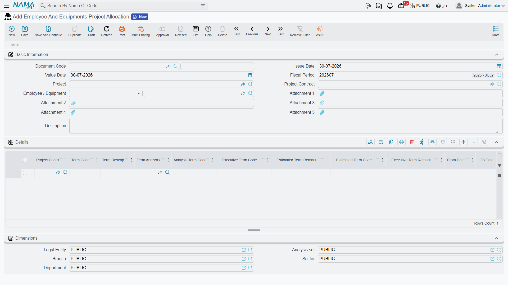
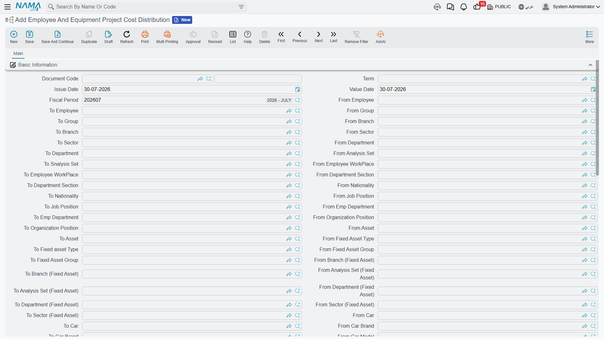
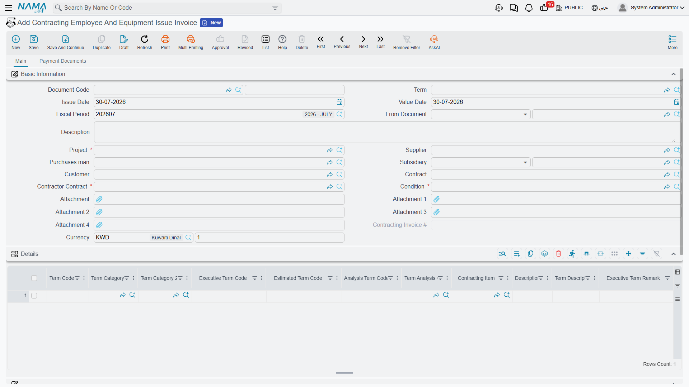
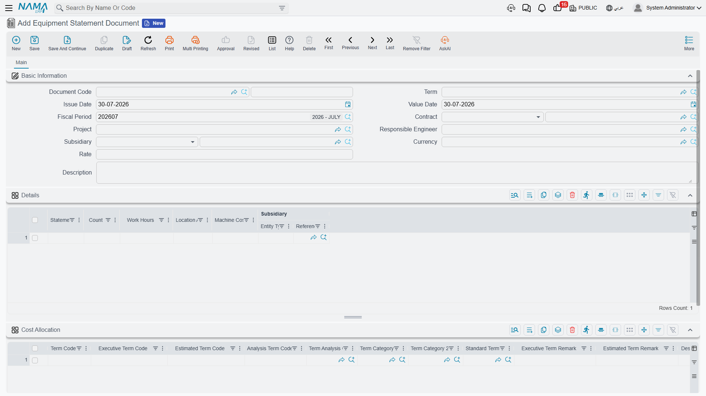
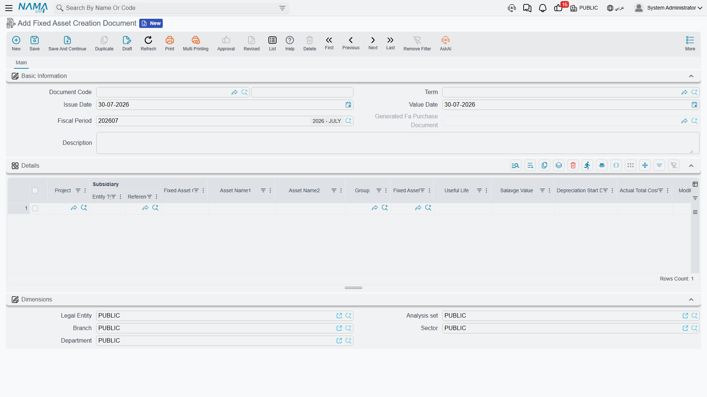

# Employees, Equipment and Their Costs

The site engineer who spends March on Tower A is on the company payroll. The tower crane that stands
there all month is a fixed asset that depreciates. Neither of them belongs to the project in any
accounting sense: his salary is booked by a payroll run, the crane's depreciation by a depreciation run,
and both of those documents are about the *company*, not about the tower.

Yet if the project's cost does not include a share of the engineer and a share of the crane, it is a
fiction. That is the gap this part of the module closes, and it closes it in three deliberate steps.

| Step | Document | What it does | Menu |
|---|---|---|---|
| 1 | Employee And Equipment Project Allocation | declares who and what is stationed on which project term, between which dates | Contracting > Master Files |
| 2 | Employee And Equipment Project Cost Distribution | pulls the real salary and depreciation documents, slices them by allocated days, and puts the slices on project terms | Contracting > Master Files |
| 3 | Contracting Employee And Equipment Issue Invoice | the invoice you receive when the people and machines were **hired in** from a supplier | Contracting > Master Files |

All three are **documents** despite being filed under *Master Files*, and all three need the
`contracting` licence. Steps 1 and 2 are a pair and belong together. Step 3 is a different animal
altogether, and the section on it below explains why.

## Step 1 — the allocation

An allocation is a posting order in document form: *from 1 April to 30 April, engineer Hani and
excavator FA-0112 are working on project contract PC-2026-001, on these terms.* It carries no money at
all, no accounting effect, and no document term — there is nothing to configure on it.

Each line names:

- the **Project Contract** (required) and, if your configuration insists on it, the **Term Code** —
  which must exist on that contract;
- **From Date** and **To Date**, both required and checked in order;
- **Number Of Days**, filled by the system from the two dates;
- the **Employee / Equipment** — an employee, a fixed asset or a car (required);
- the budget and analysis term codes and the categories, as everywhere else in the module;
- and the line's own **Dimensions**, whose branch has a special use described below.

The header carries the project contract and an employee-or-equipment field purely as helpers: typing
either pushes the value down onto every line, and the project is derived from the contract.

### One person, one machine, one place at a time

The validation that matters is the **overlap check**. The same person or machine cannot be allocated to
two overlapping date ranges — not within one document, and not across other committed allocations
either. Try it and the commit names both offending lines and both documents. A module setting turns the
check off for organisations that genuinely share a resource across projects at the same time and split
its cost some other way.

### It writes back to the employee, asset or car

Committing an allocation also has an effect outside contracting, and it is worth knowing about because
it changes master records. If your configuration nominates a field on the employee, fixed asset or car
record for it, the system writes the **most recent still-current project contract** into that field, and
does the same for the allocation line's **branch**. "Still current" is the operative word: if the latest
allocation's end date is in the past, the field is **cleared** instead. Cancelling an allocation
re-derives both values.

Leave those configuration fields blank — the default — and none of this happens.

## Step 2 — costing the allocation

This is the document that moves money onto the project, and it is run once a payroll period, usually at
month end.

Its header is dominated by a **range**: three long blocks of from/to pairs, one for employees (by
employee, group, branch, sector, department, analysis set, workplace, job section, nationality, job
position, employee department and organisation grade), one for fixed assets (by asset, type, group,
branch, analysis set, department and sector) and one for cars (by car, brand, model, group, branch,
analysis set, department and sector). Every pair is genuinely used as a filter, and a pair left empty
imposes no restriction at all — so most months you fill in two or three and leave the rest alone.

### What Collect Documents does

Press **Collect Documents** and the system:

1. takes the document's value date and fiscal period (guessing the period from the date if you left it
   blank);
2. finds every allocation line whose date range overlaps that period, and filters them through the
   range;
3. fetches the matching real documents from the other modules — committed **salary documents** for the
   allocated employees, **asset depreciation** documents for the allocated assets and cars, and the
   **vehicle insurance** documents;
4. **excludes anything an earlier cost distribution already consumed**, which is the guard against
   double-counting the same salary run twice;
5. and writes one line per (project contract × source document × person or machine) into the
   **Details** grid, carrying the sliced cost.

The slice itself is simple arithmetic: **allocated days ÷ days in the period × the value of the salary
component**. Which components count is a module setting — a list of component types the implementation
nominates as project cost. Leave that list empty and the whole net salary plus paid instalments is used
as a single unnamed component.

The Details grid is entirely machine-filled: **every column on it is read-only**. It is the evidence of
what was collected, not something you edit.

### Distributing what was collected

The second grid, **Cost Allocation**, is where the collected amounts are attached to project terms, and
it *is* editable — with helpers that keep you honest. The document picker only offers documents already
in the Details grid; the person-or-machine and project-contract pickers are similarly restricted; and
the term code columns suggest the chosen contract's terms.

How much of the work you do by hand depends on one option on the document term:

- **Manual** (the default). Detail lines that already carry a term code are reconciled into the Cost
  Allocation grid for you; the rest you distribute yourself.
- **Automatic** (*توزيع التكلفة تلقائياً على البنود / Automatically Distribute Cost On Project Terms*).
  The grid is cleared and rebuilt. A detail line that already has a term code produces one cost line
  one-for-one. A detail line **without** one has its cost spread across the eligible terms of the
  project contract — for a person, the terms flagged as carrying **salary** cost; for a fixed asset, the
  terms flagged as carrying **depreciation** cost. The weight is chosen by a second term option, *Cost
  Distribution By*, which offers quantity (the default), total price or total cost, and each term takes
  its share in proportion.

Two things about automatic distribution are worth knowing before you rely on it. A **car** is not spread
automatically — only people and fixed assets are — so distribute car cost by hand. And **Term Category 2**
is not carried onto automatically built cost lines; if you report on that category, set it yourself.

### What it refuses, and what it produces

The validation is a reconciliation, per project contract and per source document: **the total of the
Cost Allocation lines must equal the cost collected for that pair.** The message quotes both figures —
and be aware that the collected figure it quotes is an internal total that appears on no grid, so read
it from the message rather than hunting for it on screen. Every term code must exist in its contract,
and cost already absorbed by a committed
[Cost Execution](/modules/contracting/costs/contracting-cost-execution) cannot be changed.

On commit, the cost lines — **not** the details lines — become the project's cost: **Salaries** where
the resource is a person, **Depreciations** where it is a machine. The document itself has **no
accounting effect**, and it should not: the journal entries were already booked by the payroll run and
the depreciation run. All this document does is attribute money that has already been booked to the
projects that consumed it.

## Step 3 — the invoice, which costs the project nothing

::: warning This invoice contributes **zero** to project cost
The Employee And Equipment Issue Invoice is an **external purchase invoice**. It creates a payable to
the supplier who provided the manpower or the plant, and it adds **nothing at all** to the project's
actual cost: no cost entries, nothing on the contract's term lines, nothing any
[Cost Execution](/modules/contracting/costs/contracting-cost-execution) can see. Its lines carry term
codes and they look exactly like the term codes on every other cost document, but the cost they carry is
zero by design.

If you need hired-in labour or plant to appear in project cost, enter the charge as a
[Misc Contracting Invoice](/modules/contracting/costs/contracting-misc-spend), which does book project
cost. Use this document when what you want is the payable, the payment schedule and the supplier
history.
:::

With that established, it is a well-equipped invoice. A manpower agency or a plant hire company supplies
you with named people and machines for a date range at a day rate; this is the invoice you receive for
that supply. Its header carries the supplier, a purchases man, a subsidiary, the customer, the project
(required), the project contract, a **required subcontract** and a **required contracting condition**,
plus the full invoice-money composite. Its lines carry:

- the **Employee / Equipment** — a person, a fixed asset or a car, required;
- **From Date** and **To Date**, from which the **Quantity** computes itself as the number of days
  inclusive of both ends;
- the contracting item, the term codes and the categories;
- the full purchase price block — unit price, total, eight discount levels, four taxes, net value;
- and a **Credit Side** chooser with an account, a subsidiary and a subsidiary account type, exactly as
  on the [misc contracting invoice](/modules/contracting/costs/contracting-misc-spend), so an individual
  line can send its credit somewhere other than the supplier.

Its second page is the payment machinery: external payment documents that settled it from outside, a
payment template with a **Generate Payments** action, the resulting instalment grid with paid and
remaining figures, and a grid of purchase clauses with planned and extended end dates and accumulated
extension fines.

The accounting effect is the ordinary invoice one, taken from the document term: an expense or
work-in-progress debit, the tax sides, and the supplier credited. One option on the term flips the whole
document into a **sales** invoice, for the case where you are the one hiring plant out.

## The Equipment Statement is an accounting document

The **Equipment Statement Document** (مستند بيان معدات), reached from **Contracting > Contractor
Contracting**, is the plant equivalent of a labour sheet: a dated list of what machinery worked on the
site, how many of it, for how many hours, where, and what that cost. Like the Labour Book it is embedded
as a list on the subcontract screen, so everything recorded against a subcontract is visible from it.

Each line is deliberately plain:

| Column | What it is |
|---|---|
| Statement | **free text** — this is where the machine is named |
| Count | how many machines |
| Work Hours | hours worked |
| Location And Area | free text |
| Machine Cost | the money, **typed by hand** |
| Subsidiary | overrides the header counterparty for this line |

Two expectations the name invites are worth correcting, because the document does not meet them.

**There are no meter readings.** The machine is a line of text, not a link to a fixed asset or a car,
and there is no start reading, end reading or engine-hours field anywhere on it.

**There is no hourly rate arithmetic.** Machine Cost is not computed from Work Hours by anything. The
hours are recorded for the record's sake; the cost is a figure the person filling in the sheet decides
and types. If you want rate × hours, you do the multiplication before you type.

What the document does on commit is produce **one journal entry**: a debit/credit pair per statement
line, valued at that line's Machine Cost, using the Debit 2 and Credit 2 sides on its document term —
typically a plant-cost or work-in-progress debit against the plant supplier's subsidiary account. The
line's own subsidiary overrides the header's. As always the entry is delivered as a background business
request, and if both sides are left empty no entry is produced at all.

And that is the whole of it. **The Equipment Statement writes no project cost entries.** Nothing reaches
the contract's term lines, and no Cost Execution can see it. Treat it as the way you book a plant charge
to the ledger with a proper site narrative behind it — not as a way to load cost onto a project. When
the plant charge does need to be part of project cost, invoice it as a
[Misc Contracting Invoice](/modules/contracting/costs/contracting-misc-spend) instead.

## Capitalising a project you built for yourself

Sometimes the thing a contractor builds stays on his own books — a head office, a labour camp, a
batching plant. The cost has been accumulating on a
[project](/modules/contracting/setup/contracting-projects); what is needed now is a fixed asset.

The **Fixed Asset Creation Document** (سند إنشاء أصول) does that conversion. It belongs to the fixed
assets area and is opened from **Assets > Master Files**, but it is gated on the **contracting** licence,
which tells you exactly who it is for. It can also be started from the project screen itself, where a
button opens a new one with a line already pointing at that project.

Each line pairs a **Project** with the asset to be created: the asset code, its Arabic and English name,
its group and type, the **Useful Life**, the **Salvage Value**, the **Depreciation Start Date** and the
actual and modified cost. Quantity is always one — this document creates assets, not batches of them.

On commit, two things are created for each line: the **fixed asset** itself, whose reference appears back
on the line, and an **asset purchase document** that carries the capitalisation entry. The creation
document books nothing directly; the generated purchase document does, under its own term. If the
creation document's term does not name a **book and term for the asset purchase document**, the commit
stops and says so — those two settings are effectively mandatory.

Two behaviours are worth knowing:

- **One asset per project.** If a fixed asset already exists for that project, the commit is refused and
  names the existing asset.
- **The asset inherits the contract's warranties.** Term lines flagged *Transfer To Asset* on every
  project contract of that project are copied into the new asset's own terms grid, complete with their
  warranty start and end dates. A roof that carries a ten-year guarantee arrives on the asset record
  carrying it.

## Worked example: a crane for twenty days, and an engineer for the month

**Tower A** for **Al-Fanar Development**, project contract `PC-2026-001`. It is April 2026 — thirty days.

### The allocation

`CEEA-000042`, value date 1 April 2026, project contract `PC-2026-001`:

| Project Contract | Term Code | From | To | Days | Employee / Equipment |
|---|---|---|---|---|---|
| PC-2026-001 | `3.01` | 01/04/2026 | 30/04/2026 | 30 | `EMP-0210` Eng. Hani, site engineer |
| PC-2026-001 | `2.01` | 01/04/2026 | 20/04/2026 | 20 | `FA-0112` tower crane |

Committing this costs nothing. It declares that in April, Hani's salary is attributable to the tower for
the whole month, and the crane's depreciation for twenty of the thirty days. If either had already been
allocated elsewhere over an overlapping range, the commit would have named the clash.

### The costing

`CEEC-000009`, value date 30 April 2026, on a term with automatic distribution on and the weight set to
quantity. Range: employees `EMP-0200` to `EMP-0299`, assets `FA-0100` to `FA-0199`; everything else left
empty.

Press **Collect Documents**:

| Project Contract | Document | Employee / Equipment | Term Code | Cost |
|---|---|---|---|---|
| PC-2026-001 | `SAL-2026-04` | EMP-0210 Eng. Hani | *(blank)* | 9,000 |
| PC-2026-001 | `FADEP-2026-04` | FA-0112 tower crane | *(blank)* | 6,000 |

Hani's April salary is 9,000 and he was allocated 30 of 30 days, so all of it is attributable. The
crane's April depreciation is 9,000 but it was allocated only 20 of 30 days, so **9,000 × 20 ÷ 30 =
6,000** comes through.

Neither detail line carries a term code, so automatic distribution spreads them. On `PC-2026-001`, two
terms are flagged as carrying salary cost — `3.01` *Blockwork* (2,000 m²) and `3.02` *Plastering*
(1,000 m²) — and one is flagged as carrying depreciation cost, `2.01` *Reinforced concrete*:

| Project Contract | Document | Employee / Equipment | Term Code | Cost |
|---|---|---|---|---|
| PC-2026-001 | SAL-2026-04 | EMP-0210 | `3.01` | 9,000 × 2,000/3,000 = **6,000** |
| PC-2026-001 | SAL-2026-04 | EMP-0210 | `3.02` | **3,000** |
| PC-2026-001 | FADEP-2026-04 | FA-0112 | `2.01` | **6,000** |

6,000 + 3,000 = 9,000, which matches what was collected for that salary document, and 6,000 matches the
depreciation document, so the commit is accepted. Three cost slices are written — **Salaries** 6,000 and
3,000, **Depreciations** 6,000 — and *Actual Cost* on the three term lines rises accordingly. No journal
entry is produced by this document; the salary run and the depreciation run already did that.

### And the hired crane, for contrast

In May the tower crane is off and a second, larger crane is hired in from *Gulf Plant Hire* for fifteen
days at 900 a day. That arrives as an Employee And Equipment Issue Invoice: quantity 15 computed from the
dates, 13,500 plus VAT, a payable to Gulf Plant Hire and a two-instalment payment plan. **Project cost
does not move.** If the 13,500 has to appear against term `2.01`, it must be entered as a Misc
Contracting Invoice instead — or, if the plant charge only needs to reach the ledger with a site
narrative behind it, as an Equipment Statement.
