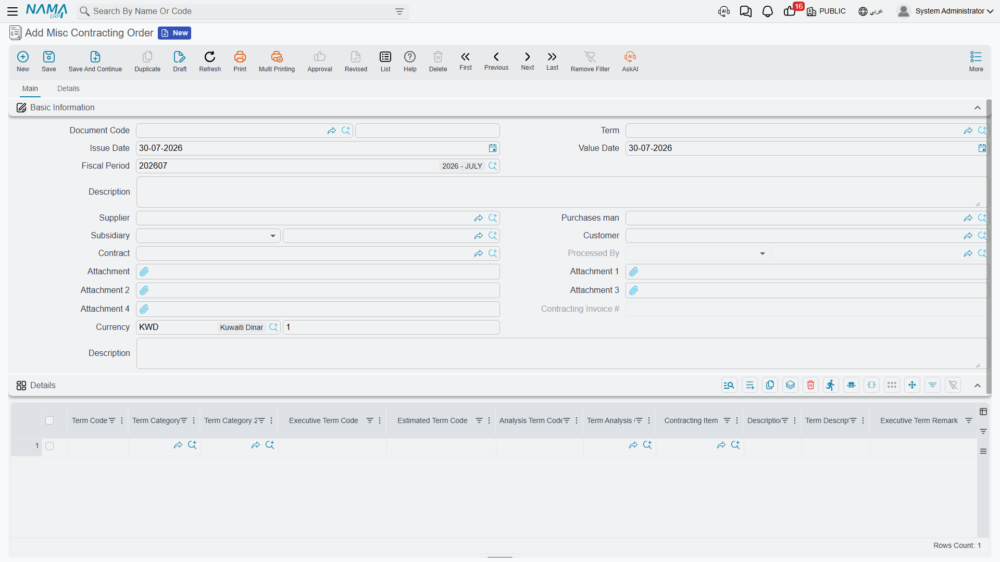
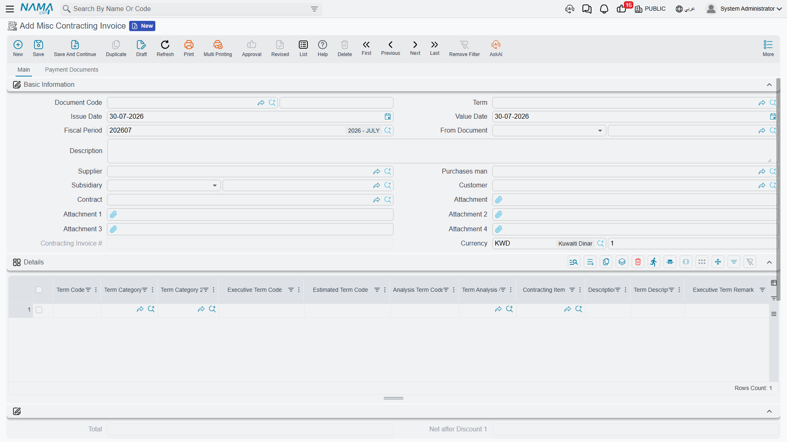

# Miscellaneous Contracting Spend

Most of what a site costs is not an item in a warehouse. The hoarding around the plot, the water and
electricity connections, the municipality permit, the crane you hire by the week, the tipper trucks
that take the spoil away, the soil-testing lab, the surveyor who sets out the grid, the scaffolding
rental, the small piece of work you gave to a jobber rather than sign a whole subcontract for — none
of these has an item code, a warehouse, a lot or a size. They have a price, an account and a project
term, and that is all.

The Arabic name of these three documents is the giveaway: **مستلزمات** — requisites, sundries, the
things a site *needs* rather than the things it *stocks*. Where
[material issues](/modules/contracting/costs/contracting-project-materials) move stock and
[the contracting purchase pair](/modules/contracting/costs/contracting-purchasing) buys stock, this
trio buys and expenses everything else, and tags every line with the project contract term it belongs
to so the money still lands on the right BOQ line.

## The trio

| Document | Arabic name | What it is |
|---|---|---|
| Misc Contracting Request | طلب شراء مستلزمات مقاولات | the site asks for a service or a non-stock supply |
| Misc Contracting Order | أمر شراء مستلزمات مقاولات | the priced order placed with the supplier |
| Misc Contracting Invoice | فاتورة شراء مستلزمات مقاولات | the invoice — **the only one of the three that books anything** |

All three live under **Contracting > Costs** and need the `contracting` licence.

## What a line looks like when there is no item

Open the details grid of any of the three and the inventory columns are simply not there — no item, no
warehouse, no locator, no colour or size or lot. In their place:

- a **Purchase Element**, which is the non-stock thing being bought. It is **mandatory on every line**,
  and it is what carries the expense account. This is the field that replaces "item".
- a plain **Quantity** (also required) and a full price block — unit price, total, eight discount
  levels, four taxes, net value.
- the usual contracting spine: **Term Code**, Analysis Term Code, Term Analysis Card, Standard Term,
  Contracting Item, Executive and Estimated term codes, the term categories and remarks, and a
  **Contract** per line.
- and — unusually — a **Credit Side** chooser per line, with an **Account**, a **Subsidiary** and a
  subsidiary account type beside it.

That last group is the reason this document exists in the shape it does. On an ordinary purchase
invoice the credit goes to the supplier and that is that. Here each line can send its credit somewhere
different: to the supplier's account, to a **specific account**, to a **specific subsidiary**, to the
**current user's subsidiary**, or to a miscellaneous purchase item. One invoice can therefore carry the
site's electricity bill (credit the utility's account), a cash-paid permit fee (credit the petty-cash
subsidiary) and a hire charge (credit the supplier) on three lines.

Note also that the line's **Contract** accepts either a project contract **or** a subcontract, so
spending incurred on account of a particular subcontract can be tagged as such — and the term code on
each line is validated against **that line's own** contract, not the header's.

## Only the invoice books anything

This is the single most important sentence on the page, and it is true twice over.

**In the ledger.** The request and the order produce no journal entry at all. The invoice produces the
full one: the debit and credit sides from its document term, the discount and cash sides, the four tax
sides, and then whatever redirection each line's Credit Side asks for. Typically the debit is the
expense or work-in-progress account and the credit is the supplier — but the line can override it.

**On the project.** The request and the order contribute **nothing** to project actual cost. Only the
invoice writes cost entries against the term codes on its lines, and it is those entries that appear
in the *Invoices* column of a
[Cost Execution](/modules/contracting/costs/contracting-cost-execution) and in the *Actual Cost*
column of the contract's term line.

So if someone asks why the 20,000 crane hire they ordered last week is not in the project cost, the
answer is almost always that the order has not been invoiced yet.

## The request

The request is the site's written ask: this purchase element, this much of it, against this term. Its
screen is deliberately quantity-only — there are no price columns and no totals on it, because at
request time the site is describing a need, not negotiating a price. It validates almost nothing
beyond requiring at least one line with a purchase element on it, and it has no effects of any kind.

## The order

The order shares its layout with the request and adds what the request lacks: the invoice-money
composite in the header, the price columns on the lines, and the totals group. Its second page carries
a grid of external payment documents, the shipping and delivery information block, and a grid of
purchase clauses with their planned and extended end dates.

When an invoice is later created from an order, the order is stamped as **processed by** that invoice,
so it is obvious from the order itself whether it has been invoiced.

## The invoice

Everything above becomes real here. Beyond the accounting effect, four behaviours are worth knowing.

**The term codes are checked properly.** Only the invoice enforces them: whether the project term code
is mandatory is a term option (it is, unless you make it optional), and separate options make the
executive and estimated budget term codes mandatory too. Each code must exist in its line's contract,
and the executive code must respect the budget's parent/leaf hierarchy.

**Direction is a term setting, not a document type.** The same document type is a purchase invoice, a
purchase return, a sales invoice or a sales return depending on two options on its term — one that
says this term is a sale rather than a purchase, and one that says it is a return. The e-invoicing
document type follows suit, producing an electronic invoice or an electronic credit note, with the
supplier as the tax-authority counterparty.

**The analysis card can do the typing.** Choosing an analysis term code on a line fills the term code,
the analysis card, the contracting item, the standard term, the categories and the descriptions — and,
if the contracting item names a purchase element, that too, which in turn pulls in the accounting side.
Unlike the material documents, the search here covers **all four** families of an analysis card:
materials, workers, subcontractors and other expenses. A module setting additionally lets picking a
term analysis card copy every one of its lines into the grid at once.

**A supplier's tax identity can be frozen onto the document.** With one module setting on, saving the
invoice snapshots the supplier's name, tax registration number and commercial registration number onto
the header and every line — the values the tax authority was told, preserved even if the supplier
record is edited later. Duplicating such an invoice clears the snapshot so the copy takes fresh values.

::: warning Cancelling an invoice clears the attachments on its lines
Line-level attachments are removed when the invoice is cancelled. If a scanned delivery note or a
signed timesheet is attached to a line, keep it somewhere else too before you cancel.
:::

## Once a Cost Execution has absorbed it

Like every other cost document, a misc contracting invoice line that a committed
[Cost Execution](/modules/contracting/costs/contracting-cost-execution) has already absorbed cannot be
changed, and the invoice cannot be deleted: *Can not delete the document … because it is linked to cost
execution …*. To correct something that far back, the Cost Execution has to be reversed first.

The invoice's term also offers the analysis-card ceilings — refuse the save if the actual quantity or
the actual cost on this term would exceed the quantity or cost planned on its analysis card. They are
the way to stop a site quietly spending three times the analysed figure on a term.

## Worked example: fencing the site

**Tower A** for **Al-Fanar Development**, project contract `PC-2026-001`. Before the earthworks can
start the plot has to be hoarded, and the fence is charged to `1.01` *Excavation*, the enabling-works
term.

1. **The site asks.** `MCR-000031`, a Misc Contracting Request: contract `PC-2026-001`, one line —
   purchase element `SRV-FENCE` *site hoarding, supply and erect*, term `1.01`, executive term
   `EX-1.01`, quantity **420 m**. No price is shown and none is needed. Nothing happens on commit.
2. **Purchasing places the order.** `MCO-000024`, created from the request so the header and lines copy
   across. Supplier *Al-Amana Site Services*, 420 m at 45 = **18,900**, VAT 15% = 2,835, total
   **21,735**. The order still books nothing, and `PC-2026-001` still shows no cost for it.
3. **The fence goes up and is invoiced.** `MCI-000044`, created from the order. On the line, Credit
   Side is left as the supplier, so the entry is: **debit** the site-preliminaries expense account
   18,900, **debit** input VAT 2,835, **credit** *Al-Amana Site Services* 21,735 — produced as a
   background business request, so it appears in the ledger a moment after the save.
4. **The project feels it.** A cost entry of **18,900** is written against term `1.01` of
   `PC-2026-001`. The contract's term line is 18,900 higher in *Actual Cost*, and 18,900 of *Invoices*
   cost is now waiting in the pool for a Cost Execution to absorb.
5. **The order is closed off.** `MCO-000024` now shows `MCI-000044` as the invoice that processed it,
   so nobody invoices it twice.

Note what the 18,900 excludes: the VAT, which is recoverable and belongs to the tax accounts, not to
the project. And note where it would have gone if the term code had been left blank — nowhere. The
journal entry would still be perfect and the project would never have heard about the fence. That trap
is described in full in [How Project Cost Is Built](/modules/contracting/costs/contracting-cost-model).
