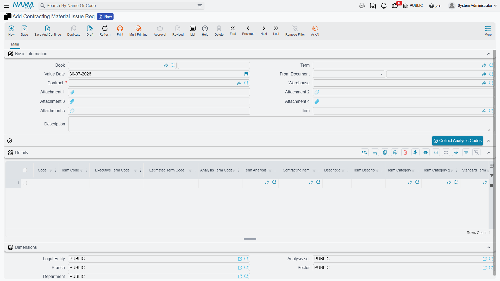
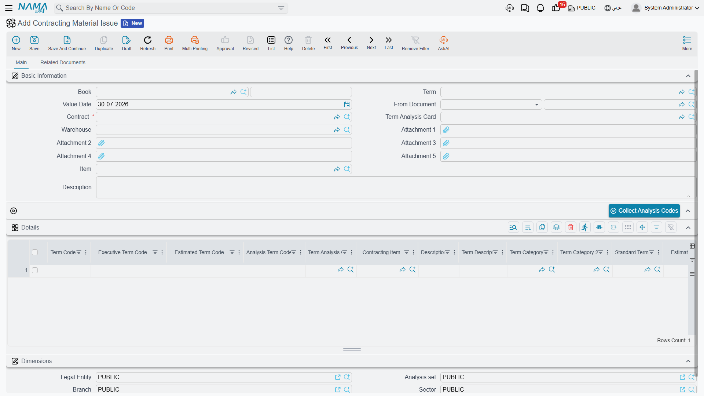
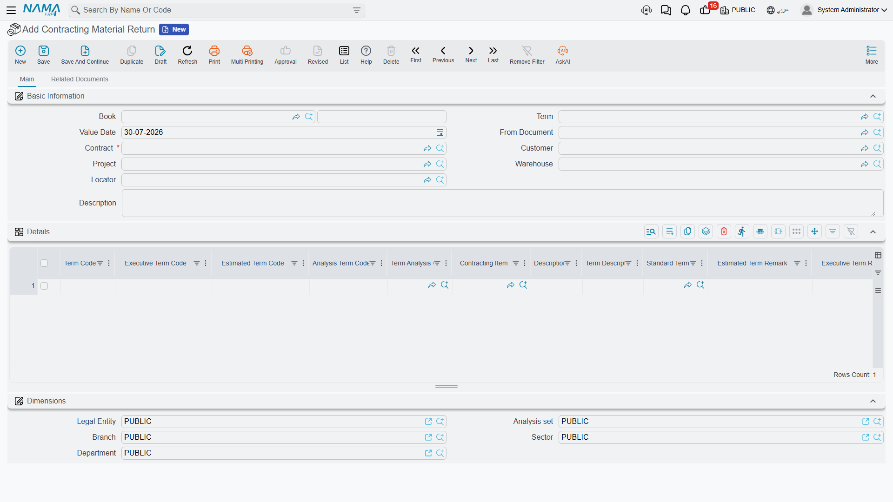

# Issuing Material to a Project

Two menu items sitting next to each other under **Contracting > Costs** look almost identical and
behave nothing alike. *Contracting Material Issue* takes company stock and burns it on your own
project. *Contractor Material Issue* takes company stock and **sells** it to a subcontractor. The
first is a cost; the second is a sale with an invoice behind it. Getting them confused is the single
most expensive mistake in this part of the module, so before anything else: this page is about the
first one, and
[Selling Material to a Subcontractor](/modules/contracting/costs/contracting-contractor-materials)
is about the second.

The project stream is three documents:

| Document | Arabic name | What it does |
|---|---|---|
| Contracting Material Issue Req | طلب صرف خامات مقاولات | the site asks for material |
| Contracting Material Issue | صرف خامات مقاولات | material leaves the warehouse and becomes project cost |
| Contracting Material Return | رد خامات مقاولات | unused material goes back and the cost comes off |

All three live under **Contracting > Costs** and need the `contracting` licence.

## There is no money on any of these documents

Look at the details grid of a material issue and you will not find a unit price, a discount or a tax —
because there is nothing to price. Nobody is being invoiced. What the project bears is the **inventory
cost** of what left the store, and inventory cost is not something a user types: the two money columns
on the line, **Unit Cost** and **Total Cost**, are read-only and are filled by the costing engine.

What the document *does* carry, and what makes it a contracting document rather than a plain stock
issue, is the set of term-code columns on every line. Each line says *this material was consumed on
this term of this project contract*, and that is how the cost finds its way onto the contract.

## The request

The request is the site's written ask: these items, against these contract terms, please. It has the
same shape as the issue — a required project contract, a warehouse, and details lines carrying term
codes and items — and it is the paperwork that gets an issue authorised.

Two facts about it are worth stating plainly, because people assume the opposite.

- **A request reserves nothing.** Out of the box it writes no cost, generates no stock document and
  changes no availability. It is a piece of paper. (The generic reservation and quantity-tracking
  options that every inventory document term carries are present on its term, so an implementation
  *can* make it reserve and can make the issue tick off the requested quantity — but that is a
  deliberate configuration decision, not the default.)
- **An issue does not need a request.** Nothing forces the *From Document* field on a material issue.
  Plenty of sites work request-first because they want the authorisation trail; plenty issue directly.
  Both are supported.

## The issue

### The header

**Contract** is required, and it accepts a **project contract only** — you cannot point a project
material issue at a subcontract. Picking it drives the term-code suggestions on the lines, and if the
document was built from a request the contract comes across automatically.

**Warehouse** is the source of the material, and it is not just a default: the header warehouse is
**pushed onto every line** each time the document is saved. If you need to issue from two warehouses,
you need two documents.

The header also carries two helpers that exist purely to save typing, plus five attachment slots and
the usual dimensions (محددات) group:

- **Term Analysis Card** — pick one and the grid is filled with a line per stocked item on that card,
  each already carrying its term code, analysis term code, standard term, unit cost and available
  quantity. The same thing can be done per line through the line's own analysis-card reference field
  when the term option that enables it is on.
- **Item** plus the **Collect Analysis Codes** button — the reverse question. Name an item and a
  contract, press the button, and the grid fills with every analysis-card term on that contract where
  the item appears. Useful when a delivery of one material has to be split across several terms. Both
  the item and the contract must be filled first, or the button says so.

### The lines

Each line pairs **an item** with **a term**, and the term half is where the contracting content lives:

| Column | What it is for |
|---|---|
| Term Code | **the load-bearing field** — the project contract term that bears this cost |
| Executive Term Code, Estimated Term Code | the matching lines on the executive and estimated budgets, so the cost lands there too |
| Analysis Term Code, Term Analysis Card | the analysis axis — what this cost should be compared against |
| Standard Term, Term Category, Term Category 2, Term Description | descriptive, carried over from the contract |
| Contracting Item | the direct-cost catalogue entry, where the material corresponds to one |
| Item, Code, measures and quantity | what actually leaves the store |
| warehouse, locator, colour, size, lot, revision | the item's specific dimensions |
| Unit Cost, Total Cost | read-only, filled by the costing engine |

### What the term code has to satisfy

Every non-empty term code is checked against the chosen contract's term list, and a code that is not
there is refused: *Term code … does not exist in the contract …*. Whether a term code is **required**
is a setup decision made on the document term (توجيه):

- by default the project term code is mandatory, and an option makes it optional;
- separate options make the **executive budget** term code and the **estimated budget** term code
  mandatory too, for implementations that budget at that level.

Leaving the project term code optional has a consequence worth understanding: a line without one is
skipped when cost is attributed, so the material leaves the warehouse and the project never hears
about it. If your implementation does not deliberately need blank term codes, keep the code mandatory.

There is one further check, off by default, that links this document to the
[contracting purchase order](/modules/contracting/costs/contracting-purchasing): tick *prevent saving
if the issued item quantity exceeds the purchase order quantity* on the term and the system will
compare, per item and per term code, everything ever issued on this contract against everything ever
ordered on it, and refuse the issue that goes over. It is the only hard link between the two
documents, and it is how a site is stopped from consuming more than was bought for it.

### What happens when the document is processed

Committing a material issue does two things.

**It writes the cost onto the project.** The cost entries land against each line's term codes — you
will see the contract's term line move immediately — and the same cost is deposited in the pool that a
[Cost Execution](/modules/contracting/costs/contracting-cost-execution) later draws on.

**It generates a Stock Issue, which is what actually moves the material.** The contracting document
itself has no inventory effect; it creates and commits an ordinary stock issue in the background,
carrying its lines, its warehouse and locator, its dates and its dimensions. The generated document
shows up on the **Related Documents** page of the issue, and cancelling the contracting document
deletes it again.

::: warning The generated document needs a book and a term, or nothing moves
The book and document term of the generated stock issue are configured **on the material issue's own
document term**. If either is empty, no stock document is created at all — the material issue commits
happily, writes its cost entries, and the stock never leaves the warehouse. This is the single most
important setup step for this document, and the first thing to check when someone reports that stock
balances did not change.
:::

### Why the cost arrives a moment later

The cost of the material is not known at the instant you commit, because average cost is computed by
the inventory engine as a background business request. When that request finishes for the generated
stock issue, a callback copies the resulting total cost back onto each line of the material issue,
works out the unit cost from it, and re-writes the cost entries with the real figures.

So the sequence is: commit → stock issue created → costing runs → the project's cost figure becomes
final. On a busy database that is seconds, not minutes, but it is not instantaneous, and a zero cost
column immediately after committing is not a fault. The same mechanism can be triggered again if a
cost correction elsewhere changes the answer — and a Cost Execution asks every material issue it is
about to absorb to refresh its cost first, precisely because average cost moves.

## The return

Material that was drawn but not consumed goes back on a **Contracting Material Return**, and the
project's cost must fall by what comes back. Its shape mirrors the issue — required project contract,
a warehouse whose value is forced onto the lines, the same term-code columns, the same read-only cost
columns — with a **Project** field on the header that the other two do not have. Choosing a project
filters the contract picker to that project's unfinished contracts, and choosing a contract can
pre-fill the grid with one line per contract term.

Its distinctive behaviour is the **return-quantity check**. Before committing, the system totals, per
term code and item, everything ever issued on this contract and everything already returned against
it, and then refuses lines that do not make sense:

- *The item … is not issued for the term …* — you are returning something that was never issued on
  that term;
- *The returned quantity is greater than the issued quantity for the item … and term …* — you are
  returning more than went out.

Two term options adjust this. One allows the returned quantity to exceed the issued quantity, for
sites that genuinely need it. The other makes the comparison consider the **executive budget term
code** as well, so the same item on the same contract term is tracked separately per budget line.

On commit the return writes negative cost entries against the term codes and generates a **Stock
Receipt** — the mirror of the issue's stock issue, and equally dependent on the generated-document
book and term being configured on the return's own document term. The value credited back to the
project is the receipt's own inbound cost, again arriving via the background costing request.

## Once a Cost Execution has used it, it is locked

Both the issue and the return refuse to be deleted once one of their lines has been absorbed by a
Cost Execution: *Can not delete the document … because it is linked to cost execution …*. Modifying
such a line is blocked for the same reason. This is deliberate — a committed Cost Execution has
already turned that cost into a unit cost, and an extract may already have billed against it. To
correct a mistake that far back, the Cost Execution has to be reversed first, and the project extract
before it if one exists.

## Worked example: 200 blocks, five of them returned

Continuing **Tower A**, project contract `PC-2026-001`, term `3.01` Blockwork.

1. **The site asks.** `CMQ-000042`, a Contracting Material Issue Req: contract `PC-2026-001`, warehouse
   `WH-SITE-A`, one line — term `3.01`, item `BLK-20` hollow block, **200 EA**. Nothing is reserved;
   the store now simply knows what is wanted.
2. **The storekeeper issues.** `CMI-000101`, a Contracting Material Issue with *From Document* =
   `CMQ-000042`, so the contract copies itself over. Same warehouse, same line, commit.
3. **Stock moves.** The document's term names generated-document book `SI-CNTR` and term
   `SI-CNTR-STD`, so stock issue `SI-001207` is created and committed automatically. 200 blocks leave
   `WH-SITE-A`.
4. **The cost arrives.** The costing request runs; average cost is 4.00 a block. The callback writes
   Unit Cost 4.00 and Total Cost **800** onto the line and rewrites the cost entries.
5. **The project feels it.** Term `3.01` on `PC-2026-001` is 800 higher in *Actual Cost*, and 800
   of *Materials* cost is now sitting in the pool waiting for a Cost Execution.
6. **Five come back.** `CMR-000018`, a Contracting Material Return: contract `PC-2026-001`, term
   `3.01`, item `BLK-20`, **5 EA**. The return check passes — 200 were issued on that term and none
   returned yet. Stock receipt `SR-000455` brings them back in, and at 4.00 the project is credited
   **20.00**.

Net effect on term `3.01` from these two documents: **780** of material cost. Try to return a
sixth block and the commit is refused, because 200 went out and 5 are already back.

By the end of March, this issue is one of a handful, and the term's material total has reached 900 — the
figure that appears in the *Materials* column when the March
[Cost Execution](/modules/contracting/costs/contracting-cost-execution) sweeps the period up.
