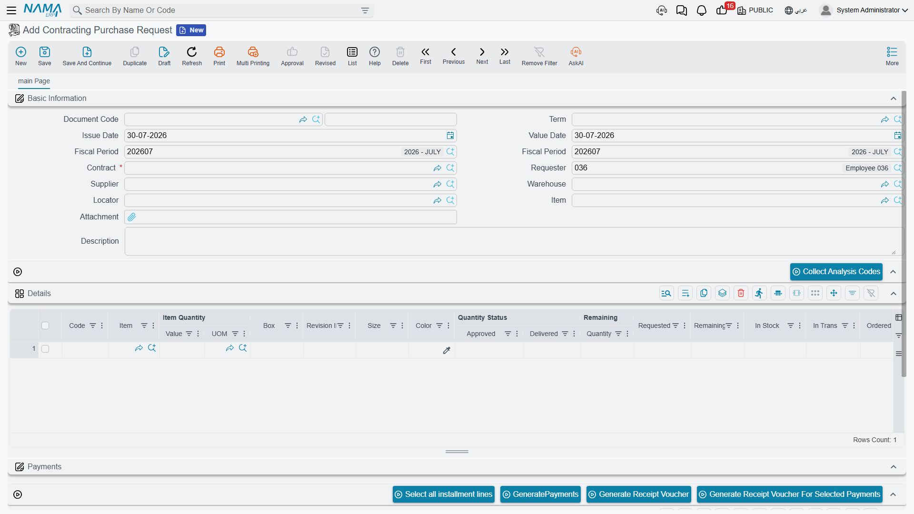
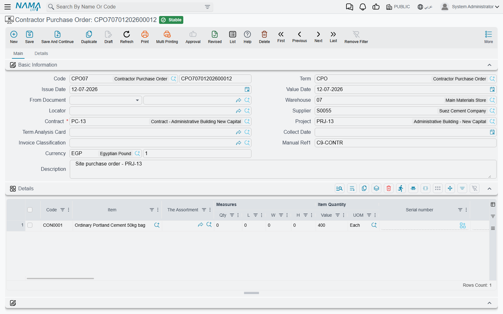

# Contracting Purchase Requests and Orders

Nama already has a perfectly serviceable purchase request and purchase order in the supply chain
module. So why does contracting ship its own pair?

Because a contractor never simply buys rebar. He buys rebar **for the concrete term of the Tower A
contract**, out of the executive budget line approved for that term, against an analysis card that
said the term needs so much steel per cubic metre. The purchase has to be traceable to a line of a
bill of quantities from the moment the site asks for it — otherwise nobody can answer the two
questions a project manager asks every week: *has what we ordered for this term arrived*, and *are we
buying more of it than we sold?*

So the contracting purchase request and the contracting purchase order are the ordinary purchase
documents — same supplier, same price block with its eight discount levels and four taxes, same
instalment schedules, same shipping information — **plus a contracting spine on every line**. That
spine is the whole point of their existence.

## Where they live and what they are called

| Document | Arabic name | Where you click |
|---|---|---|
| Contracting Purchase Request | طلب شراء مقاولات | Contracting > Contractor Contracting |
| Contracting Purchase Order | أمر شراء مقاولات | Contracting > Contractor Contracting |

Both need the `contracting` licence. The menu placement is misleading: these are **owner-side**
documents about *your* project, filed under the subcontractor menu group. In the English menu the
order appears as *Contractor Purchase Order*, but its Contract field accepts a **project contract
only** — you can never point either document at a subcontract.

## The spine that makes them contracting documents

Every line of both documents carries, on top of the ordinary purchase columns, the same set of
contracting columns you see on a [material issue](/modules/contracting/costs/contracting-project-materials):

| Column | What it is for |
|---|---|
| Term Code | **the load-bearing field** — the project contract term this purchase belongs to |
| Executive Term Code, Estimated Term Code | the matching lines on the two budgets |
| Analysis Term Code, Term Analysis Card | the analysis axis, so the buy can be compared with the analysed cost |
| Standard Term, Term Category, Term Category 2, and the three remark columns | descriptive, carried from the contract |
| Contract | the project contract of this individual line |

And a block of availability figures that answers "do we even need to buy this?" without leaving the
screen: **Requested**, **In Stock**, **In Transit**, **Remaining** and **Ordered**.

Whatever term code you type is checked against the chosen contract's term list, and a code that is
not there is refused. The executive budget term code is checked too, against the budget's own
parent/leaf hierarchy — so you cannot order against a roll-up budget line that exists only to total
its children.

## The request — the site asking, and nothing more

The request is what a site engineer raises when the store cannot supply something. Three things on it
are specific to that job.

**The requester fills itself in.** Opening a new request stamps the *Requester* field with the
employee record of the logged-in user, so the trail back to whoever asked survives without anyone
typing a name.

**Each line tracks its own fulfilment.** Alongside the requested quantity sit an **Approved
Quantity**, a **Delivered Quantity** and a **Remaining Quantity**, plus a **Recommended Supplier**
the site can nominate for the buyer to consider. A request is therefore useful long after it was
raised: it is the running record of what was asked for and how much of it has actually turned up.

**The analysis card fills the grid for you.** Name an item in the header and press **Collect Analysis
Codes** and the grid fills with every analysis-card term on this contract where that item appears —
useful when one delivery has to be split across several terms. The reverse works too: pick a term
analysis card and the grid is populated from its lines. An implementation can also restrict the item
picker to the items named on the analysis card, through the module setting described in
[Contracting Configuration](/modules/contracting/contracting-configuration).

**The request books nothing.** No journal entry, no stock movement. Whether it touches the project at
all is a setup decision on its document term (توجيه): tick *تطبيق تأثير تكاليف وكميات المقاولات /
Apply Contacting Cost And Quantity Effects* and the request starts contributing the **ordered
quantity** to the term lines it names. Left alone, it contributes nothing — it is paperwork, and that
is usually what you want from a request.

## The order — the commitment to a supplier

The order is where the money appears. Its header carries the supplier, the required project contract,
the project, a term analysis card, the delivery period and delivery date, a collect date, the payment
template and the full invoice-money composite; its lines carry the whole purchase price block on top
of the contracting spine. A second page holds three grids that matter on a construction buy:

- **Purchase clauses** — a grid of standard terms with a planned end date, an extended end date, a
  fulfilment date and accumulated extension fines. This is where "delivered to site by the 20th or
  1% a week" is written down.
- **Scheduled payments** — the instalment plan, built from the payment template, with a *View
  Installment Payments* action for what has actually been paid.
- **External payments** — payment vouchers that settled this order from outside it.

### What the order actually does when it is processed

Two effects, and both are configurable in a way that surprises people the first time.

**It posts to the ledger only if you tell it to.** The order looks at the debit and credit sides on
its document term. If neither is configured, the order books nothing at all — which is the normal
setting, because a purchase order is a commitment, not an expense. If they *are* configured it
produces a full invoice-style entry, taxes and discounts included. Change your mind and clear the
sides, and re-processing the order cancels the entry it made earlier.

**It contributes the ordered quantity to the project.** Here the polarity is the opposite of the
request: the order applies its contracting quantity effects **unless** you tick
*عدم تطبيق تأثير تكاليف وكميات المقاولات / Do Not Apply Contacting Cost And Quantity Effects*. What
lands on the contract's term line is the **Ordered Quantity** column — not money. The money side of a
purchased material reaches the project later, when the material is issued to it. A further option
makes those entries appear **at save, before the order is approved**, for implementations that want
the commitment visible during the approval cycle rather than after it; abandoning the draft removes
them again.

### What it refuses to save

A supplier is required. The instalment schedule has to reconcile with the remaining amount and the
voucher payments against it. Every term code must exist in the contract, the executive budget code
must respect the budget's hierarchy, and the contract must not be marked finished. Two more options
cap the quantities themselves: *منع تجاوز الكمية / Do Not Exceed Quantity* and *منع تجاوز كمية كارت
التحليل / Do Not Exceed Analysis Card Quantity*, which measure the order against the planned and the
analysed quantity of the term respectively.

## The one hard link between the order and the site's consumption

The contracting purchase order is also the ceiling for what the site is allowed to consume. Tick
*منع الحفظ إذا تعدت كمية الأصناف التي يتم صرفها كمية الأصناف الموجودة في أمر الشراء* on the
[material issue's](/modules/contracting/costs/contracting-project-materials) document term and, per
item and per term code, the system totals everything ever issued on this contract and compares it
with everything ever ordered on it. Issue more than was bought for that term and the commit is
refused.

The check runs in both directions. Reducing or deleting an order that has already been over-consumed
is refused for the same reason, with the same comparison. It is the only enforced relationship
between the two documents, and it is off by default.

## There is no contracting purchase invoice

This is the fact that catches everyone. The module has a purchase *request* and a purchase *order*,
and then the chain stops: **the order is invoiced on the ordinary supply chain purchase invoice.**
There is no contracting purchase invoice, and looking for one in the Contracting menu is a waste of
an afternoon.

In practice you create the purchase invoice from the order the ordinary way — through *From Document*,
or through the generate-document machinery that every purchase order participates in — and from that
point on you are in supply chain territory: goods receipt, supplier balance, payments, all of it
standard.

What the ordinary purchase invoice does **not** carry is the contracting spine. It has no term code
column, so it cannot say which BOQ line the money belongs to. That is not an omission you need to work
around, because of how project cost is designed to arrive:

- **Stocked material** becomes project cost when it is **issued to the project**, valued at inventory
  cost — see [Issuing Material to a Project](/modules/contracting/costs/contracting-project-materials).
  Buying it only moves it into the store.
- **Non-stock spend** — a service, a hire charge, a fee — never goes through this pair at all. It goes
  through the [misc contracting trio](/modules/contracting/costs/contracting-misc-spend), whose
  invoice *does* carry term codes and *does* book project cost.

So the rule of thumb when someone asks which purchase document to use: if it will sit in a warehouse,
use this pair and let the issue carry the cost. If it will never be stocked, use the misc contracting
documents instead.

## Worked example: four tonnes of rebar for the concrete term

**Tower A**, the residential tower we are building for **Al-Fanar Development**, project contract
`PC-2026-001`. Term `2.01` *Reinforced concrete*, 60 m³.

1. **The site asks.** `CPR-000067`, a Contracting Purchase Request: contract `PC-2026-001`, requester
   filled in automatically as the site engineer, one line — term `2.01`, executive term `EX-2.01`,
   item `RBR-16` deformed bar 16 mm, **4 tonnes**, recommended supplier *Gulf Steel*. The availability
   columns show 0.4 t in stock and nothing in transit, which is the justification for buying. The
   request books nothing and reserves nothing.
2. **Buying converts it.** `CPO-000058`, a Contracting Purchase Order created from the request, so the
   contract and the lines come across. Supplier *Gulf Steel*, 4 t at 2,600 = **10,400**, VAT 15% =
   1,560, total **11,960**. A purchase clause line records "to site by 18 April, 1% a week
   thereafter". The instalment plan is 50% on delivery, 50% at 30 days.
3. **The contract notices.** The order's term has the cost-and-quantity effects left on, so term
   `2.01` of `PC-2026-001` now shows **4** in its *Ordered Quantity* column. Its *Actual Cost* has
   not moved — no money has reached the project yet.
4. **The supplier is invoiced.** The buyer raises an ordinary **Purchase Invoice** from `CPO-000058`.
   Gulf Steel's balance and the input VAT are dealt with there. The project still shows no cost.
5. **The steel reaches the project.** When the bar is drawn from the site store for the pour,
   `CMI-000119`, a Contracting Material Issue against term `2.01`, is what finally puts the cost on
   the contract — at the inventory cost of what left the store.
6. **And the ceiling bites.** The material issue's term has the issued-versus-ordered check on. Four
   tonnes were ordered for term `2.01`; a second issue that would take the total past four tonnes is
   refused until someone raises another order.

That sequence is the whole model in miniature: **the order commits the quantity, the ordinary invoice
settles the supplier, and the issue carries the cost.**
