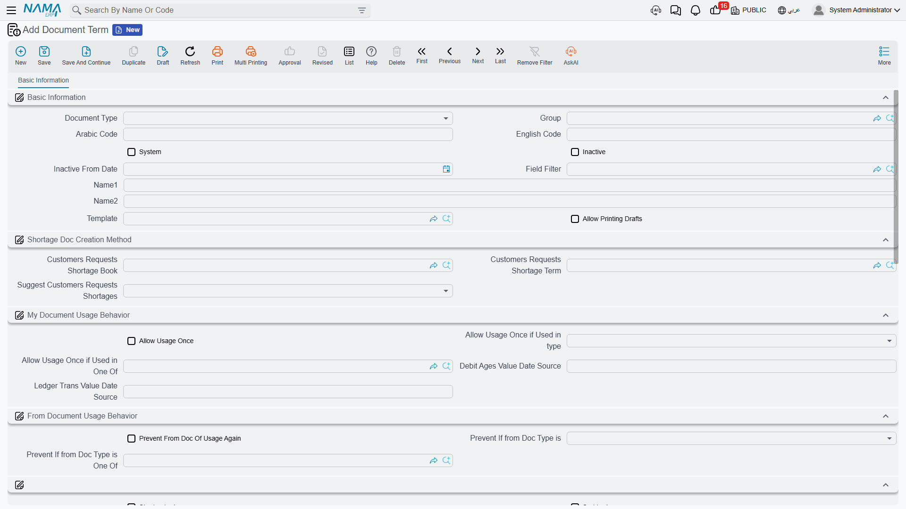

# Extract Document Terms

The extract is the only document in a contracting chain that reaches the ledger, which makes its term the most consequential piece of configuration in the module. Everything an extract posts — the certified work value, the taxes, the discounts, the planned cost, the actual cost, the variances — is a pair of accounts on this one screen. Get it right once per contract type and nobody ever thinks about it again; leave a pair blank and that part of the journal simply never appears.

There are two extract term screens, one for the [project extract](/modules/contracting/project-contracting/contracting-project-extracts.md) you bill the owner with and one for the [subcontractor extract](/modules/contracting/contractor-contracting/contracting-contractor-extracts.md) you certify a subcontractor with. They are built from the same shared set of options, so almost everything below applies to both, and where a screen differs it is called out. Both are a **single page** — everything is on one tab, arranged as a run of small groups: the behavioural switches first, then one group per posting.

A useful way to read the screen is that the groups fall into two kinds. The **behavioural** options change the arithmetic of the document — what the quantity means, what the price is based on, what is netted off. The **effect** groups change nothing at all about the numbers; they only decide where those numbers land in the ledger. Configure the effect groups first, because that is what makes the document post; treat the behavioural switches as tuning you turn on when a particular owner or consultant demands a particular presentation.

## Where to find them

| | |
|---|---|
| Menu | Basic > Settings > Document Term |
| Target document type | **Project Contract Extract**, or **Contractor Contract Extract** |
| Pages | One — *Effect* (التأثير) |
| Related | [Document Terms Basics](/modules/contracting/document-terms/contracting-terms-basics.md) for what a side is and how the standard term overrides it |

## What each posting is for

Each group on the screen is one posting, and each posting is a debit side, a credit side, and a fixed amount that Nama measures from the document. You do not choose the amount — only where it goes. Leave both sides of a group empty and that posting is skipped entirely.

| The group is where you set the accounts for… | The amount posted | Per line or per document | On which screen |
|---|---|---|---|
| **The main work value** — revenue on the owner side, cost/payable on the subcontractor side | the line's **due value**, i.e. what is being billed for that term this time | one pair per detail line | both |
| **Planned cost** of the certified work | the line's **total cost** | one pair per detail line | both |
| **Tax 1**, and separately **Tax 2**, **Tax 3**, **Tax 4** | each line's tax 1…4 value | summed over lines | both |
| **Discounts 1 to 8** | each line's discount 1…8 value | summed over lines | both |
| **Actual cost** — the cost genuinely consumed, as opposed to the planned cost above | the line's actual total cost | summed over lines | project extract |
| **Cost variance** — planned against actual | the line's cost difference. The credit side's English caption reads oddly; it is the *cost difference credit* | summed over lines | both |
| **Total price variance**, and a per-discount variance for each of the eight discounts | the line's total price difference and discount differences. Only meaningful with difference-only pricing, below | summed over lines | both |
| **The variance between the extracts' actual cost and the cost documents** | a single header figure | once per document | both |

Two things are deliberately **not** on this screen:

- **Retention, advance recovery and fines.** They arrive as condition lines and take their accounts from the [condition record](/modules/contracting/setup/contracting-conditions.md), including the condition's own tax accounts. See [how conditions post](/modules/contracting/document-terms/contracting-terms-basics.md).
- **Per-work-item accounts.** A [standard term](/modules/contracting/setup/contracting-standard-terms.md) that carries its own debit or credit overrides the term's main pair for its own lines.

There is one further side, used for conditions that carry an **other** value rather than an addition or a deduction: those credit a separate additional-cost side, falling back to the main credit if you leave it empty.

::: tip Parent term lines are headings, not money
A parent (roll-up) term line never posts on the main pair or the cost pair — only leaf lines do. But parent lines *are* included when the tax, discount, actual-cost and variance amounts are gathered. So keep values on the leaf lines and use parents purely as headings; a parent line carrying its own rolled-up tax or discount would be counted alongside its children.
:::

## Pricing modes — what the next extract is worth

By default an extract is **incremental**: each one bills the work of its own period, the previous extracts are visible as a *previous quantity* on the line, and nothing is recalculated backwards. That is the default, it needs no options, and it is what the [project extract page](/modules/contracting/project-contracting/contracting-project-extracts.md) describes in full.

Some owners and consultants insist on a cumulative presentation instead — "works to date 700 m³ at 50 = 35,000, less previously certified 20,000, this certificate 15,000". Two options change the arithmetic to that shape:

| Option | What it changes |
|---|---|
| **Calculate Prices Based On Total Quantity** | The line is priced on the **cumulative** quantity, and the previous extracts' values are subtracted to arrive at this certificate's amount |
| **Calculate Prices Difference From Previous Extract Only** | Also prices on the cumulative quantity, but subtracts only the **immediately preceding** extract, and records the resulting differences in the variance columns — which is what the total-price-variance and per-discount-variance postings above exist for |

Two things to know before choosing cumulative pricing:

- **The cumulative option is only half-effective on its own.** It does change how lines are priced, but the recalculation of the previous extracts' prices and discounts, and of taxes, happens only when the module setting that shows phase term lines is switched on in [module configuration](/modules/contracting/contracting-configuration.md). Without that setting the previous-value side of the cumulative presentation is not recalculated, so the figures you get are not the ones a cumulative certificate is supposed to show. Treat the two as a pair.
- **The two options describe two different arithmetics for the same idea, so pick one.** On the subcontractor extract term the system refuses to save both together. On the project extract term both can be saved together, which is not a combination that means anything — choose deliberately.

Three further options apply the same cumulative-then-net-off treatment to individual amounts rather than to the whole line:

| Option | Effect | On which screen |
|---|---|---|
| **Consider Previous Extracts Discount 1 Values** | Discount 1 is treated cumulatively and the earlier extracts' discount 1 is netted off | both |
| **Consider Previous Extracts Discount 2 Values** | The same for discount 2 | both |
| **Consider Previous Tax Values** | Taxes 1 to 4 are treated cumulatively and the earlier extracts' tax is netted off | project extract |

A fourth, **Previous Unit Price Difference Adjustment**, handles the case where the contract's unit price changed mid-project and earlier certificates were priced at the old rate: it posts the difference as its own adjustment. It depends on the module-level unit-price-difference setting being switched on — with that setting off, the term refuses to be saved with this option ticked, which is the system telling you to enable the feature first.

## Quantity, price and the previous extract

| Option | What it changes | On which screen |
|---|---|---|
| **Allow Extract Quantity to Exceed Contract Quantity** | Skips the permitted-percentage check entirely, so a line may bill more than the contract's quantity allows | both |
| **Force Contract Prices** | Blocks the save when any line's unit price differs from the contract's | both |
| **Allow Changing Extract Quantities if From Execution** | Lets the commercial team edit quantities on an extract that was seeded from an [execution](/modules/contracting/project-contracting/contracting-project-execution.md). Without it those quantities are locked to what was surveyed | both |
| **Calc Total Due Value From Previous Total** | The header's total due becomes this extract's total minus the previous extract's total, rather than being summed from the lines | both |
| **Fill Paid Quantity With Remaining Quantity From Previous Extract** | Changes what the *Collect Terms* action puts in the billing quantity: the whole remaining quantity rather than nothing | both |
| **Make Qty Zero When Collecting or Selecting Terms** | *Collect Terms* brings the terms in with a zero quantity, for teams who prefer to type every quantity by hand | both |

::: info Force Contract Prices is a save block, not a correction
It does not adjust a wrong price — it refuses the document. On a contract where the commercial team legitimately re-prices (a rate change, a negotiated variation), leave it off and control prices through [contract updates](/modules/contracting/project-contracting/contracting-project-contract-updates.md) instead.
:::

## The payment percentage

Contracting extracts carry a **payment percentage** — the proportion of a line's value that is actually payable now, used where a contract says a work item is certified at, say, 90% until the consultant signs off. Three options decide how far that percentage reaches:

| Option | What it changes | On which screen |
|---|---|---|
| **Consider Payment Percentage With Total Price** | The percentage scales the quantity used for pricing, so the line's total price itself is reduced | both |
| **Consider Payment Percentage In Calculation Of Discount Values** | The percentage is applied before discounts are computed, so discounts follow the reduced base | both |
| **Do Not Change Zero Payment Percent To 100** | A line left at zero percent stays at zero instead of being filled up to 100 | project extract |

## Conditions, instalments and the shape of the journal

| Option | What it changes |
|---|---|
| **Automatic Collect Payment Document With Save** | Whether advances and fines are collected into the conditions grid automatically on save. The choices are never, on every extract, or on the final extract only |
| **Copy Condition Document Lines With Remaining When Term Code And Condition Are Blank** | A condition row that names only a payment document, with no term code and no condition, is expanded into one row per remaining payment line on that document |
| **Add Conditions Tax To Statement Value** | Folds every condition line's tax into the **Tax 1** posting, on top of the condition's own tax accounts. Read the option by that behaviour rather than by its caption, which suggests it changes the extract's value — it does not |
| **Update Remaining In Contract Not Extract When Payment Or Receipt Voucher Created** | Settlement by receipt or payment voucher reduces the remaining balance on the **contract's** payment schedule rather than the extract's |
| **Link With Invoice Lines In Accounting Document** | Receipt and payment vouchers carry this extract's lines in their invoice grid, so a collection can be matched line by line |
| **Shorten Ledger Effect** | Collapses the per-line journal rows into one row per account. On a 200-line bill of quantities this is the difference between a readable entry and an unusable one |
| **Calculate discount N percentage from value** (one per discount, 1 to 8) | The discount percentage is derived from the amount you typed instead of the other way round. The same switch exists in module configuration and on the contract; any one of the three being on is enough |

## Owner side only — the tax model

The automatic tax-term mechanism exists on the **project** extract term only, because the owner extract is the document reported to the tax authority.

| Option | What it does |
|---|---|
| **Contracting Tax Extract Term** | The default tax-authority product that bill-of-quantities terms are reported under, used when a line has no tax term of its own |
| **Missing Tax Term Strategy** | What happens when a line has no tax term: **Error** refuses the save and names the offending line; **Default From Term Config** groups the line under the default term above; **Do Not Send** bills the line but leaves it out of what is reported |

::: warning Set the strategy even if you never expect a missing term
This field is the master switch for the whole tax roll-up. **Left blank, the extract's tax detail lines are never built at all** — the document bills correctly, but what is sent to the tax authority contains no lines. Choose a strategy on every project extract term; *Default From Term Config* additionally requires the default tax term above, and the term will not save without it.
:::

The full mechanism, including how a line finds its tax term, is on [Taxes on Extracts](/modules/contracting/project-contracting/contracting-extract-taxes.md).

## Subcontractor side only

The subcontractor extract term adds two families of options that have no owner-side equivalent, and both are about **cost**, which is what a subcontractor extract produces.

**The analysis-card ceilings.** Two switches block the save when the certified figures overrun the plan on the term's [analysis card](/modules/contracting/setup/contracting-term-analysis-cards.md):

- **Do Not Save If Actual Quantity Greater Than Planned Quantity**
- **Do Not Save If Actual Cost Greater Than Planned Cost**

They are the only hard spending control on this side of the module, so a business that wants subcontractor certification held to the analysed plan should tick both.

**The twelve cost exclusions.** *Exclude Tax 1 From Cost* through *Exclude Tax 4 From Cost*, and *Exclude Discount 1 From Cost* through *Exclude Discount 8 From Cost*. Each removes that one tax or discount amount from the cost the extract line contributes to the project. These are the switches that decide whether taxes and discounts are **capitalised into project actual cost** or kept out of it — a genuine accounting-policy decision, and one worth agreeing with the finance team before the first extract rather than after.

::: info Recoverable VAT belongs outside cost
The usual setting is to exclude a recoverable tax from cost (you get it back, so it is not a cost of the work) and to leave a non-recoverable one in. Trade discounts received are usually left in cost, so the cost falls by the discount.
:::

## Worked example — `EXT-STD` and `SUB-STD`

**The owner side.** Term `EXT-STD` for Project Contract Extract, used by Tower A's contract `PC-2026-001` of 230,000 (excavation `1.01`, 1,000 m³ at 50; reinforced concrete `2.01`, 60 m³ at 900; blockwork `3.01`, 2,000 m² at 46; plastering `3.02`, 1,000 m² at 34):

| Group | Debit | Credit |
|---|---|---|
| Main work value | Trade receivable, subsidiary from the customer | Contract revenue |
| Planned cost | Cost of contract works | Contract work in progress |
| Tax 1 | Contract revenue | Output VAT payable |

The actual-cost and variance pairs are left empty on this contract, because actual cost reaches the ledger through the material, labour and equipment documents themselves; configure them only where the business wants the extract to restate consumed cost as well. Leaving a pair empty is a valid answer, not an omission.

The rest of `EXT-STD` is behavioural: *Automatic Collect Payment Document With Save* set to **on every extract**, *Missing Tax Term Strategy* set to **Default From Term Config** with *Construction works* as the default tax term, and *Shorten Ledger Effect* on.

The first extract certifies 400 m³ of excavation, 20 m³ of concrete and 500 m² of blockwork — 61,000 of works, 9,150 VAT, 70,150 gross. Retention of 6,100 and advance recovery of 11,500 arrive as condition lines from the contract's retention condition and from the [46,000 advance](/modules/contracting/project-contracting/contracting-project-advances.md), reducing the net payable to **52,550**. The journal:

| Account | Debit | Credit |
|---|---|---|
| Trade receivable — from the term's main debit | 70,150 | |
| Contract revenue — from the term's main credit | | 70,150 |
| Contract revenue — from the Tax 1 debit | 9,150 | |
| Output VAT payable — from the Tax 1 credit | | 9,150 |
| Retention receivable — from the retention condition | 6,100 | |
| Trade receivable — from the retention condition | | 6,100 |
| Advances received from customers — from the advance's condition | 11,500 | |
| Trade receivable — from the advance's condition | | 11,500 |

Trade receivable nets to 52,550, exactly the net payable, and contract revenue nets to 61,000, exactly the pre-VAT works value. Nothing in that entry required a decision on the extract itself.

The second extract certifies a further 300 m³ of excavation, 20 m³ of concrete, 600 m² of blockwork and 200 m² of plastering — 67,400 of works, 10,110 VAT, 77,510 gross — and arrives at **59,270** net, after 6,740 of retention (10% of this certificate's works value, not of the contract) and a second 11,500 of advance recovery that draws the advance down from 34,500 to 23,000. Because pricing is left incremental, none of the first extract's figures is touched: previous quantity reads 400, 20 and 500, and the contract's term lines now read 700 m³, 40 m³, 1,100 m² and 200 m².

**The subcontractor side.** Term `SUB-STD` for Contractor Contract Extract, used by subcontract `CC-0042` — 2,000 m² of blockwork at 40, 80,000 in all — with 10% retention:

| Group | Debit | Credit |
|---|---|---|
| Main work value | Project work in progress | Subcontractor payable, subsidiary from the contractor |
| Planned cost | Cost of works | Accrued works |
| Tax 1 | Input VAT | Subcontractor payable |

plus *Exclude Tax 1 From Cost* ticked, because the input VAT is recoverable and must not be capitalised into the project's cost; and both analysis-card ceilings ticked, because this business certifies subcontractors strictly against the analysed plan.

The first subcontractor extract certifies 800 m² of blockwork at 40 — 32,000: work in progress is debited 32,000, the subcontractor payable is credited 32,000, and the retention condition withholds 3,200 to a retention-payable account. The project's actual cost rises by 32,000 and not by 36,800, because the 4,800 of VAT was excluded.
