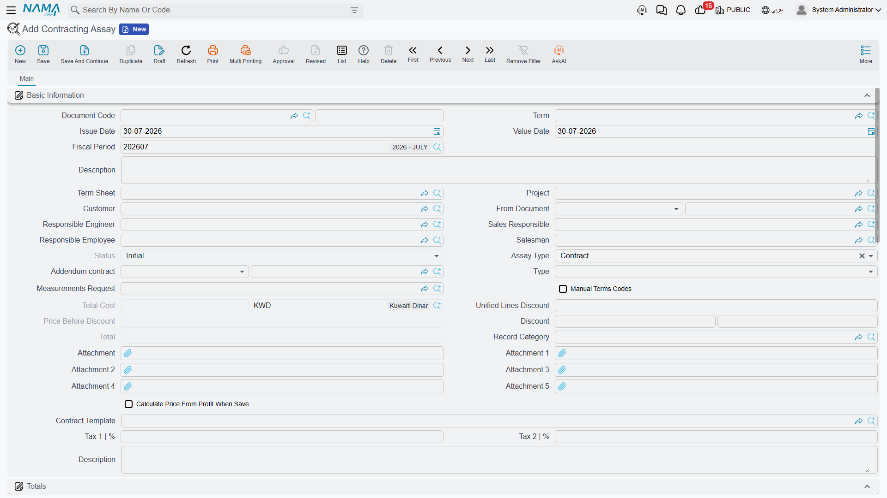

# Contracting Assays

The document this page describes is **مقايسة مقاولات** — a *priced bill of quantities*, the classic Arabic construction term for a measured schedule of works with quantities and rates. Its English name in Nama is *Contracting Assay*, and that name is a poor transliteration rather than a translation: nothing is being assayed, nothing is tested in a laboratory. If you read the English screens, read *assay* as *priced bill of quantities* and the document will make immediate sense.

You will find it at **Contracting > Project Contracting > Contracting Assay**, under licence `contracting`.

Our worked example continues the **Tower A** project for **Al-Fanar Development**: a bill of quantities totalling **230,000** across four items of work, carried from the tender documents through to signature as contract `PC-2026-001`.

## What it is for, and how it differs from an offer

The مقايسة and the [contracting offer](/modules/contracting/project-contracting/contracting-offers.md) are siblings. They are built on the same foundation, so the header fields are the same, the terms grid is the same, and both can be turned into a contract by the same buttons. Three things separate them:

| | Contracting assay (مقايسة) | Contracting offer |
|---|---|---|
| Who it is for | internal — the priced bill of quantities the company works from | the customer — the quotation you submit |
| Cost build-up | no cost-analysis grids | four grids: material, labour, subcontractors, expenses |
| Instalment plan | none | payment template plus a payments grid |
| Accounting | **can post to the ledger**, when its document term carries accounts | posts nothing, ever |

In practice organisations use them in one of two ways. Either the estimating department builds the مقايسة straight from the tender's [term sheet](/modules/contracting/setup/contracting-term-sheets.md) and it becomes the internal record of what was bid, with the offer produced from it for the client; or the offer is priced first and **Convert to Assay** produces the مقايسة afterwards as the record that goes forward to contract. Both routes are supported and the module does not prefer either.

## Populating it from a term sheet

The single field that does most of the work is **Term Sheet** (كراسة الشروط). Choosing it copies the sheet's project and customer onto the header, then clones **every** term line and **every** condition line from the sheet into this document. Nothing is left behind and nothing is filtered — you get the whole bill of quantities and then edit it down.

For Tower A, tender sheet in hand, the terms grid arrives as:

| Code | Standard term | Type | UOM | Quantity | Unit price | Total price |
|---|---|---|---|---|---|---|
| `1` | Earthworks | Parent | | | | **50,000** |
| `1.01` | Excavation | Leaf | m³ | 1,000 | 50.00 | 50,000 |
| `2` | Structure | Parent | | | | **54,000** |
| `2.01` | Reinforced concrete | Leaf | m³ | 60 | 900.00 | 54,000 |
| `3` | Masonry and finishes | Parent | | | | **126,000** |
| `3.01` | Blockwork | Leaf | m² | 2,000 | 46.00 | 92,000 |
| `3.02` | Plastering | Leaf | m² | 1,000 | 34.00 | 34,000 |

with the header totalling **230,000**. Parent rows carry no rates of their own — the system zeroes them and re-totals them from their children on every save, so line `1` reads 50,000 because line `1.01` does, and line `3` reads 126,000 because its two children add up to that, and the *Totals* block reports 230,000 before tax and, at 15% VAT, 264,500 after.

The **From Document** (بناءا على) field is the alternative route in: point it at a term sheet, at another مقايسة, or at a contracting offer, and the same copy happens from there. Use *From Document* when you are re-pricing something that already exists, and *Term Sheet* when you are pricing a tender for the first time.

The term-sheet picker is filtered by the document's customer and project, so once you have named the client you only see that client's sheets.

## The terms grid

The columns are the ones you already know from the rest of the module: term code, term categories, the **standard term** that supplies the unit, the default rate and the eventual posting accounts, *Treat As Detail* for a heading term you want to price as an ordinary line here, work area as a reporting dimension, the physical dimensions and the quantity derived from them, unit cost and total cost, unit price, discount, taxes, profit and total price.

Two columns exist here that the contract's grid does not have:

- **Manual Level** lets you force a line's outline depth instead of letting position decide it.
- **Term Status** marks a line as accepted or rejected during negotiation. This matters at conversion time: when a contract is built from this document, **rejected lines are not carried over**. It is the tidy way to keep the client's deletions visible on the bid record without polluting the signed contract.

Term codes behave as everywhere else — **Update Codes** renumbers the whole grid, **Update Empty Term Codes Only** fills the blanks safely, and *Manual Terms Codes* in the header switches automatic coding off. The [standard terms page](/modules/contracting/setup/contracting-standard-terms.md) explains the parent/leaf model and the dotted-code convention in full.

The **Conditions** grid holds the commercial clauses — our 10% retention line, for example. On this document they are a record and a carrier: nothing here calculates from them, and the values in their addition/deduction columns are not maintained by this screen. They earn their keep when the document becomes a contract, because the conversion copies them and on the contract they become live. The **Tasks** grid is likewise a documentary checklist of who does what.

## Two buttons whose names mislead

Both of these do useful work; both are named in a way that sends readers looking for the wrong behaviour.

**تجميع التحليلات** — labelled *Collect Terms* on English screens — does **not** collect terms. It pushes the analysed costs from [term analysis cards](/modules/contracting/setup/contracting-term-analysis-cards.md) onto the term lines this document already has, filling in their unit cost from the analysis. Use it after the terms are in place, when you want the cost side to reflect the analysis cards rather than whatever came off the term sheet. The Arabic label is the accurate one.

**تحديث الأرباح من كراسة الشروط** (*Update Profits From Sheet*) copies profit percentage, unit price and total price from the matching term sheet line, matched by term code. It is how a company governs its margin centrally: the sheet is the sanctioned rate card, and this button re-imposes it on a document somebody has been editing.

::: tip There is no "copy terms" button on a contract
This is worth stating here because it is the question the pair of buttons above provokes. Terms reach a project contract in one of two ways: by **converting** a مقايسة or an offer (or by pointing the contract's *Source* field at one), or by choosing a **contract template** on the contract, whose selection triggers the copy. There is no action anywhere that copies terms onto an existing contract on demand.
:::

## Status

The **Status** field has two values, *Initial* (مبدئي) and *Confirmed* (مؤكد), and it is system-maintained — you cannot type into it. A new document reads *Initial*, and on a plain installation it stays there; it is moved, if at all, by whatever approval arrangement your organisation has built around the document. Do not expect the module itself to advance it as you work.

## What it books

This is the one pre-contract document in the owner-side chain that can reach the ledger, and it is easy to miss because it does so **only if you configure it to**. The [document term](/modules/contracting/document-terms/contracting-terms-other.md) carries the accounts, and if none of them is filled the document posts nothing at all — which is how most installations run it.

When the accounts are configured, committing the document raises an accounting business request that is processed in the background, and produces one ledger line per priced (leaf) term line:

| Amount from the line | Posted to |
|---|---|
| Total price | the primary debit and credit accounts on the term |
| Tax 1 value | the tax 1 debit and credit accounts |
| Tax 2 value | the tax 2 debit and credit accounts |

Each pair posts only when both of its sides are configured. The subsidiary on the entry comes from the document — the customer, the project, and the main contract when the document is an addendum.

::: info "Debit 2" and "Credit 2" are the primary pair
On every contracting term screen the main accounts are labelled *Debit 2* (مدين 2) and *Credit 2* (دائن 2). There is no *Debit 1* to find — the numbering is historical. These are the accounts to set.
:::

If the document is posting and you cannot see the entry immediately, that is expected: the effect is a background business request. Failed requests are visible in the **Business Requests** list view, where you filter by status and use **More → Reprocess / Recommit**.

## Carrying it to signature

Four buttons turn the document into a contract:

- **Convert Contract** (تحويل لعقد) — builds a new, unsaved [project contract](/modules/contracting/project-contracting/contracting-project-contract.md) and opens it for you to review and save.
- **Convert Contract With Selected Lines Only** — the same, for the ticked lines only, which is what you use when the client awarded part of the scope.
- **Convert Contractor Contract** (تحويل لعقد مقاول باطن) and its selected-lines twin — the same conversion, producing a [subcontract](/modules/contracting/contractor-contracting/contracting-contractor-contract.md) instead.

The generated contract carries the project, the customer, the responsible engineer, the price before discount and the discount, the contract type and the main-contract reference, the remarks, all the term lines with their quantities and prices, and the condition lines. Its **Source** field points back at this document, so the signed contract always names the bid it came from.

For Tower A, one press of **Convert Contract** produces project contract `PC-2026-001` of **230,000** with the same four priced lines and the 10% retention condition already in place. From that point on, the story continues on [the project contract page](/modules/contracting/project-contracting/contracting-project-contract.md).

## Where to read next

- [Contracting offers](/modules/contracting/project-contracting/contracting-offers.md) — the customer-facing sibling, and the place cost is analysed.
- [Term sheets](/modules/contracting/setup/contracting-term-sheets.md) — the reusable bill of quantities this document is filled from.
- [Term analysis cards](/modules/contracting/setup/contracting-term-analysis-cards.md) — the cost analysis the *تجميع التحليلات* button reads.
- [Project contracts](/modules/contracting/project-contracting/contracting-project-contract.md) — what the conversion produces.
- [Other contracting document terms](/modules/contracting/document-terms/contracting-terms-other.md) — where this document's accounts are configured.
