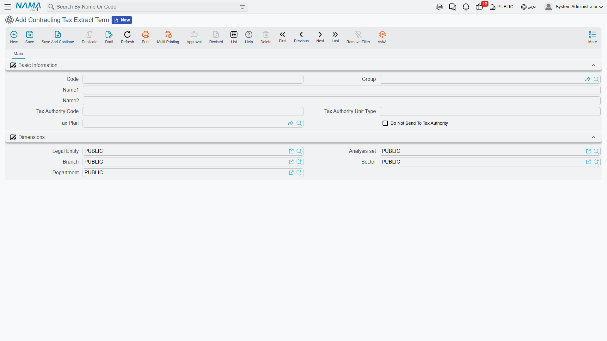

# Taxes on Extracts

A tax authority will not accept a bill of quantities. It wants a small, stable list of products or services with official codes, quantities and prices — and a contracting business's [extract](/modules/contracting/project-contracting/contracting-project-extracts.md) is the opposite of that: forty free-text lines describing excavation in three zones, blockwork in two thicknesses and a lump sum for temporary works.

The module bridges that gap with a mapping layer. Your BOQ terms stay as detailed as your engineers need them, and each of them points at a **tax extract term** (بند مستخلص ضريبي) — the tax-authority-facing item. When the extract is saved, the billing lines are rolled up by tax extract term into a second, much shorter grid, and **that** grid is what is reported.

## The tax extract term

A tax extract term is a small master file, and there are usually only a handful of them for a whole company: *Construction works*, *Consultancy*, *Supply of materials*.

| Field | What it is for |
|---|---|
| **Code** | your own identifier |
| **Group** | a master group, which can supply the tax code for a whole family at once |
| **Name1** / **Name2** | the Arabic and English names — these are what appear on the reported invoice |
| **Tax Authority Code** | the official code the authority expects for this item |
| the unit-type field next to it | the unit of measure the authority expects, in the authority's own vocabulary. Its label is not translated on the screen, so recognise it by position |
| **Tax Plan** | the tax policy applied when the roll-up line is priced |
| **Do Not Send To Tax Authority** | anything mapped to this term is excluded from the reported invoice entirely |

Find it under Contracting > Master Files > Contracting Tax Extract Term, on the `contracting` licence. It is covered alongside the module's other small master files on the [lookups page](/modules/contracting/setup/contracting-lookups.md).

## How an extract line finds its tax term

The lookup runs in four steps and stops at the first one that answers:

1. **The line's own Contracting Tax Extract Term column** on the extract's Details grid. This is the per-line override — the escape hatch for the one line that does not follow the rule.
2. **The line's standard term.** Each [standard term](/modules/contracting/setup/contracting-standard-terms.md) can name a tax extract term, and this is where the mapping normally lives: map the catalogue once and every contract inherits it.
3. **The contract's term line**, which can carry its own tax extract term for a contract that is reported differently from the rest of the business.
4. **Nothing found** — and then the strategy below decides what happens.

Set it up at level 2 and forget about it. Levels 1 and 3 exist for exceptions.

## Missing Tax Term Strategy — the switch that turns e-invoicing on

On the extract's [document term](/modules/contracting/document-terms/contracting-terms-extracts.md) there is a single option that governs the whole mechanism: **Missing Tax Term Strategy**. It has three values, and they answer the question "what should happen to a billing line that has no tax extract term?"

| Setting | What happens to an unmapped line |
|---|---|
| **Error** | the save fails, naming the line and its standard term. Nothing can be billed until the mapping is complete — the strictest and safest choice |
| **Default From Term Config** | the line is grouped under a default tax extract term named on the term itself. Everything gets reported, unmapped work landing in a catch-all item |
| **Do Not Send** | the unmapped line is silently left out of the reported invoice. It is still billed and still booked — it simply is not reported |

With *Default From Term Config* the term will not save without a default tax extract term filled in, and the extract repeats the check, so the combination cannot exist half-configured.

::: warning An empty strategy switches the whole tax roll-up off
If **Missing Tax Term Strategy** is left blank on the document term, the roll-up grid is never built at all — not for unmapped lines, not for mapped ones. The extract saves, books and prints perfectly, and the e-invoice payload is empty. This field is effectively the master switch for e-invoicing on extracts, so on any live term it must carry a value. If a customer reports that extracts are reaching the tax authority with no lines on them, look here first.
:::

## The Taxing Details grid

The roll-up grid is entirely system-maintained. You never type in it; it is rebuilt on every save.

The rule it follows is simple. The billing lines are grouped by tax extract term, in the order they first appear. Roll-up (parent) term lines are left out, and so is anything whose tax extract term is flagged *do not send*. Each group becomes **one** row, carrying quantity 1 and a unit price equal to the group's total value, with the extract's header tax percentages applied. The whole grid is then re-priced so its money block stands on its own.

That is why the reported invoice for a two-million-riyal certificate can be three lines long: the authority is given *construction works, 1, 2,000,000*, not the BOQ.

Alongside the grid the extract carries the generic e-invoicing actions — validating the document against the authority and opening it on the authority's own site — because for reporting purposes it behaves as an invoice like any other.

## Where the tax percentages come from

There are two independent layers, and mixing them up is the usual source of confusion.

**The line's own tax** — the *Item Tax* percentage and value on each Details line, plus a second tax alongside it. These derive from the tax policy of the line's standard term, and they are what produce the extract's own totals: works before tax, tax, works after tax. They are also what reaches the ledger: the tax is booked to its own account pair on the term, taken out of the revenue account so revenue settles at the pre-tax figure.

**The header percentages** — *Tax 1 | %* and *Tax 2 | %* on the extract header. These are carried onto the roll-up lines when the reported grid is built.

The **Restore Taxes** action above the Details grid (its Arabic label, *احتساب الضرائب*, describes it better: it *calculates* taxes) re-reads the tax percentages of every standard term used in the lines and recalculates the money block. Use it when a tax policy changes mid-project and existing draft extracts need to catch up.

Conditions can carry tax too. Retention, a bonus, an advance recovery — each condition line has a tax percentage, a tax value, and a value-after-tax that is what actually moves the net payable. A term option adds those condition taxes into the extract's main tax entry rather than leaving them on the conditions' own accounts.

## Worked example

Carrying on from the [extracts page](/modules/contracting/project-contracting/contracting-project-extracts.md): contract **PC-2026-001** for *Al-Fanar Development* on project *Tower A*, VAT 15%, and extract **EXT-001** for February with three billing lines.

| Term | Description | Quantity | Unit price | Price | Tax 15% | Net |
|---|---|---|---|---|---|---|
| `1.01` | Excavation | 400 m³ | 50 | 20,000 | 3,000 | 23,000 |
| `2.01` | Reinforced concrete | 20 m³ | 900 | 18,000 | 2,700 | 20,700 |
| `3.01` | Blockwork | 500 m² | 46 | 23,000 | 3,450 | 26,450 |
| | | | | **61,000** | **9,150** | **70,150** |

All three standard terms — excavation, reinforced concrete and blockwork — point at the same tax extract term, *Construction works*, whose authority code and unit type were set once. So the roll-up comes out as a single line:

| Tax extract term | Quantity | Unit price | Tax 15% | Net |
|---|---|---|---|---|
| Construction works | 1 | 61,000 | 9,150 | 70,150 |

That is the whole reported invoice. The authority sees one service worth 61,000 plus 9,150 of VAT; the customer's certificate still shows the three BOQ lines it was measured on.

Now suppose the business is required to report excavation separately from structural work. Nothing on the extract changes — you create a second tax extract term, *Earthworks*, and point the excavation standard term at it. The next extract rolls up to two lines instead of one:

| Tax extract term | Quantity | Unit price | Tax 15% | Net |
|---|---|---|---|---|
| Earthworks | 1 | 20,000 | 3,000 | 23,000 |
| Construction works | 1 | 41,000 | 6,150 | 47,150 |

The mapping is the only thing you ever change, which is the point of the layer existing.

## Where to go next

- [Project Extracts](/modules/contracting/project-contracting/contracting-project-extracts.md) — the document all of this hangs off.
- [Standard Terms](/modules/contracting/setup/contracting-standard-terms.md) — where the mapping normally lives.
- [Extract Document Terms](/modules/contracting/document-terms/contracting-terms-extracts.md) — the strategy option and the tax account pairs.
