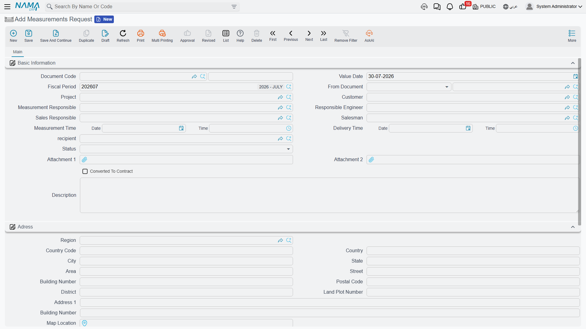
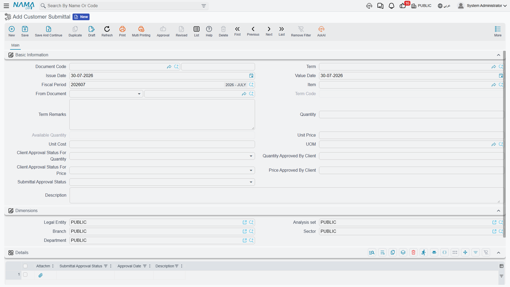

# Measurements, Submittals and Handover

Three documents sit around the edges of the billing chain: one before the contract is even priced, one that governs what materials may be bought, and one that records the day the keys change hands. None of them books anything, and — importantly — none of them blocks the [execution](/modules/contracting/project-contracting/contracting-project-execution.md) or the [extract](/modules/contracting/project-contracting/contracting-project-extracts.md). They are records of approvals that happen in the real world, kept in the system so they can be found, reported on, and pointed at when somebody asks who agreed to what.

Because two of them are filed in an unexpected place in the menu, each section says plainly where to click.

## Measurements Request — the site visit before the price

You cannot price a fit-out contract from a drawing. Somebody has to go to the customer's premises with a tape measure and establish how many square metres of floor there actually are, how many openings, how many metres of skirting. The **Measurements Request** (طلب رفع مقاسات) is the document that asks for that visit and records that it happened.

| | |
|---|---|
| Menu | Contracting > **Contractor Contracting** > Measurements Request |
| Kind | Document — no document term, and nothing to configure on one |
| Licence | `contracting` |

::: info It is under Contractor Contracting in the menu
The measurements request is a customer-facing document — it is the front door of the sales cycle for finishing and fit-out businesses — but it is filed under the sub-contractor branch of the menu. Look for it there.
:::

**What is on it.** The **Project** and **Customer**. Four people: the supervisor who will do the measuring, the responsible engineer, the sales responsible and the salesman. Two appointments, each a date and a time — when the measuring will be done, and when the results are promised back. A **Recipient**, a **Status**, two attachments, and a description. Below that, a full address block including a map location, because somebody has to actually find the place.

The grid at the bottom has just two columns, an attachment and a description. That is deliberate: **the measurement sheets are attached as files, not typed in as data.** The supervisor comes back with photographs of a marked-up drawing and a sketch on squared paper, and those go on as attachments, one row each.

**Status** offers *Initial*, *In Progress*, *Measurements Taken*, *Confirmed* and *Re-Raise*, and there is a *Converted To Contract* flag beside it. Both are maintained by hand — nothing in the module advances the status or ticks the flag for you. Treat them as the tracking fields a coordinator updates, and use a list view with a [quick filter](/platform/list-views/quick-filters.md) on status as the day's worklist.

**What it gates.** One thing only: once a [contracting assay](/modules/contracting/project-contracting/contracting-assays.md) has been built on the request, the request can no longer be re-saved. That is the whole of its enforcement.

**Where it leads.** Measurements request → assay (the priced take-off) → [project contract](/modules/contracting/project-contracting/contracting-project-contract.md). It sits *before* the contract, not before the execution, and it plays no part in billing. A reader who expects it somewhere in the certificate chain is looking in the wrong place.

## Customer Submittal — approving the material before it is bought

On a specified job, the contractor does not simply buy tiles. He submits a specific tile — this manufacturer, this model, this price — to the client or the consultant, who approves it, rejects it, or asks for something else. Only then may it be purchased and installed. **Customer Submittal** (اعتماد العميل للصنف) is that round trip, and the approved quantity becomes a ceiling on how much of the item may be requested afterwards.

| | |
|---|---|
| Menu | Contracting > Project Contracting > Customer Submittal |
| Kind | Document, with a document term |
| Licence | `contracting` |

### Only the executive budget generates them

This is the fact to get right. Submittals are not created by hand in normal use — they are **generated from the [executive budget](/modules/contracting/budgets/contracting-executive-budget.md)** when it is committed, and only from the executive one. The [estimated budget](/modules/contracting/budgets/contracting-estimated-budget.md) produces none, even though a budget item request will accept either as its source.

The generation has three conditions:

1. **A module option must be on** — the one that creates submittals for executive budget lines, in [module configuration](/modules/contracting/contracting-configuration.md). With it off, nothing is generated at all.
2. **Only budget term lines that name an item** produce a submittal. A line for "blockwork" as a labour-and-material package, with no specific item on it, is skipped — there is nothing to submit.
3. **The book and the document term** of the generated submittals come from two more module configuration settings, so those must be filled before the first budget is committed.

What is copied across is the quantity, the unit, the description, the unit price, the unit cost and the term code, and the generated submittal is linked back onto the budget line. Re-committing the budget refreshes them, and a submittal that no longer matches any line is removed — unless the budget is flagged not to edit saved submittals, which freezes the set. Deleting the budget deletes its submittals.

### The two approvals, and the log

The header carries **two independent approval decisions**, each with its own status of *Approved*, *Rejected* or *Change Requested*:

- **quantity** — with an *approved quantity* beside it;
- **price** — with an *agreed price* beside it.

They behave the same way: approve, and the approved figure is taken from the submitted one; reject or leave blank, and it is zeroed; ask for a change, and you must type the figure you are willing to accept. Splitting the two matters because consultants routinely approve a product and argue about its price, or the reverse.

The **Details** grid below is the round-trip log — one row per submission and response, each with its own approval status, approval date, attachment and note. The header's overall status is taken from the last row of that log, so the log is not decoration: it is what decides whether the submittal counts as approved. One rule follows from that: **once a row carries the closing status, no further row can be added.** The submittal is finished.

The letter codes used for that overall status are the consultant submittal codes the industry already uses; they are not translated on the screen, so agree with your consultant which of them mean "approved" and record the convention outside the system.

### What a submittal actually gates

A submittal constrains **procurement**, not billing. Neither the execution nor the extract reads it.

What reads it is the [executive budget item request](/modules/contracting/budgets/contracting-budget-item-requests.md), where the approved figures become real ceilings:

- **the price ceiling** — a line's unit price may not exceed what the submittal approved, unless the request's document term has *Allow To Exceed Approved Price* on;
- **the quantity ceiling** — the total quantity requested for an item across *all* requests raised on the same budget may not exceed the submittal's approved quantity, unless the term has *Allow To Exceed Approved Qty* on;
- **and the submittal must be approved at all** — a request against an unapproved submittal is refused.

The available quantity on the submittal is maintained as requests consume it: approved quantity, less everything already requested.

::: warning A request line with no submittal is unconstrained
Both ceilings are skipped entirely for any request line that has no submittal picked on it. If the point of the exercise is to stop unapproved buying, the discipline has to be that every request line names its submittal — the system will not insist on it.
:::

The submittal also cannot be edited down below what has already been requested against it, which stops the ceiling being moved under a request that has already been raised.

## Project Deliver Letter — the handover

The **Project Deliver Letter** (خطاب تسليم مشروع) is the formal record that the finished project was delivered to the client or the consultant on a particular date. It closes the project file.

| | |
|---|---|
| Menu | Contracting > **Contractor Contracting** > Project Deliver Letter |
| Kind | Document, with a document term |
| Licence | `contracting` |

Like the measurements request, it is filed under the sub-contractor branch of the menu although it is a project-level document.

It is a short screen: the document code and term, the issue and value dates, the **Project**, the **Consultant** who received the handover, the responsible engineer, the handover date, a description, and the Dimensions group. There is no grid and there is nothing to calculate.

**What it does.** Committing the letter writes itself onto the project as that project's delivery letter, and cancelling it clears the reference. That is the whole effect: it is the answer to "has this project been handed over, and on what paper?".

**What it does not do**, and this is the important half:

- **it books nothing** — no journal entry, no business request;
- **it does not close the contract.** Finalising a contract is done by an [extract of type Final](/modules/contracting/project-contracting/contracting-project-extracts.md), and only by that. The letter records the physical handover; the Final extract closes the money. A project can perfectly well be handed over with a certificate still to issue, and a contract can be financially closed on paper before the site is formally delivered;
- **it validates almost nothing**, including whether a project has been named. A letter saved without a project commits successfully and simply records nothing, so make filling the project part of the procedure rather than relying on the system to insist.

## Where to go next

- [Contracting Assays](/modules/contracting/project-contracting/contracting-assays.md) — where a measurements request goes next.
- [The Executive Budget](/modules/contracting/budgets/contracting-executive-budget.md) — the only document that generates submittals.
- [Budget Item Requests](/modules/contracting/budgets/contracting-budget-item-requests.md) — the document the submittal's ceilings act on.
- [Project Extracts](/modules/contracting/project-contracting/contracting-project-extracts.md) — including what a Final extract closes.
