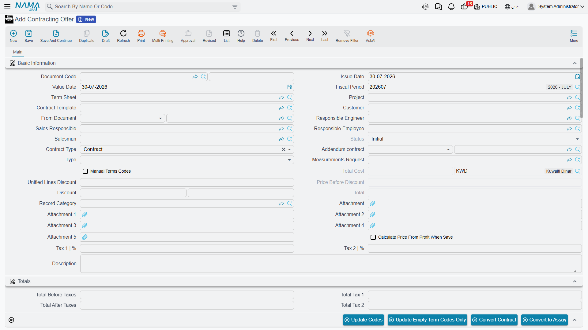

# Contracting Offers

Every contract in this module starts as a number somebody had to justify. The contracting offer is where that number is built: the document in which each item of work is broken into the materials, labour, subcontractors and expenses that will deliver it, the four buckets are added up, a margin is put on top, and the result is the price you put in front of the client.

That makes the offer the only place in the owner-side chain where **cost drives price**. Everywhere afterwards — the assay, the contract, the extract — the price is simply carried forward. Get the offer right and the rest of the chain is arithmetic.

You will find it at **Contracting > Project Contracting > Contracting Offer**, under licence `contracting`. It is a document, so it has a book, a code, an issue date and a value date. It has **no contracting term options** — the *Document Term* field is there because every document has one, but there is nothing for this document type to configure and nothing it posts. An offer creates no journal entry and moves no stock.

Our worked example is the **Tower A** project for **Al-Fanar Development**: four items of work, **200,000** of analysed cost, a **15%** margin overall, and therefore a bid of **230,000** — the bid that becomes contract `PC-2026-001`.

## Where the offer's content comes from

An offer is rarely typed from a blank screen. Four fields at the top of the basic-information block decide how much of it arrives ready-made:

| Field | What it pulls in |
|---|---|
| **Term Sheet** (كراسة الشروط) | the tender bill of quantities — its whole term list, with quantities and prices |
| **From Document** (بناءا على) | another offer, an assay, or a term sheet, when you are re-pricing something that already exists |
| **Contract Template** (نموذج العقد) | a stored contract skeleton: term codes, standard terms and conditions |
| **Measurements Request** (طلب رفع مقاسات) | the site visit whose measured quantities the offer is priced from |

Below them sit the parties and the people — project, customer, responsible engineer, sales responsible, responsible employee, salesman — and the **Type** field that decides whether this offer, when won, becomes an owner contract or a subcontract.

The header's **Contract Type** (نوع العقد) has three values: *Contract* for the ordinary case, *Addendum* when the work is an addition to an existing contract (which makes the main-contract reference mandatory), and *Modify To Contract* when the offer is meant to revise the parent contract's terms rather than sit alongside them. The field labelled *Addendum contract* in English is that main, parent contract — the Arabic `العقد الرئيسي` says it more clearly.

## The terms grid — what you are selling

The Terms grid is the bill of quantities: one row per item of work, each pointing at a **Standard Term** from [the standard-term catalogue](/modules/contracting/setup/contracting-standard-terms.md), which is what supplies the unit, the default rate and the accounts the eventual extract will post to. Rows form a tree through their dotted **term codes**, and only leaf rows carry money — parent rows are pure roll-ups, and the system zeroes them and re-totals them from their children on every save.

For Tower A:

| Code | Standard term | Type | UOM | Quantity |
|---|---|---|---|---|
| `1` | Earthworks | Parent | | |
| `1.01` | Excavation | Leaf | m³ | 1,000 |
| `2` | Structure | Parent | | |
| `2.01` | Reinforced concrete | Leaf | m³ | 60 |
| `3` | Masonry and finishes | Parent | | |
| `3.01` | Blockwork | Leaf | m² | 2,000 |
| `3.02` | Plastering | Leaf | m² | 1,000 |

You can let the codes generate themselves — **Update Codes** renumbers the whole grid from scratch by walking it top to bottom, and **Update Empty Term Codes Only** is the safe version that fills the blanks and leaves existing codes alone — or tick **Manual Terms Codes** in the header and type them yourself.

Quantities do not have to be typed either. Fill **count**, and the length, width and height columns, and the quantity is derived: `count × length × width × height`, minus any **Discounted Quantity** you deduct for openings. Which of the three dimensions actually participates is a property of the contracting unit of measure, so a wall in m² ignores height while a slab in m³ uses all three. The dimension columns are only on screen when the module configuration asks for them.

The **Work Area** column is a reporting dimension: it is copied forward from the offer to the contract to the extract, and it is useful for analysis, but nothing in the module filters, prices or totals on it.

## Building the cost — the four buckets

Under the terms grid sit four grids that are the heart of this document: **Material** (مواد خام), **Workers** (عمالة), **Contractors** (مقاول باطن) and **Other Expenses** (مصروفات أخري). Each line names a cost element from the [direct-cost catalogue](/modules/contracting/setup/contracting-lookups.md), the quantity of it consumed, and its unit cost. The four grids together are the offer's total cost.

For Tower A, this is where the 200,000 comes from:

**Term `1.01` Excavation — 1,000 m³, cost 40,000**

| Bucket | Line | Quantity | Unit cost | Total |
|---|---|---|---|---|
| Workers | Excavation gang | 200 man-days | 120 | 24,000 |
| Contractors | Machinery and hauling | 1,000 m³ | 12 | 12,000 |
| Other expenses | Shoring hire | | | 4,000 |

**Term `2.01` Reinforced concrete — 60 m³, cost 48,000**

| Bucket | Line | Quantity | Unit cost | Total |
|---|---|---|---|---|
| Material | Ready-mix concrete | 60 m³ | 550 | 33,000 |
| Material | Reinforcement steel | 4.8 ton | 1,500 | 7,200 |
| Workers | Steel fixers and pourers | 40 man-days | 130 | 5,200 |
| Other expenses | Formwork hire | | | 2,600 |

**Term `3.01` Blockwork — 2,000 m², cost 80,000**

| Bucket | Line | Quantity | Unit cost | Total |
|---|---|---|---|---|
| Contractors | Blockwork subcontract | 2,000 m² | 40 | 80,000 |

**Term `3.02` Plastering — 1,000 m², cost 32,000**

| Bucket | Line | Quantity | Unit cost | Total |
|---|---|---|---|---|
| Material | Cement and sand | 1,000 m² | 9 | 9,000 |
| Workers | Plasterers | 160 man-days | 130 | 20,800 |
| Other expenses | Consumables | | | 2,200 |

40,000 + 48,000 + 80,000 + 32,000 = **200,000**, and that is what the header's *Total Cost* shows. Blockwork is the one term with a single line, because the whole of it is being given to a subcontractor at 40.00 the square metre — the 80,000 subcontract the cost side of these docs follows.

Two mechanisms make these grids less laborious than they look. **Productivity** (الإنتاجية) and **Wastage %** (نسبة الهالك) let you enter a norm instead of an absolute quantity: productivity is how much of the element one contracted unit consumes, wastage inflates it for breakage, and the line quantity comes out as `contracted quantity × productivity × (1 + wastage %)`. Say a plasterer-day covers 6.25 m² of plastering, and the labour line sizes itself from the 1,000 m² above at 160 man-days; put 4% wastage on the cement-and-sand line and that one inflates to match. And two buttons fill the grids for you — **Collect Contract Items From Standard Terms** (تجميع بنود التكلفه من البنود القياسية) reads the standard cost recipe stored on each standard term, and **Collect Sub Items Cost** (تجميع تكلفة البنود الفرعية) rolls the resulting element costs back up into the term line's unit cost.

If your organisation maintains [term analysis cards](/modules/contracting/setup/contracting-term-analysis-cards.md), the same cost model exists there as a reusable master file, analysed once per term rather than once per offer.

## Turning cost into price — which direction?

This is the one thing to understand about the offer, because the document works **both ways** and a single checkbox decides which.

::: info Calculate Price From Profit When Save
Tick **Calculate Price From Profit When Save** (حساب السعر من الربح عند الحفظ) and you type the margin; the system computes the price:

`profit = total cost × profit % ÷ 100` · `total price = total cost + profit` · `unit price = total price ÷ quantity`

Leave it unticked — the default — and you type the price; the system computes the margin:

`profit = total price − total cost` · `profit % = profit ÷ total cost × 100`
:::

For Tower A we tick the box and type each line's own *Profit Percent* — earthworks carry the fattest margin, the sublet blockwork the standard one, and plastering is priced keenly to win the job:

| Code | Total cost | Profit % | Profit | Total price | Unit price |
|---|---|---|---|---|---|
| `1.01` Excavation | 40,000 | 25 | 10,000 | 50,000 | 50.00 |
| `2.01` Reinforced concrete | 48,000 | 12.5 | 6,000 | 54,000 | 900.00 |
| `3.01` Blockwork | 80,000 | 15 | 12,000 | 92,000 | 46.00 |
| `3.02` Plastering | 32,000 | 6.25 | 2,000 | 34,000 | 34.00 |
| **Header** | **200,000** | **15** | **30,000** | **230,000** | |

The header's margin is the one the commercial team argues about: 30,000 of profit on 200,000 of cost, 15% overall.

The header's *Price Before Discount* and *Total* both read 230,000, and the profit columns on each line are now derived figures rather than something anybody typed.

Three header fields adjust that result. **Discount Percentage / Discount** takes a percentage or a value off the whole offer. **Unified Lines Discount** pushes one discount percentage down onto every leaf line at once, which is the usual way of giving a client "5% off everything". And **Tax 1 %** / **Tax 2 %** are pushed down to every line on save, filling the *Totals* block: net before tax, tax 1, tax 2, net after tax. With 15% VAT on Tower A, the offer shows 230,000 before tax and 264,500 after.

Where your organisation publishes rate cards, the [contracting price list](/modules/contracting/setup/contracting-price-lists.md) is what supplies a term's unit price in the first place, resolved by date, customer and currency — so the offer starts from the sanctioned rate rather than from whatever the estimator remembers.

## The rest of the screen

**Conditions** (الشروط) lets you record the commercial clauses — retention, advance recovery, penalties — that will govern payment. On the offer they are documentation and a carrier: nothing on this document calculates from them. They matter because the conversion to a contract copies them, and on the contract they become live. Our Tower A offer therefore carries one condition line, *Retention 10%, with every extract*, so that the contract inherits it without re-keying.

**Tasks** (المهام) is the obligations checklist — who supplies scaffolding, who obtains the municipal permit — split into your company's tasks and the customer's. It is documentary; nothing enforces it.

**Payments** (الدفعات) holds the instalment plan, either typed by hand or generated: pick a **Payment Template** and the system spreads the amount over N instalments honouring a grace period, the payment period, a preferred day of the week and a rounding rule.

::: info The instalment total is checked against cost, not price
If you fill in a payment template, the offer validates that the instalment lines add up to the offer's **total cost** — 200,000 on Tower A — not to the 230,000 the client will pay. On any offer carrying a margin the two cannot both be satisfied, so if you want the client-facing instalment plan on the offer, leave the payment template empty and type the lines, or build the plan on the contract instead, where it is checked against the total price.
:::

## Winning the job

When the client accepts, one button does the conversion. **Convert Contract** (تحويل لعقد) opens a new, unsaved [project contract](/modules/contracting/project-contracting/contracting-project-contract.md) already filled in; you review it and save. There is also **Convert Contract With Selected Lines Only** when the client awarded you part of the scope, **Convert Contractor Contract** and its selected-lines twin when the offer is being turned into work you are giving to a subcontractor, and **Convert to Assay** (تحويل لمقايسة) when you want the internal priced bill of quantities as a separate record.

What crosses over to the contract, and what does not, is worth knowing before you press the button:

| Carried over | Left behind |
|---|---|
| Project, customer, responsible engineer | The four cost-analysis grids |
| Price before discount, discount value and percentage | Tasks |
| Contract type and the main-contract reference | The payment schedule |
| Remarks | Taxes and the total cost |
| **Source** — a reference back to this offer | Attachments |
| All term lines with their quantities and prices | |
| The condition lines (or, if the offer has none, the term sheet's) | |

Two of those deserve a note. The **Source** reference is how the contract remembers where it came from, and it is what the contract screen shows in its *Source* field — so an auditor can always walk back from a signed contract to the bid that produced it. And the cost grids being left behind is deliberate: the contract carries the *unit cost* on each term line, which is all it needs, and the detailed build-up stays on the offer as the estimating record.

One nuance on the subcontractor conversion: whether your selling price is copied onto the subcontract's lines is a module configuration setting, so you can choose not to reveal your own rates in a document a subcontractor may see. See [contracting configuration](/modules/contracting/contracting-configuration.md).

If the measurements request is filled in on the offer, the conversion also overwrites the responsible engineer and salesman from that request — the people who actually measured the site win over whoever was typed on the offer.

## Where to read next

- [Contracting assays](/modules/contracting/project-contracting/contracting-assays.md) — the same priced bill of quantities as an internal record.
- [Project contracts](/modules/contracting/project-contracting/contracting-project-contract.md) — what the offer becomes.
- [Standard terms](/modules/contracting/setup/contracting-standard-terms.md) and [term sheets](/modules/contracting/setup/contracting-term-sheets.md) — the catalogue and the reusable bill of quantities the offer is built from.
- [Estimated budgets](/modules/contracting/budgets/contracting-estimated-budget.md) — the cost estimate that usually accompanies a bid.
- [Subcontractor offers](/modules/contracting/contractor-contracting/contracting-contractor-offers.md) — the mirror document, where the quotation comes *in* rather than going out.
