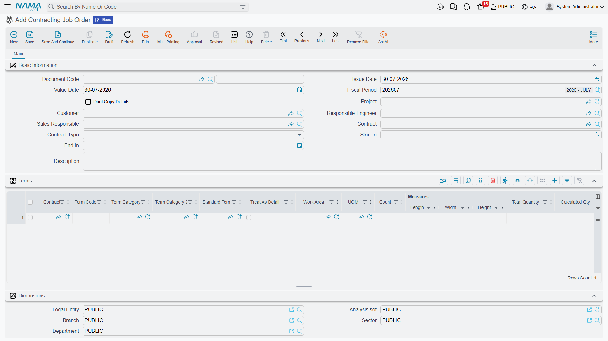

# The Project Contracting Cycle

A contracting business runs two mirrored chains at the same time. On one side it bills the project owner for work delivered; on the other it pays subcontractors for work they delivered to it. This page walks the first chain — the owner side, the revenue side — from the day a bid is priced to the day the client's money arrives.

Before any of the detail, one fact governs the whole chain and explains most of the questions support staff receive about this module:

::: tip The single rule to remember
**Signing a contract books nothing. The extract (مستخلص) books everything.** A project contract is a master file — a priced plan the rest of the module measures itself against. No journal entry, no stock movement and no receivable is created when you save or amend it. Revenue, tax, retention and actual cost all reach the ledger through the extract, and only through the extract.
:::

Throughout the owner-side pages we build the same job: the **Tower A** project for **Al-Fanar Development**, contract **`PC-2026-001`**, contracted at **230,000**, broken into four priced items of work — excavation, reinforced concrete, blockwork and plastering — with **10% retention** held back on every payment and a **46,000 advance** received up front and recovered as the work proceeds.

## The chain, step by step

```
Measurements Request  (optional — someone goes and measures the site)
        ↓
Contracting Offer  or  Contracting Assay      the priced bill of quantities
        ↓  Convert Contract
Project Contract  (master file — books nothing)
        ↓
Contracting Job Order  (optional — "go and build these terms")
        ↓
Project Execution  (optional — how much work was actually done)
        ↓
Project Extract  ← THE money document: revenue, tax, retention, advance recovery
        ↓
Receipt vouchers / collection
```

**1. Measure the site, if you need to.** For fit-out and finishing work you cannot price a bill of quantities until a supervisor has been out and measured real openings, walls and floors. That is what a [measurements request](/modules/contracting/project-contracting/contracting-measurements-and-approvals.md) is for: it asks a named supervisor to visit, and promises the results back by a date. It is entirely optional, and if your work is priced from drawings you will never open it. Note the click-path — the menu files it under **Contracting > Contractor Contracting**, even though it is a customer-facing document.

**2. Price the work.** Two documents do this, and the difference between them matters. A [contracting offer](/modules/contracting/project-contracting/contracting-offers.md) is the quotation you hand to the client, and it is the one place where the price is *built* — each item of work is exploded into materials, labour, subcontractors and expenses, and a margin turns that cost into a price. Our tower's 200,000 of analysed cost plus 15% is where the 230,000 comes from. A [contracting assay](/modules/contracting/project-contracting/contracting-assays.md) (مقايسة) is the internal priced bill of quantities — the same term lines, without the cost-analysis grids. Both can be turned into a contract with one button.

**3. Sign the contract.** [The project contract](/modules/contracting/project-contracting/contracting-project-contract.md) is the centre of gravity of the whole module: the priced term lines the extracts will bill against, the commercial conditions that add to and deduct from every payment, the staff assigned, the client's instalment plan. It is a master file, so it stays alive — executions, extracts and cost documents write their running totals back onto its term lines as the job proceeds.

**4. Authorise the work.** A job order tells the site which terms to build, in what quantities, between which dates. It has no accounting effect at all — see below.

**5. Record what was built.** [Project execution](/modules/contracting/project-contracting/contracting-project-execution.md) (حصر كميات) is the quantity survey: this month we excavated 400 m³ of the 1,000 contracted. It is **optional** — you can bill straight from the contract — and it is **incremental per document**: each execution states only what was done *since the last one*, and the contract's term line carries the running total.

**6. Bill the client.** [The project extract](/modules/contracting/project-contracting/contracting-project-extracts.md) is the certified payment application, and it is the only document in this chain that reaches the ledger. It prices the billed quantities at contract rates, adds tax, then applies the contract's conditions — the 10% retention withheld, a slice of the 46,000 advance recovered, any [fines](/modules/contracting/project-contracting/contracting-project-fines.md) deducted — and arrives at a net payable. Like the execution, an extract states only *this* period's quantities; the contract line holds the cumulative figure.

**7. Collect the money.** Receipt vouchers settle the extract. The contract screen itself can generate a receipt voucher against its instalment schedule, but that is a treasury movement against the customer — it is not revenue recognition, which has already happened on the extract.

## What is optional and what is not

| Step | Optional? | Books anything? |
|---|---|---|
| Measurements request | Yes | No |
| Contracting offer | Yes | No |
| Contracting assay | Yes | Yes, if its document term carries accounts |
| **Project contract** | **No** | **No** |
| Job order | Yes | No |
| Project execution | Yes | No |
| **Project extract** | **No** | **Yes — revenue, tax, receivable, actual cost** |
| Advance payment | Yes | Yes |
| Fine | Yes | Yes |

The reason the table looks so empty in its last column is worth stating plainly: everything before the extract is planning and measurement. The system is deliberately built so that the commercial record (the contract) and the accounting record (the extract) are separate, which is why you can amend a contract for months without disturbing a single journal entry.

## The job order

The job order is the module's work-authorisation sheet, and its English name is unhelpful — despite being called a *job order*, it has nothing whatsoever to do with Nama's manufacturing Job Order module. The Arabic **أمر شغل** is the right mental model: an instruction to the site to go and execute a defined set of contract terms.

You will find it at **Contracting > Project Contracting > Contracting Job Order**, under licence `contracting`.



The header names the project, the customer, the responsible engineer and sales responsible, the start and end dates, and — the important field — **the contract** the order is issued under. Below it, a terms grid that looks exactly like the contract's own: term code, standard term, work area, unit, the physical dimensions, and the quantity to be executed.

Two behaviours are worth knowing:

- **Every line's term code must already exist on the contract.** If you type a term code the contract does not carry, the commit is refused with *"Term code is not found in project contract"*. The message does not tell you which line, so on a long job order you check the codes yourself against the contract.
- **The quantities are not capped by the contract.** You can raise job orders whose quantities together exceed the contracted quantity, and nothing stops you. The job order is an instruction, not a control.

It has no document term, and it produces no journal entry, no stock movement and no project cost. Its only lasting effect is the quantities recorded on its own lines.

On Tower A we would issue one job order for the substructure — term `1.01` *Excavation*, 1,000 m³, from 1 March to 30 April — and hand it to the site engineer. What the site actually achieves comes back as an execution, not as a change to the job order.

## Where to read next

- The pricing end: [offers](/modules/contracting/project-contracting/contracting-offers.md) and [assays](/modules/contracting/project-contracting/contracting-assays.md), both of which stand on the [standard-term catalogue](/modules/contracting/setup/contracting-standard-terms.md).
- The contract itself: [project contracts](/modules/contracting/project-contracting/contracting-project-contract.md) and, when the client changes his mind, [contract updates](/modules/contracting/project-contracting/contracting-project-contract-updates.md).
- The money: [executions](/modules/contracting/project-contracting/contracting-project-execution.md), [extracts](/modules/contracting/project-contracting/contracting-project-extracts.md), [taxes on extracts](/modules/contracting/project-contracting/contracting-extract-taxes.md), [advances](/modules/contracting/project-contracting/contracting-project-advances.md) and [fines](/modules/contracting/project-contracting/contracting-project-fines.md).
- The mirror image of this whole page, on the cost side: [the subcontractor cycle](/modules/contracting/contractor-contracting/contracting-contractor-cycle.md).
- Where the actual cost you compare against contract value comes from: [how project cost is built](/modules/contracting/costs/contracting-cost-model.md).
